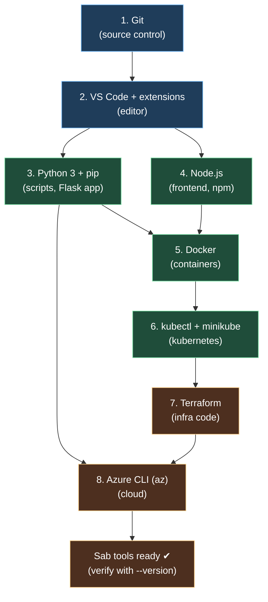

# Day 0: Setup & Prerequisites — Tools Install, Flow & Debugging

> **Ye day sabse pehle karo.** Agar tools install na ho, koi bhi lab work nahi karega. Is day ka goal = ek aisi machine jisme har tool install ho aur `--version` run karte hi sab sahi output de.

## Overview | Parichay

Is day me hum wo sab install karenge jo aane wale 30 din chahiye. Linux (Ubuntu) pe chalegayenge — agar aap Windows/Mac pe ho to WSL2 (Windows Subsystem for Linux) use karo, ya VM banao. Har tool ke saath: **kya hai, kyun chahiye, install kaise karein, test kaise karein, aur error aaye to fix kaise karein.**

> **Ek line mein:** Day 0 = tools ka "Home Delivery". Saare saamaan ghar aa jaye, bas unpack (install) karna hai.

## What You'll Learn | Aaj Ki Seekh

- [ ] Har tool install karna: Git, VS Code, Docker, Python, Node, kubectl, Terraform, `az` CLI
- [ ] `--version` se sab verify karna (test command pattern)
- [ ] Common setup errors ka debug karna
- [ ] WSL2 vs VM vs native Linux ka decision
- [ ] Debug checklist: "tool nahi mila" hone par kya karna hai
- [ ] Ek baar sab setup karke apni machine ko "dev-ready" banana

---

## Diagram | Dekho Kaise Kaam Karta Hai

### Mermaid: Tool Setup Order (Dependency Flow)



### ASCII: Setup Flow Summary

```
Ubuntu/WSL2
    │
    ├─ sudo apt update && sudo apt upgrade
    │
    ├─ git        ──> terminal me name+email set
    ├─ VS Code    ──> extensions: Markdown, Docker, YAML, Mermaid
    ├─ python3    ──> python3 --version   (3.10+ chahiye)
    ├─ nodejs     ──> npm --version
    ├─ docker     ──> sudo usermod -aG docker $USER  (docker: permission denied fix)
    ├─ kubectl    ──> kubectl version --client
    ├─ minikube   ──> minikube start
    ├─ terraform  ──> terraform version
    └─ az         ──> az --version  &&  az login
```

### Images (official references)

- [Install Git (official)](https://git-scm.com/book/en/v2/Getting-Started-Installing-Git)
- [Docker engine install (official)](https://docs.docker.com/engine/install/ubuntu/)
- [Azure CLI install (official)](https://learn.microsoft.com/en-us/cli/azure/install-azure-cli-linux)
- [Terraform install (official)](https://developer.hashicorp.com/terraform/tutorials/aws-get-started/install-cli)

---

## Setup Steps | Step-by-Step

### Step 1: OS ready karo

```bash
sudo apt update && sudo apt upgrade -y
sudo apt install -y curl wget ca-certificates gnupg lsb-release tree
```

### Step 2: Git

```bash
sudo apt install -y git
git --version                      # git version 2.x
git config --global user.name "Aapka Naam"
git config --global user.email "aap@example.com"
```

### Step 3: VS Code

```bash
# VS Code website se .deb download karo ya snap se:
sudo snap install code --classic
code --version
```

### Step 4: Python 3 + pip

```bash
sudo apt install -y python3 python3-pip python3-venv
python3 --version                  # Python 3.10 ya zyada
pip3 --version
```

### Step 5: Node.js

```bash
curl -fsSL https://deb.nodesource.com/setup_20.x | sudo -E bash -
sudo apt install -y nodejs
node --version && npm --version
```

### Step 6: Docker

```bash
curl -fsSL https://get.docker.com -o get-docker.sh
sudo sh get-docker.sh
sudo usermod -aG docker $USER       # IMPORTANT: logout/login, warna 'permission denied'
docker --version
docker run hello-world              # test
```

### Step 7: kubectl + minikube

```bash
curl -LO "https://dl.k8s.io/release/$(curl -L -s https://dl.k8s.io/release/stable.txt)/bin/linux/amd64/kubectl"
sudo install -o root -g root -m 0755 kubectl /usr/local/bin/kubectl
kubectl version --client

curl -Lo minikube https://storage.googleapis.com/minikube/releases/latest/minikube-linux-amd64
chmod +x minikube && sudo mv minikube /usr/local/bin/
minikube start --driver=docker
kubectl get nodes                  # READY dikhna chahiye
```

### Step 8: Terraform

```bash
sudo apt-get update
sudo apt-get install -y gnupg software-properties-common
wget -O- https://apt.releases.hashicorp.com/gpg | sudo gpg --dearmor -o /usr/share/keyrings/hashicorp-archive-keyring.gpg
echo "deb [signed-by=/usr/share/keyrings/hashicorp-archive-keyring.gpg] https://apt.releases.hashicorp.com $(lsb_release -cs) main" | sudo tee /etc/apt/sources.list.d/hashicorp.list
sudo apt update && sudo apt install -y terraform
terraform version
```

### Step 9: Azure CLI

```bash
curl -sL https://aka.ms/InstallAzureCLIDeb | sudo bash
az --version
az login                             # browser khol ke login karo
```

---

## Demo | Copy-Paste Karke Chalao

Ek saath sab check karne ka script — `setup-check.sh`:

```bash
cat > ~/setup-check.sh <<'EOF'
#!/usr/bin/env bash
echo "=== DevClo Setup Check ==="
for tool in git code python3 pip3 node npm docker kubectl minikube terraform az; do
  if command -v "$tool" >/dev/null 2>&1; then
    printf "%-12s ✔ %s\n" "$tool" "$($tool --version 2>&1 | head -1)"
  else
    printf "%-12s ❌ MISSING\n" "$tool"
  fi
done
echo "User groups: $(groups | grep -o docker || echo 'docker group NOT added! (logout/login karo)')"
EOF
chmod +x ~/setup-check.sh && bash ~/setup-check.sh
```

> Output me saare tools `✔` dikhne chahiye. Koi `✗` ho to niche Debug section dekho.

---

## Debug | Help — Common Errors Aur Fixes

| Problem | Cause | Fix |
|---------|-------|-----|
| `docker: permission denied` | User docker group me nahi | `sudo usermod -aG docker $USER` → **logout/login** |
| `command not found: terraform` | Binary PATH me nahi | `which terraform` aur PATH check; install echo se dobara |
| `az: command not found` | Azure CLI nahi hai | `curl -sL https://aka.ms/InstallAzureCLIDeb \| sudo bash` |
| `minikube start` me "driver not found" | docker driver nahi dikh raha | Docker chalu hai check karo `docker ps`; `--driver=docker` |
| `kubectl get nodes` empty | Cluster start nahi hua | `minikube status`; `minikube start` |
| `python3` 3.8 chalta hai | Purana python | `sudo add-apt-repository ppa:deadsnakes/ppa` se naya install |
| `npm` slow | Network | `npm config set registry https://registry.npmmirror.com` (optional) |
| `sudo snap install code` slow/fail | Snap issues | VS Code website se `.deb` download karke `dpkg -i` |

**Debug Checklist (agar kuch kaam nahi kar raha):**
1. Kya tool **installed** hai? → `command -v <tool>`
2. Kya **version** kaam karta hai? → `<tool> --version`
3. Kya **permission** issue hai? → `sudo` try karo, group check karo
4. Kya **network** issue hai? → `curl -I https://google.com`
5. Logs dekho → `docker logs`, `journalctl -u docker`
6. Ek search → error ka exact text Google/DuckDuckGo me search karo

---

## Real-Life Example | Zindagi Se

Day 0 = **ghar banana se pehle ki shopping**.

> Naya ghar (purra DevOps project) banane se pehle saare instruments khareedne padte hain — hammer (Git), drill (Docker), measure tape (kubectl), colour brush (Terraform). Aaj ki shopping me agar koi cheez missing ho, toh gadhne ka kaam beech me atak jata hai. Isliye pehle ek checklist bana ke sab samaan check kiya jata hai — yahi `setup-check.sh` karta hai.

---

## Quick Notes | Yaad Rakho

- **Install pattern:** `curl -fsSL officialURL | sudo bash` (official installers) ya `sudo apt install`
- **Verify pattern:** har tool ke baad `<tool> --version`
- **`docker` permission fix:** `usermod -aG docker` ke baad **logout/login zaroori**
- **Day 0 ka full checklist:** `~/setup-check.sh` run karke saare ✔ dekh lo
- **Agar phir bhi atko:** sidebar ke "💡 Help & Debug" page se commands ka koi bhi combo chala ke dekh sakte ho

**Kal:** Day 1 — DevOps culture aur principles. 🚀