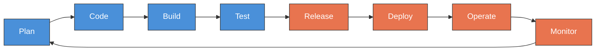

# Day 1: What is DevOps? Culture & Principles
📚 Topic 1: DevOps Culture Deep Dive
✅ Prerequisite-checklist: (none - start here)

## Overview | Parichay

DevOps is a **culture** and a **philosophy** - not just tools.

- **Dev** = Developers (jo code likhte hain)
- **Ops** = Operations (jo servers chalate hain)
- **DevOps** = Dono ko **ek saath** kaam karna, taaki software jaldi aur bina galti ke release ho

> **Ek line mein:** DevOps = dev aur ops ka ek team ban jana.

**Real-life example (Restaurant wala):**
> Ek restaurant me **chef** (Dev - joh khana banata hai) aur **waiter** (Ops - jo customer ko khana pahunchata hai) alag-alag kaam karte hain. Agar waiter ko pata na ho ki chef kya bana raha hai, to customer ko galat dish mil sakti hai. **DevOps** ka matlab = chef aur waiter ek team banein - khana acha bhi ho aur time par pahunche bhi.

---

## What You'll Learn | Aaj Ki Seekh

- [ ] DevOps kya hai aur kyun zaroori hai
- [ ] CALMS framework ke 5 pillars samajhna
- [ ] DevOps Infinity Loop (8 phases) yaad karna
- [ ] CI vs Continuous Delivery vs Continuous Deployment mein fark samajhna
- [ ] Waterfall → Agile → DevOps ka evolution dekhna
- [ ] DevOps roles: Engineer, SRE, Platform Engineer

## Diagram | Dekho Kaise Kaam Karta Hai

### Mermaid: DevOps Infinity Loop



### ASCII: Waterfall → Agile → DevOps Evolution

```
 WATERFALL (1970s)
 ================
  Plan ──→ Code ──→ Build ──→ Test ──→ Deploy
  (sab ek baar mein, 6-12 months wait)

 AGILE (2001)
 ============
  Sprint 1    Sprint 2    Sprint 3
  [Plan→Code→Test] → [Plan→Code→Test] → [Plan→Code→Test]
  (2-4 weeks, lekin deploy abhi bhi manual)

 DEVOPS (2009)
 =============
  ┌──→ Plan → Code → Build → Test ──┐
  │                                  ↓
  └── Monitor ← Operate ← Deploy ← Release
  (infinity loop - continuous, automated)
```

### Real Images


Docker architecture - DevOps tools ecosystem overview


CI/CD pipeline ka visual flow - Microsoft Azure docs se

---

## BASIC IDEA | Pehle Ye Samjho

### Problem: Software banana "pehle" aisa thha

Software banane ka tarika time ke sath badla hai. Ye table dekho:

| Model | Kab aaya | Kaam kaise hota tha | Problem kya thi |
|-------|----------|---------------------|-----------------|
| **Waterfall** | 1970s | Ek ke baad ek step: pehle plan → phir code → phir test → phir deploy. Sab **line by line** hota tha | Jab tak release hua, months lag gaye. Bugs bahut late milte the |
| **Agile** | 2001 | **Chhote-chhote cycles** (sprints) - har 2-4 week me naya version release | Development fast, lekin operations alag thi - deploy karna abhi bhi slow aur scary tha |
| **DevOps** | 2009 | Dev + Ops **ek team** - har change automatic test + auto deploy | Sabko ek dusre ke saath properly kaam karna seekhna pada |

**Key idea (cricket wala example):**
> Pehle batsman (Dev) ball mar kar batwale (Ops) ko chhod deta tha - "tera kaam hai". Agar bowler ne naya ball khelna hota to batwale bhatak jate. Dev se Ops me kooch bhi coordination nahi tha - isi ko **"throwing code over the wall"** kehte hain. DevOps ne ye **wall todo di** - ab team ek sath khelti hai.

---

## CONCEPTS | 4 Main Concepts Detail Mein

### Concept 1: CALMS Framework (DevOps ke 5 pillars)

Ye 5 cheezein DevOps ko successful banati hain - "CALMS" naam yaad rakhna aasan hai:

| Letter | Matlab | Simple Example |
|--------|--------|----------------|
| **C** - Culture | Team ka mindset - galti par **blame nahi, seekhna** | Crash hua to "kiski galti" mat poocho, "kaise fix karenge" poocho |
| **A** - Automation | Manual kaam ko script se **apne aap** hone do | Roz har server par check karna mat - ek script likho jo check kare |
| **L** - Lean | **Waste kam** karo - sirf aisa kaam jiski value hai | Baar-baar same cheez manually karna = waste; automate karo |
| **M** - Measurement | Sab kuch **measure** karo - speed, quality, uptime | "5 min me deploy hota hai" - ye number hone se improvement dikhti hai |
| **S** - Sharing | Knowledge aur tools **team se share** karo | Jo trick maine seekhi, wo sabko batao - taaki poora team fast ho |

### Concept 2: DevOps Lifecycle (Infinity Loop)

Ye ek **circle** hai - kaam isme ghuma-kara chalata rehta hai, kabhi rukta nahi:

```
Plan → Code → Build → Test → Release → Deploy → Operate → Monitor → (waps) Plan
```

Har phase me kya hota hai + kaunsa tool use hota hai:

| Phase | Matlab (Simple) | Tools |
|-------|-----------------|-------|
| **Plan** | Kya banana hai - decide karo | Jira, Trello |
| **Code** | Code likho | Git, VS Code |
| **Build** | Code ko chalaane layak banao | Maven, Docker |
| **Test** | Code sahi hai - check karo | JUnit, pytest |
| **Release** | Release ke liye ready karo | Jenkins, GitHub Actions |
| **Deploy** | Production me lagao | Kubernetes, Ansible |
| **Operate** | Hamesha chalte-raho | Terraform |
| **Monitor** | Sab theek hai - dekh-te raho | Prometheus, Grafana |

**Pizza shop wala example:**
> Pizza shop me loop aisa chalta hai: **Plan** (aaj kitne pizzas banenge) → **Order lo** (code) → **Pizza banao** (build) → **Test** (sahi bana hai?) → **Pack karo** (release) → **Deliver** (deploy) → **Shop chalte raho** (operate) → **Customer khush hai check karo** (monitor). Phir agle din wapas plan se.

### Concept 3: CI / CD Kya Hai?

Ye DevOps ka dil hai. 3 cheezein alag hain:

| Naam | Matlab | Simple Example |
|------|--------|----------------|
| **CI** (Continuous Integration) | Roz team ke saare code **milakar test** karo | Har roz 10 log ka code ek file me merge + auto test - galti turant pakdo |
| **CD** (Continuous Delivery) | Har change **deploy-ready** rakho (manually click kar ke deploy) | Code ready hai, bas ek button dabao to production me ja sakta hai |
| **CD** (Continuous Deployment) | Har passing change **bashak automatically** production me | Button bhi nahi - code test pass hua → khud deploy ho gaya |

**Yaad rakhne ka trick:** CI = milao + test karo. Delivery = ready rakho. Deployment = khud deploy karo.

### Concept 4: DevOps Roles

DevOps me alag-alag roles hote hain. Kaunsa aapko pasand aayega?

| Role | Kya karta hai |
|------|---------------|
| **DevOps Engineer** | Pipelines, infrastructure, tools - sab manage karta hai |
| **SRE (Site Reliability Engineer)** | System ko kabhi down na hone de - SLOs define karta hai |
| **Platform Engineer** | Developers ke liye internal platform/tools banata hai (jaise internal app store) |

---

## Demo | Copy-Paste Karke Chalao

```bash
# Mini DevOps pipeline simulation - terminal par dekho kaise kaam karta hai!

echo "=== DevOps Infinity Loop Simulation ==="
echo ""

# Phase 1: Plan
echo "[PLAN] Sprint planning ho rahi hai..."
echo "  → Feature: Login page banana hai"
echo "  → Team decide: 2 din mein complete"
sleep 1

# Phase 2: Code
echo "[CODE] Developer code likh raha hai..."
echo "  → login.py likha gaya"
echo "  → git add + commit ho gaya"
sleep 1

# Phase 3: Build
echo "[BUILD] Build pipeline chal rahi hai..."
echo "  → dependencies install"
echo "  → code compile → build SUCCESS"
sleep 1

# Phase 4: Test
echo "[TEST] Automated tests run ho rahe hain..."
echo "  → Unit tests: 45/45 PASSED"
echo "  → Integration tests: 12/12 PASSED"
sleep 1

# Phase 5: Release
echo "[RELEASE] Release candidate ready!"
echo "  → Version: v1.2.0"
echo "  → Changelog generated"
sleep 1

# Phase 6: Deploy
echo "[DEPLOY] Production me deploy ho raha hai..."
echo "  → Kubernetes rollout update..."
echo "  → 3/3 pods READY"
sleep 1

# Phase 7: Operate
echo "[OPERATE] Server chal raha hai smoothly..."
echo "  → Nginx running, port 80 open"
echo "  → Logs clean, no errors"
sleep 1

# Phase 8: Monitor
echo "[MONITOR] Monitoring dashboards dekh rahe hain..."
echo "  → CPU: 35%, Memory: 52%"
echo "  → Response time: 120ms"
echo "  → No alerts triggered"
sleep 1

echo ""
echo "=== Loop complete! Wapas PLAN par aa gaye ==="
echo "Agla step: User feedback aaya - dark mode chahiye"
echo ""
echo "DevOps = ye loop chalte rehta hai, kabhi rukta nahi!"
```

**Run karne ke baad dekho:** Ye ek mini pipeline hai - har phase ek step hai. Real life mein ye sab automated hota hai (GitHub Actions / Jenkins). Abhi bas samjho flow!

---

## Practice Exercise | Abhi Karein

> **Zindagi wala scenario:** Ek company me developers code likh kar operations ko "over the wall" fek dete hain. Bugs frequent hain, deployments scary hain, sab ek-dusre ko blame karte hain.

**Ye 4 cheezein karo:**
1. 3 problems list karo jo is company me hain (socho: bugs kyun hain? deploy kyun slow? blame kyun?)
2. Har problem ke sath likho - **DevOps kaunsa concept** use karega (CALMS / CI-CD / Lifecycle me se)
3. Infinity loop **draw** karo (paper par) aur har phase label karo
4. 1-page ka letter type karo apne manager ko: "team DevOps kyun adopt kare" (is file ke concepts use karo)

---

## Quick Notes | Yaad Rakho

```
- DevOps = Dev + Ops ek team (culture hai, tool nahi)
- CALMS = Culture, Automation, Lean, Measurement, Sharing
- CI = roz merge + test | CD Delivery = ready | CD Deployment = auto deploy
- Loop: Plan→Code→Build→Test→Release→Deploy→Operate→Monitor
- Deploy ke baad monitoring hoti hai - phir wapas Plan se
```

---

