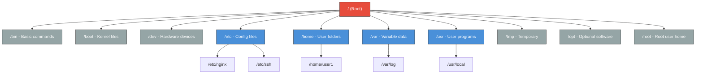

# Day 2: Linux Fundamentals - File System & Commands
📚 Topic 2: Linux Deep Dive — Filesystem & Commands
✅ Prerequisite-checklist: (review Day 1 DevOps Culture concepts if needed)

## Overview | Parichay

Linux duniya ke zyada-tar servers, containers, aur cloud instances par chalta hai. Agar aapko DevOps banana hai toh Linux commands aana **zaroori** hai. Aaj hum file system structure aur kaam ke commands seekhenge.

---

## What You'll Learn | Aaj Ki Seekh

- [ ] Linux filesystem hierarchy (FHS) samajhna - kaun sa folder kya karta hai
- [ ] Navigation commands: pwd, ls, cd, find
- [ ] File operations: touch, cp, mv, rm, mkdir
- [ ] File contents dekhna: cat, head, tail, grep
- [ ] Hidden files aur recursive search karna
- [ ] Live log monitoring with tail -f

## Diagram | Dekho Kaise Kaam Karta Hai

### Mermaid: Linux Filesystem Hierarchy



### ASCII: Linux Filesystem Tree

```
/                          ← Root (Sabka Baap)
├── bin/                   ← Basic commands (ls, cp, mv)
├── boot/                  ← Kernel aur boot files
├── dev/                   ← Hardware devices (/dev/sda1)
├── etc/                   ← SAARI config files yahan
│   ├── nginx/             ← Nginx configuration
│   ├── ssh/               ← SSH keys aur config
│   └── passwd             ← User list
├── home/                  ← Normal users ka ghar
│   ├── alice/
│   └── bob/
├── opt/                   ← Third-party software
├── root/                  ← Root user ka home (!= /)
├── tmp/                   ← Temporary files (reboot pe ud jaata)
├── usr/                   ← Programs aur libraries
│   ├── bin/
│   ├── lib/
│   └── local/
└── var/                   ← Badalne wale data
    ├── log/               ← SYSTEM LOGS - yahan se problems dhundho!
    ├── cache/
    └── www/               ← Web server files
```

### Real Images


Linux FHS hierarchy - TheGeekStuff.com se

---

## Real-Life Example | Zindagi Se

> **School library jaisa hai Linux filesystem:** Root (`/`) = poora school building. `/etc` = office room (saari records/config). `/home` = har student ka personal locker. `/var/log` = attendance register (sab kuch record hota hai). `/tmp` = notice board (temporary, kal ud jayega). Agar tumhe kisi ka record chahiye toh pehle pata hona chahiye ki kaunse room mein hai - same Linux mein bhi pehle path pata hona chahiye!

---

## Basic Concepts Detail Mein

### 1. Linux Directory Structure (FHS - Filesystem Hierarchy Standard)

Root directory `/` hamesha `/` se shuru hota hai. Structure aisa hota hai:

```
/                     ← Root (sab ka parent)
├── /bin              ← Basic commands (ls, cp, mv) - binary files
├── /boot             ← Boot files (kernel)
├── /dev              ← Devices (hardware ke liye)
├── /etc              ← Configuration files (software settings)
│   ├── /etc/nginx/   ← Nginx config
│   └── /etc/ssh/     ← SSH config
├── /home             ← Users ke personal folders
│   └── /home/user1/
├── /var              ← Variable data (logs, queues)
│   └── /var/log/     ← System logs
├── /usr              ← User programs/bins
├── /tmp              ← Temporary files (reboot par delete)
├── /opt              ← Optional software
└── /root             ← Root user ka home
```

| Directory | Kya hota hai |
|-----------|-------------|
| `/etc` | Saare software ki configuration files |
| `/var/log` | System ki saari logs |
| `/home` | Har user ka personal folder |
| `/tmp` | Temporary files (clean ho jata hai) |
| `/opt` | Third-party software |

### 2. Navigation & File Commands (Sabse Important)

**Navigation (Lock-Ke-Ne):
```bash
pwd          # Current directory dikhao (print working directory)
ls           # Files list karo
ls -l        # Detail list (permissions, size, date)
ls -a        # Hidden files bhi dikhao (.files wali)
cd /home     # Directory change karo
cd ..        # Ek level upar jao
cd ~         # Home directory mein jao
cd -         # Last directory mein wapas jao
```

**File Operations:**
```bash
touch file.txt      # Naya empty file banao
cp file.txt copy.txt   # File copy karo
mv file.txt new.txt    # File move/rename karo
rm file.txt            # File delete karo (permanent!)
rm -r folder/          # Folder recursively delete karo
mkdir folder           # Naya folder banao
mkdir -p a/b/c         # Nested folders ek saath banao
rmdir empty-folder/    # Empty folder delete karo
```

### 3. File Contents Dekhna

```bash
cat file.txt      # Poori file print karo
less file.txt     # File page-by-page dekho (q se exit)
head file.txt     # Pehli 10 lines
head -20 file.txt # Pehli 20 lines
tail file.txt     # Aakhri 10 lines
tail -f log.txt   # Live log follow karo (running process ke liye)
```

### 4. Find & Search

```bash
find / -name "*.log"        # File naam se dhoondo
find /var -size +100M       # 100MB+ files
find . -type f              # Sirf files (directories nahi)
which python3               # Command kis location par hai
grep "error" file.log       # File mein pattern dhoondo
grep -r "error" /var/log/   # Folder mein recusively dhoondo
```

---

## Demo | Copy-Paste Karke Chalao

```bash
# Step 1: Current location dekho
pwd

# Step 2: Apna home directory mein jao
cd ~
pwd

# Step 3: DevOps lab folder structure banao
mkdir -p ~/devops-lab/{webapp/{src,config,logs},scripts,data}
echo "Folder structure ban gaya!"

# Step 4: Files banao
touch ~/devops-lab/webapp/src/{app.py,utils.py,config.yaml}
touch ~/devops-lab/scripts/{deploy.sh,backup.sh,monitor.sh}
touch ~/devops-lab/data/sample.csv

# Step 5: Poora tree dekho (agar tree install hai)
tree ~/devops-lab 2>/dev/null || find ~/devops-lab -type f | sort

# Step 6: Saare .sh files dhoondo
echo "=== Shell scripts ==="
find ~/devops-lab -name "*.sh" -type f

# Step 7: app.py mein kuch likho
echo "print('Hello from DevClo!')" > ~/devops-lab/webapp/src/app.py
cat ~/devops-lab/webapp/src/app.py

# Step 8: Hidden file banao
touch ~/devops-lab/.env
ls -a ~/devops-lab/

# Step 9: deploy.sh ki details dekho
ls -la ~/devops-lab/scripts/deploy.sh

# Step 10: Saare files jo "config" contain karte hain naam mein
find ~/devops-lab -name "*config*"

# Step 11: Tail -f simulate karo (2 second live output)
echo "=== Live log simulation ==="
for i in 1 2 3; do
    echo "$(date): Request #$i processed" >> ~/devops-lab/webapp/logs/access.log
    sleep 1
done
tail -3 ~/devops-lab/webapp/logs/access.log
```

**Sab commands copy-paste karke chalao** - ek ek karke dekho kya hota hai!

---

## Practice Exercise | Abhi Karein

**Terminal Challenge:**

```bash
# Ye directory structure banao
mkdir -p ~/devops-lab/{webapp/{src,config,logs},scripts,data}

# Files banao
touch ~/devops-lab/webapp/src/{app.py,utils.py,config.yaml}
touch ~/devops-lab/scripts/{deploy.sh,backup.sh,monitor.sh}

# Ab in sawalon ka jawab commands se do:
# 1. Poori tree recursively list karo
# 2. Saare .sh files dhoondo
# 3. app.py ko backup location par copy karo
# 4. Koi file banao aur uski last 5 lines dikhao
# 5. Saare "logs" folders dhoondo
```

---

## Quick Notes | Yaad Rakho

```
- pwd = main kaunse folder mein hoon
- / = root, ~ = home, .. = parent
- rm delete = permanent, socha-samajhkar
- tail -f = live logs monitor karne ki superpower
```

---

**Kal:** Users, permissions, aur process management seekhenge.
