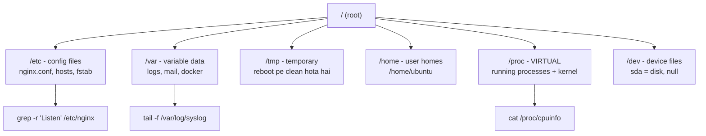

# Day 2: Linux Fundamentals - File System & Commands
📚 Topic 2: Linux Deep Dive — Filesystem & Commands
✅ Prerequisite-checklist: (review Day 1 DevOps Culture concepts if needed)

## Overview | Parichay

Linux duniya ke zyada-tar servers, containers, aur cloud instances par chalta hai. Agar aapko DevOps banana hai toh Linux commands aana **zaroori** hai. Aaj hum file system structure aur kaam ke commands seekhenge.

### Filesystem fixed kyun hai — FHS ki soch

Kalpana karo ek godown jisme saara saamaan bina rule ke rakha hai — aaj samaan kahan hai kisi ko nahi pata. ISLIYE Linux har cheez ka **fixed shelf** define karta hai: config `/etc`, logs `/var`, temp `/tmp`, users `/home`. Isi fixed map ko **FHS (Filesystem Hierarchy Standard)** kehte hain. Fayda: jab bhi production server me problem aaye, tum **pehle se jante ho kahan dekhna hai** — naya admin bhi 10 minute me dhoondh leta hai. Yehi reason hai ki har Linux machine ka filesystem dikhta hai basically same.

### "/ (root)" se sab shuru — Linux ka single tree

Linux me drives ke alag letters nahi hote (`C:`/`D:` Windows jaisa). Poora system **ek hi tree** hai jo "/" (root) se shuru hota hai — chaahe disk, pen drive, ya network share, sab kuch isi tree ke neeche **mount** hota hai. `/mnt/data`, `/media/usb` — ye sirf paani ke spots hain jahan cheezein jodi jaati hain.

### Har directory ka kaam — apna mental map banao

| Directory | Kya rakhta hai | Real example |
|-----------|----------------|--------------|
| `/` | Root — sab kuch iske neeche | — |
| `/etc` | Configuration files | `nginx.conf`, `hosts`, `ssh` |
| `/var` | Badalta/growing data, logs | `/var/log/syslog`, mail |
| `/tmp` | Temporary stuff (reboot pe clean) | install temp files |
| `/home` | Har user ka personal space | `/home/ubuntu` |
| `/proc` | **Virtual** — RAM me live kernel + process info | `/proc/cpuinfo`, `/proc/meminfo` |
| `/dev` | Device files — disk, printer, null | `/dev/sda` (disk), `/dev/null` |

### "Sab kuch file hai" — Linux ki philosophy

Linux me basically **sab kuch file hai** — config file hai, log file hai, disk file hai (`/dev/sda`), aur process bhi file hai (`/proc` me). `/proc` sabse interesting hai: ye **virtual filesystem** hai — disk pe exist nahi karta, bas RAM me rehta hai, aur jab tum `cat /proc/cpuinfo` karte ho to kernel live data file jaisa dikhata hai. Yehi karan hai ki `lsof` wali tools bina kernel code padhe kaam kar leti hain.

### Navigation aur file reading — kaunsi tool kab

- `pwd` = "mujhe kahan khade ho?" ka answer
- `ls -la` = full listing (hidden dot-files bhi) — `-l` long format, `-a` all, `-h` human readable
- `cd` = ghoomna; `cd ~` home, `cd -` pehli jagah, `cd ..` upar
- `cat` = poori file padho (chhoti files); `less` = lambi files scroll karke; `head`/`tail` = shuruaat/ant me se
- `tail -f` = log file **live stream** mein dekho — monitoring ka daily tool

### `find` vs `grep` — do alag dhoondh ka tarika

- `find /etc -name "*.conf"` = **name** se file dhoondho (filesystem tree ko walk karta hai)
- `grep -r "Listen" /etc/nginx/` = **content** ke andar pattern dhoondo (file ke andar padhta hai)
- `2>/dev/null` = "permission denied" wale errors chhupao, sirf useful output dekho

### Symlink vs hardlink — shortcut ka science

`ln -s /etc/hostname /tmp/x` ek **symlink** banata hai — shortcut file jisme "original ka path" likha hota hai (`ls -l` me arrow dikhti hai). Original delet ho to symlink **toot jata hai**. Hardlink (`ln src dst`) asli index entry copy karta hai — dono names same inode pe point karte hain (`ls -li` se inode same milega); original delete ho to dosti reh jaati hai. Practically DevOps me **symlink hi** zyada dikhega (jaise `node`, `python` symlinks).

### Disk ka dhyan — `df` vs `du`

- `df -h` = **poori disk** pe kitni jagah bachi (mounts ki list)
- `du -sh dir` = **kaunsi folder/folder** kitna khata hai (`-s` summary, `-h` human)
- Production incident ka classic order: `df -h` → disk full hai → `du -sh * | sort -rh` → kaun padta hai → old logs remove. Badhe bugchha ke peli disk ki wajah se app crash hota hai.

---

> Ek line mein: Linux me sab kuch **file hai** (config, log, device, process) aur filesystem ke fixed shelves rule karte hain — jaise godown me har cheez ka apna rack.

## What You'll Learn | Aaj Ki Seekh

- [ ] FHS structure: `/etc` (config), `/var` (logs), `/tmp` (temp), `/proc` (virtual) — kya kahan rakha hai
- [ ] Navigation: `pwd`, `ls -la`, `cd`, `mkdir -p`
- [ ] Files padhna: `cat`, `head`, `tail -f`, `less`
- [ ] Dhoondhna: `find / -name file`, `grep -r pattern`
- [ ] Symlink vs hardlink: `ln -s` shortcut banao
- [ ] Disk check: `df -h` (kitni bachi), `du -sh` (kaun kha raha)
- [ ] Logs continuously dekhte raho: `tail -f /var/log/syslog`

## Diagram | Dekho Kaise Kaam Karta Hai



ASCII:
```
/  →  /etc (config)  /var (logs)  /tmp (temp)  /home (users)
     /proc (virtual) /dev (devices)
pwd        → kahan ho
ls -la     → sab file (hidden bhi)
tail -f    → log live dekho
find / -name x   → kahan hai?
df -h + du -sh   → disk space + sizes
```

## Demo | Copy-Paste Karke Chalao

```bash
# 1. Kahan ho aur kya hai?
pwd
ls -la

# 2. Ghoomna aur structure banana
cd /etc && ls | head -5
cd ~                      # wapas home
mkdir -p /tmp/lab/config  # nested folders ek saath

# 3. Files padhna
cat /etc/os-release       # OS + version
tail -n 5 /var/log/syslog # log ke last 5 lines
tail -f /var/log/syslog   # LIVE streaming (Ctrl+C = roko)

# 4. Dhoondhna
find /etc -name "*.conf" 2>/dev/null | head
grep -r "Listen" /etc/nginx/ 2>/dev/null   # andar search

# 5. Symlink shortcut
ln -s /etc/hostname /tmp/lab/myhostname
ls -l /tmp/lab/myhostname   # arrow -> dikhegi

# 6. Disk dekhna
df -h                      # kaunsi mount pe kitna
du -sh /var/log/* 2>/dev/null | sort -rh | head
```

## Real-Life Example | Industry Me

**Log + disk check — production web server (nginx):**
```bash
ssh deploy@web-prod-01
tail -f /var/log/nginx/error.log               # live errors dekho
grep " 500 " /var/log/nginx/access.log | tail # 500s kahan aaye
find /var/log -name "*.gz" -mtime +30 -delete # purane rotated logs clean
df -h                                          # disk kitni bachi
du -sh /var/log/nginx/* 2>/dev/null | sort -rh | head
```
Production me har incident isi se shuru hota hai — pehle log padho, phir disk check karo, phir fix karo. Seniors is poori flow ko 5 minute me kar lete hain.

## Practice Exercise | Abhi Karein

1. `mkdir -p ~/lab/{config,backup}` banao — ek command me 2 folders
2. `ls -la` se hidden files pehchano (dot wali) — `.bashrc` kya hai?
3. Do terminal kholo — ek me `tail -f /var/log/syslog`, doosre me command chalao, log live dikhega
4. `find /usr -name "*.sh" 2>/dev/null | head` — kuch bash scripts dhoondo
5. Symlink banao `ln -s /etc/hostname ~/lab/host` aur `ls -li` se inode compare karo (hardlink same inode, symlink alag)
6. `df -h` + `du -sh ~/lab/*` — kitni jagah use hui likho
7. `grep -c "Listen" /etc/nginx/nginx.conf` — count karo

## Quick Notes | Yaad Rakho

```
- Ek root "/" se sab shuru hota hai (Windows /c/ jaisa kuch nahi)
- /etc = config · /var = logs · /tmp = temp (reboot pe clean) · /home = users
- /proc = virtual reality — /proc/cpuinfo, /proc/meminfo live
- ls -la = sab kuch (hidden .file bhi) · pwd = kahan ho
- mkdir -p = parent folders bhi bana deta hai
- tail -f = log live dekho (stream) · tail -n 100 = last 100 lines
- find / -name = name se dhoondo · grep -r = content search
- ln -s src dst = symlink shortcut (broken ho sakta hai)
- df -h = disk kitni bachi · du -sh * = kis folder ne khaya
- 2>/dev/null = errors chhupana (find/grep me common)
- Tab = auto-complete · Ctrl+L = clear · Ctrl+C = roko
- Everything is a file — process, disk, device sab file hai
```

**Agla:** Linux users, permissions aur processes — kaun kya kar sakta hai server pe.