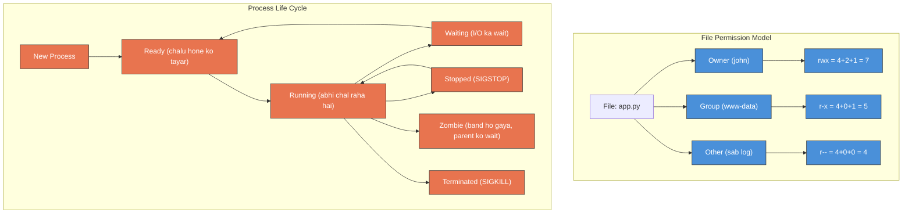

# Day 3: Linux Users, Permissions & Process Management
📚 Topic 3: Linux Deep Dive — Users, Permissions & Processes
✅ Prerequisite-checklist: (review Day 2 Linux filesystem concepts if needed)

## Overview | Parichay

Server par kaun kya kar sakta hai, yeh control karna bahut important hai. Aaj hum **users**, **permissions**, aur **processes** manage karna seekhenge - ye sab DevOps security ka base hai.

---

## What You'll Learn | Aaj Ki Seekh

- [ ] Linux users types samajhna - root, regular, service users
- [ ] File permissions (rwx) ka system samajhna - owner, group, other
- [ ] Numeric permissions (chmod 755, 644, 600) yaad karna
- [ ] Processes manage karna - ps, top, kill, systemctl
- [ ] Background processes chalana - &, nohup, jobs
- [ ] Ownership change karna - chown, chgrp

## Diagram | Dekho Kaise Kaam Karta Hai

### Mermaid: Linux Permission Model + Process States



### ASCII: Permission Breakdown (rwx)

```
-rwxr-xr--
 │││ │││ │││
 │││ │││ └┴┴── Other:  r-- = Read only (4)
 │││ │└┴────── Group:   r-x = Read + Execute (5)
 │└┴────────── Owner:   rwx = Read + Write + Execute (7)
 └──────────── Type:    - = file, d = directory

 Numeric: chmod 755 → Owner=7, Group=5, Other=5
          chmod 644 → Owner=6, Group=4, Other=4
          chmod 600 → Owner=6, Group=0, Other=0 (PRIVATE!)
```

### Real Images


Linux file permissions visual - Red Hat Sysadmin docs se

---

## Real-Life Example | Zindagi Se

> **Society ka gate jaisa hai Linux permissions:** Society mein ek main gate hota hai (root access - sab kuch kar sakte ho). Flat owner ko apne flat mein full access hai (rwx). Society members ko common area mein access hai (group - r-x). Bahar se aane waale (other) ko sirf lobby mein jaane do (r--). Agar koi guest bina permission ke andar ghusa toh security guard (SELinux/AppArmor) rok dega. `chmod` = permission card dena, `chown` = flat ka malik badalna!

---

## Basic Concepts Detail Mein

### 1. Linux Users

Linux mein har insaan/program ek **user** ke roop mein hota hai.

| User Type | Kaun | Paise |
|-----------|------|-------|
| **root** | Admin (Superuser) | Sab kuch kar sakta hai |
| **Regular user** | Normal log (e.g. deployer) | Limited permissions |
| **Service user** | Programs ke liye (nginx, www-data) | Sirf unka kaam |

**User Commands:**
```bash
whoami              # Main kaun hoon
id                  # Meri details (UID, GID, groups)
sudo useradd -m john    # Naya user banao (home folder ke saath)
sudo passwd john         # Password set karo
sudo usermod -aG sudo john  # Group mein add karo
groups john          # Konse groups mein hai
sudo userdel john    # User delete karo
```

### 2. File Permissions (rwx System)

Har file/folder ke paas **3 permission** hote hain 3 groups ke liye:

```
-rwxr-xr-- 
  │││││││││
  │││└┴┴┴┴┴── Other (baaki sab log) - read only
  ││└───────── Group (group members) - read + execute
  │└────────── Owner (file ka malik) - read + write + execute
  └────────── File type (- = file, d = directory)
```

- **r** = read (padho), **w** = write (likho/badal do), **x** = execute (chalao)
- **Owner** = khud, **Group** = group wale, **Other** = sab

### 3. Numeric Permissions (chmod)

Har permission ko ek number milta hai:
- **r = 4**, **w = 2**, **x = 1**
- Sum karke number banta hai

| Permission | Number | Matlab |
|-----------|--------|--------|
| rwx | 7 | Read+Write+Execute |
| rw- | 6 | Read+Write |
| r-x | 5 | Read+Execute |
| r-- | 4 | Sirf Read |

**Common combinations:**
```bash
chmod 755 file.sh    # Owner sab (7), group read+exe (5), others read+exe (5)
chmod 644 file.txt   # Owner read+write (6), baaki sirf read (4,4)
chmod 600 key.pem    # Sirf owner read+write (private key!)
chmod +x script.sh   # Execute permission add karo
chmod -R 755 folder/ # Poori folder recursively

# Owner / group change karo
sudo chown john:www-data file   # owner=john, group=www-data
sudo chgrp www-data file        # sirf group change
```

### 4. Process Management

**Process** = chal raha program (ik thread of execution).

```bash
ps               # Current shell ke processes
ps aux           # Saare processes detail mein
ps aux | grep nginx   # Kisi process ko dhoondo
top              # Live process monitor (q se exit)
htop             # Better top (agar install ho)

kill 1234        # Process ko PID se band karo
kill -9 1234     # Force kill
killall nginx    # Naam se saare band karo
pkill node       # Pattern match karke band karo

# System services (systemd)
systemctl status nginx     # Service status
systemctl start nginx      # Start karo
systemctl stop nginx       # Stop karo
systemctl restart nginx    # Restart karo
systemctl enable nginx     # Boot par auto-start
```

### 5. Background Processes

```bash
sleep 100 &        # Background mein chalao ( & )
jobs               # Background jobs dekho
fg                 # Pehli job foreground mein lao
bg                 # Suspended job background mein
nohup command &    # Logout ke baad bhi chalta rahe
```

---

## Demo | Copy-Paste Karke Chalao

```bash
# Step 1: Apna user info dekho
whoami
id

# Step 2: Naya user banao (sudo chahiye)
sudo useradd -m demo-user 2>/dev/null || echo "User already exists"
id demo-user

# Step 3: Ek test file banao aur permissions dekho
echo "Hello DevOps" > /tmp/test-permissions.txt
ls -la /tmp/test-permissions.txt

# Step 4: Permissions badlo aur dekho
chmod 755 /tmp/test-permissions.txt
ls -la /tmp/test-permissions.txt
echo "Ab owner ko rwx, baaki ko r-x mila"

chmod 644 /tmp/test-permissions.txt
ls -la /tmp/test-permissions.txt
echo "Ab owner ko rw-, baaki ko r-- mila"

chmod 600 /tmp/test-permissions.txt
ls -la /tmp/test-permissions.txt
echo "Ab sirf owner ko rw- mila (PRIVATE!)"

# Step 5: Process list dekho
echo "=== Running processes ==="
ps aux | head -5

# Step 6: Background process chalao
sleep 300 &
BG_PID=$!
echo "Background process PID: $BG_PID"

# Step 7: Jobs dekho
jobs -l

# Step 8: Kill the background process
kill $BG_PID
echo "Process killed!"

# Step 9: Ek dummy process create karke kill karo
echo "=== Process kill demo ==="
sleep 600 &
DUMMY_PID=$!
echo "Created dummy process: $DUMMY_PID"
ps aux | grep "sleep 600" | grep -v grep
kill $DUMMY_PID
echo "Dummy process killed: $DUMMY_PID"

# Step 10: systemctl status dekho (agar systemd hai)
echo "=== Service status ==="
systemctl is-active ssh 2>/dev/null || echo "SSH service check karo"
```

**Har step ke baad output dekho** - samajh aayega kya ho raha hai!

---

## Practice Exercise | Abhi Karein

**Permissions Challenge:**

```bash
# Scenario banao
sudo useradd -m deployer
sudo passwd deployer

# Web directory banao
sudo mkdir -p /var/www/myapp
sudo touch /var/www/myapp/index.html

# Tasks:
# 1. Ownership set karo: deployer:www-data
# 2. Permissions: directories 755, files 644
# 3. Private key file banao with 600
# 4. Script banao aur executable banao
# 5. Saare running processes list karo, nginx process dhoondo
# 6. Ek process ko PID se kill karo
```

---

## Quick Notes | Yaad Rakho

```
- 755 = folders/scripts, 644 = normal files, 600 = secrets
- chmod = permissions badlo, chown = owner badlo
- ps aux | grep = process dhoondo (super common)
- top/htop = live dekhne ke liye
```

---

**Kal:** Shell scripting - automation ki asli taakat.
