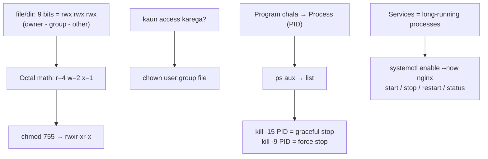

# Day 3: Linux Users, Permissions & Process Management
📚 Topic 3: Linux Deep Dive — Users, Permissions & Processes
✅ Prerequisite-checklist: (review Day 2 Linux filesystem concepts if needed)

## Overview | Parichay

Server par kaun kya kar sakta hai, yeh control karna bahut important hai. Aaj hum **users**, **permissions**, aur **processes** manage karna seekhenge - ye sab DevOps security ka base hai.

### Multi-user system kyun — security ki foundation

Linux ek **multi-user** system hai — ek machine par kaafi log/services kaam karte hain, aur unme se har ek ke paas sirf apna **limited rights** hona chahiye. Production me har app **apne dedicated user me** chalti hai (`root` kabhi nahi) — isliye ki agar ek app hack ho jaye to attacker ko **poore server ka** control na mile. Ye "least privilege" DevOps security ka golden rule hai — sirf utna access jitna zaroori hai.

### Permission bits ka pura math — rwx samjho

Har file/directory ke 9 permission bits hote hain: pehle 3 **owner (u)**, beech ke 3 **group (g)**, aakhri 3 **others (o)**. Har bit ka matlab:

| Bit | File pe | Directory pe |
|-----|---------|--------------|
| `r` (4) | Padh sakte ho | List kar sakte ho (`ls`) |
| `w` (2) | Likhe/edit kar sakte ho | File bana/delete kar sakte ho |
| `x` (1) | Run kar sakte ho (script/binary) | **Andar ja sakte ho (`cd`)** |

Octal math: `r=4, w=2, x=1` — inko jodo. `chmod 755` = 7(4+2+1 = rwx) 5(4+1 = r-x) 5(r-x) → owner full, group read+execute, other read+execute. `chmod 600` = owner sirf rw, baaki kuch nahi (secrets ke liye perfect). Yaad rakhne ka trick: **7=full, 5=read+run, 4=sirf read, 6=read+write, 0=kuch nahi.** Directory pe `x` ke bina aap `cd` hi nahi kar sakte — bahut common silent bug hai.

### Symbolic vs octal — dono chalta hai

- Octal: `chmod 750` — exact number, ek hi baar me sab kuch set
- Symbolic: `chmod u+x` (owner ko execute add), `chmod o-w` (others se write remove) — ek specific change ke liye concise

CI/CD pipelines me octal **standard** hai kyunki exact state set hoti hai (idempotent — hafaa hafaa koi andaja nahi).

### Ownership — `chown` / `chgrp`

Har file ka owner + group hota hai. `sudo chown user:group file` dono ek saath badalta hai, `chgrp` sirf group. Kaam: koi file agar apne app user ki nahi hai to app log/read/likhe nahi paayegi — deploy time pe common "permission denied" ka root cause yahi hai. `umask` control karta hai ki **naye** files ka default kya hoga (umask 022 → files 644, dirs 755 — matlab "dusre padh sakte hain par bas apna owner likhe"). Secrets ke liye `umask 077` rakho.

### Process kya hai — program vs process

**Program** = disk pe padi file (scripts/binary). **Process** = wo program **running** (RAM me, execution ho rahi hai). Ek program ke several processes ho sakte hain (jaise nginx master + workers). Har process ka **PID** (Process ID) hota hai + parent (PPID). `ps aux` = sab processes list (a=others, u=user, x=no-terminal), `top`/`htop` = live updates ke saath. `--sort=-%cpu` = CPU ke hisab se heaviest pehle.

### Signals — process ko bolo kaise rukna hai

Process ko "ruk jao" kehne ke liye signals bhejte hain:

| Signal | Command | Matlab |
|--------|---------|--------|
| **SIGTERM** (15) | `kill -15 PID` | Graceful — app ko cleanup ka mauka (files band karo, state save) |
| **SIGKILL** (9) | `kill -9 PID` | Force — turant khatam, koi cleanup nahi (last resort) |
| **SIGHUP** (1) | `kill -1 PID` | Config reload (nginx jaise services me) |

`kill -9` sirf tab jab graceful band hi na ho raha ho — warna data corrupt hone ka risk. **Zombie process** = child exit ho gaya par parent ne `wait` nahi kiya (bug parent me) — process kam nahi karta par process table mein phas raha hai.

### Background jobs — ek saath kaam

`command &` = background (terminal block nahi), `jobs` = list, `fg` = front, `bg` = background, `Ctrl+Z` = pause, `nohup cmd &` = **logout ho jao to bhi chalta rahe** (nohup = no hangup). CI/CD agents, cron, long-running tasks — sab isi pattern me.

### Services aur systemctl — system ka remote controller

**Services** = long-running processes jo boot pe chalu honi chahiye (nginx, docker, ssh). `systemctl` unka manager hai: `start/stop/restart/enable/disable/status` + `is-active`. `enable` ka matlab hai "boot pe auto start". Logs `journalctl -u nginx -f` se live dekho. Production ka daily kaam: service chalu kaise ki, status kaise check, logs kaise padhe — yahi loop hai.

---

> Ek line mein: permissions = server ki talabandi, process = chalta program jispe control chahiye, systemctl = service ka remote.

## What You'll Learn | Aaj Ki Seekh

- [ ] `ls -l` padhna: type + owner/group/other bits (`drwxr-xr--`)
- [ ] `chmod` octal (`755`) vs symbolic (`u+x`)
- [ ] `chown` / `chgrp` — owner aur group badalna
- [ ] `umask` — naye files ke default permissions
- [ ] `useradd`/`passwd` — users aur passwords
- [ ] `ps aux`, `top`, signals — `kill -15` (graceful), `kill -9` (force)
- [ ] Jobs: `&`, `jobs`, `bg`, `fg`, `nohup`
- [ ] `systemctl start/stop/restart/enable/status` + `journalctl`

## Diagram | Dekho Kaise Kaam Karta Hai



ASCII:
```
ls -l → -rwxr-xr--   (u=rwx  g=r-x  o=r--)
chmod 750 → owner rwx, group r-x, other none
chown user:group file → ownership
ps aux → PID → top live → kill -15 / -9
systemctl start|stop|restart|enable nginx
```

## Demo | Copy-Paste Karke Chalao

```bash
# 1. Permissions dekhna
ls -l /etc/hostname

# 2. chmod — octal aur symbolic dono
mkdir -p ~/lab && echo "hello" > ~/lab/a.txt
chmod 600 ~/lab/a.txt && ls -l ~/lab/a.txt
chmod u+x ~/lab/a.txt && ls -l ~/lab/a.txt
chmod 755 ~/lab/a.txt && ls -l ~/lab/a.txt

# 3. Owner/group + naya user
sudo useradd -m -s /bin/bash devuser
sudo chown devuser:devuser ~/lab/a.txt
sudo passwd devuser

# 4. Processes dekho aur rokho
ps aux --sort=-%cpu | head -5
sleep 300 &
jobs                 # background job list
kill -15 %1          # graceful stop job 1

# 5. Services manage karo
sudo systemctl status cron
sudo systemctl restart cron
sudo systemctl enable cron            # boot pe start
journalctl -u cron -n 10 --no-pager   # service logs
```

## Real-Life Example | Industry Me

**App ka dedicated deploy user + service (prod server):**
```bash
sudo useradd -m -s /bin/bash deploy     # app apne dedicated user me
sudo usermod -aG docker deploy          # sirf needed groups (‒a mat bhoolna)
sudo chmod 700 /home/deploy/.ssh
sudo chmod 600 /home/deploy/.ssh/authorized_keys
sudo systemctl enable --now nginx       # boot + start
sudo systemctl status nginx
ps aux | grep nginx                     # worker processes
kill -15 <pid>                          # graceful reload/stop
journalctl -u nginx -f                  # live service logs
```
Production me har app **apne dedicated user me** chalti hai (root kabhi nahi) — agar ek app hack ho jaye to poora server compromise na ho. `kill -9` sirf last resort jab graceful band nahi ho raha.

## Practice Exercise | Abhi Karein

1. Ek file banao aur `ls -l` se owner/group/other bits alag-alag pehchano
2. `chmod 777`, phir `chmod 750` — dono ke baad `ls -l` me kya badla likho
3. `sudo useradd -m devops` + `sudo passwd devops`, phir `su - devops` se login karo (home dir check karo)
4. `ps aux --sort=-%cpu | head` — top 3 CPU processes note karo
5. `sleep 60 &` → `jobs` → `fg` → `Ctrl+C` — job control ka poora flow samjho
6. `sleep 60 &` ko `kill -15` karo, phir dusre ko `kill -9` se — difference note karo
7. `sudo systemctl enable --now ssh` + `systemctl is-active ssh` — service ready verify

## Quick Notes | Yaad Rakho

```
- ls -l pehla char = type (d=dir, -=file) phir 3+3+3 permission bits
- r=4 w=2 x=1 → chmod 750 = owner rwx, group r-x, others none
- chmod u+x (symbolic) bhi chalta hai — kaam ek jaisa
- chown user:group file · chgrp group file (sirf group badalna)
- umask 022 → naye files 644, naye dirs 755 (default rule)
- useradd -m = home banao · usermod -aG sudo (‒a mat bhoolna)
- Directory pe x = cd karna · bina x directory lagegi locked
- ps aux = sab process · top = live screen · -sort=-%cpu = heaviest
- kill -15 = graceful (app cleanup kare) · kill -9 = force last resort
- jobs/bg/fg = background control · nohup = logout pe bhi chalta
- systemctl status/start/stop/restart/enable + journalctl logs
- Zombie process = parent ka bug (child exit, parent wait nahi kiya)
```

**Agla:** Shell scripting — repeat hone wala kaam ek script me automate karo.