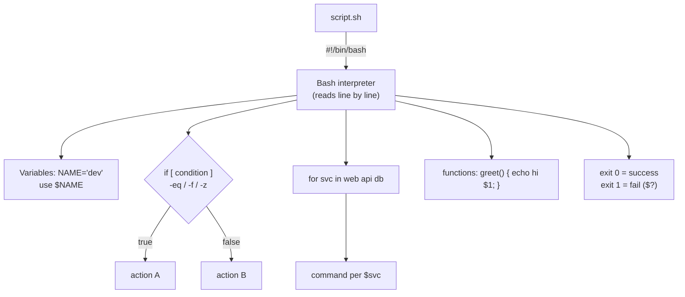

# Day 4: Shell Scripting Basics
📚 Topic 4: Linux Deep Dive — Shell Scripting & Automation
✅ Prerequisite-checklist: (review Day 3 Linux users/permissions if needed)

## Overview | Parichay

Shell scripting se repetitive kaam ko **automate** karte hain. DevOps mein jitna kaam automate karte ho, utna good. Aaj hum bash scripts ke basics seekhenge - ye DevOps automation ki foundation hai.

### Automation kyun — DevOps ka core mantra

Woh kaam jo tum har roz **haath se** karte ho — same 10 commands, same order — wahi script me likh do, aur ab ek baar bolne se sab ho jata hai. Fayda: 1) **speed** (copy-paste ke bajaye ek command), 2) **consistency** (insaan galati karta hai, script nahi — har baar exact same), 3) **shareable** (script ko team/git me rakho), 4) **auditable** (kya chala, kyon — script me hi likha hai). CI/CD pipelines asli me to bas scripts hi hain — isliye ye day CD/CD ka base hai.

### Script ka structure — top to bottom

Script = commands ki file jo top-to-bottom chalti hai. Structure:

```bash
#!/bin/bash              # shebang — interpreter kaun hai (ye file bash se chale)
# comment: kya kar raha hai      # ye sirf note hai
set -e                    # koi command fail → script turant ruk jaye (safety)
echo "starting..."
mkdir -p /tmp/lab         # normal commands...
exit 0                    # exit code — sab sahi gaya
```

Pehli line `#!/bin/bash` (shebang) zaroori hai — bina iske system ko nahi pata kaunse interpreter me chalaana hai. `set -e` pro-tip hai: bina iske ek galat command ke baad script silent chalna continue karta hai — production intact nahi.

### Variables — data store karo

`NAME="devops"` se variable banao, `$NAME` se use karo. Golden rule: **quotes hamesha** — `echo "$NAME"` (bina quotes ke spaces toot jate hain). Input: `read` (user se), `$1 $2` (argument — jab script banao, values hardcode mat karo, arguments se lo). Env vars (`export DB_USER=...`) pipelines/environment se fill hote hain — credentials kabhi script me seedhe mat likho.

### if/else — decisions lena

`if command; then ...; else ...; fi` — bash me condition **exit code** pe chalti hai. `[ -f file ]` (file exist?), `[ -d dir ]`, `[ "$a" = "$b" ]` (string compare), `[ "$n" -gt 10 ]` (number greater). Pro tip: variable ko quotes me rakho (`"$a"`), warna empty ho to syntax error. Kaam: "agar backup dir nahi hai to bana do", "agar port busy hai to skip".

### Loops — repetition kaam karo

- `for f in *.log; do echo "$f"; done` — list pe repeat (har file, har server)
- `while read line; do ...; done < file.txt` — jab tak condition true
Practical: "50 servers pe SSH karke health check karo" → loops se ek script me.

### Functions — reusable blocks

```bash
check_disk() {
  df -h /
}
check_disk   # call
```

Function = script ke andar mini-script — ek baar define, multiple baar use. Bade scripts ko functions me todna = readable + testable.

### Exit codes — success ka proof

Har command ka exit code hota hai: **0 = success, non-zero = fail**. `echo $?` se last command ka code dekho. Ye CI/CD ka dil hai — pipeline har step check karta hai: exit 0 → aage apply, non-zero → build fail. Script ka bhi same hai: `exit 0` success, `exit 1` fail (jo bhi ise call kare wo decide kar sake).

### Script safety — production-grade habits

1. `set -e` — fail pe roko, silently continue mat karo
2. Bare var references pe hamesha `"..."` quotes
3. `mkdir -p`, idempotent commands — script 2 baar chalao → same safe result
4. Logs + timestamps: `echo "$(date) - doing X"`
5. Credentials/env hardcode nahi — arguments/environment se

---

> Ek line mein: script = pehli robot jisko tum "bas ye commands chalao" bol dete ho — aur wo har baar same karta hai, copy-paste ki galtiyan khatam.

## What You'll Learn | Aaj Ki Seekh

- [ ] Shebang `#!/bin/bash` + `chmod +x` + `./script.sh`
- [ ] Variables, command substitution `$(...)`, quotes
- [ ] `if/elif/else` + tests (`-f`, `-z`, `-eq`, `-d`)
- [ ] Loops: `for`, `while` + `break`/`continue`
- [ ] Functions + positional args `$1 $2 $@`
- [ ] Exit codes: `$?`, `exit 0` (success) / `exit 1` (fail)
- [ ] `read` se user input
- [ ] `set -e` fail-fast (production style)

## Diagram | Dekho Kaise Kaam Karta Hai



ASCII:
```
#!/bin/bash
NAME="devops" ; echo "$NAME"
if [ "$X" -eq 5 ]; then ...; fi
for i in 1 2 3; do ...; done
greet() { echo "Hello $1"; }
exit 0       # CI/CD isi exit code pe decide karta hai
```

## Demo | Copy-Paste Karke Chalao

```bash
# 1. Pehli script
cat > hello.sh << 'EOF'
#!/bin/bash
NAME="DevOps"
echo "Hello $NAME"
echo "Today: $(date +%F)"
EOF
chmod +x hello.sh
./hello.sh

# 2. Decision + function + loop
cat > check-ports.sh << 'EOF'
#!/bin/bash
check_port() {
  if ss -tlnp | grep -q ":$1 "; then
    echo "Port $1: OPEN"
  else
    echo "Port $1: CLOSED"
  fi
}
for port in 80 443 22; do
  check_port "$port"
done
EOF
chmod +x check-ports.sh && ./check-ports.sh

# 3. Exit codes
echo "exit: $?"        # last command ka code (0 = ok)
false; echo "after false: $?"
```

## Real-Life Example | Industry Me

**`backup.sh` — chhoti startup, raw cloud server:**
```bash
#!/bin/bash
set -e   # koi command fail → turant ruk jao (fail-fast)
APP_DIR="/var/www/app"
BACKUP="/backup/app-$(date +%F).tgz"
tar czf "$BACKUP" "$APP_DIR"
echo "backup: $BACKUP"
find /backup -name "*.tgz" -mtime +7 -delete   # 7 din purane hatao
echo "done, exit=$?"
```
Agar `tar` fail ho to `set -e` script ro deti — silent corrupt backup nahi. Cloud VMs pe cron/CI isi template se chalte hain, isliye foundation solid hona chahiye.

## Practice Exercise | Abhi Karein

1. `hello.sh` banao (`#!/bin/bash`, variable, echo), `chmod +x`, run karo
2. `$(date +%F)` ko filename me use karke ek backup file banao
3. `read age` + if/else se "major/minor" print karne wali script
4. for loop: `for i in 1 2 3 4 5` — web-1 se web-5 print karo
5. while loop: counter 1 se 5 — odd/even print karo
6. `greet()` function banao jo `$1` naam print kare; 3 baar call karo
7. `set -e` add karo, ek galat command daalo — script turant stop hogi (proof)

## Quick Notes | Yaad Rakho

```
- Shebang #!/bin/bash har script me · chmod +x = executable
- Variable: NAME="x" (space nahi!) · use $NAME ya ${NAME}
- $(cmd) = command output capture · quotes "$VAR" hamesha
- if [ cond ] — brackets ke andar spaces zaroori
- -eq numbers, = strings · -f file? -d dir? -z empty?
- for i in list; do ...; done · while [ cond ]; do ...; done
- function myfn() { ... } · call: myfn arg · $1 = first arg
- $# = kitne args · $@ = sab args · $? = last exit code
- exit 0 = success · exit 1 = fail (caller decide karta hai)
- set -e = error pe roko · set -u = unset variable pe roko
- bash -n script.sh = syntax check · shellcheck = lint (0 errors)
- Har script idempotent: 2 baar chalao → same safe result
```

**Agla:** Networking fundamentals — ip, ping, dig, curl, ports, DNS, HTTP.