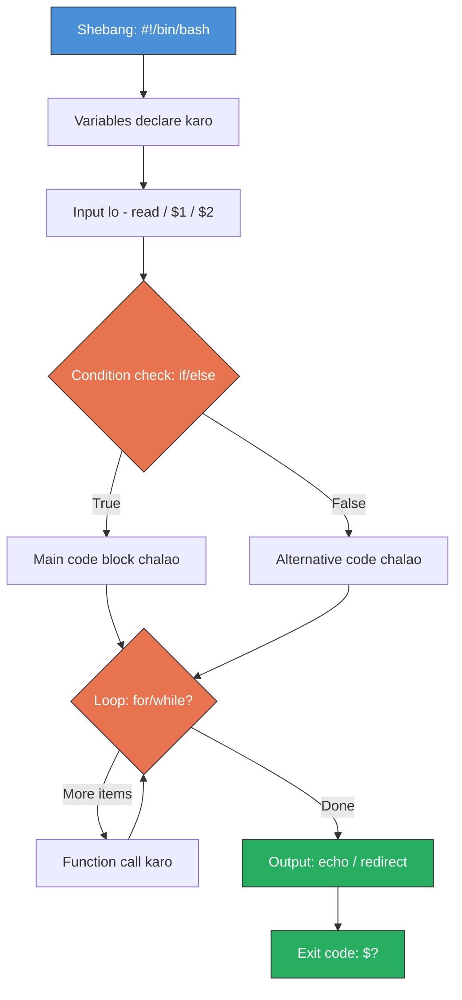

# Day 4: Shell Scripting Basics
📚 Topic 4: Linux Deep Dive — Shell Scripting & Automation
✅ Prerequisite-checklist: (review Day 3 Linux users/permissions if needed)

## Overview | Parichay

Shell scripting se repetitive kaam ko **automate** karte hain. DevOps mein jitna kaam automate karte ho, utna good. Aaj hum bash scripts ke basics seekhenge - ye DevOps automation ki foundation hai.

---

## What You'll Learn | Aaj Ki Seekh

- [ ] Bash script ka structure samajhna - shebang, variables, comments
- [ ] Variables aur command output store karna
- [ ] Conditionals (if/else/elif) use karna
- [ ] Loops (for, while, until) chalana
- [ ] Functions banana aur arguments pass karna
- [ ] Input/output redirection aur pipes samajhna

## Diagram | Dekho Kaise Kaam Karta Hai

### Mermaid: Bash Script Structure Flow



### Real Images


Bash scripting overview - Hostinger tutorials se

---

## Real-Life Example | Zindagi Se

> **Cooking recipe jaisi hai shell script:** Pehle samagri rakh lo (variables = ingredients). Phir dekho ande hain ya nahi (if/else = condition). Agar ande hain toh omelette banao, nahi toh paratha banao (conditional). Har ek roti banate jao jab tak dough khatam na ho (for loop). Agar sab ho gaya toh serve karo (output). Recipe likhi hui hai toh baar baar same kaam nahi karna padta - bas padho aur banao (automation)!

---

## Basic Concepts Detail Mein

### 1. Shebang & Script Structure

Har bash script `#!/bin/bash` se shuru hoti hai - yeh batata hai bash interpreter se script chalegi.

**Script banane ka tarika:**
```bash
#!/bin/bash
# comment
echo "Hello World"   # print karo

# Execute karne ke liye:
chmod +x script.sh   # executable banao
./script.sh          # chalao
```

### 2. Variables

```bash
NAME="DevClo"          # Variable declare (space nahi, = ke aas-paas!)
readonly PI=3.14      # Constant
echo "$NAME"          # Variable use karo ("" mein $ use hota hai)

# Command output variable mein daalo
DATE=$(date)
HOST=$(hostname)
echo "Aaj ki date: $DATE, Host: $HOST"

# User se input lo
read -p "Apna naam batao: " USERNAME
echo "Hello $USERNAME"

# Special variables
echo "$0"   # Script ka naam
echo "$1"   # Pehla argument
echo "$#"   # Kitne arguments
echo "$?"   # Last command ka exit code (0 = success)
```

### 3. Conditionals (if/else)

```bash
if [ "$NAME" = "DevClo" ]; then
    echo "Match mila!"
elif [ "$NAME" = "Test" ]; then
    echo "Test match"
else
    echo "Kuch aur"
fi

# Comparisons (numbers)
if [ "$AGE" -gt 18 ]; then    # greater than
    echo "Adult"
fi
# -gt (.), -lt (<), -ge (>=), -le (<=), -eq (=), -ne (!=)

# String checks
[ -z "$VAR" ]     # Empty hai?
[ -n "$VAR" ]     # Empty nahi hai?
[ -f file ]       # File exists + regular file?
[ -d dir ]        # Directory exists?
[ ! -e file ]     # File exist nahi karta

# Logical
[ "$A" = "x" ] && [ "$B" = "y" ]   # AND
[ "$A" = "x" ] || [ "$B" = "y" ]   # OR
```

### 4. Loops

**For loop:**
```bash
for i in 1 2 3 4 5; do
    echo "Number: $i"
done

for file in *.txt; do
    echo "File: $file"
done

for i in $(seq 1 10); do ...
done
```

**While loop:**
```bash
COUNT=0
while [ $COUNT -lt 5 ]; do
    echo "Count: $COUNT"
    COUNT=$((COUNT + 1))
done

# Infinite loop (monitoring ke liye)
while true; do
    echo "Checking status..."
    sleep 5
done
```

**Until loop:**
```bash
COUNT=0
until [ $COUNT -ge 5 ]; do
    echo "Count: $COUNT"
    COUNT=$((COUNT + 1))
done
```

### 5. Functions

```bash
function greet() {
    echo "Hello $1 $2"
}

greet "DevOps" "Engineer"

# Return value
function add() {
    echo $(( $1 + $2 ))
}
SUM=$(add 5 3)
echo "Sum: $SUM"
```

### 6. Input/Output (Redirection)

```bash
echo "Hello" > file.txt      # Write (overwrite)
echo "World" >> file.txt     # Append (add)
command < input.txt          # Input from file
ls 2> error.log              # Errors alag file mein
command | grep "error"       # Pipe - output ko next command mein bhejo
command 2>&1                 # stderr ko stdout mein merge
```

---

## Demo | Copy-Paste Karke Chalao

```bash
# Ek real .sh script banao aur chalao!

# Step 1: Script file banao
cat > ~/hello-devops.sh << 'EOF'
#!/bin/bash
# Hello DevOps - pehli shell script!

echo "================================="
echo "  DevOps Automation Script"
echo "================================="
echo ""

# Variables
SCRIPT_NAME="hello-devops.sh"
TODAY=$(date +"%Y-%m-%d %H:%M:%S")
HOSTNAME=$(hostname)
USER=$(whoami)

echo "Script: $SCRIPT_NAME"
echo "Date: $TODAY"
echo "Host: $HOSTNAME"
echo "User: $USER"
echo ""

# If/Else condition
DISK_USAGE=$(df / | awk 'NR==2{print $5}' | tr -d '%')
echo "Disk usage: ${DISK_USAGE}%"

if [ "$DISK_USAGE" -gt 80 ]; then
    echo "WARNING: Disk space low hai!"
elif [ "$DISK_USAGE" -gt 50 ]; then
    echo "OK: Disk thoda use ho raha hai"
else
    echo "GREAT: Disk space bahut hai!"
fi
echo ""

# For loop
echo "=== System services check ==="
for svc in ssh nginx docker; do
    STATUS=$(systemctl is-active $svc 2>/dev/null || echo "not-found")
    echo "  $svc: $STATUS"
done
echo ""

# Function
check_port() {
    if ss -tlnp | grep -q ":$1 "; then
        echo "  Port $1: OPEN"
    else
        echo "  Port $1: CLOSED"
    fi
}

echo "=== Port check ==="
check_port 22
check_port 80
check_port 443

echo ""
echo "Script complete!"
EOF

# Step 2: Script ko executable banao
chmod +x ~/hello-devops.sh

# Step 3: Script chalao
echo "=== Script chal raha hai ==="
~/hello-devops.sh

# Step 4: Arguments ke saath test karo
echo ""
echo "=== Arguments demo ==="
echo "First arg: $1"
echo "Total args: $#"
```

**Ek baar copy-paste karo** - script banega aur chalega bhi. Dekho terminal par output!

---

## Practice Exercise | Abhi Karein

**In scripts ko banao:**

```bash
#!/bin/bash
# 1. system-info.sh - System ki jaankari dikhao
#    hostname, OS, kernel, uptime, disk, memory

#!/bin/bash
# 2. backup.sh - Directory ko timestamp ke saath backup karo
#    Usage: ./backup.sh /path/to/source /path/to/backup
#    backup_YYYYMMDD_HHMMSS.tar.gz banega

#!/bin/bash
# 3. health-check.sh - Services running hain check karo
#    Check: nginx, docker, ssh → RUNNING/STOPPED

#!/bin/bash
# 4. user-setup.sh - Text file se multiple users banao
```

---

## Quick Notes | Yaad Rakho

```
- Har script #!/bin/bash se shuru
- Variable = ke aas-paas space NAHI
- $() = command ka output, ${} = variable
- " " use karo $ expansion ke liye, ' ' literal
- echo "Hello $@" = saare arguments
```

---

**Kal:** Networking fundamentals - services kaise baat karti hain.
