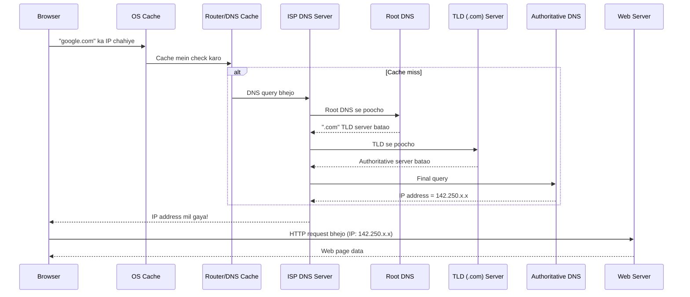

# Day 5: Networking Fundamentals
📚 Topic 5: Networking Deep Dive — DNS, HTTP & Basics
✅ Prerequisite-checklist: (review Day 4 Shell scripting if needed)

## Overview | Parichay

Services ko configure karna, connectivity troubleshoot karna, infra secure banana - sab ke liye networking samajhna zaroori hai. Aaj hum networking ke basics detail mein seekhenge.

---

## What You'll Learn | Aaj Ki Seekh

- [ ] IP addresses aur subnets samajhna - IPv4, CIDR notation
- [ ] Networking commands: ip, ping, dig, traceroute
- [ ] TCP vs UDP ka fark samajhna aur common ports yaad karna
- [ ] DNS resolution samajhna - domain name kaise IP mein convert hota hai
- [ ] HTTP/HTTPS methods aur status codes
- [ ] Firewall (ufw) setup karna

## Diagram | Dekho Kaise Kaam Karta Hai

### Mermaid: DNS Resolution Flow



### Mermaid: Curl Request Flow


### ASCII: TCP 3-Way Handshake

```
 Client                        Server
   │                              │
   │──── SYN ────────────────────│  "Mujhe connection chahiye"
   │                              │
   │──── SYN-ACK ────────────────│  "Theek hai, bhejo"
   │                              │
   │──── ACK ────────────────────│  "Chalo shuru karte hain!"
   │                              │
   │════ DATA TRANSFER ═════════│  ← Ab data aata jaata hai
```

### Real Images


DNS resolution steps - Cloudflare docs se


TCP/IP model layers - Fortinet Cyberpedia se

---

## Real-Life Example | Zindagi Se

> **Courier delivery jaisa hai networking:** Tumhe apne dost ko letter bhejna hai (data packet). Pehle uska pata chahiye (DNS resolution = domain se IP). Phir post office se receive karta hai (TCP handshake - confirm kar ke). Agar registered post hai toh seal bhi lagti hai (TLS/SSL encryption). Letter pahunchta hai toh dost reply bhi bhejta hai (HTTP response). Agar pata galat hai toh letter wapas aata hai (404 Not Found). Port number = ghar ka flat number - 22 = SSH flat, 80 = HTTP flat!

---

## Basic Concepts Detail Mein

### 1. IP Addresses & Subnets

**IP Address** = har device ka internet/network mein unique address (jaise ghar ka pata).

- **IPv4:** 4 numbers, dot se alag - `192.168.1.10` (jaise `x.x.x.x`, har x 0-255)
- **IPv6:** Lambe - `2001:0db8:85a3:0000:0000:8a2e:0370:7334`

**CIDR Notation** - IP + prefix length:
- `10.0.0.0/8` = 16 million addresses (bada network)
- `10.0.0.0/16` = 65,536 addresses
- `10.0.0.0/24` = 256 addresses

**Private IP ranges (internet par nahi, andar ke network ke liye):**
- `10.0.0.0/8`
- `172.16.0.0/12`
- `192.168.0.0/16`

### 2. Networking Commands

```bash
ip addr          # Apna IP dekho
ip a             # Short version
ifconfig         # Puraana style
hostname -I      # Sirf IP

ping google.com        # Connectivity test (ICMP)
ping -c 4 google.com   # 4 packets
traceroute google.com  # Kaunse route se jaana (path)
tracepath google.com   # Ports wala version

nslookup google.com    # DNS resolve karo
dig google.com         # Advanced DNS query
dig +short google.com  # Sirf answer
```

### 3. TCP vs UDP & Common Ports

| Protocol | Kya hai | Kab use hota hai |
|----------|---------|------------------|
| **TCP** | Reliable, connection-based, confirm kar ke bhejta | HTTP, SSH, database |
| **UDP** | Fast, no confirmation, packets can drop | Video, DNS, gaming |

**Common Ports (yaad rakhne wajib):**
| Port | Service |
|------|---------|
| 22 | SSH |
| 80 | HTTP |
| 443 | HTTPS |
| 3306 | MySQL |
| 5432 | PostgreSQL |
| 6379 | Redis |
| 27017 | MongoDB |
| 8080 | App servers (Tomcat) |

**Port check:**
```bash
netstat -tlnp       # Kaunse ports listening hain
ss -tlnp            # Modern version
sudo lsof -i :8080  # Port 8080 par kaun hai
nmap localhost      # Open ports scan karo
```

### 4. DNS (Domain Name System)

DNS = internet ki phonebook. Domain naam (`google.com`) ko IP mein translate karta hai.

| Record Type | Matlab |
|-------------|--------|
| **A** | Domain → IPv4 address |
| **AAAA** | Domain → IPv6 address |
| **CNAME** | Domain → doosre domain name |
| **MX** | Mail server |
| **TXT** | Verification/SPF (email security) |
| **NS** | Name server specify |

### 5. HTTP/HTTPS

**HTTP Methods:**
| Method | Matlab |
|--------|--------|
| GET | Data lo (read) |
| POST | Naya data bhejo (create) |
| PUT | Data update karo |
| DELETE | Data delete karo |
| PATCH | Partial update |

**Status Codes (yaad rakhne):**
| Code | Matlab |
|------|--------|
| 200 | OK (success) |
| 301/302 | Redirect |
| 400 | Bad request (client ki galti) |
| 401 | Unauthorized |
| 403 | Forbidden |
| 404 | Not found |
| 500 | Server error |
| 502/503 | Gateway/service problem |

**curl (API testing superpower):**
```bash
curl https://httpbin.org/get              # GET
curl -X POST -d '{"name":"x"}' URL        # POST with data
curl -H "Authorization: Bearer TOKEN" URL # With headers
curl -o file.html URL                     # Save to file
curl -I URL                               # Sirf headers
curl -k https://self-signed.example       # Skip SSL verify (careful)
```

### 6. Firewall (ufw)

Firewall = batata hai kounsa traffic andar/outside jaa sakta hai.

```bash
sudo ufw enable
sudo ufw allow 22/tcp        # SSH allow
sudo ufw allow 80            # HTTP
sudo ufw allow 443           # HTTPS
sudo ufw deny 3306           # MySQL block
sudo ufw status              # Current rules
sudo ufw allow from 192.168.1.100 to any port 22  # Specific IP
```

### 7. SSL/TLS Basics

**SSL/TLS** = data ko encrypt (code) karke bhejna, taaki beech mein koi nahi padh sakta.

- Certificate = website ki identity + public key
- Let's Encrypt = free certificates
- `https://` = SSL/TLS active
- DevOps kaam mein aksar SSL setup/config hota hai (e.g. nginx certs)

---

## Demo | Copy-Paste Karke Chalao

```bash
# Step 1: Apna IP address dekho
echo "=== Mera IP Address ==="
ip addr show | grep "inet " | awk '{print $2}'

# Step 2: Connectivity test karo
echo ""
echo "=== Ping test (4 packets) ==="
ping -c 4 google.com

# Step 3: DNS resolve karo
echo ""
echo "=== DNS Resolution ==="
dig google.com +short
echo ""
echo "NS records:"
dig google.com NS +short

# Step 4: Kaunse ports abhi open hain
echo ""
echo "=== Listening Ports ==="
ss -tlnp 2>/dev/null | head -10

# Step 5: curl se API call karo
echo ""
echo "=== HTTP GET Request ==="
curl -s https://httpbin.org/get | head -15

# Step 6: Response headers dekho
echo ""
echo "=== Response Headers ==="
curl -sI https://google.com | head -10

# Step 7: Traceroute dekho (path kya hai)
echo ""
echo "=== Traceroute ==="
traceroute -m 5 google.com 2>/dev/null || echo "traceroute install nahi hai"

# Step 8: Quick firewall status
echo ""
echo "=== Firewall Status ==="
sudo ufw status 2>/dev/null || echo "UFW available nahi hai is system par"
```

**Step by step copy-paste karo** - har command ka output samajhne ki koshish karo!

---

## Practice Exercise | Abhi Karein

**Networking Challenge:**
```bash
# 1. Apna IP aur interface check karo
# 2. google.com ping karo, output explain karo
# 3. dig se google.com resolve karo
# 4. Netstat/ss se listening ports check karo
# 5. curl se https://httpbin.org/get call karo
# 6. Kisi website ka SSL certificate check karo:
#    echo | openssl s_client -connect google.com:443 2>/dev/null | openssl x509 -noout -dates
# 7. Firewall set karo: allow 22,80,443
# 8. Script likho jo port 80 open hai check kare
```

---

## Quick Notes | Yaad Rakho

```
- 22 SSH | 80 HTTP | 443 HTTPS | 3306 MySQL | 5432 Postgres
- dig/nslookup = DNS, netstat/ss = ports, curl = API
- ufw allow/deny = firewall
- 2xx OK, 4xx client, 5xx server
```

---

**Kal:** Git - version control, collaboration ka base.
