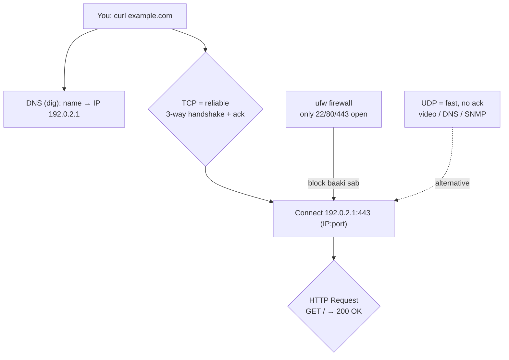

# Day 5: Networking Fundamentals
📚 Topic 5: Networking Deep Dive — DNS, HTTP & Basics
✅ Prerequisite-checklist: (review Day 4 Shell scripting if needed)

## Overview | Parichay

Services ko configure karna, connectivity troubleshoot karna, infra secure banana - sab ke liye networking samajhna zaroori hai. Aaj hum networking ke basics detail mein seekhenge.

### Networking ka pattern — address, door, phonebook, bhasha

Har network problem isi chhote pattern se banti hai. Ek server ka **address** IP hai (`192.0.2.1`), ek **port** door hai (443 = https door), **DNS** phonebook hai (naam → IP), aur **HTTP** bhasha hai (GET/POST + status codes). Jab "site down" aaye — inhi layers ko step-by-step check karo.

### IP, port, aur address — ghar ka pata + darwaza

IP address batata hai **kaunsa machine** (kaunsi building), port batata hai **kaunsa darwaza** (kaunsi service): `192.0.2.1:443` = "us building ke 443 wale door pe jao". Ek machine par kai services ek saath — isliye ports zaroori: `22` SSH, `80` HTTP, `443` HTTPS, `53` DNS, `3306` MySQL. `localhost` = `127.0.0.1` = khud. `ip addr show` → apne interfaces/IPs, `ss -tlnp` → kaun kaunse ports pe sun raha hai.

### DNS — internet ka phonebook

Insaan kaha, machine ka pata. Turant **DNS** translate karta hai: `example.com` → `192.0.2.1`. `dig example.com` poora jawab + details deta hai (`+short` sirf IP). Records:
- **A** = IPv4, **AAAA** = IPv6
- **CNAME** = alias (ek naam doosre naam ko point kare)
- **MX** = mail server
- **TXT** = verification (SPF/DKIM)
- **TTL** = kitni der tak result cache — live change se pehle TTL kam karo, warna old IP tak pahunchta rahega

### HTTP — web ki bhasha

Browser se request ya api call — `curl` wahi bhejta hai. Methods: **GET** (padho), **POST** (banao), **PUT** (update), **DELETE** (hatao). Status codes ek bhasha hain:

| Code | Matlab |
|------|--------|
| 2xx | Success (200 OK) |
| 3xx | Redirect (301 permanent) |
| 4xx | Client ka galti (401 no-auth, 403 no-perm, 404 not-found) |
| 5xx | Server ka galti (500 server error, 502 bad gateway, 503 unavailable, 504 timeout) |

`curl -I` sirf headers, `-v` full journey (DNS → TCP → TLS → request → response), `-w "%{http_code}"` sirf status number pipeline me use karne ke liye.

### TCP vs UDP — reliable vs fast

**TCP** = reliable delivery: 3-way handshake (SYN/ACK) hota hai, data pakka pahunchta hai, choota to retry. Web, email, file transfer — accuracy zaroori hai. **UDP** = fast, no guarantee (no handshake/retry) — video call, gaming, DNS queries, SNMP. Rule: **"data miss ho jaye to dua rakho" → UDP, agar na ho sakta → TCP.**

### Firewall — ghar ke andar sirf zaroori darwaze

Server me do+ windows open hain to ghuse andar aana easy. **ufw** = Ubuntu Firewall: `ufw allow 22/tcp` pehle khulo (warna khud ko lock kar doge!), phir `ufw enable`. Principle = **least privilege**: sirf wohi ports khule jinpe kaam chalta hai (80/443 public, 3306 sirf internal). `ufw status verbose` se check. Break kyun bhi — firewall security groups, NACLs, security policies sab isi concept pe.

---

> Ek line mein: networking = server ka address + door (port) + phonebook (DNS) + bhasha (HTTP) — computers IP se, hum naam se baat karte hain.

## What You'll Learn | Aaj Ki Seekh

- [ ] IP basics: `ip addr show`, interface, `127.0.0.1` localhost
- [ ] Connectivity: `ping`, gateway (`ip route`)
- [ ] Ports: `ss -tlnp`, famous ports (22, 80, 443, 53)
- [ ] DNS: `dig`/`nslookup`, records A/CNAME/MX, TTL
- [ ] HTTP: `curl`, methods, status codes 2xx/4xx/5xx
- [ ] TCP vs UDP — kab kya use hota hai
- [ ] Firewall: `ufw allow/deny/enable/status`

## Diagram | Dekho Kaise Kaam Karta Hai



ASCII:
```
example.com --dig--> 192.0.2.1      (DNS phonebook)
curl https://x:443 → TCP handshake → HTTP → 200 OK
ufw allow 22,80,443 ; deny baaki    (firewall = locks)
ping 1.1.1.1 = ICMP jaanch · TCP = reliable · UDP = fast
```

## Demo | Copy-Paste Karke Chalao

```bash
# 1. Apna network dekho
ip addr show          # interfaces + IPs
ip route              # default gateway

# 2. Connectivity check
ping -c 4 1.1.1.1     # ICMP -c = sirf 4 baar
curl -I https://example.com          # HTTP headers
curl -sS -o /dev/null -w "%{http_code}\n" https://example.com

# 3. DNS query
dig example.com +short        # sirf IP
dig example.com MX            # mail records

# 4. Ports khol ke dekho
ss -tlnp            # kaun kaun ports pe listen kar raha

# 5. Firewall (Ubuntu — pehle SSH kholo, phir enable)
sudo ufw status
sudo ufw allow 22/tcp        # SSH pehle kholo
sudo ufw allow 80/tcp
sudo ufw allow 443/tcp
sudo ufw enable
```

## Real-Life Example | Industry Me

**"Site down" incident — correct debug order:**
```bash
curl -sS -o /dev/null -w "%{http_code}\n" https://app.company.com   # 502? 000?
dig app.company.com +short        # DNS NXDOMAIN to nahi?
ping -c 3 app.company.com         # host reachable?
ss -tlnp | grep :443              # TLS service listen kar rahi?
sudo ufw status verbose           # firewall ne block to nahi kiya?
curl -v https://app.company.com   # full handshake + headers
```
Isi order me jao — DNS → connectivity → port → firewall → app service. Interview me bhi yehi flowchart dikhana; ye cheating sheet security wale helpdesk ka bhi hota hai.

## Practice Exercise | Abhi Karein

1. `ip addr show` + `ip route` — apna IP aur gateway note karo
2. `ping -c 3 google.com` — reply milta hai (ICMP)
3. `dig google.com +short` aur `curl -I https://google.com` — IP + headers
4. `ss -tlnp` — tumhare system pe kaunse ports listen kar rahe
5. `curl -sS -o /dev/null -w "%{http_code}\n" https://api.github.com` — 200 expect
6. `sudo ufw allow 8080/tcp` → `sudo ufw deny 8080/tcp` → `sudo ufw status` — allow/deny flow
7. `dig google.com MX` — mail servers ke records kholo aur TTL nikalo

## Quick Notes | Yaad Rakho

```
- ip addr show = interfaces · ip route = gateway · 127.0.0.1 = localhost
- ping = ICMP jaanch (-c 4 count ke saath, Ctrl+C nahi)
- Port = service ka door: 22 ssh · 80/443 http(s) · 53 dns · 3306 mysql
- ss -tlnp = kaun port pe listen kar raha (lsof -i bhi chalta)
- DNS = phonebook name→IP · dig sabse powerful tool
- Records: A = IPv4 · AAAA = IPv6 · CNAME = alias · MX = mail · TXT = verify
- TTL = cache time kitni der · migration se pehle TTL kam karo
- HTTP methods: GET read · POST create · PUT update · DELETE delete
- Status: 200 ok · 301 redirect · 401 no-auth · 403 no-perm · 404 · 500 server · 502/503/504 bad-gateway/unavailable/timeout
- TCP = reliable (handshake+ack) · UDP = fast/no-guarantee (video, DNS)
- curl -I headers · -v full · -w "%{http_code}" status · -o /dev/null
- ufw allow <port> / deny / enable / status — order: SSH pehle kholo
- Firewall = principle of least privilege: sirf zaroori doors kholo
```

**Agla:** Git fundamentals — code changes track karo aur team me collaborate.