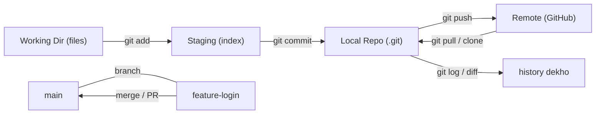

# Day 6: Git Fundamentals
📚 Topic 6: Git Deep Dive — Advanced Workflow
✅ Prerequisite-checklist: (review Day 5 Networking fundamentals if needed)

## Overview | Parichay

Git version control software hai jo code ke **changes track** karta hai. Yeh DevOps collaboration ki backbone hai - har code change, har version, har team member ki understanding store hoti hai.

### Version control kyun — safety + collaboration ka game

Bina Git ke: code `final_v2_actually_final.py` jaisi files se manage hota tha — outdated copies, "kaunne kya kab badla" kisi ko nahi pata, aur galat change rollback impossible. Git in teen cheezein deta hai: 1) **History** — har change ka record (kya, kab, kisne, kyun), 2) **Rollback** — kisi bhi purani state pe wapas jao, 3) **Parallel teams** — har developer apni branch pe kaam kare bina collide kiye. Ye teen skills har interview me poochi jaati hain.

### Git ke 3 areas — khana banana wala analogy

Git teen jagaho me kaam karta hai aur har command unke beech data move karta hai:

| Area | Matlab | Command |
|------|--------|---------|
| **Working Directory** | Files jo tum abhi edit kar rahe ho | khana ban raha hai, table pe nahi |
| **Staging Area** | Files jo next commit me jaane wali hain | plate pe sajaya |
| **Local Repo** | Committed history (safe state) | archive me store/serve |

Flow: `git add file` (working → staging), `git commit -m "msg"` (staging → repo). Ek seekh: working me kuch bhi ho, jab tak commit nahi, **history safe nahi**. `git status` batata hai kaun file kis area me hai — ye sabse frequent command hai.

### Commit = snapshot, sirf change nahi

Commit sirf diff nahi — **puri project ka snapshot** + metadata (sha1 id, author, time, message). Matlab: kisi bhi commit pe `git checkout <sha>` karke poora project us waqt ke jaisa milta hai. `git log` = history, `git diff` = uncommitted changes, `git show <sha>` = us commit ne kya badla.

### Branch & merge — parallel timelines

**Branch** = apni alag timeline — main branch ko bina tode experiment kar sakte ho. Scene: `main` stable; Kishan `feature/login` branch pe feature develop karta hai; finished → `git merge feature/login main` me lao. Conflict tab jab dono ne same lines badli — resolve karke merge complete. **Merge vs rebase**: merge ek naya "integration commit" banata hai (history conservative), rebase branch ko upstream pe replant karta hai (linear history).

### Remote — cloud backup + team ka kaam

**Remote** = kisi aur jagah ka repo (GitHub/GitLab) — cloud backup + team collaboration dono. `git clone` (pehli baar lena), `git push origin main` (apna kaam bhejo), `git pull origin main` (dusre ke kaam lao). `origin` = default remote ka naam. Dhyaan: **Git local hai, GitHub remote hai** — `commit` bina internet ke hota hai; `push/pull` me internet + remote lagta hai. **Pull request / Merge request** = "meri branch wali cheeze review karke main me merge karo" ka formal way — team workflow ka core.

### Everyday loop — paste rakhne layak

```
git status                 # kya badla hai
git add file               # stage karo
git commit -m "message"    # snapshot banao
git pull origin main       # team ka kaam lo
git push origin main       # apna kaam bhejo
```

---

> Ek line mein: Git = code ka save-point system — har commit ek safe state, branch = experiment ka parallel raasta, remote = cloud backup + collaboration.

## What You'll Learn | Aaj Ki Seekh

- [ ] Basic cycle: `git init`, `status`, `add`, `commit`
- [ ] History: `git log --oneline`, `git diff`, `git show`
- [ ] Branch: `git branch`, `checkout -b`, `switch`
- [ ] Merge + conflict resolve
- [ ] `.gitignore` — secrets/files commit se bachao
- [ ] Remote: `git clone`, `push`, `pull`, `origin`
- [ ] Commit message discipline (conventional)
- [ ] Tags: releases mark karna

## Diagram | Dekho Kaise Kaam Karta Hai



ASCII:
```
working → add → staging → commit → local repo
                                 ↓ push
                         GitHub (remote) ← pull / clone
git status · git log --oneline · git diff
git branch / checkout -b feature / merge
```

## Demo | Copy-Paste Karke Chalao

```bash
# 1. Naya repo shuru
mkdir -p ~/lab/git-demo && cd ~/lab/git-demo
git init -b main
git config user.name "Your Name"
git config user.email "you@example.com"

# 2. Pehla commit
echo "# Demo" > README.md
git status
git add README.md
git commit -m "docs: add readme"
git log --oneline

# 3. Branch + merge
git checkout -b feature-login
echo "def login(): pass" > login.py
git add login.py && git commit -m "feat: add login"
git checkout main
git merge feature-login
git log --graph --oneline --all

# 4. Remote (GitHub pe repo bana ke)
git remote add origin https://github.com/you/repo.git
git push -u origin main
git pull          # naye changes download karo
```

## Real-Life Example | Industry Me

**Feature release — GitHub Flow (production team):**
```bash
git checkout -b fix-checkout           # ek feature = ek branch
git add src/ && git commit -m "fix(cart): validate qty"
git push -u origin fix-checkout        # → GitHub pe PR banao
# reviewer approve → PR merge
git checkout main && git pull
git log --oneline -3
git tag -a v1.4.0 -m "release 1.4.0"
```
Har change branch → PR → review → merge → deploy. Main pe direct push nahi — ek chhota galt commit poori team ko break kar sakta hai, isliye review gate zaroori.

## Practice Exercise | Abhi Karein

1. `git init -b main` karke repo banao + `git config` alag se
2. 2 files banao, `git add`, `git commit` kar ke `git status`/`git log` dekho
3. `git log --oneline --graph --all` se history tree visualize
4. Feature branch banao, 1 commit karo, main pe merge karo
5. Jaan-bujh ke conflict banao (dono branches same line badlo) → `<<<<<<<` / `>>>>>>>` resolve karo → commit
6. `.gitignore` me `*.log` daal ke verify karo `git status` clean rahta
7. GitHub/remote repo banao → `git remote add origin` → `git push -u origin main`

## Quick Notes | Yaad Rakho

```
- git init = repo shuru · git clone = remote se copy
- Flow: working → add (staging) → commit (repo) → push (remote)
- status = kya stage hai · log --oneline = history ek line
- diff = changes dikhao (unstaged) · diff --staged = staged wale
- branch = parallel timeline · checkout -b new = banao + jao
- merge = combine · conflict = manual resolve: <<< HEAD ==== >>> branch
- resolve ke baad: git add file → git commit → done
- .gitignore = node_modules, .env, *.log, build/ — commit mat karo
- remote add origin <git url> · push -u origin main (pehli baar)
- pull = fetch + merge · rebase advanced hai (aage ke days me)
- Commit message conventional: "feat(x): ..." "fix(y): ..." "docs: ..."
- Secrets kabhi commit nahi — git history me forever rehta hai
- reflog = undo machine (90 din ka diary) — advanced tool
```

**Agla:** Week 1 review + capstone — server-setup.sh jo sab combine karega.