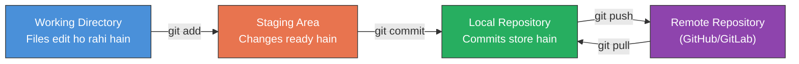
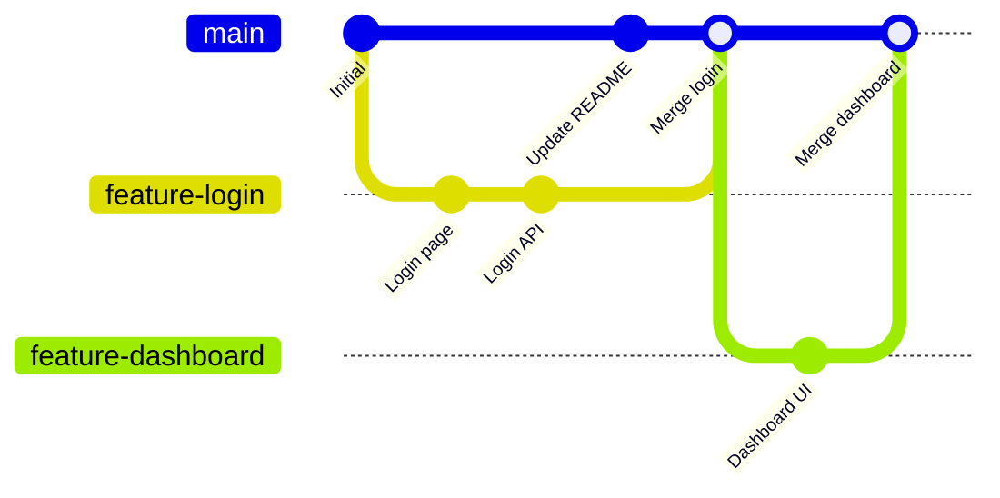

# Day 6: Git Fundamentals
📚 Topic 6: Git Deep Dive — Advanced Workflow
✅ Prerequisite-checklist: (review Day 5 Networking fundamentals if needed)

## Overview | Parichay

Git version control software hai jo code ke **changes track** karta hai. Yeh DevOps collaboration ki backbone hai - har code change, har version, har team member ki understanding store hoti hai.

---

## What You'll Learn | Aaj Ki Seekh

- [ ] Git ke 3 areas samajhna - Working, Staging, Local Repo, Remote
- [ ] Core commands: init, add, commit, status, log, diff
- [ ] Branching aur merging seekhna - feature branches banana
- [ ] Remote collaboration: push, pull, fetch, clone
- [ ] Merge conflicts resolve karna
- [ ] .gitignore banana - secrets aur build files track mat karo

## Diagram | Dekho Kaise Kaam Karta Hai

### Mermaid: Git Areas & Flow



### Mermaid: Branch & Merge Graph



### ASCII: Git Workflow Visual

```
 main ──────●──────────●─────────●─── (stable)
             \        /          ↑
              ●──────●           |
   feature    | Login |          |
              | page  |    merge |
              | commit|          |
              └───────┘          |
                                 |
   feature ──●────●──────────────●
   dashboard | UI |    merge     |

 Commands: git branch → git checkout → git commit → git merge
```

### Real Images


Git working areas - Git official docs se


Git branching model - nvie.com (Vincent Driessen)

---

## Real-Life Example | Zindagi Se

> **Google Docs jaisa hai Git:** Google Docs mein jab tum edit karte ho toh wo save hota hai (working directory). Jab tum "Version History" dekhte ho toh har change track hota hai (commits). Agar tum naya version banao toh wo alag branch hai (jaise "Draft 2"). Jab tum decide karo ki "ye dono versions ka best part rakhna hai" toh tum merge karte ho (conflict resolution). Git = version control + collaboration - sab log ek saath kaam kar sakte hain bina kuch Delete hue!

---

## Basic Concepts Detail Mein

### 1. Git ke 3 Areas

Git mein 3 jagah hoti hai jahan files rehti hain:

```
Working Directory → Staging Area → Local Repository → Remote Repository
   (files tumhare)   (add karo  )   (commit karo  )   (push karo)
```

| Area | Matlab |
|------|--------|
| **Working Directory** | Files tumhare computer par, edit ho rahi hain |
| **Staging Area** | Jo changes commit karne ke liye ready hain (`git add`) |
| **Local Repository** | Archane commits tumhare machine par (`git commit`) |
| **Remote** | GitHub jaise server par (`git push`) |

### 2. Setup & Core Commands

```bash
# Ek baar setup karo
git config --global user.name "Your Name"
git config --global user.email "you@example.com"

# Init karo
mkdir project && cd project
git init                # Naya repo
git clone <url>         # Existing repo copy karo

# Core workflow
git status              # Kya situation hai
git add file.txt        # Staging mein daalo
git add .               # Saare files
git commit -m "message" # Commit karo
git log                 # Commit history
git log --oneline       # One line each
git diff                # Kya badla hai
```

### 3. Branching (Sabse Important)

**Branch** = code ki alag line. Isse naya feature bina production ko todhe develop karte hain.

```bash
git branch                # Saare branches dekho
git branch feature-login  # Naya branch banao
git checkout feature-login   # Us branch par jao
git switch feature-login     # (modern alternative)
git checkout -b new-branch   # Bana + switch ek saath
git switch -c new-branch

# Merge (doosre ke changes apni branch mein lao)
git checkout main
git merge feature-login

# Delete branch
git branch -d feature-login
```

### 4. Remotes & Collaboration

```bash
git remote -v                 # Remotes dekho
git remote add origin <url>   # Remote add karo
git push origin main          # Push karo
git pull origin main          # Pull karo (fetch + merge)
git fetch origin              # Sirf fetch karo (merge nahi)
git clone <url>               # Clone

# PR (Pull Request) = changes puraane ke liye request
# Review → approve → merge → pull
```

### 5. Git Workflow (Best Practices)

**Traditional Flow:**
```
main (stable)
  └── develop (integration)
        └── feature/* (naya kaam)
```

**Popular flows:**
- **Git Flow:** main, develop, feature, release, hotfix branches
- **GitHub Flow:** sirf main + feature branches, PR se merge
- **Trunk-based:** sab main par, chhote branches

### 6. Un-Do Changes

```bash
# Working directory ka change wapas karo
git restore file.txt          # (discard unstaged)
git checkout -- file.txt      # (puraana style)

# Staged change unstage karo
git restore --staged file.txt
git reset HEAD file.txt

# Last commit undo karo (history rehta hai)
git revert HEAD              # Naya commit jo change undo karta hai

# Last commit completely hatao (history badalti hai - careful!)
git reset --hard HEAD~1

# Stash (kaam save karo, clean kar lo, baad mein lao)
git stash                    # Changes save karo
git stash list               # Saved stashes
git stash pop                # Wapas lao
```

### 7. Merge Conflicts

Jab do log same line change karein → **conflict**.

```bash
# Conflict resolution
# File mein dikhta hai:
<<<<<<< HEAD
main wala code
=======
feature wala code
>>>>>>> feature-login

# Decide karo kaunsa rakhna hai, <> wali lines delete karo
# Phir:
git add file.txt
git commit -m "Resolved conflict"
```

### 8. .gitignore

Batata hai kaunsi files track NAHI karni (secrets, build files, node_modules):

```
# .gitignore example
node_modules/
venv/
*.log
.env               # Secrets - kabhi commit mat karo!
target/
build/
.DS_Store
```

### 9. Tags

```bash
git tag v1.0.0          # Release tag
git tag -a v1.0.0 -m "Version 1.0.0"  # Annotated
git tag                 # List
git push origin v1.0.0  # Push tag
```

---

## Demo | Copy-Paste Karke Chalao

```bash
# Step 1: Naya repo banao
mkdir ~/git-demo && cd ~/git-demo
git init
echo "Git demo repo ban gaya!"

# Step 2: Pehli file banao aur commit karo
echo "# My DevOps Project" > README.md
git add README.md
git commit -m "Initial commit: README add kiya"

# Step 3: Naya branch banao
git branch feature-login
git checkout feature-login
echo "Login feature pe kaam shuru!"

# Step 4: Feature branch par commits karo
echo "def login(): return True" > login.py
git add login.py
git commit -m "Login function add kiya"

echo "login_secret = 'password123'" >> login.py
git commit -am "Login credentials add kiye"

# Step 5: Wapas main branch par jao aur merge karo
git checkout main
git merge feature-login
echo "Login feature merge ho gaya!"

# Step 6: Merge conflict demo
echo "Main branch ka content" > config.txt
git add config.txt
git commit -m "Config file add kiya (main)"

git checkout feature-login
echo "Feature branch ka content" > config.txt
git add config.txt
git commit -m "Config file modify kiya (feature)"

git checkout main
echo ""
echo "=== Ab merge conflict aayega ==="
git merge feature-login 2>&1 || true

# Step 7: Conflict resolve karo
echo "Final resolved content" > config.txt
git add config.txt
git commit -m "Merge conflict resolve kiya"

# Step 8: Log dekho
echo ""
echo "=== Git Log ==="
git log --oneline --graph

# Step 9: Status check
echo ""
echo "=== Git Status ==="
git status

# Step 10: Branch list
echo ""
echo "=== Saare Branches ==="
git branch -a
```

**Sab commands ek ek karke chalao** - merge conflict dekhna important hai samajhne ke liye!

---

## Practice Exercise | Abhi Karein

**Git Workflow Challenge:**

```bash
# 1. "devops-project" repo banaya
# 2. develop branch banao
# 3. 3 feature branches: feature/login, feature/api, feature/db
# 4. Har feature par commits karo
# 5. Sabko develop mein merge karo
# 6. Ek intentional merge conflict banao aur resolve karo
# 7. v1.0.0 tag karo
# 8. Python project ke liye .gitignore banao
# 9. git stash use karke kaam save/restore karo
# 10. Last commit reset karke phir se theek se karo
```

---

## Quick Notes | Yaad Rakho

```
- Flow: add → commit → push
- Branch = isolate feature, PR = collaborate
- pull = fetch + merge
- kabhi .env/secrets commit mat karo (gitignore)
- revert safe, reset --hard dangerous
```

---

**Kal:** Week 1 review + capstone challenge.
