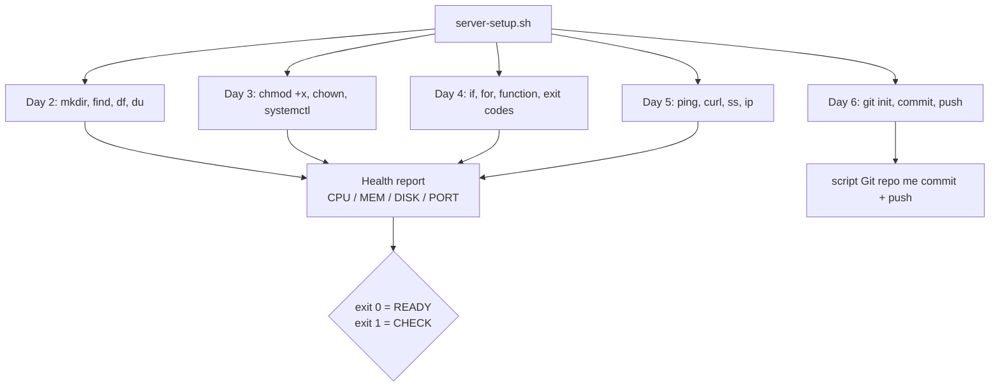

# Day 7: Week 1 Review & Challenge
📚 Topic 7: DevOps Cycle Review — Infinity Loop Mastery
✅ Prerequisite-checklist: (review Days 1-6 concepts if needed)

## Overview | Parichay

Week 1 ka poora review - DevOps culture, Linux, shell scripting, networking, Git. Aur sabse important: **Week 1 Capstone Challenge** jo sab combine karta hai.

### Week 1 ne kya seekhaya — quick recap

| Day | Cheez | Ek-line |
|-----|-------|---------|
| Day 0 | Tools setup | Machine dev-ready, verify har tool |
| Day 2 | Linux filesystem | `find`, `grep`, `tail -f`, `df/du` — sab kuch file hai |
| Day 3 | Users & permissions | `chmod 755`, `ps aux`, `kill -15`, `systemctl` |
| Day 4 | Shell scripting | Variables, if/loops/functions, exit codes |
| Day 5 | Networking | IP/port/DNS/HTTP, TCP vs UDP, ufw |
| Day 6 | Git | add/commit/branch/merge, remote collaborating |

In sab concepts ka **combined**, real-world test hi is challenge ka point hai — alag-alag toh brain me beti baithe yaad rehte hain, mila ke use karna hi skill hai.

### Capstone kya banega — `server-setup.sh`

Ek script jo **kisi bhi naye server** ko leke use "production-ready" bana de: tools install karo, health check chalao, report print karo, correct exit code do, aur Git me commit karo. Ye wahi kaam hai jo real companies me "bootstrap scripts", "provisioning scripts" ya cloud-init ke naam se hota hai — unme se ek mini version. Agar script kaam karti hai to naya environment minutes me ready, warna ghante haath se lagega.

### Idempotency — script ko bharosa-mand banane ka rule

**Idempotent** = script ko 2 ya 50 baar chalao, result same safe rehta hai — na double install ho, na error aaye. Implementation: pehle check karo, phir action (`if ! command -v docker; then install; fi`). Ye concept DevOps ka **golden rule** hai — Ansible, Terraform, CI/CD sab isi pe chalta hai. Interview me "idempotent kya hai" pakka poochte hain.

### Health checks — system ka pulse

Production server pe "kya sab theek hai" nahi poocha jata — **data** se decide hota hai:
- **CPU**: `top`/`uptime` — load kaisa hai
- **Memory**: `free -h` — RAM khatam to nahi
- **Disk**: `df -h` — storage full to nahi (pehla suspect)
- **Port**: `ss -tlnp` ya `curl -s localhost:PORT` — service sun rahi hai?
- **Exit code** har check pe: 0 = pass, non-zero = fail → report me PASS/FAIL

Yehi checks monitoring tools (Prometheus, cloud health) bhi karte hain — sirf automate karke alert karte hain. Tum aaj wahi ekboard bana rahe ho.

### Senior ka daily pattern — yehi hai

Real DevOps engineer ka routine: ek script/config se server ready karna → health verify karna → report dena → Git me version karna → kisi bhi naye change ke baad dobara run karna (drift check). Week 1 challenge isi routine ka blueprint hai. Yahi karne ko "5-saal ki skill" kehte hain.

---

> Ek line mein: week 1 ki poori journey ab ek hi script me — install, check, report, exit code, git commit; senior log roz isi pattern pe kaam karte hain.

## What You'll Learn | Aaj Ki Seekh

- [ ] Week 1 recap: filesystem, permissions, scripting, networking, git
- [ ] `server-setup.sh` — install + configure + verify ek saath
- [ ] Idempotent script (2 baar chalao → same safe result)
- [ ] Health checks: CPU, memory, disk, port (`ss`/`curl`)
- [ ] Clean report + correct exit codes (0 = ready, 1 = check)
- [ ] Script ko Git repo me commit + push karna
- [ ] Debugging: `bash -x` trace, `echo $?`

## Diagram | Dekho Kaise Kaam Karta Hai



ASCII:
```
server-setup.sh
  install → nginx / git / tree
  health  → CPU%  MEM%  DISK%  port
  report  → date + hostname + IP
  exit    → 0 READY  /  1 CHECK
  git     → init + add + commit + push
```

## Demo | Copy-Paste Karke Chalao

```bash
cat > server-setup.sh << 'EOF'
#!/bin/bash
set -euo pipefail

echo "=== [1/4] Install tools ==="
sudo apt-get update -qq
sudo apt-get install -y -qq nginx git tree
mkdir -p ~/app/logs
chmod 750 ~/app

echo "=== [2/4] Health checks ==="
MEM=$(free | awk '/Mem/{printf "%.0f", $3/$2*100}')
DISK=$(df / | awk 'NR==2{print $5}' | tr -d '%')
CPU=$(ps aux | awk 'NR>1{c+=$3} END{printf "%.0f", c}')
echo "CPU=${CPU}% MEM=${MEM}% DISK=${DISK}%"

echo "=== [3/4] Service + port ==="
sudo systemctl enable --now nginx
ss -tln | grep -q ':80 ' && echo "port 80: OPEN" || echo "port 80: CLOSED"

echo "=== [4/4] Report ==="
echo "Date: $(date)"
echo "Host: $(hostname)  IP: $(ip -4 -o addr show | tr -s ' ' | cut -d' ' -f4 | head -1)"
if [ "$DISK" -lt 80 ] && [ "$MEM" -lt 90 ]; then
  echo "STATUS: READY"; exit 0
else
  echo "STATUS: CHECK"; exit 1
fi
EOF
chmod +x server-setup.sh
./server-setup.sh
echo "exit code: $?"
```

## Real-Life Example | Industry Me

**Fresh Ubuntu VM onboarding (jab cloud-init nahi hai):**
```bash
./server-setup.sh          # setup run karo
./server-setup.sh          # 2nd run = idempotent, same output
bash -x server-setup.sh    # debug trace — galat line pakdo
git init -b main && git add server-setup.sh
git commit -m "chore: bootstrap server"
git remote add origin https://github.com/yourname/server-bootstrap.git
git push -u origin main
```
Senior engineer naya VM laga to bas script download + run — koi manual apt, koi missing check nahi. Git history exact batati hai kaunsa setup kya karta hai. Yehi "Infrastructure as Code" ki pehli jhalak hai.

## Practice Exercise | Abhi Karein

1. Skeleton: `#!/bin/bash` + `set -euo pipefail` + section markers (echo splitters)
2. Install section: `apt-get update` + install nginx, git, tree — pehle check tools hai to skip (idempotent banao)
3. Health: CPU/MEM/DISK percentages nikalo (`ps`/`free`/`df` + awk)
4. Port check: `ss -tln | grep :80` — OPEN/CLOSED print karo
5. Report: date, hostname, IP, saare checks — clean output; exit 0/1 logic
6. Script 2 baar chalao — idempotency verify; `bash -x` se trace karo
7. `git init` + commit + remote setup + push — poori challenge done

## Quick Notes | Yaad Rakho

```
- Day 2: pwd ls cd find tail grep df du — filesystem ki bhasha
- Day 3: chmod/chown rwx · ps/kill · systemctl — control + security
- Day 4: shebang · variables · if/for/while · functions · exit code
- Day 5: ip ping dig curl · ports · DNS · TCP/UDP · ufw
- Day 6: git init/add/commit/branch/merge/push — history + team
- Capstone flow: install → health → report → exit code → git commit
- set -euo pipefail har script me · secrets env se, kabhi hardcode nahi
- Idempotent = 2 baar chalao same result (install only if missing)
- Health check: curl -fsS /healthz (k8s probe isi pattern pe)
- exit 0 = ready · exit 1 = attention needed (CI/CD isi se decide)
- bash -x script = debug trace · echo $? = last result
- Har cheez script + Git me — manual notes yaad rakhna band
```

**Agla:** Day 8 — Docker: containers, images, Dockerfile. Infrastructure as Code ki asli shuruaat.