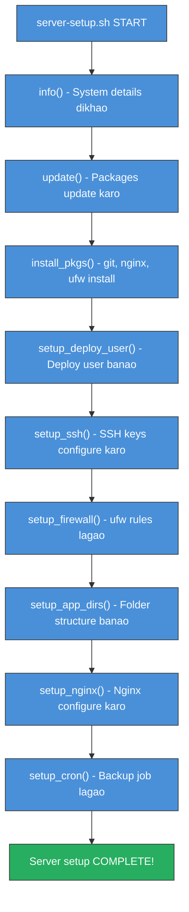

# Day 7: Week 1 Review & Challenge
📚 Topic 7: DevOps Cycle Review — Infinity Loop Mastery
✅ Prerequisite-checklist: (review Days 1-6 concepts if needed)

## Overview | Parichay

Week 1 ka poora review - DevOps culture, Linux, shell scripting, networking, Git. Aur sabse important: **Week 1 Capstone Challenge** jo sab combine karta hai.

---

## What You'll Learn | Aaj Ki Seekh

- [ ] Week 1 ke saare concepts ka quick revision
- [ ] DevOps, Linux, Shell, Networking, Git sab ka recap
- [ ] server-setup.sh capstone script samajhna
- [ ] Har topic se key commands yaad karna
- [ ] Apni learning self-assess karna
- [ ] Week 2 ke liye tayyar hona

## Diagram | Dekho Kaise Kaam Karta Hai

### Mermaid: Server-Setup Script Execution Flow



### ASCII: Week 1 Knowledge Map

```
 WEEK 1 - DevOps Foundation
 ============================

 Day 1: DevOps Culture         ──→  CALMS, CI/CD, Infinity Loop
    │
 Day 2: Linux File System      ──→  ls, cd, find, mkdir, tail -f
    │
 Day 3: Users & Permissions    ──→  chmod, chown, ps, kill, systemctl
    │
 Day 4: Shell Scripting        ──→  Variables, if/else, loops, functions
    │
 Day 5: Networking             ──→  ip, ping, dig, curl, DNS, ports
    │
 Day 6: Git                    ──→  add, commit, branch, merge, push
    │
 Day 7: REVIEW + CAPSTONE      ──→  Sab combine karo! server-setup.sh
```

### Real Images


Complete DevOps toolchain - Docker docs se


Linux administration overview - Red Hat Sysadmin se

---

## Real-Life Example | Zindagi Se

> **Exams se pehle revision jaisa hai Day 7:** Semester mein 6 subjects padhe (Days 1-6). Ab exam se pehle sabka revision karo (Day 7 = review). Phir ek mini exam do (capstone challenge = server-setup.sh). Agar sab yaad hai toh pass, nahi toh wapas padho. DevOps mein bhi aisa hi hota hai - pehle fundamentals seekho, phir ek project mein sab combine karo. Capstone script = tumhara first real DevOps project!

---

## Week 1 Summary | Is Week Kya Seekha

| Day | Topic | Key Concepts/Commands |
|-----|-------|----------------------|
| 1 | DevOps Culture | CALMS, CI/CD, Infinity Loop, roles |
| 2 | Linux File System | ls, cd, cp, mv, rm, find, mkdir |
| 3 | Users & Permissions | chmod, chown, useradd, ps, kill |
| 4 | Shell Scripting | Variables, if/else, loops, functions |
| 5 | Networking | ip, ping, dig, curl, ufw, ports, HTTP |
| 6 | Git | add, commit, branch, merge, push, stash |

---

## Revision Quiz | Apni Yaad Check Karo

**Question 1:** DevOps ke 3 Ways kya hain?
**Answer:** Flow (kaam left-to-right), Feedback (right-to-left loops), Continual Learning

**Question 2:** `chmod 755` ka matlab kya hai?
**Answer:** Owner = rwx(7), Group = r-x(5), Other = r-x(5)

**Question 3:** `git merge` vs `git rebase` difference?
**Answer:** merge = naya merge commit banata hai (history preserve), rebase = history rearrange/resurface karta hai (cleaner but rewrites)

**Question 4:** SSH port? HTTP? HTTPS?
**Answer:** 22, 80, 443

**Question 5:** Bash script executable kaise banate hain?
**Answer:** `chmod +x script.sh` (aur `#!/bin/bash` shebang)

**Question 6:** Linux mein config files kahan hoti hain?
**Answer:** `/etc/`

**Question 7:** Kisi port par kaunsa process hai kaise pata karein?
**Answer:** `sudo lsof -i :<port>` ya `netstat -tlnp`

---

## Week 1 Capstone Challenge | Server Provisioning Script

Ek comprehensive bash script banao jo ek web server ka **automatic setup** kare:

```bash
#!/bin/bash
# server-setup.sh - Web server auto-setup
set -euo pipefail   # 3 safe flags: error par ruko, unset var par error, pipe fail

# Functions
log() { echo "[$(date +'%Y-%m-%d %H:%M:%S')] $1"; }

info() {
    log "=== System Info ==="
    log "Hostname: $(hostname)"
    log "OS: $(cat /etc/os-release | head -1)"
    log "Memory: $(free -h | awk 'NR==2{print $2}')"
    log "Disk: $(df -h / | awk 'NR==2{print $2}')"
}

update() {
    log "Updating packages..."
    apt-get update -y && apt-get upgrade -y
}

install_pkgs() {
    log "Installing packages..."
    apt-get install -y git curl wget htop nginx ufw
}

setup_deploy_user() {
    log "Creating deploy user..."
    if ! id "deploy" &>/dev/null; then
        useradd -m -s /bin/bash deploy
        usermod -aG sudo deploy
        echo "deploy:password123" | chpasswd
    fi
}

setup_ssh() {
    log "Configuring SSH..."
    mkdir -p /home/deploy/.ssh
    touch /home/deploy/.ssh/authorized_keys
    chown -R deploy:deploy /home/deploy/.ssh
    chmod 700 /home/deploy/.ssh
    chmod 600 /home/deploy/.ssh/authorized_keys
    # Password auth off (secure!)
    sed -i 's/^#PasswordAuthentication yes/PasswordAuthentication no/' /etc/ssh/sshd_config
}

setup_firewall() {
    log "Setting up firewall..."
    ufw allow 22/tcp
    ufw allow 80/tcp
    ufw allow 443/tcp
    ufw --force enable
}

setup_app_dirs() {
    log "Setting up app structure..."
    mkdir -p /var/www/myapp/{src,logs,config,backups}
    chown -R deploy:www-data /var/www/myapp
}

setup_nginx() {
    log "Configuring nginx..."
    cat > /etc/nginx/sites-available/myapp << 'EOF'
server {
    listen 80;
    server_name _;
    root /var/www/myapp/src;
    index index.html;
    access_log /var/www/myapp/logs/access.log;
    error_log /var/www/myapp/logs/error.log;
}
EOF
    ln -sf /etc/nginx/sites-available/myapp /etc/nginx/sites-enabled/
    systemctl restart nginx
}

setup_cron() {
    log "Adding backup cron job..."
    echo "0 2 * * * tar -czf /var/www/myapp/backups/backup_$(date +\%Y\%m\%d).tar.gz /var/www/myapp/src" | crontab -u deploy -
}

# Main execution
info
update
install_pkgs
setup_deploy_user
setup_ssh
setup_firewall
setup_app_dirs
setup_nginx
setup_cron

log "Server setup COMPLETE!"
log "App: /var/www/myapp, Deploy user: deploy, NGINX running"
```

**Bonus Challenges:**
- `--dry-run` flag add karo (bina execute kiye kya hoga dikhao)
- Logging add karo `/var/log/server-setup.log` mein
- Idempotent banao (multiple baar chalaane par safe)

---

## Demo | Copy-Paste Karke Chalao

```bash
# Capstone script ko actually run kaise karein - step by step guide:

# Step 1: Script file banao
cat > ~/server-setup.sh << 'MAINEOF'
#!/bin/bash
set -euo pipefail

log() { echo "[$(date +'%Y-%m-%d %H:%M:%S')] $1"; }

info() {
    log "=== System Info ==="
    log "Hostname: $(hostname)"
    log "OS: $(cat /etc/os-release 2>/dev/null | head -1 || echo 'Unknown')"
    log "Memory: $(free -h 2>/dev/null | awk 'NR==2{print $2}' || echo 'N/A')"
    log "Disk: $(df -h / | awk 'NR==2{print $2}')"
}

update() { log "Updating packages..."; apt-get update -y 2>/dev/null || sudo apt-get update -y; }
install_pkgs() { log "Installing basic tools..."; apt-get install -y git curl wget htop 2>/dev/null || true; }
setup_deploy_user() {
    log "Creating deploy user..."
    if ! id "deploy" &>/dev/null; then
        sudo useradd -m -s /bin/bash deploy 2>/dev/null || true
        log "Deploy user created!"
    else
        log "Deploy user already exists!"
    fi
}
setup_firewall() { log "Checking firewall..."; ufw status 2>/dev/null || echo "UFW not available - skipping"; }
setup_app_dirs() {
    log "Setting up app structure..."
    mkdir -p ~/myapp/{src,logs,config,backups}
    log "App directories created!"
}

info
update
install_pkgs
setup_deploy_user
setup_firewall
setup_app_dirs

log "============================================"
log "Server setup COMPLETE!"
log "App: ~/myapp"
log "Deploy user: deploy"
log "============================================"
MAINEOF

chmod +x ~/server-setup.sh
echo "Script ban gaya aur executable hai!"

# Step 2: Script chalao
echo ""
echo "=== Ab script run kar rahe hain ==="
~/server-setup.sh

# Step 3: Verify karo ki sab ban gaya
echo ""
echo "=== Verification ==="
ls -la ~/myapp/
echo ""
echo "Deploy user check:"
id deploy 2>/dev/null || echo "Deploy user nahi bana (sudo chahiye)"
echo ""
echo "=== Capstone DONE! Week 2 ke liye tayyar ho! ==="
```

**Copy-paste karo aur dekho server setup ho raha hai!** Script sab steps automatically karega.

---

## Self-Checklist | Week-1 Completion

- [ ] DevOps concept samajh aaya
- [ ] Linux commands comfortable hain
- [ ] Shell script likh sakta hoon
- [ ] Networking basics clear hai
- [ ] Git workflows jaante hain
- [ ] Capstone script banai

---

**Agla Week:** CI/CD pipelines, build tools, aur automation - GitHub Actions aur Jenkins.
