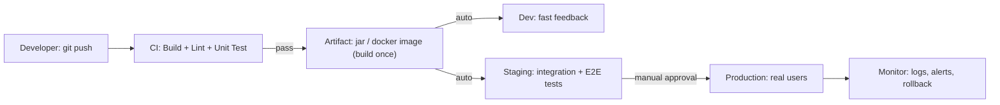

# Day 8: CI/CD Concepts & Pipelines
> Ek line mein: CI = har code change pe automated build + test (turant feedback), CD = wo artifact ko dev → staging → prod tak bharose se pahunchana. Pipeline = factory ki assembly line.
📚 Topic 8: CI/CD Deep Dive — Concepts, Pipelines & Deploy Strategies
✅ Prerequisite-checklist: (review Day 7 Week 1 review if needed)

## Overview | Parichay

**CI/CD** DevOps ka dil hai. Continuous Integration matlab code ko roz merge karke test karna; Continuous Delivery matlab har change deploy-ready rakhna. Aaj hum puri pipeline ka concept detail mein samjhenge.

Pipeline ko ek **factory assembly line** ki tarah socho: raw material (code) ek side se andar jata hai, har station apna kaam karta hai — build, test, package — aur end mein ready product (deployable artifact) bahar aata hai. Agar koi station fail ho, line wahi pe ruk jati hai taaki kharab cheez aage na pahunche. "Manual deploy" karna purani duniya jaisa hai jahan ek aadmi roz ke 100 steps haathon se karta tha; CI/CD wo sab machine se karta hai — fast, same result, koi bhi galti nahi.

Environments ka concept sabse important hai: **Dev** (fast feedback, synthetic data), **Staging** (production jaisa setup, full tests), **Production** (real users, real data). Golden rule — ek hi **same artifact** teeno environments mein promote hota hai, har environment ke liye rebuild kabhi nahi karte.

### CI vs CD vs Continuous Deployment — teen alag cheezein

CI (Continuous Integration) ka matlab hai code changes ko **baar-baar merge karna** aur har merge par automated build + test chalaana — taaki "integration hell" kabhi na bane. CD (Continuous Delivery) matlab har change **deploy-ready** — test pass hote hi artifact ready, par prod mein human approval chahiye. Continuous Deployment ek step aage hai — har green build apne aap prod tak pahunch jata hai. In teeno ka farak ek table mein:

| Concept | Feedback | Prod deploy? | Kab use karo |
|---|---|---|---|
| CI | har commit pe build+test | kabhi nahi | har commit ka quality check |
| CD Delivery | staging tests pass | manual approval se | cautious teams / banks |
| CD Deployment | full auto | turant | strong monitoring + rollback ready teams |

Rule yaad rakkho: Continuous Deployment tabhi shuru karo jab **rollback + monitoring solid** ho, warna prod mein surprises aayenge.

### Pipeline stages — har station ka apna kaam

Ek standard pipeline ka rozenama: **lint → unit test → build → package → security scan → publish artifact → deploy → smoke test**. Har stage ek **gate** hai — fail hote hi aage kuch nahi chalta. Isliye **sasta check pehle** rakhna best practice hai: lint (1 second) pehle, mehenge E2E tests baad mein. Fail fast ka matlab hi yehi hai — kharab code par mehenga time waste na karo, mismatch turant pakdo. Har stage ke inputs/outputs defined hone chahiye: yeh stage kya leta hai, kya deta hai. Har stage ke baad ek decision hota hai — continue ya fail:

- **build**: kya compile succeed hua? saari files? koi warning ignore?
- **test**: coverage meet hui? koi flaky test? network dependency toh nahi?
- **package**: kya artifact ban paya (jar/image)? version sahi hai?
- **deploy**: smoke test pass? health endpoint green? rollback ready hai?

Yehi "gates" hi pipeline ko assembly line banati hain — bina gate ke to sirf commands ka list hai.

### Manual deploy kyun nahi — repeatability ka jad

Manual deploy ke problems: 1) har baar result alag (koi step bhul gaya), 2) koi record nahi ki kya deploy hua, 3) audit impossible, 4) 50 steps ka run ek baar mein — ek galti poori customer service kharab. CI/CD se milta hai **repeatability** (har baar same), **audit trail** (har run recorded), **speed** (hours se minutes), **reliability** (insaan se kam galti). Interview ka classic sawaal — "CI/CD kyu zaroori hai?" — answer in 4 words: repeatable, fast, auditable, reliable.

```
Manual: 50 steps copy-paste  → 50 chances of human error
CI/CD: 1 pipeline definition → wo hi 50 steps, har baar exact
        plus har step ka log (kaun, kab, kya, kahan) — audit ready
```

### Fail-fast — pipeline ka dil

Fail fast ka matlab: jahan fail hua, wahi pipeline ruk jaye — aage ka kaam shuru na ho. System-level proof yeh hai ki har command ka **exit code** hota hai (0 = success, non-zero = fail) aur pipeline engine isi ko dekh kar decide karta hai. Doosra pillar: **robust tests** — agar test hi kamzor hai to pipeline "green" dikhegi par kharab artifact deploy ho jayega. Silent green pipeline sabse dangerous hoti hai — log dekh kar verify karo ki test genuinely chala aur kuch check kiya.

```bash
set -e                # bash mein: pehli galti par ruk jao
mvn package || exit 1 # ya explicit check — exit code hi signal hai
# 0 → aage badho; non-zero → pipeline red, koi deploy nahi
```

### Environments aur approval gates

Three environments, ek hi artifact: **dev** (sabse tez, synthetic data), **staging** (production jaisa — same config, same infra), **prod** (real users). Har environment ka trigger alag hota hai: dev auto, staging auto, prod **manual approval** ke gate se. GitHub me "required reviewers", Jenkins me `input` step — isi se engineer ka human judgment aata hai: "haan, ab deploy karo". Yahan ek cheez pakka karo: human approval wali pipeline = **CD Delivery**; zero manual = **CD Deployment**.

| Environment | Kaun chalata | Kya chalta hai |
|---|---|---|
| dev | auto (har commit) | unit tests + build, tez feedback |
| staging | auto (main merge) | integration + E2E + smoke tests |
| prod | manual approval | canary/limited rollout + full smoke |

### Rollback mindset — deploy ka insurance

Deploy se pehle ek sawaal: **agar yeh toot gaya to 2 minute mein kaise wapas aayenge?** Options: 1) previous artifact ko wapas deploy karo (sabse simple — isi liye artifact repo versioned hota hai), 2) **feature flags** — naya code disabled rehta hai, ek switch se enable/disable, 3) blue-green ya canary (aage ke days mein). Rollback tabhi fast hota hai jab artifact immutable ho aur versions clear hon. Rollback plan ke bina deploy adhura hai — 50% kaafi nahi.

### DORA metrics — shipping kitni fast ho rahi

DevOps teams apni quality **DORA metrics** se naapti hain — interview ke liye yaad rakhna: **deployment frequency** (kitni baar prod deploy hota hai), **lead time** (commit se prod tak ka time), **change-failure rate** (deploy ke baad tootne ka percent), aur **MTTR** (Mean Time To Recovery — tootne se theek hone tak ka time). Goal ek hi: fast + stable — zyada frequency, kam failures. Yeh hi metrics batati hain ki pipeline asli mein kaam kar rahi hai ya sirf "green dikh rahi hai".

---

## What You'll Learn | Aaj Ki Seekh

- [ ] CI vs CD vs Continuous Deployment — teeno ka exact difference
- [ ] Pipeline stages: build → test → package → deploy → monitor
- [ ] Why pipelines: apne aap deploy, no manual, har baar same result
- [ ] Artifact immutability: build once, promote everywhere (no rebuild)
- [ ] Environments: dev / staging / prod + approval gates
- [ ] Rollback mindset: deploy ho, to undo bhi plan karke ho
- [ ] DORA metrics: deploy frequency, lead time, MTTR (kitne fast shipping)

## Diagram | Dekho Kaise Kaam Karta Hai



ASCII:
```
git push → [CI] build + test → artifact → dev (auto)
                                        → staging (auto, full tests)
                                        → prod (manual approval + monitor)
Kuch toota to rollback: wapas purana artifact deploy karo = rollback
```

## Demo | Copy-Paste Karke Chalao

```bash
# 1. Pipeline ke stages ko bash mein simulate karo (har stage fail na kare)
set -euo pipefail
echo "== STAGE 1: BUILD =="
mkdir -p build && echo "hello devops" > build/app.txt
echo "== STAGE 2: TEST =="
test -s build/app.txt && echo "test passed: file exists"
echo "== STAGE 3: PACKAGE =="
tar -czf build/app-v1.0.0.tar.gz build/app.txt
echo "== STAGE 4: PROMOTE =="
ls -lh build/

# 2. Fail-fast check karo: galat command todo ke dekho
false   # exit 1 -> set -e yahan isko rok deta

# 3. Asli CI/CD: bas git push karo, pipeline khud chalta hai
#   Day 9 (GitHub Actions) / Day 10 (Jenkins) yahi trigger karenge
```

```yaml
# Pipeline ka mental model — har stage apna kaam + gate
pipeline:
  name: devclo-app
  stages:
    - lint              # style + static analysis
    - unit-test         # fast, isolated
    - build             # compile + package
    - security-scan     # SAST + dependency check
    - publish-artifact  # jar/image registry mein
  environments:
    dev:     { trigger: auto,  approval: false }
    staging: { trigger: auto,  approval: false }
    prod:    { trigger: manual, approval: true }
```

## Real-Life Example | Industry Me

**E-commerce app (say, Zomato/Myntra style):** har feature branch se PR aane pe CI **lint + unit tests + build** chalta hai (5-10 min mein dev ko feedback). Main branch pe merge hote hi CD staging pe deploy karta hai, wahan **integration + E2E** tests chalte hain. Release manager **manual approval** deta hai, phir prod pe deploy hota hai. Agar kuch toota, ek button se rollback — wapas pichhla artifact. Production me yehi pipeline 50 manual steps ko automate karke bachata hai — baar-baar ek jaisi galti nahi hoti.

## Practice Exercise | Abhi Karein

1. Ek paper/slide par pipeline design karo: stages, tools, gates, rollback plan likho (CURRICULUM ka Day 8 lab)
2. bash mein upar wala 4-stage pipeline chalao aur har stage ka output dekh
3. `false` command daal ke verify karo ki fail ho to uske aage kuch nahi chalta
4. Dev/Staging/Prod ke liye ek table banao — kaunsa test kahaan chalega
5. Ek approval gate banao: `read -p "Deploy to prod? (yes/no) " ans; [ "$ans" = "yes" ] || exit 1`
6. Rollback concept likho: kya chahiye taaki 2 minute mein wapas purana version aaye
7. Socho: tumhari app mein pipeline ke kitne stage chahiye aur kyun

## Quick Notes | Yaad Rakho

```
- CI = integration hell khatam: roz merge + automated build/test, <10 min feedback
- CD (Delivery) = artifact ready + staging tests + manual approval se prod
- CD (Deployment) = har green build auto-prod (bina strong monitoring ke risky — dheere dheere aana)
- Pipeline = stages ka assembly line: fail pe line rukti hai (fail fast)
- Artifact immutability: build ONCE → promote same artifact (no rebuild, no "works on my machine")
- Environments: dev (fast) → staging (production-like) → prod (real) + approval gates
- Staging ≈ Production: same infra, same config via env vars (data synthetic)
- Rollback pehle se plan: previous artifact ready, feature flag/blue-green (baad ke days mein)
- Fail fast: sasta check pehle (lint) → mehenga check baad (E2E)
- Manual prod approval = delivery; zero manual = deployment
- Pipeline fast honi chahiye warna developers ise skip karenge — trust khatam
- DORA: deploy freq, lead time, change-fail rate, MTTR — inhi se team quality napti hai
```

**Agla:** GitHub Actions — ek YAML file se puri CI/CD pipeline, repo mein hi (kal ka topic Day 9).