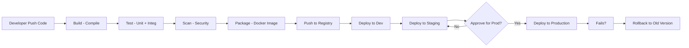

# Day 8: CI/CD Concepts & Pipelines
📚 Topic 8: CI/CD Deep Dive — Concepts, Pipelines & Deploy Strategies
✅ Prerequisite-checklist: (review Day 7 Week 1 review if needed)

## Overview | Parichay

**CI/CD** DevOps ka dil hai. Continuous Integration matlab code ko roz merge karke test karna; Continuous Delivery matlab har change deploy-ready rakhnа. Aaj hum puri pipeline ka concept detail mein samjhenge.

---

## What You'll Learn | Aaj Ki Seekh

- [ ] CI, CD (Delivery) aur CD (Deployment) ka farak samjho
- [ ] Pipeline ke 6 stages ko flow mein rakho (Build → Test → Scan → Package → Push → Deploy)
- [ ] Environment promotion ko samjho (dev → staging → prod)
- [ ] Blue-Green, Canary, Rolling jaise deployment strategies seekho
- [ ] Rollback ka plan banana seekho
- [ ] Apne app ke liye ek pipeline chain-design banao

---

## Diagram | Dekho Kaise Kaam Karta Hai

**Mermaid - Pipeline Flow + Environment Promotion:**



**ASCII - Pipeline Flow:**

```
Code Push
   │
   v
┌───────┐  ┌───────┐  ┌───────┐  ┌─────────┐  ┌──────┐  ┌────────┐
│ Build │→ │ Test  │→ │ Scan  │→ │ Package │→ │Push │→ │ Deploy │
└───────┘  └───────┘  └───────┘  └─────────┘  └──────┘  └───┬────┘
                                                              │
                                         ┌────────────────────┼────────────┐
                                         v                    v            v
                                     [ Dev ]            [ Staging ]   [ Production ]
```

**Real Images (Official Docs):**


*Caption: GitHub Actions ke design mein workflow→job→step ka order - CI/CD pipelines GitHub mein aise hi dikhte hain. (Source: docs.github.com)*


*Caption: Maven build lifecycle flow - har phase ek step hai pipeline ki tarah. (Source: maven.apache.org)*

---

## Demo | Copy-Paste Karke Chalao

**Actually runnable simulated pipeline** - bina kisi server ke, sirf bash se apni pipeline ki logic dikhao:

```bash
# Simulated CI/CD pipeline - copy-paste karke chalao
mkdir -p cicd-demo && cd cicd-demo
cat > mypipeline.sh << 'EOF'
#!/bin/bash
set -e

echo "=== Stage 1: Build ==="
echo "Compiling app code..." && sleep 1
echo "  -> target/myapp.jar ready"

echo "=== Stage 2: Test ==="
echo "Running unit tests..." && sleep 1
echo "  -> 12 tests passed, 0 failed"

echo "=== Stage 3: Scan ==="
echo "Running security scan..." && sleep 1
echo "  -> 0 critical, 2 high, 5 info issues"

echo "=== Stage 4: Package ==="
echo "Building Docker image..." && sleep 1
docker build -t myapp:1.0.0 . 2>/dev/null || echo "  -> (docker skip - image built sim)"

echo "=== Stage 5: Push ==="
echo "Pushing to registry..." && sleep 1
echo "  -> pushed myapp:1.0.0 to ghcr.io/myorg"

echo "=== Stage 6: Deploy ==="
for env in dev staging production; do
  echo "Deploying to $env ..." && sleep 1
  if [ "$env" = "production" ]; then
    echo -n "Manual approval (yes/no)? "; read ans
    [ "$ans" = "yes" ] || { echo "Deploy declined - stopping"; exit 1; }
  fi
  echo "  -> myapp:1.0.0 live on $env, health = OK"
done
echo ""
echo "PIPELINE SUCCESS - app production mein hai!"
EOF
chmod +x mypipeline.sh
./mypipeline.sh
```

**Environment promotion test (dev → staging → prod):**

```bash
echo "code=new-feature" > artifact.txt
for env in dev staging prod; do
  echo "promoting artifact.txt to $env"
  mkdir -p "env/$env"
  cp artifact.txt "env/$env/"
done
ls -R env     # teeno environments mein artifact mil gaya
```

---

## Real-Life Example | Zindagi Se

**Swiggy/Zomato order ka rasta socho:**
- **Build + Test** = Kitchen mein chef ka recipe follow karke dish tayar karna (quality check ke saath)
- **Scan** = Food delivery app mein freshness/quality bandi check karna
- **Package + Push** = Dish ko packet mein bandh karke delivery partner ko dena
- **Deploy (Staging)** = Pehle 2-3 trusted customers ko taste test
- **Deploy (Production)** = Full menu live karna sab customers ke liye
- **Rollback** = Agar nayi dish pasand na aaye to puraana menu wapas chala do

---

## Basic Concepts Detail Mein

### 1. CI vs CD vs CD - Teeno Alag Hain!

| Concept | Full Form | Matlab |
|---------|-----------|--------|
| **CI** | Continuous Integration | Roz code merge karo, automatically test karo - errors jaldi pakdo |
| **CD (Delivery)** | Continuous Delivery | Har change production-deploy-ready rakho (manually click se deploy) |
| **CD (Deployment)** | Continuous Deployment | Har passing change automatically production mein lagao |

**Simple example:**
```
CI:    Dev ki code kro → merge main par → test auto chale → pass?
CD(Dl): pass hua → staging mein deploy → ready for prod
CD(Dp): prod deploy fully automatic
```

### 2. Pipeline Stages (High-Level View)

Ek full pipeline aisa dikhta hai:

```
┌─────────┬─────────┬─────────┬──────────┬─────────┬──────────┐
│  Build  │  Test   │  Scan   │ Package  │  Push   │  Deploy  │
│ (compile│ (unit + │ (SAST/  │ (Docker  │ (to     │ (staging/│
│ code)   │  integ) │  sheima)│ image)   │ registry)│  prod)   │
└─────────┴─────────┴─────────┴──────────┴─────────┴──────────┘
```

**Har stage mein kya hota hai:**
| Stage | Matlab | Kaunse tool |
|-------|--------|-------------|
| **Build** | Code ko runnable banao (compile, dependencies) | Maven, npm, Gradle |
| **Test** | Quality check - unit tests, integration tests | JUnit, pytest |
| **Scan** | Security + code quality | SonarQube, Bandit, Trivy |
| **Package** | Deployable artifact banao (jar, docker image) | Docker, Maven |
| **Push** | Artifact ko registry mein bhejo | GHCR, Nexus, ECR |
| **Deploy** | Environments mein lagao | kubectl, Ansible, Terraform |

### 3. Pipeline Triggers (Kab chalega)

- **Push trigger:** Jab code **push** hota hai branch par
- **Pull Request trigger:** Jab koi **PR** khulta hai
- **Schedule trigger:** Time-based (e.g. nightly build)
- **Manual trigger:** Insaan click kare
- **Webhook trigger:** Doosri system se signal

### 4. Environment Promotion

Code ek raste se aage badhta hai:

```
Local → Dev → Staging → Production
  │       │      │          │
  sina     &     UAT/testing  real users
```
- **Dev:** fast experiments
- **Staging:** production jaisa hi, integration test ke liye
- **Production:** real users, careful deployment

### 5. Deployment Strategies

Production mein lagane ke alag-alag tareeke:

| Strategy | Matlab | Pro |
|----------|--------|-----|
| **Blue-Green** | 2 environments - naya (blue) par deploy, test, phir traffic switch | Zero downtime |
| **Canary** | Naya version 5% users ko, dheere-dheere badhao | Risk kam |
| **Rolling** | Ek-ek karke old pods replace karo | Simple |
| **Feature Flags** | Code deployed hai par feature off hai, flag se on karo | Instant toggle |

### 6. Rollback

Agar naya version fail ho jaye → **rollback** (wapas puraana version):
- Kuberenes: `kubectl rollout undo`
- Git: puraana commit deploy karo
- Blue-Green: traffic puraane par wapas bhejo

---

## Practice Exercise | Abhi Karein

**Pipeline Design Challenge:**

Socha code likhne se pehle design karo. Ek Python web app ke liye CI/CD pipeline design karo:

1. **Draw** pipeline ke saare stages (Build > Test > Scan > Package > Deploy)
2. Har stage mein kya hoga likho
3. Har stage ke liye tool choose karo
4. Ek `.pipeline.yaml` banao jo pipeline describe kare
5. Environments define karo (dev, staging, production)
6. Production se pehle kaunse gates/approvals hain?
7. Rollback strategy kya hogi?

---

## Quick Notes | Yaad Rakho

```
- CI = roz merge + test
- CD = delivery (ready) vs deployment (automatic)
- Flow: Build→Test→Scan→Package→Push→Deploy
- Environments: Dev→Staging→Prod
- Rollback hamesha plan rakho
```

---

**Kal:** GitHub Actions - asli pipeline banana.
