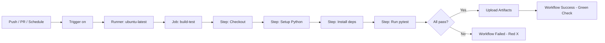

# Day 9: GitHub Actions
📚 Topic 9: CI/CD Deep Dive — GitHub Actions & Pipeline Automation
✅ Prerequisite-checklist: (review Day 8 CI/CD concepts if needed)

## Overview | Parichay

**GitHub Actions** GitHub ki built-in CI/CD platform hai. GitHub repo mein `.github/workflows/` folder mein YAML files banate hain aur GitHub khud pipeline chala deta hai. Aaj hum asli pipelines banayenge.

---

## What You'll Learn | Aaj Ki Seekh

- [ ] Workflow, job, step, action aur runner ka concept samjho
- [ ] `.github/workflows/ci.yml` file ka syntax seekho
- [ ] Trigger (on:) - push, PR, schedule, manual dispatch samjho
- [ ] Job dependencies (`needs:`) aur secrets use karna seekho
- [ ] Matrix builds aur caching se workflow optimize karo
- [ ] Real pipeline GitHub repo par push karke verify karo

---

## Diagram | Dekho Kaise Kaam Karta Hai

**Mermaid - Workflow Lifecycle:**



**ASCII - Job / Step Structure:**

```
Workflow: ci.yml
   │  (trigger: push ko main)
   ▼
┌─ Job: build-test (runner: ubuntu-latest)
│   ├─ Step: Checkout code (actions/checkout)
│   ├─ Step: Setup Python (actions/setup-python)
│   ├─ Step: Install deps     (pip install)
│   └─ Step: Run tests        (pytest)  ──► pass/fail
└─ (badh ke agla job jise needs: hai)
```

**Real Images (Official Docs):**


*Caption: GitHub Actions - workflow, jobs aur steps ka overview. (Source: docs.github.com)*


*Caption: Workflow run ka flow - trigger events se jobs tak. (Source: docs.github.com)*

---

## Demo | Copy-Paste Karke Chalao

**Real ci.yml banao aur fresh GitHub repo mein push karo:**

```bash
# 1. Local folder + repo banao
mkdir gh-actions-demo && cd gh-actions-demo
git init
git branch -M main

# 2. Simple Python app + test
mkdir -p app tests
echo "def add(a,b): return a+b" > app/calc.py
cat > tests/test_calc.py << 'EOF'
from app.calc import add
def test_add():
    assert add(2,3) == 5
    assert add(-1,1) == 0
EOF
echo "import pytest" > requirements.txt

# 3. Workflow folder banao
mkdir -p .github/workflows
cat > .github/workflows/ci.yml << 'EOF'
name: CI Pipeline
on:
  push:
    branches: [main]
  pull_request:
    branches: [main]
jobs:
  build-test:
    runs-on: ubuntu-latest
    steps:
      - name: Checkout code
        uses: actions/checkout@v4
      - name: Setup Python
        uses: actions/setup-python@v5
        with:
          python-version: '3.11'
      - name: Install deps
        run: pip install -r requirements.txt
      - name: Run tests
        run: pytest -v
      - uses: actions/upload-artifact@v4
        with:
          name: test-reports
          path: .
        if: always()
EOF

# 4. GitHub par naya repo banao (gh CLI) aur push karo
gh repo create gh-actions-demo --public --source=. --push
# (ya: git remote add origin <url> && git push -u origin main)

# 5. Output check - Action Automatically chala:
echo "GitHub repo kholo → Actions tab → CI Pipeline run dikhega"
echo "Green check = pass, Red X = fail (log khol ke dekho)"
```

**Local verification (GitHub ke bina) - wahi steps chalao:**

```bash
pip install pytest
pytest -v    # 1 passed - yahi GitHub runner bhi chalayega
```

**Output kya milega:** GitHub enter karte hi `.github/workflows/ci.yml` detect hota hai aur "CI Pipeline" naam ka run shuru hota hai. Har commit ke saath ye automatically chalta hai - log mein har step ka kaam dikhta hai.

---

## Real-Life Example | Zindagi Se

**Pizza delivery chain socho:**
- **Workflow** = Order process ka full system (ye poori pipeline)
- **Job** = Khana banane ka kitchen kaam / delivery ka kaam (2 alag teams)
- **Step** = Kuch minute ke chhote kaam (dough banao, topping lagao, bake karo)
- **Runner** = Jo oven/car use hoti hai wo runner hai (ubuntu machine)
- **Trigger (on:)** = Jab naya order aata hai (push), workflow shuru hota hai
- **needs:** = Delivery tabhi chalu jab khana proper bana (job dependency)

---

## Basic Concepts Detail Mein

### 1. GitHub Actions ke Building Blocks

```
Workflow (Big picture)
  └── Job(s) (kaam ke hisse)
        └── Step(s) (chhote chhote kaam)
              └── Action(s) (pre-built code)
```

| Concept | Matlab |
|---------|--------|
| **Workflow** | Poora automated process (ek YAML file) |
| **Job** | Ek runner par chalta hua kaam (ek ya multiple steps) |
| **Step** | Ek chhota command/action |
| **Action** | Pre-built step (Marketplace se) |
| **Runner** | Jise server jahan workflow chalta hai (ubuntu-latest) |

### 2. File Structure & Syntax

```yaml
# .github/workflows/ci.yml
name: CI Pipeline              # Workflow ka naam

on:                           # Trigger (kab chale)
  push:
    branches: [main]
  pull_request:
    branches: [main]

jobs:                         # Saare jobs
  build-test:                 # Job ka naam
    runs-on: ubuntu-latest    # Kahan chale
    steps:
      - name: Checkout code
        uses: actions/checkout@v4    # Convert code lo

      - name: Setup Python
        uses: actions/setup-python@v5
        with:
          python-version: '3.11'

      - name: Install deps
        run: |
          pip install -r requirements.txt

      - name: Run tests
        run: pytest
```

### 3. Triggers (on:)

```yaml
on:
  push:                              # Push par
    branches: [main, develop]
    paths: ['src/**', '!docs/**']    # Sirf specific files badle to

  pull_request:                      # PR par
    branches: [main]

  schedule:                          # Time-based
    - cron: '0 2 * * *'             # Har din 2AM

  workflow_dispatch:                 # Manual trigger (button)
```

### 4. Jobs & Dependencies

```yaml
jobs:
  lint:
    runs-on: ubuntu-latest

  test:
    runs-on: ubuntu-latest
    needs: lint                  # sirf lint pass hone ke baad

  build:
    runs-on: ubuntu-latest
    needs: [lint, test]          # dono pass ke baad

  deploy-prod:
    runs-on: ubuntu-latest
    needs: build
    environment: production      # env gating
    if: github.ref == 'refs/heads/main'   # sirf main par
```

### 5. Secrets & Env Variables

```yaml
# Environment variables
env:
  APP_ENV: production

steps:
  - name: Deploy
    env:
      AZURE_CREDENTIALS: ${{ secrets.AZURE_CREDENTIALS }}   # 1st secret
      DATABASE_URL: ${{ secrets.DATABASE_URL }}             # 2nd secret
    run: ./deploy.sh $APP_ENV
```

**Secrets kahan set karte hain:**
- GitHub repo → **Settings → Secrets and variables → Actions**
- `secrets.XXX` se use karte hain
- Kabhi secrets directly code mein print mat karo!

### 6. Matrix Builds (Multi-Version Testing)

```yaml
strategy:
  matrix:
    python-version: ['3.9', '3.10', '3.11']   # 3 alag chalege
    os: [ubuntu-latest, windows-latest]

steps:
  - uses: actions/setup-python@v5
    with:
      python-version: ${{ matrix.python-version }}
```

### 7. Caching (Speed Up)

```yaml
- name: Cache pip
  uses: actions/cache@v3
  with:
    path: ~/.cache/pip
    key: ${{ runner.os }}-pip-${{ hashFiles('requirements.txt') }}
```

### 8. Artifacts (Result Save)

```yaml
- name: Upload test reports
  uses: actions/upload-artifact@v4
  with:
    name: test-reports
    path: tests/reports/
  if: always()     # fail ho to bhi upload
```

---

## Practice Exercise | Abhi Karein

**Ye workflows banao:**

```yaml
# .github/workflows/ci.yml - CI pipeline
# 1. Push + PR par main par trigger
# 2. Python 3.11 setup
# 3. Dependencies install
# 4. Lint (flake8)
# 5. Tests (pytest)
# 6. Test reports upload artifact
```

```yaml
# .github/workflows/deploy.yml - Deploy
# 1. CI pass ke baad trigger
# 2. Docker image build
# 3. GHCR (GitHub Container Registry) par push
# 4. SSH se staging server par deploy
# 5. Production ke liye manual approval
```

**Project Setup:**
- Python project `requirements.txt` ke saath banao
- `pytest` tests add karo
- `.github/workflows/ci.yml` banao
- Push karo aur pipeline verify karo

---

## Quick Notes | Yaad Rakho

```
- Path: .github/workflows/*.yml
- on: = trigger, jobs = kaam, uses = pre-built action
- ${{ secrets.XXX }} = secrets
- needs: = job dependency
- matrix = multiple configs ek saath
```

---

**Kal:** Jenkins - CI/CD server ka puraana raja.
