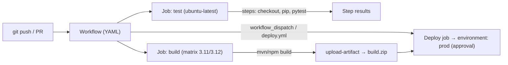

# Day 9: GitHub Actions
> Ek line mein: GitHub repo mein `.github/workflows/` ki YAML file = workflow; har event (push/PR) pe GitHub khud runner par job chala deta hai — CI/CD bina apne server ke.
📚 Topic 9: CI/CD Deep Dive — GitHub Actions & Pipeline Automation
✅ Prerequisite-checklist: (review Day 8 CI/CD concepts if needed)

## Overview | Parichay

**GitHub Actions** GitHub ki built-in CI/CD platform hai. GitHub repo mein `.github/workflows/` folder mein YAML files banate hain aur GitHub khud pipeline chala deta hai. Aaj hum asli pipelines banayenge.

Actions ko ek **kitchen robot** samjho: tum usse recipe (workflow YAML) do, wo apne gas-stove (runner) par step-by-step ingredients prepare karta hai — checkout (saman lao), install (masale daalo), test (chakh kar dekho), build (paka do). Sab kuch hosted machines par chalta hai, tumhare khud ke server ki zaroorat nahi.

Workflow ke 4 pillars yaad rakho: **trigger** (kab chalega — push/PR/schedule), **jobs** (runner par execute hone wale task), **steps** (ek job ke andar chhote commands/actions), **actions** (dusron ke bane reusable blocks — Marketplace se milte hain). YAML hi puri pipeline hai — isliye `ci.yml` + `deploy.yml` likhna seekhna hi aaj ka kaam hai.

### Workflow anatomy — YAML hi pipeline hai

Workflow ek **YAML file** hai `.github/workflows/*.yml` mein, repo ke andar. Ek repo mein ek se zyada workflow ho sakte hain — `ci.yml` (build+test+artifact) aur `deploy.yml` (deploy) alag rakhna best practice hai, kyunki CI fast+cheap feedback hai aur CD slow+approval wala kaam. Har workflow ka skeleton ek jaisa: **name → on (triggers) → jobs (runners) → steps (checkout/run/uses)**. Is file-ko-git mein rakhne se pipeline bhi code jaisi versioned + reviewable ban jati hai.

### Events — kab trigger hoga

Event hi workflow khulne ka trigger hai: `push` (main branch pe commit), `pull_request` (PR open/update), `workflow_dispatch` (manual button), `schedule` (cron). Sabse common gotcha: jobs toh sahi likhi hain par trigger galat — workflow kabhi chal hi nahi. Debug ka pehla sawaal hamesha: **"ye workflow kab trigger ho raha hai?"** Branch filter bhi important: `on.push.branches: [main]` matlab workflow sirf main branch pe push hone par chalega.

```yaml
on:
  push:                 # commit/merge pe
    branches: [main]
  pull_request:         # PR open, update, re-open pe
  schedule:             # cron — raat 2 baje nightly build
    - cron: '0 2 * * *'
  workflow_dispatch:    # manual button (Actions tab mein)
```

### Jobs vs Steps — kaun kya chalaega

**Job** = ek runner (`ubuntu-latest` / `macos` / `windows` / self-hosted) par execute hone wala kaam; **step** = job ke andar ki chhoti commands ya actions. Jobs default **parallel** chalti hain — speed ke liye — aur `needs: build` se dependency banao (deploy tabhi jab build pass hua). Steps chronological hain: har step ka exit code check hota hai, koi fail → job red. Parallel jobs = speed; `needs` + `if:` = correctness.

```yaml
jobs:
  test:        { runs-on: ubuntu-latest, steps: [...] }
  build:
    needs: test          # test ke baad hi chalega
    runs-on: ubuntu-latest
  deploy:
    if: github.ref == 'refs/heads/main'   # sirf main pe
```

### actions/checkout aur reusable actions

`actions/checkout@v4` ke bina runner ke paas tumhara code hi nahi hoga — isliye yeh **har job ka pehla step** hai. Actions dusron ke bane reusable blocks hain (Marketplace): `setup-python`, `setup-java`, `upload-artifact`, `cache`. Gotcha: third-party action ko **version pin** karo (`@v4` ya commit SHA tak) — warna supply-chain attack ka dar rehta hai. Koi bhi unknown action bina review kare use mat karo — pipeline code jitna hi secure woh action bhi hona chahiye.

### Secrets aur expressions — safe data

Secrets repo/organisation **Settings → Secrets** me store hote hain aur `${{ secrets.NAME }}` se use hote hain; logs me masked dikhte hain. Dhyan do: `${{ ... }}` is **expression syntax** hai — conditions, contexts sab isi se: `if: github.ref == 'refs/heads/main'`, `needs.build.result`. Secrets ko kabhi `echo` karke test mat karo — wo log mein permanent stain bana deta hai jo kabhi clean nahi hota.

```yaml
- name: Deploy with secret
  run: ./deploy.sh --token "${{ secrets.DEPLOY_TOKEN }}"
  env:
    API_KEY: ${{ secrets.API_KEY }}   # safely env mein daalo, log print nahi
```

### Matrix builds aur caching

**Matrix** = ek job, kai combinations — ek saath Python 3.11 + 3.12, ya ubuntu + macos. Yeh multi-version / multi-OS testing hai jisse pata chalta hai ki code har environment pe chalta hai. **Caching** (`actions/cache`, ya `setup-python` ka `cache: pip`) se dependencies baar-baar download nahi hoti — isse CI 5 min se 2 min ho jata hai. Production CI ki speed isi caching se aati hai.

```yaml
strategy:
  matrix:
    os: [ubuntu-latest, macos-latest]
    python-version: ['3.11', '3.12']   # 4 builds khud chala jaata hai
```

### Environments aur approval gates

Repo **Settings → Environments** me `staging`/`prod` banao; **required reviewers** laga ke manual approval gate ban jata hai. Workflow me `environment: production` likhne se deploy job us gate se guzarti hai. Yeh hi CD = "delivery with approval" ka pattern hai. Rollback bhi isi page se hota hai — Deployments me purani run ko Re-run karo. Yeh ek hi feature prod deploy ko human-check ke daayre me rakhta hai.

### Gotchas + interview angle

Common gotchas jo interview me pooche jaate hain: private repos ka runner minute quota (cost), YAML indentation ki ek space se workflow nahi chalega, `${{ }}` context vs `env.` variable ka confusion, aur branch protection ke bina "green CI par bhi galat merge ho sakta hai". Interview answer ka framework: **Workflow = code (versioned YAML), Events = triggers, Runner = execution environment, Actions = reusable blocks, Secrets + Environments = security + gates**. Yeh ek hi line poora GitHub Actions ka model explain karta hai.

## What You'll Learn | Aaj Ki Seekh

- [ ] Workflow = `.github/workflows/*.yml`; events = push / PR / schedule / workflow_dispatch
- [ ] Job vs Step: job (runner par runs), step (command ya `uses:` action)
- [ ] `actions/checkout@v4` kyun pehla step — code laana zaroori hai
- [ ] Secrets: `${{ secrets.X }}` — kabhi plaintext log mein nahi
- [ ] Expressions + conditionals: `if:`, `github.ref`, `needs:`
- [ ] Matrix builds (multiple versions ek saath), cache, upload-artifact
- [ ] Environments + manual approval gate (staging vs prod)
- [ ] ci.yml (test+build+artifact) aur deploy.yml (deploy) alag kyun rakhe

## Diagram | Dekho Kaise Kaam Karta Hai



ASCII:
```
push/PR → workflow yaml → jobs (parallel) → steps (checkout→test→build) → artifact
                                                             → deploy.yml (manual approval) → prod
```

## Demo | Copy-Paste Karke Chalao

```bash
# 1. Workflow folder banao
mkdir -p .github/workflows
# 2. Files toh YAML banenge (neeche) — git push/touch se trigger
touch .github/workflows/ci.yml .github/workflows/deploy.yml
# 3. Local test: act (GitHub Actions locally) — optional, docker chahiye
# npx act -j build-test
```

```yaml
# .github/workflows/ci.yml
name: CI
on:
  push:
    branches: [ main ]
  pull_request:

jobs:
  build-test:
    runs-on: ubuntu-latest
    steps:
      - uses: actions/checkout@v4
      - uses: actions/setup-python@v5
        with:
          python-version: "3.12"
          cache: pip
      - run: pip install -r requirements.txt
      - name: Lint
        run: ruff check .
      - name: Tests
        run: pytest -q --cov=app --cov-fail-under=80
      - name: Upload artifact
        uses: actions/upload-artifact@v4
        with:
          name: app-build
          path: dist/
```

```yaml
# .github/workflows/deploy.yml
name: Deploy
on:
  workflow_run:
    workflows: [ "CI" ]
    types: [ completed ]
    branches: [ main ]

jobs:
  deploy-staging:
    if: ${{ github.event.workflow_run.conclusion == 'success' }}
    runs-on: ubuntu-latest
    environment: staging
    steps:
      - uses: actions/checkout@v4
      - name: Deploy to staging
        run: ./deploy.sh staging
      - name: Smoke test
        run: curl -fsS https://staging.example.com/health

  deploy-prod:
    needs: deploy-staging
    runs-on: ubuntu-latest
    environment: production   # Manual approval gate (repo settings)
    steps:
      - name: Deploy to production
        run: ./deploy.sh production
```

## Real-Life Example | Industry Me

**DeployTrack (DevClo ka demo app):** har PR pe `ci.yml` lint + tests + build image chalata hai — branch protection bola "required checks pass" tabhi merge hoga. Main pe merge hote hi deploy.yml ko trigger hota hai: CI success → staging deploy → smoke test → reviewer GitHub UI mein **"Approve deployment"** click karta hai → prod deploy. Rollback bhi simple: prod environment ke "Deployments" se kisi purani run ko **Re-run** karte ho. Is pattern se team roz 10+ releases zero-jhanjhat kar sakti hai.

## Practice Exercise | Abhi Karein

1. GitHub pe ek repo (public) banao aur `.github/workflows/ci.yml` add karo
2. Python/Node waala simple app + test add karo, push karo, "Actions" tab mein watch karo
3. Jaan-bujh kar galat test likho → check red aana chahiye; branch protection se galat merge block hona bhi proof karo (prerequisite: branch protection on)
4. `actions/upload-artifact@v4` se build output upload karo aur Actions mein download karo
5. Repo Settings → Environments → `prod` banao + required reviewers; deploy.yml mein `environment: production`
6. Secret add karo (Settings → Secrets) aur `${{ secrets.X }}` use karo — confirm logs mein masked dikhta hai
7. `schedule:` (cron) ya `workflow_dispatch` trigger add karo aur manually run karo

## Quick Notes | Yaad Rakho

```
- Workflow = file `.github/workflows/*.yml`; ek repo mein kitni bhi
- Trigger: push, pull_request, workflow_dispatch (manual), schedule (cron)
- Job = runner (ubuntu/macos/windows ya self-hosted); Steps = job ke andar kaam
- actions/checkout@v4 = sabka pehla step (code laana) — iske bina kuch nahi chalega
- Secrets only `${{ secrets.NAME }}` se; kabhi echo/commit mat karo
- `if:` conditionals; `needs:` job dependency; matrix = ek job kai versions
- upload-artifact/download-artifact = build output CI se next job/stage tak
- Environments + required reviewers = manual approval gate (CD "delivery")
- ci.yml aur deploy.yml alag rakho — CI fast feedback, CD deploy + approval
- Actions = reusable blocks (Marketplace); 3rd-party actions ko version pin karo
- GitHub-hosted runners mein minute quota hota hai (public repos: free)
- Branch protection: "Require status checks" → CI ka pass hona zaroori
```

**Agla:** Jenkins — ab ek enterprise self-hosted CI/CD server aur Jenkinsfile (Day 10).