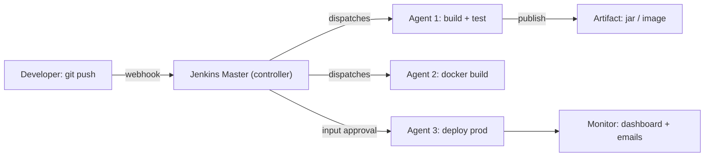

# Day 10: Jenkins - Building Your First Pipeline
> Ek line mein: Jenkins ek self-hosted CI/CD server (master) hai jo agents par jobs banata hai; Jenkinsfile (Declarative) mein pipeline code ki tarah likhi jati hai.
📚 Topic 10: CI/CD Deep Dive — Jenkins & Enterprise Pipelines
✅ Prerequisite-checklist: (review Day 9 GitHub Actions if needed)

## Overview | Parichay

**Jenkins** sabse widely-used CI/CD server hai. Iska power hai **Declarative Pipeline** - jahan pipeline ko code ki tarah (Jenkinsfile) define karte hain. Aaj hum Jenkins set up karke complete pipeline banayenge.

Jenkins ko ek **factory manager** samjho jo apne workers (agents) ko tasks baantta hai. **Master** sirf plan aur coordination karta hai — kab kaunsi job chalegi; **agent** asli kaam karta hai (maven/docker/tests). Ye master-agent setup hi Jenkins ko bade enterprises mein scalable banata hai.

GitHub Actions mein workflow YAML thi; Jenkins mein wahi **Jenkinsfile** (Groovy) hai. Declarative = clean, structured (`pipeline { stages { stage() {} } }` — beginners ke liye); Scripted = free-form code (`node { ... }` — complex logic ke liye). Aur ek rule zaroori: **freestyle job se mat banao** — modern Jenkins pe Jenkinsfile hi best practice hai, kyunki wo Git mein versioned rehti hai aur pipeline-as-code banati hai (Code review + audit sab safe).

### Master/Agent — kaun kya karta hai

**Master (controller)** sirf plan banata hai — job scheduling, artifact store, UI/dashboard, build history. **Agent (worker)** asli kaam karta hai — Maven compile, docker build, tests. Agent ko **label/tag** se select karte ho: `agent { label 'linux' }`. Common mistake: sab kuch master pe hi chalana — master overload hone par poori pipeline slow ho jati hai. Enterprises mein master ek bari machine pe hota hai aur agents ke pool pe; yahi master-agent model Jenkins ko enterprise-scale banata hai.

```
Master: scheduling + dashboard + artifacts (lightweight)
Agent1 (label: linux)    → maven build + unit tests
Agent2 (label: docker)   → docker build + push
Agent3 (label: prod)     → deploy with input approval
```

### Freestyle vs Pipeline — purana vs modern

**Freestyle job** UI se banati hai (Configure → Build → Execute shell — commands paste karo). Problem: iski settings **Git mein nahi** hoti — machine pe padi rehti hai, reproduce nahi ho sakti, audit nahi milta. **Pipeline job** Jenkinsfile se pipeline ko code banati hai — Git versioned, code-review hota hai, poori history + audit milta hai. Modern rule: nayi job freestyle se mat banao, Jenkinsfile se banao. Interview punchline: "why Jenkinsfile?" → "pipeline-as-code".

| Aap kya chaho | Freestyle | Jenkinsfile (Pipeline) |
|---|---|---|
| version control | nahi (UI settings) | Git mein file |
| code review | impossible | PR se review |
| audit / history | weak | poori chain |
| reproduction | machine specific | clone karke chalao |

### Declarative vs Scripted — syntax ka chunaav

Jenkinsfile ke do flavors: **Declarative** — `pipeline { agent any; stages { stage('Build') { steps { ... } } } }` — structured, predictable, beginners ke liye best. **Scripted** — `node('agent') { stage('Build') { ... } }` — free-form Groovy: loops, variables, complex logic. Rule: 90% kaam Declarative se ho jata hai; Scripted tab jab dynamically generated stages chahiye ho. File ka naam hamesha **Jenkinsfile** — repo ke root mein.

```groovy
// Declarative (recommended): structure fixed, steps andar
pipeline {
  agent any
  stages { stage('Test') { steps { sh 'mvn test' } } }
}
// Scripted (flexible): aap apna flow likho
node('linux') { stage('Test') { sh 'mvn test' } }
```

### input step — human approval gate

`input {}` step pipeline ko **tab tak rok deta** hai jab tak koi approve/decline na kare — yehi prod deploy ka human gate hai. `submitter 'release-manager'` se specify karo ki approve kaun kar sakta hai, aur parameters bhi de sakte ho (`choice`, `booleanParam`) — "rollback karna hai kya?". Gotcha: input ka **timeout** set karo warna pipeline ghanto latak sakti hai. Practical: prod pe input = CD "delivery"; bina input ke auto = CD "deployment".

### post blocks — closure aur notifications

`post` block pipeline ke result aane ke **baad** chalta hai: `always { }` (har case — junit reports publish, workspace cleanup), `success { }` (Slack/webhook notify), `failure { }` (alert). Isi se test reports store hote hain aur alerts jaate hain. Gotcha: post block mein bhi exit code verify karo — cleanup bhi dependency ka hi kaam hai. `always` isliye daalo ki build fail ho tab bhi artifacts/reports milte rahen.

### Multibranch + webhook — har branch pe auto

**Multibranch pipeline** har branch/PR ke liye ek job dikhati hai — feature branch pe bhi CI chalta hai jab commit aata hai. **Webhook** (SCM se) commit aate hi build trigger karta hai — manual polling ki zaroorat nahi. Yahi GitHub Actions jaisa auto-CI pattern hai, par **self-hosted** — data apne infra pe rehta hai. Har branch ki apni build history hoti hai — devs ko turant feedback milta hai.

- dev/feature branch push → us branch ki job apne aap banti hai
- PR check: Jenkins status branch protection me "required" set karo
- branch delete → uski job apne aap cleanup (resources free)
- `Jenkinsfile` har branch pe milta hai — yahi pipeline-as-code ka sach

### Gotchas + interview angle

Self-hosted ka matlab **tum khud maintain karo**: patched, secured, plugin updates, workspace cleanup. Production ke common dard: plugin version mismatch (upgrade se builds toot jate), default admin username security risk, workspace disk full, credentials storage. Interview framework: Jenkins = self-hosted CI/CD; master/agent; Jenkinsfile = pipeline-as-code; input = human gate; multibranch + webhook = auto-CI; use-case = banks/on-prem jahan code cloud pe nahi ja sakta. Ek aur interview trick: "GitHub Actions theek hai, phir Jenkins kyun?" — jawab: jahan compliance, licensing ya data-residency ka sawaal ho (banks, healthcare, on-prem), wahin self-hosted jeet jata hai.

## What You'll Learn | Aaj Ki Seekh

- [ ] Master vs Agent (controller/worker) — kaun kya karta hai
- [ ] Freestyle Job vs Pipeline Job — modern choice kyun Jenkinsfile
- [ ] Jenkinsfile Declarative vs Scripted — syntax + kab kya
- [ ] Stages: Build → Test → Deploy (GitHub Actions wale pattern se map)
- [ ] `input` step = manual approval gate (human button)
- [ ] Jenkins in Docker — 2 minutes mein up and running
- [ ] Post conditions: `always()` / `success()` → notification/cleanup
- [ ] Multibranch pipeline + webhook — commit aane pe auto run

## Diagram | Dekho Kaise Kaam Karta Hai



ASCII:
```
git push → Jenkins master → agents (build/test/docker) → artifact
                                    → [input: human approval] → deploy prod
Jenkinsfile = pipeline-as-code, Git versioned
```

## Demo | Copy-Paste Karke Chalao

```bash
# 1. Jenkins ko Docker mein chalao (ye demo aaj chalega)
docker run -d --name jenkins \
  -p 8080:8080 -p 50000:50000 \
  -v jenkins_home:/var/jenkins_home \
  jenkins/jenkins:lts

# 2. Initial admin password nikalo
docker exec jenkins cat /var/jenkins_home/secrets/initialAdminPassword
# browser: http://localhost:8080 → password → suggested plugins → create admin

# 3. Jenkinsfile repo mein commit karo (neeche wala), job "Pipeline" banake
#    repo/jenkinsfile path point karo → "Build Now"
```

```groovy
// Jenkinsfile — Declarative (recommended)
pipeline {
  agent any
  environment {
    APP_VERSION = '1.0.0'
  }
  stages {
    stage('Build') {
      steps { sh 'mvn -B clean package' }
    }
    stage('Test') {
      steps { sh 'mvn -B test' }
    }
    stage('Docker Image') {
      steps { sh 'docker build -t devclo-myapp:' + env.APP_VERSION + ' .' }
    }
    stage('Deploy Prod') {
      input {
        message 'Prod deploy approve karo?'
        ok 'Deploy'
        submitter 'release-manager'
      }
      steps { sh './deploy.sh production' }
    }
  }
  post {
    success { sh 'curl -fsS $SLACK_WEBHOOK -d "text=Build green"' }
    always  { junit 'target/surefire-reports/*.xml' }
  }
}
```

```groovy
// Jenkinsfile — Scripted (flexible, complex logic)
node('docker-agent') {
  stage('Build')  { sh 'mvn -B clean package' }
  stage('Test')   { sh 'mvn -B test' }
  def deploy = input message: 'Deploy?', ok: 'Yes'
  if (deploy) { sh './deploy.sh prod' }
}
```

## Real-Life Example | Industry Me

**Bank ya large enterprise (on-prem) CI/CD:** bank ke servers public cloud mein nahi rehte — isliye GitHub Actions nahi, **self-hosted Jenkins** aam baat hai. Master ek secure VM par, agents private/internet-isolated network mein. Code commit → Jenkins webhook → build job master ke agent par maven se compile → sonar scan → test → artifact (Nexus, Day 12) → testing agent par deploy → release-manager `input` se approve karta hai → prod job. Yehi setup 500+ repos ko daily pipeline deta hai.

## Practice Exercise | Abhi Karein

1. `docker run` se Jenkins start karo + initial password se login
2. Maven project banao (ya day-11 ka) aur `JENKINSFILE` repo mein commit karo
3. New Item → Pipeline job → "SCM: Git" → PATH = `Jenkinsfile` → Build Now
4. Ek stage deliberately fail karo (galat command) — `post { always }` cleanup dikhna chahiye
5. `input` stage add karo aur prod deploy par human approval verify karo
6. Agent concept: halka Docker agent image use karo (doosre job par) aur master/agent logs dekh
7. Multibranch pipeline banake ek feature branch push karo — auto branch job dekh

## Quick Notes | Yaad Rakho

```
- Jenkins = self-hosted CI/CD (enterprise/on-prem ka standard; GitHub Actions jaisa cloud nahi)
- Master (controller) = logic; Agent = actual work (scalable, tags se choose)
- Freestyle job = UI se bani, stale, hard to reproduce — Jenkinsfile prefer karo
- Declarative: pipeline { stages { stage{} } } — structure, beginners, CI/CD templates
- Scripted: node { stage{} } — free Groovy code, complex logic ke liye
- Jenkinsfile = pipeline-as-code → Git mein versioned, review hota hai, audit milta hai
- input{} = manual approval gate (prod par zaroori)
- post { success/always } = notifications/artifacts cleanup, on-final-status
- Golden rules: stage fail → wahi pe ruk jao (fail-fast); shell exit code ≠ 0 → stage red
- Plugins ki duniya (git, docker, sonar, slack...) — plugin install ke baad battle-ready
- Jenkins + Docker: agent per-task container — clean workspace, yahi modern setup
- Credentials plugin = secrets (username/password/SSH key) encrypted store mein, `env.` se reference
```

**Agla:** Build Tools — Maven & Gradle se code compile/test/package ka lifecycle (Day 11).