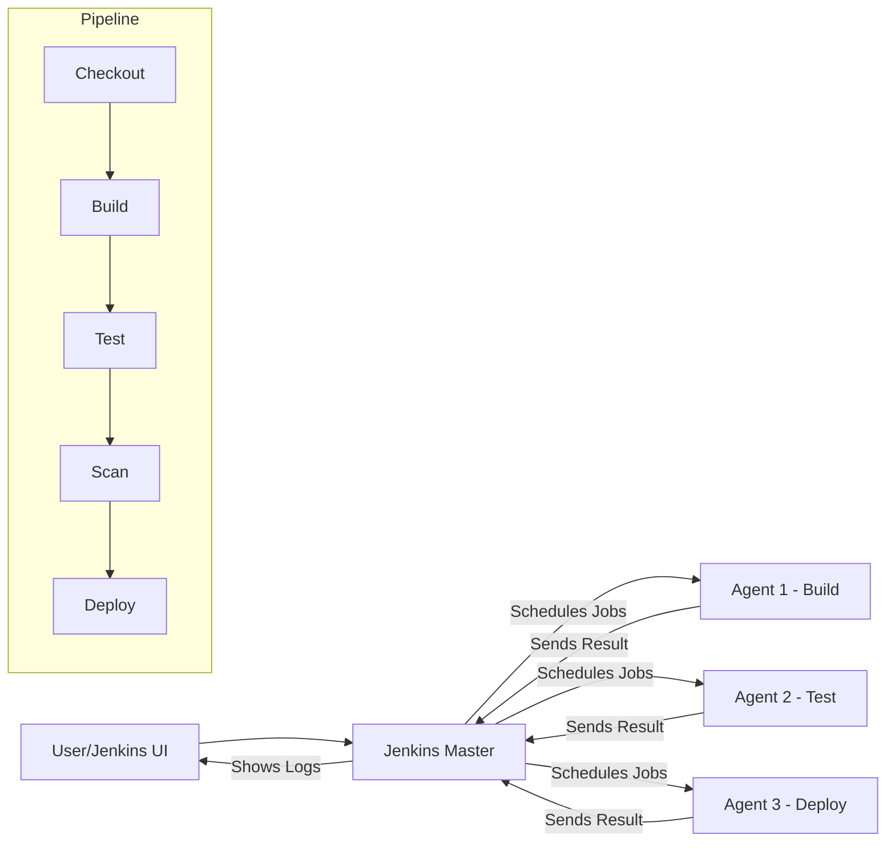

# Day 10: Jenkins - Building Your First Pipeline
📚 Topic 10: CI/CD Deep Dive — Jenkins & Enterprise Pipelines
✅ Prerequisite-checklist: (review Day 9 GitHub Actions if needed)

## Overview | Parichay

**Jenkins** sabse widely-used CI/CD server hai. Iska power hai **Declarative Pipeline** - jahan pipeline ko code ki tarah (Jenkinsfile) define karte hain. Aaj hum Jenkins set up karke complete pipeline banayenge.

---

## What You'll Learn | Aaj Ki Seekh

- [ ] Jenkins master-agent architecture samjho
- [ ] Jenkins ko Docker se run karke set up karo
- [ ] Initial admin password logs se nikal na sikho
- [ ] Declarative Pipeline ka structure samjho (agent, stages, post)
- [ ] Manual approval (`input`) aur parallel stages use karo
- [ ] Jenkinsfile project root mein likhna seekho

---

## Diagram | Dekho Kaise Kaam Karta Hai

**Mermaid - Jenkins Master-Agent Architecture + Pipeline:**



**ASCII - Master/Agent:**

```
                ┌────────────────────────────┐
                │          MASTER            │
                │  (control, schedules, logs)│
                └───────────┬────────────────┘
          ┌─────────────────┼─────────────────┐
          │                 │                 │
          v                 v                 v
  ┌─────────────┐   ┌─────────────┐   ┌─────────────┐
  │ Agent Build │   │ Agent Test  │   │ Agent Deploy│
  └─────────────┘   └─────────────┘   └─────────────┘
       (compile)         (pytest)          (deploy.sh)
```

**Real Images (Official Docs):**


*Caption: Jenkins controller (master) aur agent ki architecture. (Source: jenkins.io)*


*Caption: Real-world multi-node Pipelines - Jenkins Pipeline ka flow. (Source: jenkins.io)*

---

## Demo | Copy-Paste Karke Chalao

**Jenkins ko Docker se chalao aur password nikaalo:**

```bash
# 1. Jenkins LTS image pull karo
docker pull jenkins/jenkins:lts

# 2. Jenkins run karo (8080 = UI, 50000 = agents ke liye)
docker run -d \
  --name myjenkins \
  -p 8080:8080 \
  -p 50000:50000 \
  -v jenkins_home:/var/jenkins_home \
  jenkins/jenkins:lts

# 3. Jab tak logs aaye - wait karo
sleep 5

# 4. Initial admin password logs se nikaalo
echo "=== Jenkins Initial Password (logs se) ==="
docker logs myjenkins | grep -A 2 "Initial Admin"
# Ya seedha file se:
docker exec myjenkins cat /var/jenkins_home/secrets/initialAdminPassword

# 5. Confirm UI chal raha hai
curl -s -o /dev/null -w "HTTP %{http_code}\n" http://localhost:8080

# 6. Password ko var mein lo aur status check karo
PASS=$(docker exec myjenkins cat /var/jenkins_home/secrets/initialAdminPassword)
echo "Jenkins ready! Browser mein http://localhost:8080 kholo"
echo "Password is: $PASS"
echo "Unlock hote hi: Install suggested plugins → Admin user banao"
```

**Pipeline steps note karo (Jenkinsfile template):**

```groovy
pipeline {
    agent any
    stages {
        stage('Checkout') { steps { echo 'code clone' } }
        stage('Build')    { steps { sh 'mvn compile' } }
        stage('Test')     { steps { sh 'mvn test' } }
        stage('Deploy')   { steps { sh './deploy.sh' } }
    }
    post { success { echo 'All green!' } failure { echo 'Broke :(' } }
}
```

**Cleanup (baad mein):**
```bash
docker stop myjenkins && docker rm myjenkins
```

---

## Real-Life Example | Zindagi Se

**Restaurant manager socho:**
- **Master** = Restaurant ka manager - wo orders schedule karta hai, har table ka haal rakhta hai
- **Agent** = Kitchen ke alag-alag chefs/stations (ek slabgas, ek oven) - ye asli kaam karte hain
- **Agent any** = Manager koi bhi free station par kaam bhej de
- **Stage** = Recipe ka har step (wash → cut → cook → plate)
- **Input gate** = Head chef ka approval "Serve karein?" se pehle
- **Post** = Shift ke baad kitchen clean (always) ya special handling

---

## Basic Concepts Detail Mein

### 1. Jenkins Architecture

```
┌─────────────────────────────┐
│         Master              │
│  (sab control, schedules)   │
└────────────┬────────────────┘
             │ (manages)
     ┌───────┴────────┐
     │    Agents      │
     │  (kaam karte)  │
     └────────────────┘
```
- **Master:** Pipelines schedule karta hai, saare info rakhta hai
- **Agent (Node):** Asli build/test/deploy kaam karta hai
- **Plugins:** Jenkins ki taakat - Git, Docker, Credentials plugins

### 2. Jenkins Setup (Docker)

```bash
docker run -d \
  -p 8080:8080 \
  -p 50000:50000 \
  --name jenkins \
  jenkins/jenkins:lts

# Password nikalne ke liye:
docker logs jenkins | grep -A 2 "Initial Admin"
```

### 3. Declarative Pipeline Structure

```groovy
pipeline {
    agent any                    // kahan chale (any = koi bhi agent)

    environment {                 // env variables
        APP = 'myapp'
        VERSION = '1.0.0'
    }

    stages {                     // saare stages
        stage('Checkout') {
            steps {
                // code lo
            }
        }
        stage('Build') {
            steps {
                // build karo
            }
        }
        stage('Test') {
            steps {
                // tests chalao
            }
        }
    }

    post {                       // pipeline ke baad
        always {                 // hamesha
            cleanWs()            // workspace saaf
        }
        success {
            // success wala kaam
        }
        failure {
            // failure wala kaam
        }
    }
}
```

### 4. Key Pipeline Elements

**Steps** (har stage mein):
```groovy
steps {
    sh 'echo "Hello"'          // shell command
    sh 'ls -la'
    echo 'Pipeline step'        // jenkins log
}

// With arguments
sh '''
    cd /app
    pip install -r requirements.txt
    pytest
'''
```

**Input (manual gate):**
```groovy
stage('Deploy Prod') {
    input {
        message "Production mein deploy karein?"
        ok "Haan, karo"
        submitter "admin"
    }
    steps {
        sh './deploy.sh production'
    }
}
```

**Credentials:**
```groovy
withCredentials([string(credentialsId: 'azure-sp', variable: 'AZURE_CREDENTIALS')]) {
    sh 'echo $AZURE_CREDENTIALS | ...'
}
```

**Parallel stages:**
```groovy
stage('Parallel') {
    parallel {
        stage('Lint') { steps { sh 'flake8' } }
        stage('Test') { steps { sh 'pytest' } }
    }
}
```

### 5. Jenkinsfile at Project Root

Jenkinsfile ko project root mein rakhte hain taaki version-control ho:

```
myapp/
├── Jenkinsfile       ← pipeline defined hai yahan
├── app/
└── tests/
```

**Multibranch Pipeline** = Jenkins har branch ke liye pipeline chala sakta hai.

---

## Practice Exercise | Abhi Karein

**Jenkins Pipeline (complete):**

```groovy
pipeline {
    agent any

    environment {
        APP_NAME = 'devops-demo'
        VERSION = '1.0.0'
    }

    stages {
        stage('Checkout') {
            steps { git branch: 'main', url: 'https://github.com/you/repo.git' }
        }
        stage('Build') {
            steps { sh 'pip install -r requirements.txt' }
        }
        stage('Test') {
            steps { sh 'pytest tests/ -v' }
        }
        stage('Security Scan') {
            steps { sh 'bandit -r app/' }
        }
        stage('Build Docker image') {
            steps { sh 'docker build -t myapp:${VERSION} .' }
        }
        stage('Deploy to Staging') {
            steps { sh './scripts/deploy.sh staging' }
        }
        stage('Deploy to Production') {
            input { message "Production deploy?" ok "Deploy" }
            steps { sh './scripts/deploy.sh production' }
        }
    }
    post {
        always   { echo "Pipeline finished" }
        success  { echo "All green!" }
        failure  { echo "Something broke!" }
    }
}
```

**Setup:**
```bash
docker pull jenkins/jenkins:lts
# 8080 par open karo, setup complete, Multibranch pipeline banao
```

---

## Quick Notes | Yaad Rakho

```
- Jenkinsfile = pipeline as code (Groovy)
- Pipeline ke 3 blocks: agent, stages, post
- stage = group, steps = kaam, sh = shell
- input = manual approval
- Parallel = speed
```

---

**Kal:** Build tools - Maven/Gradle.
