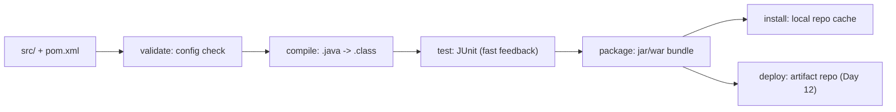

# Day 11: Build Tools - Maven & Gradle
> Ek line mein: Build tool code ko compiled/tested/packaged artifact (jar/war) banata hai; Maven = XML pom.xml, Gradle = Groovy build.gradle; dono ka lifecycle same hai.
📚 Topic 11: Build Tools Deep Dive — Maven, Gradle & Project Lifecycles
✅ Prerequisite-checklist: (review Day 10 Jenkins if needed)

## Overview | Parichay

**Build tools** code ko compile karke deployable artifact banate hain. Maven (Java), Gradle, npm, pip - sabka fundamental concept same hai. Aaj hum Maven detail mein seekhenge aur general build concepts samjhenge.

Build tool ko ek **chef ki kitchen** samjho: raw ingredients (source code) ready hain, recipe (pom.xml/build.gradle) bataati hai kaunsa masala (dependencies) dalna hai, kab kadhai garam karni hai (compile), kab chakhna hai (test), aur kab plate ki taiyaari karni hai (package). End mein ready dish = jar/war artifact jo server par serve hogi.

Maven ka **lifecycle** sabse famous hai — 3 main cycles (clean, default, site) hain, default ke har phase ek sequence mein chalte hain: `validate → compile → test → package → install → deploy`. Tum `mvn test` bolo to package tak nahi jayega; `mvn package` bolo to usse pehle compile aur test bhi apne aap chalenge — phases depend karte hain.

Artifact ka format saral hai: **groupId** (company, `com.devclo`), **artifactId** (project, `myapp`), **version** (`1.0.0`), packaging (`jar`). Dependency management = "wo library mujhe chahiye" → Maven **pom.xml** dekh ke khud JAR download karta hai (Internet/Yenus se) — tumhare paas library ka folder nahi rakhta hai.

### Build kya hota hai — source se artifact tak

Build = raw source code ko **deployable artifact** mein badalna: `.java` → `.class` → `jar/war` bundle. Build tool se pehle ka zamana: devs manually compile karte the, dependencies ka folder apne paas rakhte the, phir dusre machine par "works on my machine" ka drama. Build tool is sabko **automate + standardize** karta hai — ek command (`mvn package`) se compile + test + package sab ek saath. Har language ka apna tool: Java → Maven/Gradle, Node → npm, Python → pip/setuptools. Concept base ek hi hai: lifecycle + dependencies + packaging.

```
source (.java)  →  compile  →  test  →  package  →  jar/war
                          build tool ye poori journey automate karta hai
```

### Maven lifecycle — phases ka tree

Maven ka **default lifecycle** ek fixed sequence hai: `validate → compile → test → package → install → deploy`. Sabse important baat: Maven **parent phase ko pehle** chalata hai — `mvn test` bolte hi validate + compile bhi chalenge (test compile pe depend hai), `mvn package` bolte hi compile + test bhi. Isliye CI ka sabse common command `mvn -B clean package` hai — `clean` purana `target/` wipe karta hai (fresh build, koi stale `.class` file nahi), package final jar banata hai. `-B` = batch mode, interactive prompts band.

```
mvn validate  → sirf config check
mvn test      → validate + compile + test (test tak)
mvn package   → validate + compile + test + package (sab tak)
mvn clean package → pehle side-clean, phir poora build
```

### pom.xml — Maven ki recipe

`pom.xml` (Project Object Model) Maven ka dil hai — yahi batata hai project kya hai aur kaise banta hai. Core fields: **groupId** (company namespace, `com.devclo`), **artifactId** (project naam, `myapp`), **version** (`1.0.0`), **packaging** (`jar`/`war`). In teeno se artifact ke unique **coordinates** bante hain: `com.devclo:myapp:1.0.0` — yehi address repository mein jar ka path hai. `properties` me Java version/encoding, `build` me plugins — sab isi file se control. Parent-child (multi-module) projects mein do pom.xml bhi hoti hain.

```xml
<groupId>com.devclo</groupId>
<artifactId>myapp</artifactId>
<version>1.0.0</version>
<packaging>jar</packaging>
```

### Dependency management — libraries ki duniya

"Library chahiye" → pom me dependency add karo → Maven khud **Maven Central** se download karke local cache `~/.m2/repository` me store karta hai. Dependencies ki khud ki dependencies hoti hain — **transitive deps** — Maven resolve karta hai. Gotcha: version conflict (do libs alag version maange) → `mvn dependency:tree` se poora graph dikhega, clash pakdo. **Scope** bhi decide karta hai: `test` deps sirf test phase me, `compile`/`runtime` production jar me. Version pin karna hi reproducible builds ka aadhar hai.

| Scope | Kahan use hota | Production jar me? |
|---|---|---|
| compile | main code | haan |
| test | JUnit/testing | nahi |
| runtime | runtime pe chahiye | haan |

### Gradle vs Maven — dono ka farak

**Gradle** same concepts rakhta hai, alag syntax — `build.gradle` (Groovy/Kotlin), tasks (`compileJava`, `test`, `jar`), dependency notation `implementation 'com.google.guava:guava:33.0.0'`. Core difference: Gradle **incremental build** karta hai (sirf badli hui files rebuild — fast, daemon memory me rehta hai); Maven rigid + predictable (har baar poora lifecycle). Enterprise Java + legacy projects → Maven zyada; Android / modern multi-module → Gradle. Interview answer: "Maven = XML + strict lifecycle; Gradle = Groovy DSL + incremental = fast".

### Phases, plugins, profiles — power moves

Maven phases sirf framework hain — asli kaam **plugins** karte hain: `compiler-plugin` compile, `surefire-plugin` tests, `jar-plugin` package. Phase → plugin goals ki mapping yahi Maven ka magic hai. **Profiles** se environment-specific config chalti hai: `mvn -Pprod package`. **Shaded/fat jar** plugin saari dependencies ek jar me pack karta hai (self-contained, run easy — CI/CD mein common). Yehi details interview me "Maven pata hai" ka proof deti hain.

### Build in CI — pipeline ke andar

CI me build stage asli mein isi tool ko chalata hai: GitHub Actions ka `run: mvn -B clean package`, Jenkins ka `sh 'mvn -B clean package'`. Output `target/*.jar` hi wo **artifact** hai jo agli stage (artifact repo, deploy) uthati hai. Isliye build **reproducible** honi chahiye — versions pin, deterministic — warna "works on my machine" wapas aata hai. Interview sawaal: "clean package vs package kya difference?" — `clean` stale build ka risk zero karta hai. Local + CI dono same Maven version rakho.

## What You'll Learn | Aaj Ki Seekh

- [ ] Maven lifecycle: clean → validate → compile → test → package → install → deploy
- [ ] pom.xml anatomy: groupId / artifactId / version + dependencies
- [ ] Artifacts: jar (library/app) vs war (web app) — packaging type
- [ ] Gradle basics: build.gradle + tasks (compileJava, test, jar)
- [ ] Dependency management: transitive deps, versions, lockfiles/settings
- [ ] `mvn clean package` = sabse bada command (CI mein jo chalta hai)
- [ ] Build ke baad milta hai `target/*.jar` — wahi Day 12 ka artifact
- [ ] Build vs CI relationship: pipeline build stage asli yahi karta hai

## Diagram | Dekho Kaise Kaam Karta Hai



ASCII:
```
mvn clean package = clean + validate + compile + test + package ek saath
mvn test          = upar wale saare phases bhi, sirf test tak rukta hai
output: target/myapp-1.0.0.jar  ← CI ka publish-artifact step isi ko uthata hai
```

## Demo | Copy-Paste Karke Chalao

```bash
# 1. Maven check karo (nahi hai to install: sudo apt install maven -y)
mvn -version

# 2. Simple project banao
mkdir -p app/src/main/java/com/devclo && cd app
```

```xml
<!-- pom.xml -->
<project xmlns="http://maven.apache.org/POM/4.0.0">
  <modelVersion>4.0.0</modelVersion>
  <groupId>com.devclo</groupId>
  <artifactId>myapp</artifactId>
  <version>1.0.0</version>
  <packaging>jar</packaging>
  <properties>
    <maven.compiler.source>17</maven.compiler.source>
    <maven.compiler.target>17</maven.compiler.target>
  </properties>
  <dependencies>
    <dependency>
      <groupId>org.junit.jupiter</groupId>
      <artifactId>junit-jupiter</artifactId>
      <version>5.10.2</version>
      <scope>test</scope>
    </dependency>
  </dependencies>
</project>
```

```bash
# 3. Java file + simple test likho, phir lifecycle dekho
cat > src/main/java/com/devclo/App.java << 'EOF'
public class App {
  public static String greet(String name) { return "Hello " + name; }
  public static void main(String[] a) { System.out.println(greet("DevClo")); }
}
EOF

# 4. Build (clean + compile + test + package sab ek saath)
mvn -B clean package
#    target/ folder mein `myapp-1.0.0.jar` milega

# 5. Artifact ko run karo
java -cp target/myapp-1.0.0.jar com.devclo.App

# 6. Gradle? same concepts, different syntax
#    gradle init --type java-application && gradle build → build/libs/myapp.jar
```

## Real-Life Example | Industry Me

**Payment integration service (bank ke saath):** source ek monorepo mein, Jenkins/GitHub Actions ka build stage `mvn -B clean package` chalta hai. Pehle wo isi project ka jar build hota hai, phir plugin se **shaded jar** (saari dependencies ek sath) banta hai. Har build ka version automatic hota hai — `1.4.0-20240921.1100-1` jaisa (timestamped) — taaki CI ka har run apna unique artifact banae. Wahi jar nexus (Day 12) mein upload hota hai aur prod deploy ussi exact binary ko use karta hai — package wapas banao nahi, balki publish karo.

## Practice Exercise | Abhi Karein

1. `mvn -version` se setup verify karo
2. Upar wala pom.xml + App.java bana ke `mvn -B clean package` chalao
3. Har phase alag se chalao (`validate`, `compile`, `test`, `package`) aur console logs mein order dekho
4. `mvn dependency:tree` chalake dekho kaunsi libraries (transitive) aayi
5. Version upgrade karo pom mein (`1.0.1`) — target/ folder mein naya jar name verify karo
6. Build fail karwao: ek method remove karo jo test mein use hota hai → jar aur CI dono red verified karo
7. Gradle try karo: `gradle init --type java-application`, `gradle tasks`, `gradle build`
8. Socho: tumhare language (Python pip / Node npm) ka "build lifecycle" kaisa hota — `npm ci && npm run build`

## Quick Notes | Yaad Rakho

```
- Build tool = compile + test + package → jar/war (deployable artifact)
- Maven lifecycle: validate → compile → test → package → install → deploy
- `mvn package` pehle wale sab phases bhi chala leta hai (dependencies ka tree)
- pom.xml = recipe: groupId/artifactId/version + dependencies (transitive bhi)
- Artifact coordinates: groupId:artifactId:version (com.devclo:myapp:1.0.0)
- Gradle: build.gradle (Groovy/Kotlin) + tasks; incremental + fast (daemon)
- Lifecycle command: mvn clean package (CI standard); gradle clean build
- Output: target/ (Maven) vs build/libs/ (Gradle) — important CI artifact path
- Dependency management = khud libraries ghar mat rakho, tool manage karta hai
- Shaded/fat jar = app + saari deps ek jar mein (self-contained, run aasaan)
- Scope: test vs compile/runtime — test deps sirf tests ke liye
- Build deterministic: versions pin karo + lockfiles — flaky build se bacho
```

**Agla:** Artifact Management — ab yehi jar/image registry (Nexus/GHCR) mein daalna aur semver (Day 12).