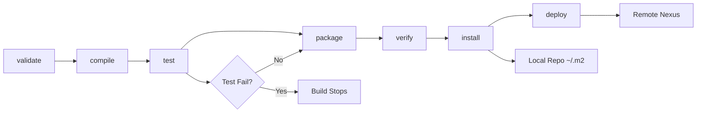

# Day 11: Build Tools - Maven & Gradle
📚 Topic 11: Build Tools Deep Dive — Maven, Gradle & Project Lifecycles
✅ Prerequisite-checklist: (review Day 10 Jenkins if needed)

## Overview | Parichay

**Build tools** code ko compile karke deployable artifact banate hain. Maven (Java), Gradle, npm, pip - sabka fundamental concept same hai. Aaj hum Maven detail mein seekhenge aur general build concepts samjhenge.

---

## What You'll Learn | Aaj Ki Seekh

- [ ] Maven build lifecycle ke phases order mein samjho
- [ ] `pom.xml` ka structure aur dependencies samjho
- [ ] `mvn clean package` chala karke `target/` output dekho
- [ ] Maven vs Gradle vs npm vs pip ka fundamental compare karo
- [ ] Maven archetype se project generate karo
- [ ] Build ka output (JAR) run karke verify karo

---

## Diagram | Dekho Kaise Kaam Karta Hai

**Mermaid - Maven Lifecycle Phases:**



**ASCII - Build Flow:**

```
Source Code (src/main/java)
     │  mvn clean package
     v
┌─────────────────────────────┐
│ 1. validate  → 2. compile   │
│ 3. test      → 4. package   │
│ 5. verify    → 6. install   │
│ 7. deploy                   │
└─────────────┬───────────────┘
              v
         target/myapp-1.0.0.jar  ← artifact
```

**Real Images (Official Docs):**


*Caption: Maven build lifecycle ke phases ka flow. (Source: maven.apache.org)*


*Caption: Maven Project Object Model (pom.xml) - Maven ka heart. (Source: maven.apache.org)*

---

## Demo | Copy-Paste Karke Chalao

**Maven archetype se fresh project banao (need Java + Maven):**

```bash
# 0. Pehle check karo
java -version && mvn -version

# 1. Archetype (template) se project generate karo
mvn archetype:generate \
  -DgroupId=com.devops \
  -DartifactId=demoapp \
  -DarchetypeArtifactId=maven-archetype-quickstart \
  -DinteractiveMode=false

cd demoapp

# 2. Aur simple pom.xml + App.java (agar archetype na chale)
cat > pom.xml << 'EOF'
<project>
  <modelVersion>4.0.0</modelVersion>
  <groupId>com.devops</groupId>
  <artifactId>demoapp</artifactId>
  <version>1.0.0</version>
  <packaging>jar</packaging>
  <properties>
    <maven.compiler.source>11</maven.compiler.source>
    <maven.compiler.target>11</maven.compiler.target>
  </properties>
</project>
EOF
mkdir -p src/main/java/com/devops
cat > src/main/java/com/devops/App.java << 'EOF'
public class App {
    public static void main(String[] args) {
        System.out.println("Hello from Maven Build!");
    }
}
EOF

# 3. Clean package chalao (compile + test + package)
mvn clean package
echo "EXIT CODE: $?   (0 = success)"

# 4. target/ folder ka output dekho
echo "=== target/ contents ==="
ls -la target/

# 5. Banaya hua JAR run karo
java -jar target/demoapp-1.0.0.jar
```

**Output samjho:** `mvn clean package` = purana clean + compile + test + package. `target/demoapp-1.0.0.jar` hi deployable artifact hai jo baad mein artifact repository (Day 12) mein jaayega.

---

## Real-Life Example | Zindagi Se

**Pizza banane ka process socho:**
- **validate** = Check: saare ingredients shelf par hain? (pom valid)
- **compile** = Dough banao (raw flour → dough)
- **test** = Taste/size check karo (unit tests)
- **package** = Pizza ko box mein pakao (JAR file)
- **install** = Local fridge mein rakho (local repo `~/.m2`)
- **deploy** = Delivery ke liye central store mein bhejo (Nexus)
- Har phase ribaag pass hi aage badhta hai - agar test fail to pizza customer tak nahi jaata

---

## Basic Concepts Detail Mein

### 1. Build Lifecycle (Maven)

Maven ke **default lifecycle** mein phases hote hain (order mein):

```
validate → compile → test → package → verify → install → deploy
```

| Phase | Matlab |
|-------|--------|
| **validate** | Project structure theek hai check |
| **compile** | Source code ko .class/.jar banao |
| **test** | Unit tests chalao |
| **package** | JAR/WAR file banao |
| **verify** | Integration checks |
| **install** | Local repository (~/.m2) mein daalo |
| **deploy** | Remote repository (Nexus) mein daalo |

**Commands:**
```bash
mvn compile       # sirf compile
mvn test          # test chalao
mvn package       # jar banao
mvn clean install # clean + install
mvn clean deploy  # repo mein daalo
```

### 2. Maven Project Structure

```
myapp/
├── pom.xml                    # Maven ka config (heart)
└── src/
    ├── main/
    │   ├── java/com/devops/   # Source code
    │   │   └── App.java
    │   └── resources/         # Config files
    └── test/
        └── java/com/devops/   # Tests
            └── AppTest.java
```

**pom.xml (Project Object Model):**
```xml
<project>
  <modelVersion>4.0.0</modelVersion>

  <groupId>com.devops</groupId>      <!-- org/package -->
  <artifactId>myapp</artifactId>     <!-- project name -->
  <version>1.0.0</version>           <!-- version -->
  <packaging>jar</packaging>

  <properties>
    <maven.compiler.source>17</maven.compiler.source>
    <maven.compiler.target>17</maven.compiler.target>
  </properties>

  <dependencies>
    <dependency>                      <!-- library -->
      <groupId>org.junit.jupiter</groupId>
      <artifactId>junit-jupiter</artifactId>
      <version>5.10.0</version>
      <scope>test</scope>
    </dependency>
  </dependencies>

  <build>
    <plugins>
      <!-- Maven Shade Plugin - fat jar banao -->
      <plugin>
        <groupId>org.apache.maven.plugins</groupId>
        <artifactId>maven-shade-plugin</artifactId>
        <version>3.5.0</version>
        <executions>
          <execution>
            <phase>package</phase>
            <goals><goal>shade</goal></goals>
          </execution>
        </executions>
      </plugin>
    </plugins>
  </build>
</project>
```

### 3. Maven Key Concepts

**Dependencies:** Maven libraries ko **central repository** (repo.maven.apache.org) se download karta hai, phir local `~/.m2` mein cache.

**Scopes:**
| Scope | Matlab |
|-------|--------|
| `compile` | During build chahiye (default) |
| `test` | Sirf tests ke liye (JUnit) |
| `provided` | Container deta hai (Servlet API) |
| `runtime` | Runtime par chahiye |

**Plugins:** Build ke steps ka kaam karte hain (compiler, surefire, shade).

### 4. Maven vs Gradle vs Others

| Tool | Language | Build file | Speed | Popularity |
|------|----------|-----------|-------|------------|
| **Maven** | Java | pom.xml (XML) | Medium | Bada enterprise |
| **Gradle** | Java/Kotlin | build.gradle (Groovy/Kotlin) | Fast | Android, modern |
| **npm** | Node.js | package.json + package-lock.json | - | JS/TS |
| **pip** | Python | requirements.txt | - | Python |

**Same concept, alag tools:**
- `npm install` = `pip install` = `mvn dependency:resolve` (dependencies)
- `npm run build` = `mvn package` (build)
- `npm test` = `mvn test` (test)

### 5. Gradle Basics

```groovy
// build.gradle
plugins {
    id 'java'
}

repositories {
    mavenCentral()
}

dependencies {
    testImplementation 'org.junit.jupiter:junit-jupiter:5.10.0'
}

test {
    useJUnitPlatform()
}
```

```bash
./gradlew build     # Gradle wrapper (version lock)
./gradlew test
```

---

## Practice Exercise | Abhi Karein

**Build Tool Challenge:**

```bash
# Maven project banao, ya Python project use karo
# pom.xml banao in requirements ke saath:
#  - Java 17
#  - JUnit 5
#  - Maven Surefire (test report)
#  - Maven Shade (fat JAR)

# Structure:
# myapp/
# ├── pom.xml
# └── src/main/java/com/devops/App.java

# Commands:
mvn clean compile
mvn test
mvn package
mvn clean install
java -jar target/myapp-1.0.0.jar   # shaded jar chalao
```

Compare kar lo: Maven lifecycle vs pip/npm build steps - concept same hai.

---

## Quick Notes | Yaad Rakho

```
- Lifecycle: compile→test→package→install→deploy
- pom.xml = configuration, dependencies, plugins
- groupId:artifactId:version = koi bhi dependency
- mvn clean = purana build hatao (fresh start)
- Build = dependencies + compile + test + package
```

---

**Kal:** Artifact management - built files ko kahaan rakhen.
