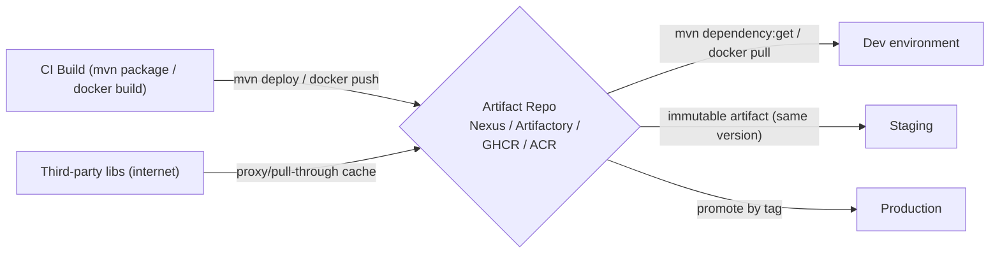

# Day 12: Artifact Management & Repositories
> Ek line mein: Build ke baad jo jar/docker image/npm package banta hai, wo kisi repository (Nexus/Artifactory/GHCR/ACR) mein version-clear (semver) store hota hai taaki CD pipeline wahi se utha kar deploy kare.
📚 Topic 12: Artifact Management Deep Dive — Nexus, Repositories & Versioning
✅ Prerequisite-checklist: (review Day 11 Build Tools if needed)

## Overview | Parichay

Build ke baad jo **artifact** banta hai (jar, docker image, npm package) use kisi **repository** mein store karte hain - taaki CD/CD pipeline use download karke deploy kar sake. Aaj hum artifact management seekhenge.

Repository ko ek **godam (warehouse)** samjho: factory (CI build) tayar maal (jar/image) yahan rakhti hai, label (version) chipkake. Jab bhi zaroorat ho — dev/staging/prod deploy — wahi maal tag se utha ke bheja jata hai. Bina repository ke har machine apna maal khud banaye, koi guarantee nahi ki same binary mile.

Do tarah ki repositories hoti hain: **apne infra wale store** (Nexus/Artifactory — private, corporate artifacts + third-party cache) aur **cloud registry** (GHCR = GitHub Container Registry, ACR = Azure Container Registry — docker images/npm/pypi ka cloud storage). Dono ka kaam ek hi: **immutable, versioned, ek-jaisa artifact** jise CI/CD securely push/pull kare.

**SemVer (semantic versioning)** yaad rakho: `MAJOR.MINOR.PATCH` — MAJOR (breaking change, `2.0.0`), MINOR (naya feature, backward compatible, `1.3.0`), PATCH (bug fix, `1.3.1`). Iska ek aur senior pattern hai: **build once, promote** — image ko baar-baar nahi pakaate, bas registry me tag change (dev → staging → prod) karte hain.

### Artifact kya hai — build ka asli dhan

Artifact = build ka **final output** jo deploy karte ho: `jar` (Java app), docker image, npm package, wheel (PyPI). Yeh hi cheez dev → staging → prod mein travel karti hai — isliye artifact **immutable** (ek baar bana, kabhi change nahi) aur **versioned** (har build ka unique number) hona zaroori hai. Isi ke upar reproducibility, rollback aur audit teeno khade hain: agar prod pe jar ka version pata na ho, to debugging ka aadhar hi nahi bacha.

```
build → mvn deploy / docker push → repo (immutable, versioned)
repo → mvn dependency:get / docker pull → deploy servers (wahi binary)
```

### Repo types — hosted, proxy, group

Nexus/Artifactory ki repo 3 tarah ki hoti hai: **hosted** (tumhare apne artifacts — yahi publish hota hai, dev teams isi se depend karte hain), **proxy** (internet se third-party libs ko cache karna — ek baar download, baad mein local se, builds fast), **group** (dono ko ek URL mein jodna — devs ko ek hi endpoint do). Gotcha: har build par internet se libraries fetch karna slow + flaky hota hai; proxy cache usko fast aur offline-safe bana deta hai. Enterprises mein isolated network ke liye proxy hi lifeline hai.

| Repo type | Kya store hota | Kis ke liye |
|---|---|---|
| hosted | tumhare build artifacts (jar/image/wheel) | publish + deploy |
| proxy | internet ke libs ka cache | build-speed + offline safety |
| group | hosted + proxy ka ek URL | devs ko ek hi endpoint |

### Nexus vs Artifactory vs cloud registries

Choice dependence scenario pe hai: **Nexus** = self-hosted aur free (Docker se 2 minute me up), **Artifactory** = JFrog ka enterprise version (SSO, HA, huge scale, paid), **GHCR/ACR/ECR** = managed cloud registries (GitHub/Azure/AWS ke saath native integration, CI/CD se direct push/pull). Rule: compliance ya on-prem chahiye → Nexus/Artifactory apne infra pe; cloud allowed → GHCR (GitHub Actions ke saath) ya ACR/ECR. Sabka kaam same — versioned warehouse for each artifact type. Ek hi repo me jar + image + npm packages ek saath ho sakte hain (Nexus/Artifactory multi-format); cloud registry usually ek format (container).

### SemVer — version ka language

`MAJOR.MINOR.PATCH` ka rule: **MAJOR** tab badhao jab breaking change (API toot gaya — `2.0.0`), **MINOR** tab jab naya feature (backward compatible — `1.3.0`), **PATCH** tab jab bug fix (`1.3.1`). Yeh version consumer project ko batata hai ki upgrade safe hai ya nahi. Pre-release tags bhi hote hain: `1.4.0-SNAPSHOT` (abhi bhi badal sakta hai) aur `1.4.0-rc.1` (release candidate). Interview sawaal: "1.2.3 se aage version kya hoga?" — breaking change → `2.0.0`, feature → `1.3.0`, fix → `1.2.4`. Rules simple hain, yahi senior naming ka hint hai.

| Change type | Naya version | Example (1.2.3 se) |
|---|---|---|
| bug fix (patch) | PATCH +1 | 1.2.4 |
| naya feature | MINOR +1, PATCH 0 | 1.3.0 |
| breaking change | MAJOR +1, baaki 0 | 2.0.0 |

### Build once, promote — senior pattern

Golden rule: artifact **ek baar banao, har environment me usi ko promote karo**. Dev me deploy karo → staging me **wahi image** `staging` tag do → prod me wahi `prod` tag. Rebuild mat karo — naya binary naya baal, phir "jo test kiya tha wo prod me nahi" ka chakkar. Docker example: `docker tag myapp:1.3.0 myapp:prod && docker push myapp:prod`. Isi pe immutability + rollback khade hain — purana version wapas pull karna utna hi easy.

```
docker tag myapp:1.3.0 myapp:dev      → dev pod restart (wahi binary)
docker tag myapp:1.3.0 myapp:staging  → staging verify (wahi binary)
docker tag myapp:1.3.0 myapp:prod     → prod release (wahi binary)
immutable: koi bhi environment kabhi 'rebuild' nahi, sirf 'retag + redeploy'
```

### Checksum aur integrity — bharose ki chain

Artifact ke saath **checksum (sha256)** bhi store hota hai — koi bhi file le ke hash compare karo, corruption ya tampering turant pakdo. `shasum -a 256 myapp-1.0.0.jar` vs registry pe listed hash. Cloud registries me digest (manifest digest) bhi hota hai, aur enterprise me **signed images** (cosign) — sirf verified digest hi deploy hota. Prod deploy jobs ko hash verify karne se bharose ki chain banati hai — audit ke waqt "ye exact binary prod pe hai" confident ho ke bata sakte ho.

### Registry security + common gotchas

Registries **private** hoti hain — auth tokens se access: GitHub Actions me `GITHUB_TOKEN`, Nexus me credentials (hamesha **secrets store** se, hardcode nahi). Gotcha 1: release repo pe published version **overwrite nahi** karte — change chahiye to naya version. Gotcha 2: `latest` tag har push pe badal jata hai — prod me kabhi `latest` pe rely mat karo, semver/sha tag hi bharose ka. Gotcha 3: registry names case-sensitive hote hain — push fail hone pe pehle yeh check karo. Interview ke liye: "promote by tag = naya binary nahi, wahi binary naya label".

## What You'll Learn | Aaj Ki Seekh

- [ ] Nexus vs Artifactory vs GHCR/ACR — project infra vs cloud registry
- [ ] Nexus: hosted (apne artifacts), proxy (third-party cache), group (union)
- [ ] `mvn deploy` aur `docker push` — build se repository tak
- [ ] Pull-through/proxy cache: ek baar download, baar-baar use, production safe
- [ ] Semantic versioning (semver): MAJOR.MINOR.PATCH + rules
- [ ] Immutable artifacts + promote by tag (dev → qa → prod), kabhi rebuild nahi
- [ ] Checksum/verify: artifact integrity (sha256), tampering detect
- [ ] Docker image tagging: `sha-abc1234` (per commit) + env tags

## Diagram | Dekho Kaise Kaam Karta Hai



ASCII:
```
build (jar/image) → push → repo (semver tag, checksum) → pull → dev/staging/prod
proxy cache = internet se library ek baar le lo, uske baad local se
immutable = ek version ke artifacts kabhi change nahi hote
```

## Demo | Copy-Paste Karke Chalao

```bash
# 1. Nexus ko Docker mein chalao
docker run -d --name nexus -p 8081:8081 sonatype/nexus3
#    browser: http://localhost:8081 (initial admin password file mein milta hai)

# 2. Maven project se Nexus pe push
#    mvn deploy  → settings.xml mein server credentials + distributionManagement
#    (deploy ke liye URL Yahi milta hai: Nexus → Repositories → maven-releases copy URL)

# 3. Checksum verify (artifact ki integrity ke liye)
shasum -a 256 myapp-1.0.0.jar
#    Nexus me jar par click → SHA-256 checksum match karo

# 4. Docker image → GHCR (GitHub Container Registry)
echo "${{ secrets.GITHUB_TOKEN }}" | docker login ghcr.io -u $GITHUB_ACTOR --password-stdin
docker tag myapp ghcr.io/myorg/myapp:1.3.0
docker push ghcr.io/myorg/myapp:1.3.0

# 5. Promote by tag (kabhi rebuild nahi)
docker tag ghcr.io/myorg/myapp:1.3.0 ghcr.io/myorg/myapp:prod
docker push ghcr.io/myorg/myapp:prod
```

```yaml
# GitHub Actions — build + push image step (Day 9 ki deploy.yml ke saath jod do)
- name: Build and push image
  run: |
    docker build -t ghcr.io/myorg/myapp:1.3.0 .
    echo "${{ secrets.GITHUB_TOKEN }}" | docker login ghcr.io -u ${{ github.actor }} --password-stdin
    docker push ghcr.io/myorg/myapp:1.3.0
```

## Real-Life Example | Industry Me

**Platform team (DeployTrack demo bhi yahi style):** CI har green build par `myapp-1.4.0-SNAPSHOT.jar` ko **Nexus maven-releases** (ya artifacts ko GHCR) pe push karta hai. Nexus ka **proxy repo** (maven-central) dev teams ko dependency downloads fast karta hai — 10 teams same dependencies use karein to no repeated internet pull. Prod deploy job exact release version `1.4.0` select karke Nexus se jar uthata hai; checksum verify hota hai; pura rollback: purana release version wapas pull. Audit ke waqt bata sakte ho "prod pe kaunsa exact binary hai" — kyunki artifact + version + SHA sab recorded hai.

## Practice Exercise | Abhi Karein

1. Nexus Docker se start karo aur UI mein login karo (admin password log se)
2. Repositories list dekh: hosted/proxy/group — teeno ka difference samjho
3. Day 11 ka Maven project lo aur `mvn deploy` (settings.xml ke sath) — jar Nexus mein aayega
4. Nexus se wahi jar `curl` se download karke sha256 compare karo
5. Docker image ko `1.0.0` tag se GHCR/docker hub pe push karo (private repo)
6. Same image ko `staging` + `prod` tag dekar push karo (promote pattern)
7. SemVer practice: purana release 1.2.3; define karo next ka version agar (a) naya feature (b) bug fix (c) breaking API

## Quick Notes | Yaad Rakho

```
- Artifact repo = jar/image/package ka versioned warehouse; CI/CD yahi se engine lagata hai
- Nexus = apne infra (free), Artifactory = enterprise JFrog; GHCR/ACR = cloud registry
- Repo tin tarah: hosted (tumhare), proxy (third-party cache), group (dono ka ek entry)
- SemVer: MAJOR (breaking).MINOR (feature).PATCH (bugfix)
- Build once, promote: image rebuild karke dev→prod alag version mat banao
- Immutability: published version kabhi overwrite/change nahi karte (rollback/audit ka aadhar)
- Immutable ka matlab: promote = bas tag laga do (1.3.0 → prod), binary same
- Pull-through/proxy cache: internet deps ko cache karke, baar-baar download khatam, prod offline-safe
- mvn deploy / docker push / npm publish / twine upload (pypi) = publish commands
- Checksum (sha256) verify karo — corrupted/tampered artifact pakdo
- Tagging: sha-abc1234 (dev builds), stable semver (releases)
- Registry auth = tokens (GITHUB_TOKEN/Nexus creds) — secrets store se, kabhi hardcode nahi
```

**Agla:** Advanced Shell Scripting — ab linux scripts production-grade (awk/sed/jq, cron, set -e) (Day 13).