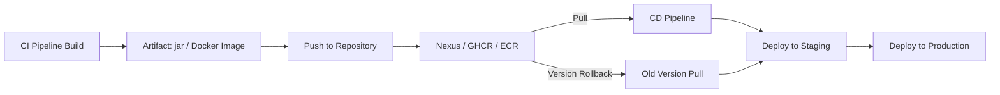

# Day 12: Artifact Management & Repositories
📚 Topic 12: Artifact Management Deep Dive — Nexus, Repositories & Versioning
✅ Prerequisite-checklist: (review Day 11 Build Tools if needed)

## Overview | Parichay

Build ke baad jo **artifact** banta hai (jar, docker image, npm package) use kisi **repository** mein store karte hain - taaki CD/CD pipeline use download karke deploy kar sake. Aaj hum artifact management seekhenge.

---

## What You'll Learn | Aaj Ki Seekh

- [ ] Artifact aur repository ka concept samjho
- [ ] Nexus ko Docker se run karke set up karo
- [ ] Nexus REST API ko curl se hit karo
- [ ] Docker image build → tag → push (GHCR) karna seekho
- [ ] Semantic Versioning (MAJOR.MINOR.PATCH) samjho
- [ ] Release vs snapshot repositories ka farak dekho

---

## Diagram | Dekho Kaise Kaam Karta Hai

**Mermaid - Build → Artifact → Repository → Deploy:**



**ASCII - Artifact Flow:**

```
CI Build ──► artifact.jar ──► ┌──────────────┐ ──► CD Deploy
                              │  Repository  │
                              │  (Nexus/ECR) │
                              └──────────────┘
                                   │
                                   └──► version 1.0.0
                                        version 1.1.0 (rollback yahan se)
```

**Real Images (Official Docs):**


*Caption: Sonatype Nexus Repository Manager - artifacts ka central store. (Source: help.sonatype.com)*


*Caption: GitHub Packages (GHCR) - container aur package registry ka overview. (Source: docs.github.com)*

---

## Demo | Copy-Paste Karke Chalao

**Nexus Docker se chalakar REST API curl karo + GHCR push:**

```bash
# 1. Nexus (Sonatype) ko Docker se run karo
docker run -d -p 8081:8081 --name nexus sonatype/nexus3
echo "Nexus starting... http://localhost:8081 par 1-2 min lagte hain"

sleep 5
# 2. Login page accessible hai check karo
curl -s -o /dev/null -w "Nexus UI: HTTP %{http_code}\n" http://localhost:8081/

# 3. Nexus REST API - repositories list karo (public API)
echo "=== Nexus repositories via REST API ==="
curl -s "http://localhost:8081/service/rest/v1/repositories" \
  | python3 -m json.tool | head -40

# 4. Nexus API se anonymous status dekho
curl -s "http://localhost:8081/service/rest/v1/status" \
  | python3 -c "import sys,json; print('Nexus status:', json.load(sys.stdin)['message'])"

# 5. GHCR example - ek naya image build + tag + push (gh CLI)
docker build -t myapp:1.0.0 . 2>/dev/null || \
  docker pull hello-world >/dev/null 2>&1 && docker tag hello-world myapp:1.0.0

echo "=== Docker image tags ==="
docker images | grep myapp
docker tag myapp:1.0.0 ghcr.io/myorg/myapp:1.0.0
echo "Push command:"
echo "  docker push ghcr.io/myorg/myapp:1.0.0   (login do login ghcr.io pahle)"

# 6. Semantic versioning dikhao
echo "1.4.2 = MAJOR(1).MINOR(4).PATCH(2)"
echo "  ^1.4.0 = 1.x.x,  ~1.4.0 = 1.4.x,  rc.1 = release candidate"

# Cleanup
docker rm -f nexus
```

**Output kya milega:** Nexus UI HTTP 200 + repositories list (maven-releases, maven-snapshots, etc.) + status "nexus" + Docker image tagged. Ye verify karta hai ki artifact store kaam kar raha hai.

---

## Real-Life Example | Zindagi Se

**Library ya bookstore socho:**
- **Build** = Book ka publisher content tayar karta hai
- **Artifact** = Printed/final book (jar, docker image)
- **Repository** = Central library/warehouse (Nexus) jahan har version rakha hai
- **Deploy** = Branch library ko dukan se book bhejna (production)
- **Versioning** = 1st edition, 2nd edition (1.0.0, 1.1.0) - kaunsi edition kahan available sab pata hai
- **Rollback** = Agar nayi edition mein typo hai to puraani edition wapas bhejo
- Ek hi central warehouse se poori chain ko milega - wahi artifact repository ka kaam hai

---

## Basic Concepts Detail Mein

### 1. Kya Hai Artifact Repository?

Artifact = build ka final product (jar, war, docker image, npm package, zip)

Repository = central jagah jahan ye store hota hai, version ke saath

```
Build --> Artifact --> Repository --> Deploy
         (jar)       (Nexus/ECR)    (production)
```

**Kyun zaroori?**
- **Central storage:** Sabko ek jagah se milega
- **Versioning:** Har version accessible, rollback easy
- **Traceability:** Kaunsi version deploy hua pata rahta hai
- **Caching:** Baz dependencies provider se fast laata hai

### 2. Popular Tools

| Tool | Type | Matlab |
|------|------|--------|
| **Nexus** (Sonatype) | Maven/npm/pip/Docker repo | Self-hosted, popular |
| **JFrog Artifactory** | Multi-format | Enterprise |
| **GitHub Packages** | Docker + code package | GitHub integrated |
| **Docker Hub** | Container images | Public registry |
| **ACR** (Azure Container Registry) | Container images | Azure-native |
| **GHCR** (GitHub) | Container images | GitHub Container Repo |

### 3. Package Managers (har language ka)

Maven, npm, pip etc. not just install - wo **repositories** se doosri taraf bhi use hoti hain:

| Language | Repo | Manager |
|----------|------|---------|
| Java | Maven Central | Maven/Gradle |
| Node.js | npm registry | npm/yarn |
| Python | PyPI | pip |
| Linux | apt repositories | apt |
| Containers | Docker Hub/GHCR | docker pull/push |

### 4. Semantic Versioning (SEMVER)

Versioning ka standard format: `MAJOR.MINOR.PATCH`

```
1.4.2
│ │ │
│ │ └── PATCH (bug fix - abatterand compatible)
│ └──── MINOR (naya feature - backward compatible)
└────── MAJOR (breaking change)
```

- `^1.4.0` = 1.x.x allowed
- `~1.4.0` = 1.4.x allowed
- `latest` = hamesha latest (careful)
- **Tags:** `v1.0.0`, `1.0.0-rc.1` (release candidate)

### 5. Container Registries

Docker images bhi artifacts hain:
```bash
# Build + tag + push
docker build -t myapp:1.0.0 .
docker tag myapp:1.0.0 ghcr.io/myorg/myapp:1.0.0
docker push ghcr.io/myorg/myapp:1.0.0

# Login
docker login ghcr.io
docker pull ghcr.io/myorg/myapp:1.0.0

# Immutable tags (best practice)
# ghcr.io/org/app:sha-abc123 (change par unique)
# ghcr.io/org/app:1.0.0     (release)
```

### 6. Nexus Setup

```bash
docker run -d -p 8081:8081 --name nexus sonatype/nexus3
```

Nexus mein **repositories** ke types:
- `maven-releases` → release artifacts
- `maven-snapshots` → development snapshots
- `maven-central` → external proxy (download source se)

**Deploy to Nexus (pom.xml):**
```xml
<distributionManagement>
  <repository>
    <id>nexus</id>
    <url>http://localhost:8081/repository/maven-releases/</url>
  </repository>
</distributionManagement>
```
```bash
mvn clean deploy
```

---

## Practice Exercise | Abhi Karein

**Artifact Management Challenge:**

```bash
# 1. Nexus Docker se start karo
docker run -d -p 8081:8081 --name nexus sonatype/nexus3
#   http://localhost:8081 par kholo, admin password nikal lo

# 2. Repositories banao:
#   - Maven hosted (maven-releases)
#   - Docker hosted (docker-releases)

# 3. Maven project configure karo Nexus deploy ke liye
mvn clean deploy

# 4. Docker image bana aur Nexus Docker repo mein push karo

# 5. Script likht you:
#   - Nexus se artifact download karo
#   - Checksum verify karo
#   - Target server par deploy karo
```

---

## Quick Notes | Yaad Rakho

```
- Artifact = build ka product (jar/image)
- Nexus/Artifactory = central store
- SEMVER: MAJOR.MINOR.PATCH
- docker build → tag → push → pull → run
- Release tags immutable (change na ho) - snapshots mutable
```

---

**Kal:** Advanced shell scripting aur automation.
