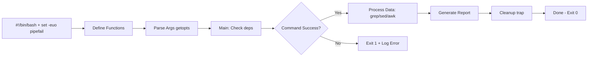

# Day 13: Advanced Shell Scripting & Automation
📚 Topic 13: Linux Deep Dive — Advanced Scripting & Automation
✅ Prerequisite-checklist: (review Day 12 Artifact Management if needed)

## Overview | Parichay

Ab basic scripting ki power ko aage le jayenge - **production-grade** scripts jo handle karte hain errors, text processing, remote execution, aur reusable libraries. Yeh hi wo skill hai jo DevOps engineers ko alag banata hai.

---

## What You'll Learn | Aaj Ki Seekh

- [ ] `set -euo pipefail` se safe aur robust script banao
- [ ] `awk`, `sort`, `uniq`, `head` se logs analyze karo
- [ ] `sed` aur `grep` se text process karo
- [ ] `jq` se JSON parse karo
- [ ] SSH automation aur cron jobs schedule karo
- [ ] Ek log-analyzer script bana ke chalao

---

## Diagram | Dekho Kaise Kaam Karta Hai

**Mermaid - Robust Script Structure:**



**ASCII - Log Analyzer Flow:**

```
app.log (nginx access logs)
     │  awk -F' ' '{print $1}'  (IP nikalo)
     v
IPs list
     │  sort | uniq -c | sort -rn | head -10
     v
Top 10 IPs (sabse zyada requests)
```

**Real Images (Official Docs):**

[Advanced Bash Scripting Guide](https://tldp.org/LDP/abs/html/abs-guide.html)
*Caption: Advanced Bash-Scripting Guide - shell scripting ka reference. (Source: tldp.org)*

[AWK Manual](https://www.gnu.org/software/gawk/manual/gawk.html)
*Caption: GNU AWK - text processing ke liye powerful tool ka official manual. (Source: gnu.org)*

---

## Demo | Copy-Paste Karke Chalao

**Log-analyzer one-liners + cron (actually runnable):**

```bash
# 1. Fake access log banao (example)
cat > access.log << 'EOF'
192.168.1.1 - - [01/Sep/2026:10:00:01] "GET /index.html" 200
192.168.1.1 - - [01/Sep/2026:10:00:05] "GET /about" 200
10.0.0.2 - - [01/Sep/2026:10:00:09] "GET /index.html" 200
192.168.1.1 - - [01/Sep/2026:10:00:12] "GET /login" 404
10.0.0.3 - - [01/Sep/2026:10:00:20] "GET /api/data" 500
10.0.0.2 - - [01/Sep/2026:10:00:30] "GET /index.html" 200
EOF

echo "=== Top 5 IPs (sabse zyada requests) ==="
awk '{print $1}' access.log | sort | uniq -c | sort -rn | head -5

echo ""
echo "=== Total requests ==="
wc -l < access.log

echo ""
echo "=== 4xx + 5xx error count ==="
awk '{print $9}' access.log | grep -E '^[45][0-9][0-9]$' | wc -l

echo ""
echo "=== 200 status ka count ==="
grep -c ' 200 ' access.log

echo ""
echo "=== Server error (5xx) wali lines ==="
grep -E ' [5][0-9][0-9] ' access.log

# 2. Startup ek cleaned report mein daalo
awk '{print $1}' access.log | sort | uniq -c | sort -rn > report.txt
echo "Report saved: report.txt"
cat report.txt
```

**Cron example (report ko roz chalao):**

```bash
# Har din 2AM par log-analyzer chala ke report banao
crontab -l 2>/dev/null; echo "0 2 * * * /home/user/analyze.sh >> /var/log/report.log 2>&1" | crontab -
crontab -l   # verify karo
```

**Robust script structure (set -euo + funcs + main):**

```bash
mkdir -p robust-demo && cd robust-demo
cat > analyze.sh << 'EOF'
#!/bin/bash
set -euo pipefail

log() { echo "[$(date +%T)] $*"; }

main() {
  local file="${1:-access.log}"
  [ -f "$file" ] || { log "ERROR: $file nahi mila"; exit 1; }
  log "Analyzing $file"
  awk '{print $1}' "$file" | sort | uniq -c | sort -rn | head -5
  log "Done"
}

main "$@"
EOF
chmod +x analyze.sh
./analyze.sh access.log   # yahan access.log bana ke chalao
```

---

## Real-Life Example | Zindagi Se

**Hospital emergency room ka triage system socho:**
- **set -euo pipefail** = Agar koi bhi step galat ho (nurse error), poori process ruk jaye - silent failure nahi
- **Functions** = Alag-alag department (registration, vitals, treatment) - har ek apna kaam karta hai
- **awk/sort/uniq** = Patient queue ko categorize karke sabse critical pehle (jemna sorting)
- **trap** = Shift khatam par hamesha room clean ho (cleanup) chahe kuch bhi ho jaye
- **cron** = Har rost par scheduled round check (nightly monitoring) - kabhi miss na ho

---

## Basic Concepts Detail Mein

### 1. Robust Scripting - Error Handling

**`set -euo pipefail`** - ye 3 flags scripts ko safe banate hain:
```bash
#!/bin/bash
set -e        # Koi command fail ho to script ruk jao
set -u        # Undefined variable use karne par error
set -o pipefail  # Pipe mein beech ka fail bhi count karo
```

**Exit codes:**
```bash
command
echo "$?"     # 0 = success, non-zero = fail
exit 1        # Script se specific code ke saath bahar jao
```

**Trap (cleanup):**
```bash
cleanup() {
    echo "Cleaning up..."
    rm -f /tmp/tempfile
    exit
}
trap cleanup EXIT     # Exit par hamesha cleanup chale
trap 'echo "Ctrl+C pressed"; exit' INT   # Ctrl+C par
```

### 2. Text Processing - grep, sed, awk

**grep (search):**
```bash
grep "error" app.log          # search
grep -i "error" app.log       # case-insensitive
grep -v "debug" app.log       # invert (debug wali except)
grep -c "error" app.log       # count
grep -r "TODO" src/           # recursive
grep -E "error|fail" f.log    # regex OR
```

**sed (stream editor - replace):**
```bash
sed 's/cat/dog/' file.txt         # replace first cat→dog (per line)
sed 's/cat/dog/g' file.txt        # global replace
sed -i 's/cat/dog/' file.txt      # file mein hi change (-i)
sed -n '10,20p' file.txt          # lines 10-20 print
sed '/^#/d' file.txt              # comment lines delete
sed 's/\s*$//' file.txt           # trailing spaces hatao
```

**awk (column processing):**
```bash
awk '{print $1}' file.txt         # pehla column
awk '{print $2, $3}' file.txt     # 2nd + 3rd column
awk -F: '{print $1}' /etc/passwd  # ':' se split karo
awk '$3 > 10 {print $0}' data.csv # condition
awk '{sum += $1} END {print sum}' numbers.txt   # sum
```

**cut / sort / uniq:**
```bash
cut -d: -f1 /etc/passwd      # colon split, 1st field
sort file.txt                # sort
sort -rn                     # reverse + numeric
uniq -c                      # count duplicates (sorted required)
sort file.txt | uniq -c | sort -rn   # top repeated
```

### 3. Working with JSON - jq

APIs se baat karte waqt JSON parse karna zaroori hai:

```bash
echo '{"name":"DevClo","age":5}' | jq '.name'        # "DevClo"
jq '.age' data.json
jq '.items[] | .name' data.json       # array par loop
jq '.[0].id' data.json                # first element
jq '.items | length' data.json
jq '{name, age}' data.json            # specific fields
jq -r '.name' data.json               # raw (bina quotes)
```

### 4. SSH Automation

```bash
# SSH keys generate
ssh-keygen -t ed25519 -C "email@example.com"
ssh-copy-id user@server            # key copy (password once)
ssh user@server                    # login (no password now)

# Commands remotely
ssh user@server "uptime && free -h"
ssh user@server "systemctl restart nginx"

# Copy files
scp file.txt user@server:/tmp/            # SSH copy
scp -r folder/ user@server:/tmp/
rsync -avz folder/ user@server:/backup/   # incremental sync

# SSH tunnel
ssh -L 8080:localhost:80 user@server      # port forward
```

### 5. Cron Jobs - Scheduling

```bash
# Edit user's cron
crontab -e

# Format: minute hour day month weekday command
#         0      2   *   *     *     /root/backup.sh

# Examples:
*/5 * * * *     /monitor.sh          # Har 5 min
0 2 * * *       /backup.sh           # Har din 2AM
0 9 * * 1      /weekly-report.sh    # Monday 9AM
0 0 1 * *       /monthly.sh          # Har mahine 1st
@reboot         /startup.sh          # Boot par
```

### 6. Argument Parsing - getopts

```bash
#!/bin/bash
usage() { echo "Usage: $0 -e <env> -v <version> [-d]"; }

while getopts "e:v:d" opt; do
  case $opt in
    e) ENV=$OPTARG ;;
    v) VERSION=$OPTARG ;;
    d) DEBUG=true ;;
    *) usage; exit 1 ;;
  esac
done

echo "Environment: $ENV, Version: $VERSION, Debug: $DEBUG"
```

---

## Practice Exercise | Abhi Karein

**Ye scripts banao:**

```bash
#!/bin/bash
# 1. log-analyzer.sh - nginx log analyze
#    - Total requests
#    - Top 10 IPs
#    - Top 10 URLs
#    - 4xx aur 5xx count
#    - Report output

#!/bin/bash
# 2. remote-deploy.sh - Multi-server deploy
#    - Server list file se padho
#    - Har server par artifact copy
#    - Deploy command chalao
#    - Verify karo
#    - Fail ho to rollback

#!/bin/bash
# 3. config-generator.sh - Templates se config banao
#    - Placeholders replace karo (sed)
#    - nginx.conf, docker-compose.yml banao
#    - Validate karo

#!/bin/bash
# 4. monitor.sh - System monitor + alert
#    - CPU, memory, disk check
#    - Threshold cross ho to alert
#    - Timestamp ke saath log
#    - Webhook par curl se notify
```

---

## Quick Notes | Yaad Rakho

```
- set -euo pipefail = safe script (3 flags)
- grep = search, sed = replace, awk = columns, jq = JSON
- ssh-keygen + ssh-copy-id = password-free
- crontab = schedule, getopts = args
- $? = last exit code, trap = cleanup
```

---

**Kal:** Week 2 review + CI/CD capstone challenge.
