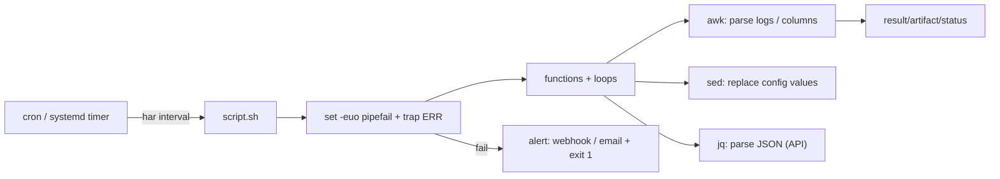

# Day 13: Advanced Shell Scripting & Automation
> Ek line mein: Production-grade scripts = set -euo pipefail + functions + awk/sed/jq + cron scheduling + secrets env se — jo baar-baar chale aur kabhi jhuti na kare.
📚 Topic 13: Linux Deep Dive — Advanced Scripting & Automation
✅ Prerequisite-checklist: (review Day 12 Artifact Management if needed)

## Overview | Parichay

Ab basic scripting ki power ko aage le jayenge - **production-grade** scripts jo handle karte hain errors, text processing, remote execution, aur reusable libraries. Yeh hi wo skill hai jo DevOps engineers ko alag banata hai.

Script ko ek **automated worker** samjho — par agar usne khud fail hone pe silently ignore kar diya, to tumhe kabhi pata hi nahi chalega ki kuch toota hai! Isliye pehla lesson: `set -euo pipefail` — ek safety harness ki tarah — error pe script turant rukti hai, koi undefined variable use nahi hota, aur pipeline ke beech ki galti bhi pakdi jati hai. Unexpected undefined ki tarah ek silent farari khaane wala worker, faltu ka.

Text ka kaam teen tools se hota hai: **awk** (columns/tables — `awk '{print $1}'`), **sed** (replace/edit — `sed 's/old/new/'`), **jq** (JSON parsing). Logs parse karna, config badalna, API response nikalna — inhi teen se hota hai. Aur jab repeated kaam ho — har raat logs rotate, har 5 min health check — tab **cron** (ya systemd timer) schedule karte ho.

### set -euo pipefail — script ka safety harness

Teen safety switches ek saath: `set -e` (koi command fail → script turant ruk jao), `set -u` (undefined variable use kiya → fail), `set -o pipefail` (pipeline mein koi bhi command fail → poora pipeline fail). Bina iske ek galat command silently chal kar aage badh jati hai — script "success" dikhti hai par kaam adhura hota hai. Isliye har production script ki pehli line yahi hai: `#!/usr/bin/env bash` ke turant baad `set -euo pipefail`. Interview ke liye: "production script ka mandatory header kya hai?" — yahi.

```bash
#!/usr/bin/env bash
set -euo pipefail       # fail fast + no silent mistakes
set -e                  # `false` command pe ruk jayega
```

### trap ERR — fail hone par kya karo

`trap 'echo "[ERROR] line $LINENO failed"' ERR` — koi command fail hote hi script batati hai **kis line pe, kya hua**. Fail hone par sirf rukna kaafi nahi — **info dena** bhi zaroori hai. Production scripts me trap + alert (Slack webhook / email) jaata hai, taaki silent failure na ho. Log line number + exit code = debugging ka shortcut. Yeh extra 2 lines script ki quality double kar deti hain.

### awk — columns aur tables ka khel

`awk` line-by-line structured data parse karta hai: `awk '{print $1}'` — pehla column; `awk -F, '{print $2}'` — comma-delimited (CSV); `NR>1` — header line skip; aggregation `awk '{s+=$NF} END {print s}'`. Sabse famous interview one-liner = **top 5 IPs**: `awk '{print $1}' access.log | sort | uniq -c | sort -rn | head -5`. Logs parse karna, system output se value nikalna, report banana — awk hi pehla tool hai. Pehle data ka structure samjho, phir awk expression likho.

```
INPUT:  1.2.3.4 GET /login 200
        5.6.7.8 GET /pay    500
awk '{print $1}'        → IP column nikaala    → 1.2.3.4 / 5.6.7.8
awk '$NF==500'          → sirf 500 wali lines  → 5.6.7.8 GET /pay 500
```

### sed — replace aur edit in-place

`sed 's/old/new/g'` — har line ka global replace; `sed -i` — file mein in-place edit (pehle **backup** banao: `cp file file.bak`). Practical use: `sed -i "s|appVersion:.*|appVersion: 1.3.0|" values.yaml`. Gotchas: bina `-i` ke output sirf screen pe print hota hai, file change nahi hoti; aur Linux vs macOS BSD sed ka `-i` syntax alag hai (portable scripts pe dhyan rakho). Regex ka basic (`.*`, `[0-9]`) yahi se seekhna hai.

```
sed 's/error/warning/'  file    → pehla replace har line ka
sed 's/error/warning/g' file    → sab replace (global)
sed -i.bak 's/x/y/'     file    → in-place + backup bana ke
```

### jq — JSON ka authority

APIs ka response JSON hota hai aur bash JSON khud parse nahi kar sakta — chaliye **jq**: `curl -fsS https://api... | jq -r '.name'` (`-r` = raw output, bina quotes). `.field` — object access, `.[]` — array items, `select(.status=="error")` — filter, `.users[].name` — nested access. Practical: health-check script — API se `jq '.data.port'` nikaal kar config compare karo. Har script mein JSON se value nikalne ka trusted tool jq hi hai; interview me `.menu.items[].id`, `map`, `length` — inhi se 90% JSON ka kaam chalta hai.

```bash
curl -fsS https://api.example.com/app | jq -r '.status, .port'
jq '[.users[].name] | length'          # kitne users
jq '.[] | select(.status == "error")'  # filters
```

### Functions + loops — automation ka engine

Chhoti chhoti **functions** banao (`check_cpu()`, `check_disk()`) — ek baar define, baar baar call, main logic readable. `local` variables function ke andar scoped rehte hain (leak nahi). Loops `for svc in nginx postgres cron; do systemctl is-active "$svc"; done` se 50 services pe ek saath check — yehi infrastructure automation ka base hai. Script ko **main()** pattern mein likho: functions upar, execution niche — readable + reusable, yahi real production script ka structure hai.

```bash
check_disk() { df / | awk 'NR==2 && int($5) > 80 { print "WARN", $5; exit 1; }'; }
main() { echo "start: $(date)"; check_disk; echo "done:  $(date)"; }
main "$@"         # actual execution sirf niche
```

### cron vs systemd timers — scheduling ka tarika

`crontab -e` se repeated kaam schedule karo: `*/5 * * * * /opt/app/health.sh >> /var/log/health.log 2>&1` — har 5 minute. Cron ke 2 gotchas: environment **baar baar load nahi** hota (PATH chhota) — script mein full PATH set karo ya `#!/usr/bin/env bash`; aur koi notification nahi — log file daalna zaroori. **systemd timer** superior hai: journald logging, `Persistent=true` (server off rehne par bhi chala deta), dependencies, retry. Rule: simple job → cron; serious production-grade job → systemd timer.

```
*/5 * * * *  health.sh            → har 5 minute
0 4 * * *    backup.sh            → roz subah 4 baje
0 2 * * 0    cleanup.sh           → har Sunday 2 baje
5 fields: minute hour day month weekday
```

### Secrets + idempotency — senior habits

Secrets kabhi script mein hardcode nahi — environment se: `${API_KEY:?}` (required — set nahi to turant exit, `:?` ka magic), `${VAR:-default}` (optional fallback). **Idempotency**: script 2 baar chalao → same safe result — check-karo-phir-karo pattern: `[ -d /backup ] || mkdir -p /backup`. `shellcheck` se lint (0 errors target) aur `bash -n` syntax check — merge-ready script ka standard. Yeh habits hi script ko production-grade banati hain: fail-fast + cleanup + idempotent + lint-clean + logged + alerting.

## What You'll Learn | Aaj Ki Seekh

- [ ] `set -euo pipefail` + `trap ERR` — fail-fast script ka dharam
- [ ] `$?`, exit codes, `||`/`&&` — har command ka result check karna
- [ ] Functions + loops (`for`, `while`): code reuse, repeated checks
- [ ] awk: columns/conditions (`awk '{print $1}'`, `NR>1`, `-F,`)
- [ ] sed: replace/extract (`s/old/new/g`, `-i` in-place)
- [ ] jq: JSON parses (`jq '.app.port'`, `[].name`)
- [ ] cron: schedule + PATH/env gotchas; systemd timers superior
- [ ] Environment vars + secrets: `${VAR:?}` required, kabhi hardcode nahi

## Diagram | Dekho Kaise Kaam Karta Hai



ASCII:
```
cron → script.sh → set -euo pipefail → functions → awk/sed/jq → output/log
                          └───────────────koi error → alert + exit 1 (silent ignore no)
secrets: ${API_KEY:?} — env se, kabhi script mein hardcoded nahi
```

## Demo | Copy-Paste Karke Chalao

```bash
# 1. Log analyzer — top 5 IPs (interview favourite one-liner)
awk '{print $1}' /var/log/nginx/access.log | sort | uniq -c | sort -rn | head -5

# 2. Config updater (sed in-place) — version nikaldo
sed -i "s|appVersion:.*|appVersion: 1.3.0|" values.yaml
grep appVersion values.yaml

# 3. JSON (jq) — API response se value nikaalna
curl -fsS https://api.github.com/repos/anomalyco/opencode | jq -r '.name, .stargazers_count'

# 4. Production-style script (copy-paste chalao)
```

```bash
#!/usr/bin/env bash
set -euo pipefail
trap 'echo "[ERROR] line $LINENO failed (exit $?)"' ERR

# functions = reusable blocks
check_cpu() {
  local cpu
  cpu=$(top -bn1 | grep "Cpu(s)" | awk '{print int($2)}')
  [ "$cpu" -gt 85 ] && echo "WARN cpu=$cpu%"
}
check_disk() {
  df / | awk 'NR==2 && int($5) > 80 { print "WARN disk full:", $5 }'
}
backup_daily() {
  local dest="/backup/app-$(date +%F).tar.gz"
  tar -czf "$dest" /var/www/app && echo "backup -> $dest"
}

# main
echo "Started: $(date)"
check_cpu
check_disk
for svc in nginx postgresql cron; do
  systemctl is-active "$svc" >/dev/null && echo "ok: $svc" || echo "DOWN: $svc"
done
backup_daily
echo "Done"
```

```bash
# 5. Secrets: env se lo, kabhi hardcode mat karo
: "${API_KEY:?API_KEY set karna zaroori hai}"   # missing pe turant exit
curl -fsS -H "Authorization: Bearer $API_KEY" https://api.example.com/stats

# 6. Cron scheduling
crontab -l
#   * 4 * * *    /opt/app/backup_daily.sh >> /var/log/app-cron.log 2>&1
#   */5 * * * *  /opt/app/health_check.sh   (cron PATH chhota hai — script mein full PATH set karo)
```

## Real-Life Example | Industry Me

**Nginx log incident (53 minutes of 429s):** production mein user ko 429 (server busy) aane lage. Devs ne manually logs kholne in 20 min lagaye. Senior ne ek script likha — `awk '{print $1}' access.log | sort | uniq -c | sort -rn | head` se top IPs mile, `grep '" 429 '` se error pattern, `jq` se API response count — 5 minute mein culprit (galt configured rate-limit IP) pakda gaya. Script ko cron mein laga diya — ab har 5 minute ek health-check script checks karta hai (CPU>85, disk>80, service down) aur Slack webhook alert bhejta hai. Aisi script ki koi bhi line silent fail ho to `set -e` usko turant pakda deta.

## Practice Exercise | Abhi Karein

1. `set -euo pipefail` wala skeleton banao + `bash -n` syntax check
2. `check_cpu`/`check_disk` functions ko loop mein ek script mein jodo
3. Log file banao (`access.log`) aur `awk | sort | uniq -c | sort -rn | head -5` chalao
4. `sed -i` se ek real config file ka version/replace karo — pehle backup bana ke
5. `jq` se kisi public API se 2 fields nikaalo (`curl | jq`)
6. `${API_KEY:?}` wala check laga ke bina env wali failed exit dekh
7. Ek script ko cron mein chalao + log file redirection; daikho ki PATH/env miss ka asar kya
8. `shellcheck script.sh` — 0 errors target (0 se upar aayega to sahi karo)

## Quick Notes | Yaad Rakho

```
- set -euo pipefail = fail pe turant rukna + unset var pe fail + pipeline galti pakdo
- trap 'echo "[ERROR] line $LINENO"' ERR = fail kab aur kahan, so jaane do mat
- $? = last command exit; 0 = success — check karke aage badho
- awk = columns/tables (structured); sed = replace/edit; jq = JSON — teeno alag kaam
- awk '{$1}' or awk -F, '{$2}' = field nikalna; NR>1 = header skip
- sed -i 's/old/new/g' file = in-place replace; pehle backup zaroori
- jq -r = raw output (bina quotes), '.', '.[]', 'select' — JSON ki jaan
- functions = reuse; loops (for/while) = repeated checks 100 machineon ke liye
- cron: PATH chhota + env loading nahi → script me full PATH ya #!/usr/bin/env bash
- systemd timers > cron (journald logs, Persistent=true, dependencies)
- Secrets sirf env se: `${VAR:?}` required, ${VAR:-default} optional; kabhi hardcode nahi
- Idempotent banao: script baar-2 chale to same result (check-karo-phir-karo)
- shellcheck 0 errors = merge-ready script; bash -x = debug step-by-step
```

**Agla:** Week 2 Review + Challenge — puri CI/CD pipeline ek sath (GitHub Actions/Jenkinsfile) (Day 14).