# Day 14: Week 2 Review & Challenge
> Ek line mein: Week 2 ka poora review — CI/CD (Day 8), GitHub Actions (9), Jenkins (10), Maven/Gradle (11), artifact repos (12), scripting (13) — aur capstone: ek full CI/CD pipeline jo build+test+package+upload kare.
📚 Topic 14: CI/CD Mastery — Full Pipeline Review
✅ Prerequisite-checklist: (review Days 8-13 concepts if needed)

## Overview | Parichay

Week 2 ka pura review - CI/CD, GitHub Actions, Jenkins, build tools, artifact management, advanced scripting. Aur complete karo **Week 2 Capstone Challenge** - ek full CI/CD pipeline.

Week 2 ke concepts ko ek doosre se jodkar dekho: code commit ho (Day 8) → GitHub Actions/Jenkins usse build+test kare (Day 9/10) → build tool ka jar/image nikaley (Day 11) → wahi artifact registry mein version ke saath jaye (Day 12) → aur jahan beech mein log/deploy/check ki zaroorat pade, advanced script (Day 13) lage. Har practice routine chhote-chhote par the; capstone un sabko ek **assembly line** mein jodta hai.

Capstone ka rule ek hi: **asli pipeline, asli repo** — fake commands nahi. Summary ki ambition: agar koi tumse puche "apna CI/CD dikha na", to ek click mein wo pipeline demo ho jaye — green build, test results, jar/artifact upload, aur ek deploy (staging) — sab ka sab documented.

### Week 2 ka pura map — ek table mein

Week 2 ke har din ki ek line yaad rakkho:

| Day | Concept | Ek line |
|---|---|---|
| 8 | CI/CD | har commit pe build+test; same artifact promote sab envs |
| 9 | GitHub Actions | repo me YAML, event pe runner par jobs |
| 10 | Jenkins | self-hosted master/agent + Jenkinsfile declarative |
| 11 | Build tools | `mvn clean package` → `target/*.jar` |
| 12 | Artifact repos | Nexus/GHCR, semver + promote by tag |
| 13 | Scripting | `set -euo pipefail`, awk/sed/jq, cron, secrets env se |

Yahi poora chain ek line me: commit → build+test → package → publish → deploy → verify.

### Active recall — revision ka sahi tarika

Ratta bharne se kuch nahi hota — **active recall** karo: ek blank paper pe Day 8-13 ke core terms likho — pipeline, artifact immutability, checkout, needs, input, clean package, semver, hosted/proxy, pipefail, idempotent — aur har ka 1-line definition khud likho. Jo na aaya, wo weak point hai — sirf usi pe wapas jao. 15 minute me poora week revise — yehi method interview ka bhi hai: senior engineer se puche jate hain "CI/CD ka ek line ka definition?" — tumhare paas 10 honi chahiye.

Revision ka ek aur trick: har term ko **apne words** mein bol kar sunao (nahi, mann hi mann nahi — awaaz nikalo). Jo bolte waqt atko, wo concept weak hai. Duolingo-style consistency: har subah 2 din ka quick recall + ek naya cheat-sheet note. Week-end review isi se effective hota hai — sirf padhna nahi, nikalna.

### Capstone kya hai aur kyun

**Capstone** ek chhota project hai jo Day 8-13 ko **ek assembly line** mein jodta hai: code commit → CI build+test → package → artifact upload → deploy staging → smoke verify. Concepts alag-alag samajhna aur unko jodna — do alag skills hain; pehla padhai hai, doosra engineering. Capstone se milte hain: 1) koi ek cheez ratta nahi — sab real repo me aani chahiye, 2) real debugging (YAML error, versions, permissions, auth), 3) portfolio-ready demo jo interview me dikhao. Rule ek: **asli repo, asli commit, asli green build** — fake kuch nahi.

```
commit → workflow (build+test) → jar → upload → GHCR/Nexus (semver)
        → deploy staging → smoke test → PASS → docs + screenshot
sab pipeline mein, zero manual — yahi capstone ki final delivery hai
```

### Capstone gotchas — pehle se dhyan do

1) YAML indentation — ek space ka galat, workflow start hi nahi hota (Actions tab ka error padho), 2) `needs`/`jobs`/`steps` keys ki spelling + nesting — yahi typo sabse common, 3) artifact path — `target/*.jar` vs `build/libs` galat to upload empty jata hai, 4) registry auth — `GITHUB_TOKEN`/Nexus creds secrets se, hardcode nahi, 5) deploy script executable — `chmod +x` bhulog to "permission denied", 6) smoke test ka URL — health endpoint sahi chahiye. Har gotcha interview ki **story** ban jata hai: "hamare capstone me ye issue aaya aur maine aise fix kiya".

### Portfolio demo — interview ka proof

"CI/CD dikha sakte ho?" — repo kholo: `.github/workflows/capstone.yml` → code review; Actions tab → green history; registry → jar/image `1.0.0` tag ke saath; README → architecture diagram + rollback plan. In 4 cheezein se pata chalta hai: **pipeline-as-code** (file Git me), **execution** (green runs), **artifact handling** (versioned + immutable), **docs** (audit — kya deploy hua, kab, kyu). Yeh "hands-on proof" interview me certificate se zyada worth rakhta hai. Capstone ko aise hi commit karo — demo-ready.

### Week 3 ki jhalak — aage kya hai

Week 3 shuru hoti hai: **Docker Fundamentals** — containers, images, Dockerfile. Connection dekh lo: Day 12 ka artifact jar/image tha — ab image first-class citizen banega. Jo patterns seekhe wo agle week ka seed hai: semver + promote by tag (Day 12) = image tags, env vars + secrets (Day 13) = Docker `ENV`/`ARG`/secrets, pipeline concept (Day 8-10) = container builds automate. Week 2 ka foundation hi Week 3 ko oopar uthata hai — isliye capstone poora karna wajib hai.

## What You'll Learn | Aaj Ki Seekh

- [ ] Day 8: CI vs CD, stages, environments dev/staging/prod — ek line revision
- [ ] Day 9: GitHub Actions — triggers, jobs/steps, secrets, environments
- [ ] Day 10: Jenkins Jenkinsfile (declarative) — master/agent, input gate
- [ ] Day 11: Maven lifecycle (`clean package`) — artifact target/*.jar
- [ ] Day 12: Artifact repo — Nexus/GHCR, semver `1.0.0`, promote by tag
- [ ] Day 13: set -euo pipefail, awk/sed/jq, cron, secrets env se
- [ ] Capstone: build+test+package+upload wali full pipeline (Actions ya Jenkinsfile)
- [ ] Week 2 demo portfolio-ready: screenshot/docs ke saath

## Diagram | Dekho Kaise Kaam Karta Hai

```mermaid
flowchart LR
    CODE["Dev: git push (Day 3/8)"] --> TRIG["Trigger: push/PR webhook (Day 9/10)"]
    TRIG --> CHECK["Checkout + Lint (Day 9)"]
    CHECK --> TEST["Unit tests pytest/JUnit (Day 8/11)"]
    TEST --> PKG["Build: mvn clean package / docker build (Day 11)"]
    PKG --> PUSH["Upload artifact: jar/image (Day 12)"]
    PUSH --> REPO["Repo: GHCR/Nexus semver tag (Day 12)"]
    REPO --> DEP["Deploy staging + smoke (Day 10/13 script)"]
    DEP --> VER["Verify: logs, status, dashboards (Day 13)"]
```



ASCII:
```
push → workflow → (checkout → lint → test → build → package) → upload artifact
    → repo (version tag) → deploy staging (script) → smoke + verify
sab kuch pipeline mein, koi manual nahi — yahi poora Week 2
```

## Demo | Copy-Paste Karke Chalao (Capstone)

```yaml
# .github/workflows/capstone.yml — full pipeline (build + test + package + upload)
name: Week2 Capstone Pipeline
on:
  push:
    branches: [ main ]
  workflow_dispatch:

jobs:
  build:
    runs-on: ubuntu-latest
    steps:
      - uses: actions/checkout@v4
      - uses: actions/setup-java@v4
        with:
          distribution: temurin
          java-version: "17"
      - name: Tests
        run: mvn -B test
      - name: Package
        run: mvn -B -DskipTests package
      - name: Verify artifact
        run: ls -lh target/*.jar
      - name: Upload artifact
        uses: actions/upload-artifact@v4
        with:
          name: myapp-jar
          path: target/*.jar

  publish:
    needs: build
    runs-on: ubuntu-latest
    steps:
      - uses: actions/download-artifact@v4
        with:
          name: myapp-jar
          path: dist/
      - name: Push container image to GHCR
        run: |
          docker build -t ghcr.io/devclo/myapp:1.0.0 .
          echo "${{ secrets.GITHUB_TOKEN }}" | docker login ghcr.io -u ${{ github.actor }} --password-stdin
          docker push ghcr.io/devclo/myapp:1.0.0
```

```groovy
// Jenkinsfile alternative (Day 10) — build + test + package + deploy staging
pipeline {
  agent any
  stages {
    stage('Test')    { steps { sh 'mvn -B test' } }
    stage('Package') { steps { sh 'mvn -B -DskipTests package' } }
    stage('Publish') { steps { sh './publish-artifact.sh' } }   // Nexus/GHCR push (Day 12)
    stage('Deploy Staging') { steps { sh './deploy.sh staging' } }
  }
  post { always { junit 'target/surefire-reports/*.xml' } }
}
```

## Real-Life Example | Industry Me

**Interview / portfolio demo:** senior-engineer ke interview mein "CI/CD dikha sakta hai?" koi bolta hai, to wo pehle repo khollta hai — `.github/workflows/capstone.yml`, phir Actions tab — ek green pipeline history, phir artifact (jar/image) registry mein version ke saath, aur README mein pipeline architecture diagram + rollback plan. Yehi "demo" ka culture hai — **asli output, asli commit, asli green build**. Capstone bhi waise hi banao: code + test + pipeline + artifact + docs — sab commit karke, fake template nahi.

## Practice Exercise | Abhi Karein (Capstone Steps)

1. Ek public repo (ya naya repo) banao; simple app + tests (pytest/JUnit) commit karo
2. `.github/workflows/capstone.yml` add karo (build+test+package) — green build hasil karo
3. Artifact upload karo (upload-artifact) + jaise Actions mein download
4. Build ke baad jar ko registry mein push karo (GHCR ya docker hub), semver tag `1.0.0`
5. Deploy staging step add karo (SSH/deploy.sh/tar) + smoke test (`curl` health)
6. Ek deliberate test fail karke pipeline red karo, phir fix karke green — rollback/fail-fast dikhao
7. README mein diagram + steps + screenshots daalo — portfolio ready demo
8. Week 2 review table banao: Day | concept | tool | ek-line; self-check karke tick karo

## Quick Notes | Yaad Rakho

```
- Day 8: CI = build+test (feedback), CD = deploy with approval; same artifact all envs
- Day 9: Actions YAML — trigger/jobs/steps/secrets/environments; ci.yml + deploy.yml
- Day 10: Jenkins Jenkinsfile declarative; master/agent; input = human gate
- Day 11: mvn clean package → target/*.jar; lifecycle validate→test→package
- Day 12: artifact repo (Nexus/GHCR), semver MAJOR.MINOR.PATCH, promote by tag, checksum
- Day 13: set -euo pipefail, awk/sed/jq, cron, ${VAR:?} secrets — scripts production-grade
- Capstone = build+test+package+upload+deploy+verify ek pipeline mein — asli repo, asli green
- Artifact immutability + promote = rollback/audit ka aadhar
- Fail fast: pipeline me naye changes pe turant signals; human approval sirf prod pe
- Portfolio: pipeline code + green runs + artifact registry + README diagram = complete
```

**Agla:** Docker Fundamentals — containers, images aur Dockerfile (Week 3 ki shuruaat).