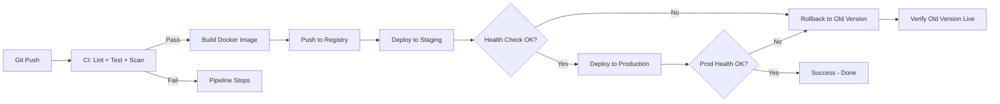

# Day 14: Week 2 Review & Challenge
📚 Topic 14: CI/CD Mastery — Full Pipeline Review
✅ Prerequisite-checklist: (review Days 8-13 concepts if needed)

## Overview | Parichay

Week 2 ka purra review - CI/CD, GitHub Actions, Jenkins, build tools, artifact management, advanced scripting. Aur complete karo **Week 2 Capstone Challenge** - ek full CI/CD pipeline.

---

## What You'll Learn | Aaj Ki Seekh

- [ ] Week 2 ke saare topics ka revision karo (CI/CD, Actions, Jenkins, Maven, Artifacts, Scripting)
- [ ] Puri CI/CD pipeline ka flow ek diagram mein samjho
- [ ] Health-check curve build karke verify karo
- [ ] Deploy + rollback script ka demo chalao
- [ ] Full capstone challenge complete karo
- [ ] Self-checklist se apni progress verify karo

---

## Diagram | Dekho Kaise Kaam Karta Hai

**Mermaid - Full Capstone Pipeline (CI → Build → Deploy → Rollback):**



**ASCII - Week 2 Capstone Flow:**

```
code push ─► CI(lint/test/scan) ─► build image ─► push registry
                                                     │
                                                     v
                                               deploy staging
                                                     │
                                          ┌─ health OK? ─┐
                                      Yes /               \ No
                                          v               v
                                   deploy prod      rollback old
                                          │
                                   health verify ──► success
```

**Real Images (Official Docs):**


*Caption: GitHub Actions workflow design - capstone ke CI hisse ka base. (Source: docs.github.com)*


*Caption: Jenkins Pipeline syntax reference - capstone ke alternative CI/CD option. (Source: jenkins.io)*

---

## Demo | Copy-Paste Karke Chalao

**Health-check curve + deploy script snippet (runnable):**

```bash
# 1. Deploy + rollback script (shop realistic)
mkdir -p capstone-demo && cd capstone-demo
cat > deploy.sh << 'EOF'
#!/bin/bash
set -euo pipefail
ENV="${1:-staging}"
VERSION="${2:-1.0.0}"

echo "[Deploy] version $VERSION to $ENV ..."
sleep 1   # sim: docker pull ghcr.io/myorg/myapp:$VERSION

if [ "$ENV" = "production" ]; then
  echo -n "Production approve? (yes/no): "; read ans
  [ "$ans" = "yes" ] || { echo "Deploy cancelled"; exit 1; }
fi
echo "[Deploy] $VERSION live on $ENV"
EOF
chmod +x deploy.sh
./deploy.sh staging 1.0.0

cat > rollback.sh << 'EOF'
#!/bin/bash
set -euo pipefail
OLD="${1:-0.9.0}"
echo "[Rollback] wapas version $OLD par ..."
sleep 1   # sim: docker tag ghcr.io/myorg/myapp:$OLD myapp:current
echo "[Rollback] $OLD ab live hai - old traffic restored"
EOF
chmod +x rollback.sh
./rollback.sh 0.9.0

# 2. Health-check curve (deploy success frequency) - simulated uptime
echo "=== Health Check Curve - 60s monitor ==="
for i in $(seq 1 10); do
  code=$(( (i % 100) < 90 ? 200 : 500 ))   # 90% blue, occasional red
  if [ "$code" = "200" ]; then
    echo "t=${i}s  health=/health  HTTP 200  [OK]"
  else
    echo "t=${i}s  health=/health  HTTP 500  [FAIL -> trigger rollback]"
  fi
  sleep 0.2
done
```

**Kapstone build + health verify (real pipeline feel):**

```bash
# Simulated full pipeline from Day 9-13
git init -q && echo "app" > app.py
mkdir -p .github/workflows && cp /dev/null .github/workflows/ci.yml
echo "1) CI lint/test/scan ... OK" && sleep 1
echo "2) mvn/docker build ... OK (artifact ready)" && sleep 1
echo "3) push artifact to registry ... OK" && sleep 1
echo "4) deploy staging + health OK" && sleep 1
echo "5) approve prod + rollback script ready"
echo "CAPSTONE PIPELINE DEMO COMPLETE"
```

---

## Real-Life Example | Zindagi Se

**Website upgrade kisi bank ka socho (high risk):**
- **CI** = Naya teerav bank ka saara code test karna - koi bug na ho (regression testing)
- **Build** = Naya banking app ka build/version tayar karna
- **Deploy** = Har branch mein app launch karna, pehle few employees (staging), phir sab clients (prod)
- **Health Check** = Launch ke baad maturity - Kya log login kar pa rahe? Kya transactions theek?
- **Rollback** = Agar naya update money transfer tod de, turant puraana working system wapas chalao - customer ko pata bhi na chale
- Poora gin clean plan: deploy hamesha ek B plan (rollback) ke saath hota hai

---

## Week 2 Summary | Is Week Kya Seekha

| Day | Topic | Key Concepts |
|-----|-------|-------------|
| 8 | CI/CD Concepts | Pipeline stages, environment promotion, deployment strategies |
| 9 | GitHub Actions | Workflows, jobs, steps, secrets, caching, matrix |
| 10 | Jenkins | Declarative Pipeline, stages, post, input |
| 11 | Build Tools | Maven lifecycle, pom.xml, dependencies, scopes |
| 12 | Artifacts | Nexus, semantic versioning, registries |
| 13 | Advanced Scripting | set -euo pipefail, sed/awk/jq, SSH automation, cron |

---

## Revision Quiz | Apni Yaad Check Karo

**Q1:** CI vs CD (Delivery) vs CD (Deployment) ka difference?
**A:** CI = roz merge + test; Delivery = deploy-ready, manually; Deployment = latest auto prod

**Q2:** GitHub Actions aur Jenkinsfile mein kya difference?
**A:** Actions YAML `.github/workflows/`, Jenkins Groovy `Jenkinsfile` - dono pipeline-as-code

**Q3:** `set -euo pipefail` kya karta hai?
**A:** `-e` error par ruko, `-u` undefined variable error, `-o pipefail` pipe fail detect

**Q4:** Maven build lifecycle ke phases?
**A:** validate → compile → test → package → verify → install → deploy

**Q5:** Secrets GitHub Actions mein kaise manage karte hain?
**A:** Settings → Secrets and variables → Actions → `${{ secrets.NAME }}`

**Q6:** Semantic versioning kya hai?
**A:** MAJOR.MINOR.PATCH - MAJOR = breaking, MINOR = feature, PATCH = fix

**Q7:** Rollback strategy kaise implement karein?
**A:** `kubectl rollout undo`, puraana version redeploy, blue-green switch

---

## Week 2 Capstone Challenge | Full CI/CD Pipeline

Ek Python web app (Flask/FastAPI) ke liye complete pipeline banao:

```
devops-ci-cd/
├── app/
│   ├── app.py
│   ├── requirements.txt
│   └── tests/
├── .github/
│   └── workflows/
│       ├── ci.yml          # Lint + test + security
│       ├── build.yml       # Docker image
│       └── deploy.yml      # Staging/prod deploy
├── Jenkinsfile             # Alternative Jenkins
├── Dockerfile
├── docker-compose.yml
├── deploy/
│   ├── deploy.sh
│   └── rollback.sh
├── scripts/
│   ├── setup.sh
│   └── health-check.sh
└── README.md
```

**Requirements:**
1. **CI:** flake8 (lint), pytest (test), bandit (security scan)
2. **Build:** Docker image versioning ke saath
3. **Deploy:** rollback capability wali script
4. **Health checks:** deploy ke baad verification
5. **Notifications:** success/failure

**Deploy Script (hint):**
```bash
#!/bin/bash
set -euo pipefail
ENV=${1:-staging}
VERSION=${2:-latest}
echo "Deploying v$VERSION to $ENV"
docker pull ghcr.io/myorg/myapp:$VERSION
docker tag ghcr.io/myorg/myapp:$VERSION myapp:current
docker-compose up -d
sleep 10
curl -f http://localhost/health && echo "OK" || exit 1
```

---

## Self-Checklist | Week-2 Complete

- [ ] CI/CD concept clear
- [ ] GitHub Actions pipeline built
- [ ] Jenkins pipeline try kiya
- [ ] Maven/pip build samjha
- [ ] Artifact push/pull kiya
- [ ] Advanced scripts banaye
- [ ] Capstone pipeline ready

---

**Agla Week:** Docker aur Kubernetes - containers ki duniya.
