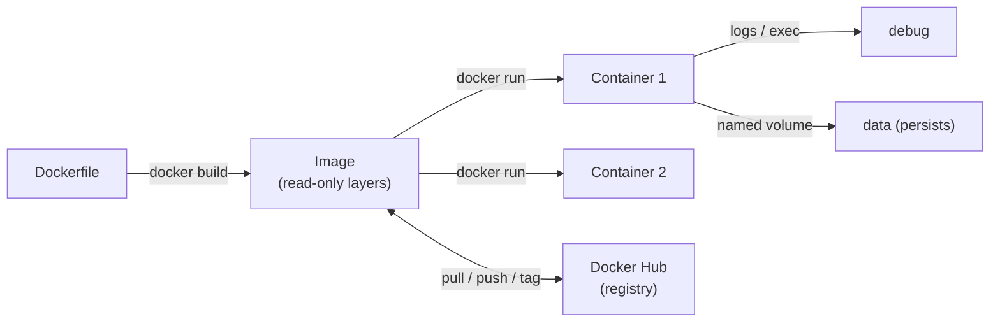

# Day 15: Docker Fundamentals
📚 Topic 15: Containers Deep Dive — Fundamentals, Dockerfile & Image Lifecycle
✅ Prerequisite-checklist: (review Day 14 CI/CD mastery if needed)

> Ek line mein: Image = recipe, container = pakki hui dish — ek hi environment, har jagah same result.

## Overview | Parichay

Docker ne DevOps revolution laaya hai - **containers** ke through har environment ek jaisa banta hai. "Meri machine par chal raha hai" waali bahas Docker se khatam. Aaj hum Docker ke basics detail mein seekhenge.

Socho ghar badal rahe ho — har baar samaan naya set karna headache hai. Container wahi: app + saari dependencies (Python, libraries, config) ek **dibbe** me packed, jo kisi bhi machine pe bina change chala jata hai. Docker do superpowers deta hai: **isolation** (process-level, VM jaisa heavy nahi) aur **portability** (ek baar image banao, kahin bhi chale).

Dockerfile se **Image** banta hai (read-only blueprint), `docker run` se **Container** (chalta hua instance). Har image layers ka stack hai, har container upar ek writable layer daalta hai. Volumes se data survive karta hai, user-defined network me container ka naam hi DNS ban jata hai.

### Container vs VM — halka kyun hai

VM me har instance ka **apna OS** (full guest OS) hota hai — isliye heavy + slow boot. Container me **host ka kernel share** hota hai, sirf app + uski dependencies pack hoti hain — isliye MBs me, seconds me boot. Kernel share karne ka margin hai: container utna isolated **nahi** hai jitna VM (isliye prod me bhi root, seccomp, user-namespaces jaisi hardening chahiye, Day 17/36). Mental model: **VM = naya ghar+kitchen+rozguzar; container = same building me alag flat.**

### Image vs Container — recipe vs pakki hui dish

- **Image** = read-only **blueprint**: app + runtime + config, immutable recipe. Ek image se **kitne bhi** containers banao.
- **Container** = image + upar ek **writable layer** — running instance, jisme files badal sakti hain; delete karte hi writable layer bhi chali jaati hai (data khatam).
- **Registry** (Docker Hub) = recipe book ki library — `pull` doosri recipe lo, `push` apni recipe share karo.

### Layers & caching — build fast/slow ka raaz

Har Dockerfile instruction (`FROM`, `RUN`, `COPY`) ek **layer** banata hai. Docker har layer cache karta hai — agar koi layer pehle ban chuki hai to use **reuse** karta hai. Isliye order matter karta hai: **changing cheezein last** rakho. `COPY requirements.txt .` + `RUN pip install` pehle (deps kam badalti hain), phir `COPY . .` (code baad). Yehi trick CI me build time 60% ghatati hai. `docker history image` se layers dekho.

### `docker run` ke real flags — dimag me rakho

- `-d` = detach (background), `-it` = interactive terminal (`exec -it bash` me)
- `-p 5000:5000` = host port : container port
- `--name` = label (samajhne ke liye)
- `--restart unless-stopped` = prod ka saviour — crash pe auto-restart, manual stop pe nahi
- Exit codes decode: **0** = clean exit, **137** = OOMKilled (out of memory), **143** = SIGTERM (128 + signal)

### Debugging flow — logs/ps/exec/inspect

```
docker ps -a        → dead containers bhi (pahla step!)
docker logs -f web  → app ka stdout/stderr
docker exec -it web bash  → andar jao, ls/curl karo
docker inspect web  → JSON detail (health, network, mounts)
docker stats        → live CPU/RAM per container
```
`docker ps -a` me container missing/gone dikhta hai — isi se >50% issues catch ho jaate hain.

### Volumes vs bind mounts — data kahan aur kyun

- **Named volume** (`-v mydata:/app/data`) = Docker managed, safe, **container delete pe bhi bachta hai** — real data ke liye.
- **Bind mount** (`-v $(pwd):/app`) = host folder siddha — dev hot-reload ke liye, prod me rarely.
- Break hota hai kyun: container **stateless** rakhna hai — DB/cache ke data hamesha volume me, phir container `rm` karke naya `run` kar sakte ho bina kuch khoye.

### Networking — container name hi DNS hai

Default bridge me containers IP se connect hote hain (IP badal jata hai!). **User-defined network** me container ka **naam hi hostname** ban jata hai — code me `localhost` nahi, `db` likho. `docker network create mynet` → dono containers usi pe → `getent hosts db` = IP. Multi-container apps ka yehi design ka heart hai (kal compose).

---

## What You'll Learn | Aaj Ki Seekh

- [ ] Image vs Container — blueprint vs running instance (writable layer)
- [ ] Dockerfile basics — FROM, RUN, COPY, EXPOSE, CMD
- [ ] `docker build` + `docker run` with `-d -p --name`
- [ ] `docker ps` / `logs` / `exec` / `inspect` — dekhna aur debug
- [ ] Layer system + caching — image build fast/slow kyun hota hai
- [ ] Docker Hub — pull, tag, push
- [ ] Volumes vs bind mounts — data persistence
- [ ] User-defined networks — container name = DNS

## Diagram | Dekho Kaise Kaam Karta Hai



ASCII:
```
Dockerfile → build → Image → run → Container (-d -p --name)
   Image     = read-only layers (recipe)   → Docker Hub me store
   Container = image + writable layer      → ps / logs / exec
   Volume    = data image ke bahar          → restart ke baad bhi safe
```

## Demo | Copy-Paste Karke Chalao

```bash
mkdir docker-demo && cd docker-demo

# app: simple Flask
echo "flask==3.1.*" > requirements.txt
cat > app.py << 'EOF'
from flask import Flask
app = Flask(__name__)

@app.route("/")
def home():
    return "Hello Docker!"

@app.route("/health")
def health():
    return "OK"

if __name__ == "__main__":
    app.run(host="0.0.0.0", port=5000)
EOF

# Dockerfile — our recipe
cat > Dockerfile << 'EOF'
FROM python:3.12-slim
WORKDIR /app
COPY requirements.txt .
RUN pip install --no-cache-dir -r requirements.txt
COPY . .
EXPOSE 5000
CMD ["python", "app.py"]
EOF

# build + run
docker build -t myapp:1.0 .
docker run -d -p 5000:5000 --name web myapp:1.0

# verify
curl http://localhost:5000            # "Hello Docker!"
docker ps                             # running containers
docker ps -a                          # stopped bhi dikhte
docker logs --tail 20 web             # app logs
docker exec -it web bash              # andar: ls /app then exit
docker images                         # ~130MB

# persistence: named volume
docker run -d --name web2 -v mydata:/app/data myapp:1.0

# DNS: user-defined network me name hi hostname hai
docker network create mynet
docker run -d --name db --network mynet -e POSTGRES_PASSWORD=pass postgres:16-alpine
docker run -d --name app --network mynet -p 5001:5000 myapp:1.0
docker exec app sh -c "getent hosts db"      # name -> IP resolve ho gaya

# cleanup
docker stop web web2 app db && docker rm web web2 app db
docker system prune -f
```

## Real-Life Example | Industry Me

**E-commerce checkout (production):**
```
Developer push → CI build: docker build -t acme/checkout:v3.1-9f2ab31 . → trivy scan → private registry push
Production host wahi image pull karke chalata hai — dev, QA, prod EXACT same image.
Product `latest` tag in prod? Nahi — unpredictable, rollback mushkil (semver/commit-SHA use hota hai).
```

## Practice Exercise | Abhi Karein

1. Dockerfile + app banao (demo jaisa), `docker build -t myapp:1.0 .`
2. `docker run -d -p 5000:5000 --name web myapp:1.0` → `curl localhost:5000` verify
3. `docker ps -a`, `docker logs -f web`, `docker exec -it web bash` — teeno ka output samjho
4. Volume: container `-v demo-data:/app/data` ke saath chalao, andar file banao, container delete karke naye me data check karo (survive)
5. Network: `docker network create labnet`, postgres + app usi pe, `docker exec app getent hosts db` se resolve
6. Tag+push: `docker tag myapp:1.0 <username>/myapp:1.0` + `docker push` (Docker Hub account)
7. Cleanup: `docker stop $(docker ps -q)` + `docker system prune -f`

## Quick Notes | Yaad Rakho

```
- Image = blueprint (read-only layers); Container = running instance (writable layer)
- 1 image se kitne bhi containers; har container ka apna writable layer
- `-d` detach, `-p host:container` port map, `--name` label, `-it` interactive
- Har Dockerfile instruction ≈ ek layer — unchanged layers cached
- `docker ps -a` me dead containers bhi — troubleshooting ka #1 step
- Exit 0 = clean, 137 = OOMKilled, 143 = SIGTERM (128 + signal)
- Volume = Docker-managed data; Bind mount = host path (dev hot-reload)
- Container delete ho to volume DELETE NAHI hota — `volume rm` alag
- User-defined network me container ka naam hi DNS hai — IP mat yaad rakho
- `latest` tag dev me theek, prod me tag pin (semver ya commit-SHA)
- Restart policy `--restart unless-stopped` prod ke liye recommended
- `docker system prune -a` = nuclear cleanup — carefully!
```

**Agla:** Docker Compose — multi-container apps (app + db + redis) ek YAML se, ek command me.