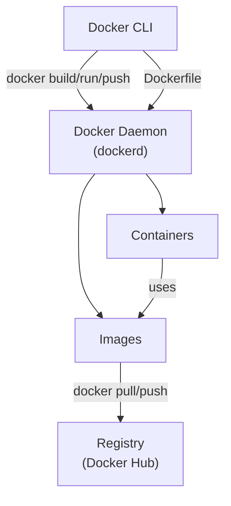
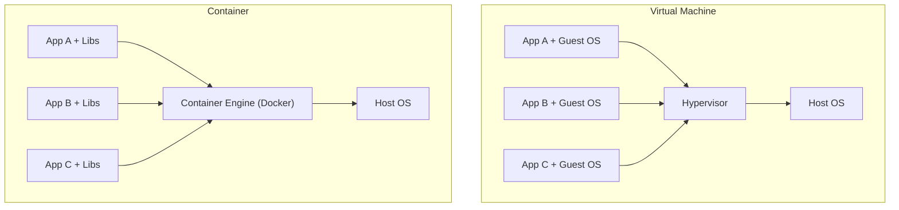

# Day 15: Docker Fundamentals
📚 Topic 15: Containers Deep Dive — Fundamentals, Dockerfile & Image Lifecycle
✅ Prerequisite-checklist: (review Day 14 CI/CD mastery if needed)

## Overview | Parichay

Docker ne DevOps revolution laaya hai - **containers** ke through har environment ek jaisa banta hai. "Meri machine par chal raha hai" waali bahas Docker se khatam. Aaj hum Docker ke basics detail mein seekhenge.

---

## What You'll Learn | Aaj Ki Seekh

- [ ] Docker kya hai aur VM se kaise different hai
- [ ] Docker architecture samajhna - CLI, daemon, images, containers, registry
- [ ] Dockerfile likhna - FROM, RUN, CMD, ENTRYPOINT
- [ ] Docker commands - build, run, ps, logs, exec, stop, rm
- [ ] Container lifecycle samajhna
- [ ] Flask app ko Dockerize karna

---

## Diagram | Dekho Kaise Kaam Karta Hai

### Mermaid - Docker Architecture



### Mermaid - Container vs VM



### Real Image Links

- Docker Architecture: https://docs.docker.com/get-started/docker-overview/#docker-architecture
- Docker Engine Overview: https://docs.docker.com/engine/

---

## Real-Life Example | Zindagi Se

Socho tumhare ghar mein alag-alag kaam ke liye alag-alag **dibbe** (containers) hain - ek dabba kapdon ka, ek dabba khane ka, ek dabba books ka. Har dabbe ka apna size hai, apna content hai, lekin sab ek hi ghar (host machine) mein rehte hain. Dibbe utha ke kahin bhi le ja sakte ho (portability) - ghar badlo ya doosre ghar mein le jaao, dabba waisa hi rahega.

**VM vs Container:** VM jaisa hai ki tumne poora kamra alag bana liya (har kamra mein alag bed, alag TV, alag AC). Container jaisa hai ki ek kamre mein alag-alag dabbe rakh diye - sab ek hi AC, ek hi light use karte hain, halka aur fast.

---

## Basic Concepts Detail Mein

### 1. Container vs Virtual Machine

```
┌─────────────────────────────────────────────────────┐
│  Virtual Machine                                    │
│  ┌───────┐ ┌───────┐ ┌───────┐                      │
│  │ App   │ │ App   │ │ App   │                      │
│  │ Guest │ │ Guest │ │ Guest │   Each has OWN OS    │
│  │  OS   │ │  OS   │ │  OS   │   (bhari)            │
│  └───────┘ └───────┘ └───────┘                      │
│  ┌──────────────────────────────────────────────┐  │
│  │           Hypervisor                         │  │
│  └──────────────────────────────────────────────┘  │
│  ┌──────────────────────────────────────────────┐  │
│  │              Host OS                         │  │
│  └──────────────────────────────────────────────┘  │
└─────────────────────────────────────────────────────┘

┌─────────────────────────────────────────────────────┐
│  Container                                          │
│  ┌───────┐ ┌───────┐ ┌───────┐                      │
│  │ App   │ │ App   │ │ App   │   Share HOST OS      │
│  │ libs  │ │ libs  │ │ libs  │   (halka, fast)      │
│  └───────┘ └───────┘ └───────┘                      │
│  ┌──────────────────────────────────────────────┐  │
│  │              Container Engine (Docker)       │  │
│  └──────────────────────────────────────────────┘  │
│  ┌──────────────────────────────────────────────┐  │
│  │              Host OS                         │  │
│  └──────────────────────────────────────────────┘  │
└─────────────────────────────────────────────────────┘
```

**Difference:**
| Feature | VM | Container |
|---------|-----|-----------|
| OS per unit | Alag-alag OS | Host OS share |
| Size | GBs | MBs |
| Boot time | Minutes | Seconds |
| Resource use | High | Low |
| Isolation | Strong | Medium |

### 2. Docker Architecture

```
┌──────────────────────┐
│   Docker CLI         │  ← aap yahan type karte ho
└──────────┬───────────┘
           │
┌──────────▼───────────┐
│  Docker Daemon       │  ← server jo kaam karta hai
└──────────┬───────────┘
           │
   ┌───────┴────────┐
   │ Images (blueprint)│
   └───────┬────────┘
           │
   ┌───────▼────────┐
   │   Containers   │  ← running images
   └────────────────┘
           │
   ┌───────▼────────┐
   │  Registries    │  ← image store (Docker Hub)
   └────────────────┘
```

- **Image:** Blueprint/template (read-only) - recipe jaisa
- **Container:** Image ka running instance - pakka hua khana
- **Registry:** Image store karna (Docker Hub)
- **Dockerfile:** Image banaane ki recipe (instructions)

### 3. Dockerfile Instructions (Core)

```dockerfile
FROM python:3.11-slim    # Base image choose (zaroori, pehli line)
WORKDIR /app             # Working directory banake set karo
COPY . .                 # Files copy karo (source destination)
RUN pip install -r requirements.txt   # Build ke time command
EXPOSE 5000              # Port document
CMD ["python", "app.py"] # Container start par command (container run hone par)
```

**FROM / RUN / CMD / ENTRYPOINT difference:**
- **FROM:** Image kis base par banegi (mandatory)
- **RUN:** Build ke time chalta hai (layer banata hai)
- **CMD:** Container start par default command (override ho sakta hai)
- **ENTRYPOINT:** Container start par command (override nahi ho sakta easily)

**CMD vs ENTRYPOINT:**
```dockerfile
CMD ["python", "app.py"]          # docker run image → python app.py
CMD ["python", "app.py"]          # docker run image argu → argu overrides
ENTERPOINT ["python"]             # hamesha python chale
CMD ["app.py"]                    # iska default arg
```

### 4. Core Docker Commands

```bash
# Build
docker build -t myapp:1.0 .     # image banao
docker build -f Dockerfile.dev -t myapp:dev .  # custom dockerfile

# Images
docker images            # list images
docker rmi myapp         # delete image
docker system prune      # clean unused

# Containers
docker run -d -p 5000:5000 --name myapp myapp:1.0  # -d backgourn, -p port
docker run -it ubuntu bash    # interactive shell
docker ps                 # running containers
docker ps -a              # saare (stopped bhi)
docker stop myapp         # stop
docker start myapp        # start stopped
docker restart myapp      # restart
docker rm myapp           # delete container

# Logs & exec
docker logs myapp         # logs dekho
docker logs -f myapp      # follow (live)
docker exec -it myapp bash  # andar jaao
docker top myapp          # processes

# Networking & volumes
docker port myapp         # ports
docker network ls
docker volume ls
```

### 5. Container Lifecycle

```
docker build ──► Image
                  │
              docker run
                  ▼
             Container (Running)
                  │
              docker stop
                  ▼
             Container (Stopped)
                  │
              docker start
                  ▼
             Container (Running)
                  │
              docker rm
                  ▼
               Deleted
```

---

## Demo | Copy-Paste Karke Chalao

### Step 1: Flask App Banao

```bash
# Folder banao
mkdir docker-demo && cd docker-demo

# app.py banao
cat > app.py << 'EOF'
from flask import Flask
app = Flask(__name__)
@app.route('/')
def home():
    return "Hello Docker! Ye container se chal raha hai!"
@app.route('/health')
def health():
    return "OK"
if __name__ == '__main__':
    app.run(host='0.0.0.0', port=5000)
EOF

# requirements.txt banao
cat > requirements.txt << 'EOF'
flask==3.0.0
EOF
```

### Step 2: Dockerfile Banao

```bash
cat > Dockerfile << 'EOF'
FROM python:3.11-slim
WORKDIR /app
COPY requirements.txt .
RUN pip install --no-cache-dir -r requirements.txt
COPY . .
EXPOSE 5000
CMD ["python", "app.py"]
EOF
```

### Step 3: Build aur Run

```bash
# Image build karo
docker build -t flask-demo:1.0 .

# Check karo kitni badi image bani
docker images flask-demo

# Container run karo (background mein)
docker run -d -p 5000:5000 --name myflask flask-demo:1.0

# Browser mein jaao: http://localhost:5000

# Logs dekho
docker logs myflask

# Container ke andar jaao
docker exec -it myflask bash

# Container band karo aur delete
docker stop myflask
docker rm myflask

# Image delete
docker rmi flask-demo:1.0
```

---

## Practice Exercise | Abhi Karein

**Dockerize Flask App:**

```python
# app.py
from flask import Flask
app = Flask(__name__)
@app.route('/')
def home(): return "Hello Docker!"
if __name__ == '__main__':
    app.run(host='0.0.0.0', port=5000)
```

```dockerfile
# Dockerfile
FROM python:3.11-slim
WORKDIR /app
COPY requirements.txt .
RUN pip install -r requirements.txt
COPY . .
EXPOSE 5000
CMD ["python", "app.py"]
```

```bash
# requirements.txt
flask==3.0.0
```

**Tasks:**
1. Files banao
2. `docker build -t devops-demo .`
3. `docker run -p 5000:5000 devops-demo`
4. Browser mein http://localhost:5000
5. Try: `docker logs`, `docker exec -it`, `docker stop`, `docker rm`
6. Cleanup: `docker rmi`

---

## Quick Notes | Yaad Rakho

```
- Image = blueprint, Container = running
- Dockerfile: FROM → WORKDIR → COPY → RUN → CMD
- docker build → run → ps → logs → stop → rm
- -d background, -p port map, -it interactive
- RUN = build time, CMD = run time
```

---

**Kal:** Docker Compose - multi-container apps.
