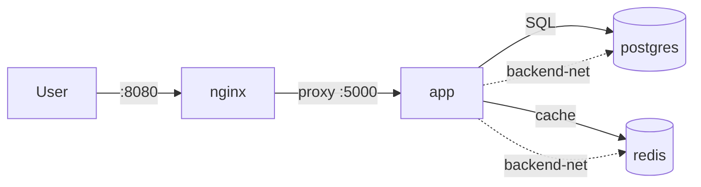

# Day 16: Docker Compose & Multi-Container Apps
📚 Topic 16: Containers Deep Dive — Multi-Container Apps & Docker Compose
✅ Prerequisite-checklist: (review Day 15 Docker Fundamentals if needed)

> Ek line mein: Compose = jaadu ki chhadi — ek YAML file se poora stack (app + db + redis + nginx) ek command me chal jaata hai.

## Overview | Parichay

Real-world app sirf ek container se nahi chalti - usmein backend, database, cache, webserver sab hote hain. **Docker Compose** ek YAML file se poora multi-container app define aur run karta hai.

Socho ek band ka conductor ho jo saare instruments ek saath bajaye. `docker run` = har instrument alag bajana; `docker compose up` = conductor ki baat — poora orchestra ek saath. Har service ka **naam hi DNS hostname** ban jata hai — code me `localhost` ki jagah `postgres` likho, IP ki koi tension nahi.

### Compose kya solve karta hai — without vs with

Bina Compose: 10+ `docker run` commands yaad rakhni + har baar correct flags (`--network`, `-v`, `-p`, `-e`). Ek bhooli flag = broken setup. With Compose: **poora stack ek `compose.yml` me** declared — service list, networks, volumes, env, depends. `docker compose up -d` = sab ek saath. Bonus: composition **code hai** → Git me version, review, reuse (jaise IaC ka chhota version, Day 22 me full).

### `compose.yml` ke core blocks

| Block | Kya rokhta hai |
|-------|----------------|
| `services:` | Har container ka definition (image/build, ports, env, volumes, networks) |
| `networks:` | Isolated networks — `frontend` (nginx+app), `backend` (app+db+redis) |
| `volumes:` | Named volumes jo container restart/down pe bhi data rakhein |

Har service ko `services:` ke neeche define karo; network/volume names bash top-level blocks me.

### Startup order — `depends_on` ka pura sach

`depends_on` plain sirf **ordering** guarantee karta hai (db container pehle start hoga), ready hone ka nahi. Real "db up hua ya nahi" ke liye **healthcheck + `condition: service_healthy`** chahiye:

```yaml
db:
  image: postgres:16-alpine
  healthcheck:
    test: ["CMD-SHELL", "pg_isready -U app_user"]
    interval: 10s
app:
  depends_on:
    db: { condition: service_healthy }
```
Ye pattern prod me race-condition startup bugs khatam karta hai — app kabhi bhi db ke ready hone se pehle connect nahi karegi.

### Env vars — config code se alag

- `environment:` — service specific, YAML me (dev ke liye)
- `env_file:` — `.env` se saare vars load
- `${DB_PASSWORD}` — host/`.env` se **interpolation** (secret ke liye — `.env` ko Git se bahar rakhna, `.gitignore` me daalo)
- `secrets:` — sensitive file mount (Compose secrets)
Real rule: **code me secret kabhi nahi** — compose/docker me inject hota hai, CI/CD me Vault/crypted store se.

### Ports + DNS — connectivity ka logic

`ports: ["8080:80"]` = **host 8080 → container 80** (bahar se access). Andar, services ek dusre ko **service name se** milte hain: app se `redis` hostname — `localhost` kabhi use mat karo (dusra container nahi milta, khud hi dhundho). `docker compose config` debug ka gold — resolved + merged YAML dikhata hai (interpolation ke baad).

### Data ka hisaab — aage wali seekh

`docker compose down` = containers stop (named volumes **bachte hain**). `docker compose down -v` = volumes bhi delete → **DATA LOSS** (sirf lab me!). Prod/backup wali cheez kabhi -v se na chalao. Aur yaad rakho: **Compose single-host** ke liye hai — multi-node, auto-scaling, self-healing ke liye Kubernetes hai (Day 18 onwards).

---

## What You'll Learn | Aaj Ki Seekh

- [ ] `compose.yml` structure — services, networks, volumes
- [ ] Multi-container: app + db + redis + nginx ek saath
- [ ] `docker compose up -d` — poora stack ek command me
- [ ] `depends_on` + `condition: service_healthy` — startup order
- [ ] Env vars — `environment`, `env_file`, `${VAR}` interpolation
- [ ] Ports mapping — `"8080:80"` (host:container)
- [ ] Named volumes + custom networks — persistence aur isolation
- [ ] Debug — `compose ps` / `logs -f` / `exec` / `config`

## Diagram | Dekho Kaise Kaam Karta Hai



ASCII:
```
Browser → nginx → app → postgres + redis
compose.yml = poora stack ek file me
up -d = sab ek saath; service naam hi DNS hai
```

## Demo | Copy-Paste Karke Chalao

`compose.yml` (app + db + redis + nginx):

```yaml
services:
  web:
    image: nginx:alpine
    ports: ["8080:80"]
    volumes: ["./website:/usr/share/nginx/html"]
    networks: [frontend]
  app:
    build: ./app
    ports: ["5000:5000"]
    environment:
      DB_HOST: db
    env_file: [.env]
    depends_on:
      db: { condition: service_healthy }
      redis: { condition: service_healthy }
    healthcheck:
      test: ["CMD", "curl", "-f", "http://localhost:5000/health"]
      interval: 30s
      timeout: 5s
      retries: 3
    networks: [frontend, backend]
  db:
    image: postgres:16-alpine
    environment:
      POSTGRES_USER: app_user
      POSTGRES_PASSWORD: ${DB_PASSWORD}
    volumes: [pgdata:/var/lib/postgresql/data]
    healthcheck:
      test: ["CMD-SHELL", "pg_isready -U app_user"]
      interval: 10s
      retries: 5
    networks: [backend]
  redis:
    image: redis:7-alpine
    command: redis-server --maxmemory 128mb
    volumes: [redisdata:/data]
    healthcheck:
      test: ["CMD", "redis-cli", "ping"]
      interval: 10s
      retries: 5
    networks: [backend]
networks:
  frontend:
  backend:
volumes:
  pgdata:
  redisdata:
```

`.env` + commands:

```bash
DB_PASSWORD=supersecret123            # repo me commit mat karna!

docker compose up -d --build          # stack start
docker compose ps                     # status
curl http://localhost:8080            # nginx frontend
docker compose exec app getent hosts db    # service name = DNS
docker compose logs --tail 20 app && docker compose config
docker compose down                   # stop — data survives (named volumes)
docker compose down -v                # !! volumes delete = DATA LOSS (sirf lab)
```

## Real-Life Example | Industry Me

**Startup e-commerce (single VM production):**
```
nginx (LB + static) → app replicas → postgres + redis
CI me docker compose build → push registry; rollout: compose pull + up -d (almost zero downtime)
Backup: pgdata nightly snapshot; scale test: up -d --scale app=3
Compose single-host ke liye; multi-node ke liye K8s hai (Day 18 se)
```

## Practice Exercise | Abhi Karein

1. `mkdir compose-lab && cd compose-lab`; `mkdir app website`; `echo '<h1>Frontend</h1>' > website/index.html`
2. `app/` me Flask app (REDIS_HOST/DB_HOST env, `/health`), requirements + Dockerfile (Day 15 pattern)
3. Upar wala `compose.yml` + `.env` banao → `docker compose up -d --build`; `compose ps` me charo healthy
4. Verify: `curl localhost:8080`, `curl localhost:5000/health`, `docker compose exec app getent hosts db`
5. `docker compose down` + `up -d` (data bacha) vs `down -v` (data gaya) — fark samjho; `logs -f --tail 50 app` se startup flow dekho
6. Cleanup: `docker compose down --remove-orphans`

## Quick Notes | Yaad Rakho

```
- Compose = full stack ek YAML me; 2026 me `docker compose` (plugin), `docker-compose` deprecated
- Service ka naam hi hostname hai — `DB_HOST=postgres`, kabhi `localhost` nahi
- `depends_on` plain = sirf order; `condition: service_healthy` = ready hone tak wait
- Env: `environment:` / `env_file:` / `secrets:` / `${VAR}` (`.env`)
- Ports hamesha `"host:container"` — `"8080:80"` = host 8080 → container 80
- Named volumes `down` ke baad bhi data rakhte hain; `down -v` = DATA LOSS; custom networks = tier isolation (frontend/backend)
- `docker compose config` = resolved YAML — debugging ka gold
- Debug order: `ps` → `logs -f <svc>` → `exec <svc> bash`
- Healthcheck service me lagaoge to hi `service_healthy` kaam karega; `--scale app=5` = load test
```

**Agla:** Image optimization & security — multi-stage, `.dockerignore`, Trivy.