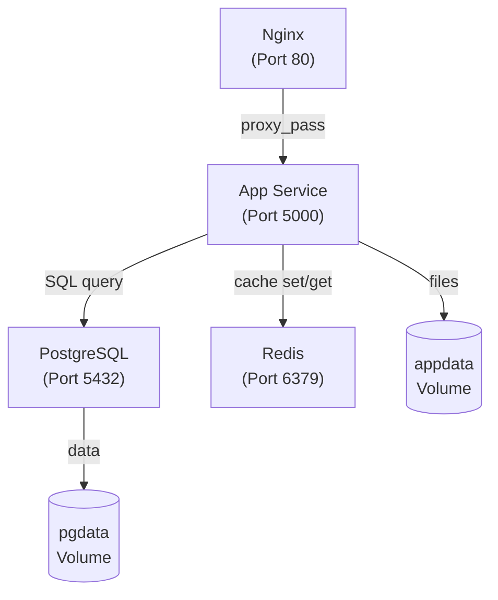

# Day 16: Docker Compose & Multi-Container Apps
📚 Topic 16: Containers Deep Dive — Multi-Container Apps & Docker Compose
✅ Prerequisite-checklist: (review Day 15 Docker Fundamentals if needed)

## Overview | Parichay

Real-world app sirf ek container se nahi chalti - usmein backend, database, cache, webserver sab hote hain. **Docker Compose** ek YAML file se poora multi-container app define aur run karta hai.

---

## What You'll Learn | Aaj Ki Seekh

- [ ] Docker Compose kya hai aur kyun zaroori hai
- [ ] docker-compose.yml structure samajhna - services, volumes, networks
- [ ] Compose commands - up, down, ps, logs, exec, build
- [ ] Containers ke beech networking aur DNS
- [ ] Volumes se data persistence karna
- [ ] Environment variables aur .env files manage karna

---

## Diagram | Dekho Kaise Kaam Karta Hai

### Mermaid - Docker Compose Services Network



### Real Image Links

- Docker Compose Overview: https://docs.docker.com/compose/
- Compose File Specification: https://docs.docker.com/compose/compose-file/

---

## Real-Life Example | Zindagi Se

Docker Compose ek **restaurant ka kitchen** jaisa hai. Socho ek restaurant mein:
- **Chef (App Service)** khana banata hai
- **Fridge (Database)** mein ingredients store hain
- **Spice Rack (Redis)** mein ready-made masale hain
- **Waiter (Nginx)** customer se baat karta hai

Docker Compose ek **recipe card** jaisa hai jo batata hai ki kitne chef chahiye, kitna fridge chahiye, kitna spice rack chahiye - aur ek command se poora kitchen setup ho jata hai. `docker compose up` = kitchen start, `docker compose down` = kitchen band.

---

## Basic Concepts Detail Mein

### 1. Docker Compose Kya Hai?

Compose ek tool jo `docker-compose.yml` file se multiple containers ek saath manage karta hai:
- Saare **services** ek file mein define
- Ek command se sab up/down
- App ki **infrastructure as a file** (versioned!)

### 2. docker-compose.yml Structure

```yaml
version: '3.8'                # file format version

services:                     # saare containers
  app:                        # service ka naam
    build: ./app              # yahan se image build
    image: myapp:1.0          # use prebuilt image
    ports:
      - "5000:5000"          # host:container
    environment:              # env vars
      - DATABASE_URL=postgresql://user:pass@db:5432/app
    env_file:                 # ya file se env
      - .env
    depends_on:               # pehle ye chalao
      - db
    volumes:
      - ./data:/app/data      # folder mount
      - appdata:/app/data     # named volume

  db:                         # database service
    image: postgres:15-alpine
    environment:
      POSTGRES_USER: user
      POSTGRES_PASSWORD: pass
      POSTGRES_DB: app
    volumes:
      - pgdata:/var/lib/postgresql/data

  redis:
    image: redis:7-alpine
    ports:
      - "6379:6379"

volumes:                      # named volumes (persistent)
  pgdata:
  appdata:

networks:                     # custom networks (optional)
  default:
    driver: bridge
```

### 3. Compose Commands

```bash
docker compose up               # build + start (foreground)
docker compose up -d            # background
docker compose down             # stop + remove containers
docker compose down -v          # + volumes delete (careful)
docker compose ps               # status
docker compose logs -f app      # service logs
docker compose build            # only build images
docker compose pull             # pull images
docker compose restart app      # restart ek service
docker compose exec app bash    # andar jao app service mein
docker compose config           # validate file
```

### 4. Networking Between Containers

`docker-compose.yml` mein har service ka naam **DNS** ki tarah kaam karta hai:
- App `db` naam se database se baat karta hai (IP nahi!)
- `DATABASE_URL=postgresql://...@db:5432/...`
- Compose ek automatic network banata hai jo saare services connect karta hai

### 5. Volumes - Data Persistence

**3 types:**
```
Named volume   - docker volume create → reuse multiple containers
Bind mount     - host folder se link (./data:/app/data)
tmpfs          - memory mein (temporary)
```

**Kyun zaroori:** Container delete par data bhi delete ho jata hai! Volume data ko host/machine par store karta hai.

**Careful:** `docker compose down -v` named volumes delete karta hai!

### 6. Environment Configuration

```yaml
# .env file (root) - secrets ke liye nahi (gitignore mein)
POSTGRES_USER=user
POSTGRES_PASSWORD=secretpass
APP_PORT=5000
```

```yaml
# Use in docker-compose.yml
ports:
  - "${APP_PORT}:5000"
```

### 7. Profiles & Overrides (Advanced)

```yaml
# docker-compose.prod.yml - production overrides
services:
  app:
    restart: always
    environment:
      - NODE_ENV=production
```
```bash
docker-compose -f docker-compose.yml -f docker-compose.prod.yml up -d
```

---

## Demo | Copy-Paste Karke Chalao

### Step 1: Project Folder Banao

```bash
mkdir compose-demo && cd compose-demo
mkdir -p app
```

### Step 2: Flask App Banao

```bash
cat > app/app.py << 'EOF'
from flask import Flask
import os
app = Flask(__name__)
@app.route('/')
def home():
    return "Multi-Container App Running!"
@app.route('/health')
def health():
    return "OK"
if __name__ == '__main__':
    app.run(host='0.0.0.0', port=5000)
EOF

cat > app/requirements.txt << 'EOF'
flask==3.0.0
EOF

cat > app/Dockerfile << 'EOF'
FROM python:3.11-slim
WORKDIR /app
COPY requirements.txt .
RUN pip install --no-cache-dir -r requirements.txt
COPY . .
EXPOSE 5000
CMD ["python", "app.py"]
EOF
```

### Step 3: docker-compose.yml Banao

```bash
cat > docker-compose.yml << 'EOF'
version: '3.8'

services:
  app:
    build: ./app
    ports:
      - "5000:5000"
    environment:
      - DATABASE_URL=postgresql://user:pass@db:5432/myapp
      - REDIS_URL=redis://redis:6379/0
    depends_on:
      - db
      - redis

  db:
    image: postgres:15-alpine
    environment:
      POSTGRES_USER: user
      POSTGRES_PASSWORD: pass
      POSTGRES_DB: myapp
    volumes:
      - pgdata:/var/lib/postgresql/data

  redis:
    image: redis:7-alpine
    ports:
      - "6379:6379"

volumes:
  pgdata:
EOF
```

### Step 4: Chalao aur Test Karo

```bash
# Sab services up karo (background mein)
docker compose up -d

# Status check karo
docker compose ps

# Logs dekho
docker compose logs -f app

# App ke andar jaao
docker compose exec app bash

# Service restart karo
docker compose restart db

# Cleanup
docker compose down -v
```

---

## Practice Exercise | Abhi Karein

**Full Stack App (3+ services):**

```yaml
version: '3.8'
services:
  app:
    build: ./app
    ports: ["5000:5000"]
    environment:
      - DATABASE_URL=postgresql://user:pass@db:5432/myapp
      - REDIS_URL=redis://redis:6379/0
    depends_on: [db, redis]

  db:
    image: postgres:15-alpine
    environment:
      POSTGRES_USER: user
      POSTGRES_PASSWORD: pass
      POSTGRES_DB: myapp
    volumes: [pgdata:/var/lib/postgresql/data]

  redis:
    image: redis:7-alpine
    ports: ["6379:6379"]

  nginx:
    image: nginx:alpine
    ports: ["80:80"]
    volumes:
      - ./nginx.conf:/etc/nginx/nginx.conf
    depends_on: [app]

volumes:
  pgdata:
```

**Tasks:**
1. App banao jo db aur redis se connect kare
2. `docker compose up -d`
3. `docker compose ps`, `docker compose logs -f app`
4. Sab services ke beech communication test karo
5. Redis caching add karo
6. `docker compose down -v` cleanup

---

## Quick Notes | Yaad Rakho

```
- docker-compose.yml = multi-container app as code
- services = containers, volume = persistence
- Service naam = DNS (app ↔ db)
- up -d start, down -v destroy (including volume!)
- depends_on = order guarantee
```

---

**Kal:** Image optimization aur security.
