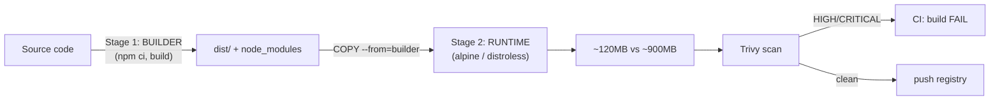

# Day 17: Container Images & Optimization
📚 Topic 17: Container Security & Optimization — Multi-stage Builds, Hardening & Scanning
✅ Prerequisite-checklist: (review Day 16 Docker Compose if needed)

> Ek line mein: Chhoti image = fast deploy + kam attack surface — multi-stage builds, `.dockerignore`, layer caching aur Trivy scan se optimize.

## Overview | Parichay

Badhi images = slow deploy + waste + security risk. Aaj hum **chote, fast, secure images** banate seekhenge - multi-stage builds, .dockerignore, base image choice, aur security scanning.

Socho building contractor — wo delivery pe poora cement-grill nahi le jata, sirf finished furniture. Multi-stage build yahi karta hai: **builder stage** me compiler/npm hota hai (kachcha maal), **runtime stage** me sirf final artifacts copy hote hain. Isse 900MB image 120MB ho jati hai aur build tools (attack surface) image me nahi rehte.

Tools aaj ke: **layer caching** (deps pehle COPY, code baad), **`.dockerignore`** (1GB context → 2MB), **base image** (alpine/slim/distroless), **non-root user + read-only filesystem**, aur **Trivy** CVE scanning jo CI me gate ban jata hai — HIGH/CRITICAL mili to build fail.

### Image size kyun matter karti hai

Chhoti image = **fast push/pull** (CI speed), **fast deploy/rollout** (k8s pod start), **kam storage+network cost**, aur sabse badi baat: **kam attack surface**. Attackers ke paas image me utne hi tools honge jitne resolved. Build tools (compiler, npm, package manager) ko runtime image me rakhna = hacker ke liye "welcome kit" bhejna.

### Multi-stage build — heavy builder, halka runtime

```
# Stage 1: BUILDER — kachcha maal (compiler/npm + sources)
FROM node:20 AS builder
WORKDIR /app
COPY package*.json .
RUN npm ci
COPY . .
RUN npm run build          # → dist/ ready

# Stage 2: RUNTIME — sirf final artifacts + minimal runtime
FROM node:20-slim
WORKDIR /app
COPY --from=builder /app/dist ./dist
RUN useradd -u 1001 appuser
USER appuser                # non-root!
EXPOSE 3000
CMD ["node", "serve.js"]
```
Result: 900MB → ~120MB, aur **build tools image me nahi** — dono fayde. Interview me "image optimize kyu/kaise" ka standard answer yehi hai.

### `.dockerignore` — build context ka diet

Docker context (build ke andar bheja gaya folder) default pure folder hota hai — `.git`, `node_modules`, logs, `.env` sab chale jaate hain (huge + secret leak risk!). `.dockerignore` use karke bina assets exclude karo:

```
node_modules
.git
.env
*.log
dist
.DS_Store
```
1GB context → 2MB — faster build + clean cache.

### Base image choice — kaunsa lo

| Image | Size | Use kab |
|-------|------|---------|
| `ubuntu`/`debian` | Badhi | General OS, package install |
| `*-slim` | Chhoti | Default — zyadatar apps ke liye |
| `*-alpine` | Bahut chhoti (musl) | Static/simple binaries; native deps me dhyan |
| **distroless** | Minimal | Prod — no shell, no package manager, safest |

Siren rule: `latest` kabhi base banao — **pin exact tag/digest** (`node:20.11.0-bookworm-slim`), kyunki base badalate hi image turant ban sakti hai.

### Non-root + read-only — container hardening

`USER appuser` (non-root) — agar image hack ho, attacker root na mile. `read-only rootfs` (`docker run --read-only`) — process filesystem me kuch likh nahi sakta (attackers ka playground nahi). Logs/output ke liye sirf volumes/open dirs. Ye k8s me pod security context se bhi enforce hota hai. Rule: root-user images = interview red flag.

### Trivy scanning — security gate in CI

```bash
trivy image --severity HIGH,CRITICAL --exit-code 1 --ignore-unfixed myapp:1.0
```
**OS packages** (apt) + **app deps** (npm/pip) ke CVEs scan karta hai. `--exit-code 1` = HIGH/CRITICAL mili to exit 1 → **build fail** (fail-fast). Log4j jaisi incidents ka lesson: images **har build pe** scan karo, warna vulnerability production me dinon tak rukti hai. Yehi gate pattern future verification me `trivy image` se pakda jayega.

---

## What You'll Learn | Aaj Ki Seekh

- [ ] Multi-stage builds — builder aur runtime stages
- [ ] `.dockerignore` — build context chhota, secrets na jayein
- [ ] Layer caching — order ka jadoo (deps pehle, code baad)
- [ ] Base images — alpine, slim, distroless
- [ ] Non-root `USER` + read-only filesystem
- [ ] Trivy scan — severity filter, `--exit-code 1` CI gate
- [ ] `docker history` / `docker images` — size analysis
- [ ] BuildKit extras — cache mounts, secret mounts

## Diagram | Dekho Kaise Kaam Karta Hai



ASCII:
```
naive:  FROM node:20 + COPY . . + npm ci + build  → ~900MB
multi:  builder(npm ci, build) → runtime(COPY dist) → ~120MB
.dockerignore  → context chhota → build fast + secrets-safe
trivy image --severity HIGH,CRITICAL img → gate in CI
USER nonroot + --read-only + no secrets → secure by default
```

## Demo | Copy-Paste Karke Chalao

```bash
# naive (single-stage) — kabhi prod me nahi
cat > Dockerfile.naive << 'EOF'
FROM node:20
WORKDIR /app
COPY . .
RUN npm ci && npm run build
CMD ["node", "dist/index.js"]
EOF

# multi-stage (optimized)
cat > Dockerfile << 'EOF'
FROM node:20-alpine AS builder
WORKDIR /app
COPY package*.json ./
RUN npm ci
COPY . .
RUN npm run build

FROM node:20-alpine
ENV NODE_ENV=production
WORKDIR /app
COPY --from=builder /app/package*.json ./
COPY --from=builder /app/dist ./dist
RUN npm ci --omit=dev && npm cache clean --force
RUN addgroup -S app && adduser -S app -G app
USER app
EXPOSE 3000
CMD ["node", "dist/index.js"]
EOF

docker build -f Dockerfile.naive -t myapp:naive .
docker build -t myapp:opt .
docker images myapp:naive myapp:opt --format "{{.Size}}"   # ~900MB vs ~120MB
docker history myapp:opt                                   # har layer ka size

cat > .dockerignore << 'EOF'
.git
node_modules
.env
.env.*
*.md
__pycache__
EOF

# scan + non-root verify
trivy image --severity HIGH,CRITICAL myapp:opt             # install: https://trivy.dev
trivy image --exit-code 1 --severity HIGH,CRITICAL myapp:opt   # CI gate
docker run -d -p 3000:3000 --name opt myapp:opt
docker exec opt whoami                                      # "app" — root nahi
```

## Real-Life Example | Industry Me

**Fintech payments (production lesson):**
```
Before: single-stage (from node:20 + full repo) — 1.4GB, pull 2+ min, build tools container ke andar
After: multi-stage + distroless + .dockerignore + Trivy gate:
  image 95MB, pull ~8s, HIGH/CRITICAL CVEs 40 → 0, push fail agar koi HIGH/CRITICAL
  Layer order fix — deps rarely re-run — build ~4x fast
  Base tag pinned (node:20-alpine3.20) → reproducible supply chain
```

## Practice Exercise | Abhi Karein

1. Apna app lo (Day 15/16 wala), naive Dockerfile build karo — size note karo
2. Upar wala multi-stage Dockerfile build karo — `docker images --format "{{.Size}}"` se compare (kam se kam 5-7x chhota)
3. `docker history myapp:opt` se sabse badi layer pakdo aur optimize ka socho
4. `.dockerignore` banao (`.git`, `node_modules`, `.env`) — build time fark dekho
5. Cache test: code change karke rebuild — deps cached rahengi
6. Trivy: `trivy image --severity HIGH,CRITICAL myapp:opt`; koi fixable CVE to base tag upgrade + re-scan
7. Non-root verify: `docker exec opt whoami` → `app`; `--read-only` flag try karo
8. Cleanup: `docker stop opt && docker rm opt && docker system prune -f`

## Quick Notes | Yaad Rakho

```
- Multi-stage: builder me compiler+npm, runtime me sirf artifacts — badi size win
- `COPY --from=builder /app/dist ./dist` — stages ke beech copy
- Layer caching: non-badalte instructions pehle (package.json), badalne wale baad (code)
- `.dockerignore` = `.git`, `node_modules`, `.env`, `*.md` — context se bahar
- Base choice: python-slim / node-alpine / distroless — chhota + hardened
- `USER app` (non-root) = CIS Docker benchmark requirement
- `trivy image --exit-code 1 --severity HIGH,CRITICAL img` = CI fail gate
- `docker history` se layer sizes dekho — optimize ka target
- Alpine me musl libc — kuch binaries glibc expect karti hain (test karo!)
- BuildKit (default 2026): `--mount=type=cache` se npm/pip cache reuse
- Secrets kabhi image me nahi — runtime env / secret manager
- Tag pin karo (`node:20-alpine3.20`), `latest` nahi — supply chain protection
```

**Agla:** Kubernetes fundamentals — containers ab orchestrate honge (minikube, kubectl, pods).