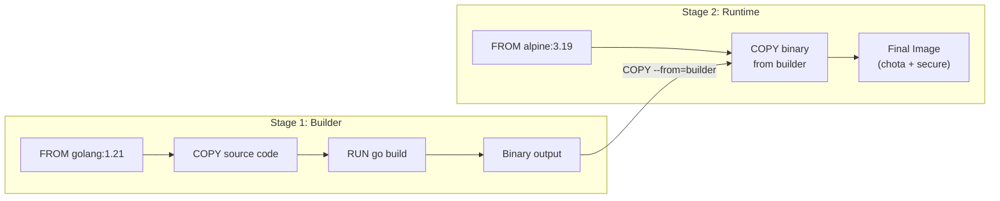
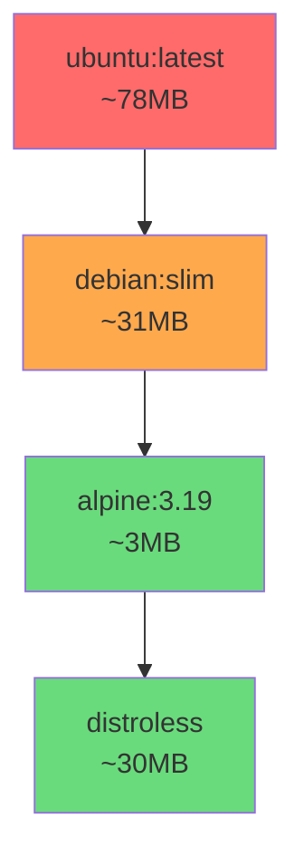

# Day 17: Container Images & Optimization
📚 Topic 17: Container Security & Optimization — Multi-stage Builds, Hardening & Scanning
✅ Prerequisite-checklist: (review Day 16 Docker Compose if needed)

## Overview | Parichay

Badhi images = slow deploy + waste + security risk. Aaj hum **chote, fast, secure images** banate seekhenge - multi-stage builds, .dockerignore, base image choice, aur security scanning.

---

## What You'll Learn | Aaj Ki Seekh

- [ ] Image layers aur caching samajhna
- [ ] Multi-stage builds se image size kam karna
- [ ] Base image choose karna - alpine, slim, distroless
- [ ] .dockerignore file banana
- [ ] Security best practices - non-root user, Trivy scan
- [ ] Image tagging strategy samajhna

---

## Diagram | Dekho Kaise Kaam Karta Hai

### Mermaid - Multi-Stage Build Flowchart



### Mermaid - Image Size Comparison



### Real Image Links

- Dockerfile Best Practices: https://docs.docker.com/develop/develop-images/dockerfile_best-practices/
- Docker Build Cache: https://docs.docker.com/build/cache/

---

## Real-Life Example | Zindagi Se

Multi-stage build ek **restaurant** jaisa hai. Pehle stage mein tumhe poora kitchen chahiye - gas, bartan, masale, sabjiyan (build tools - Go compiler, npm, etc.). Lekin jab khana ban jata hai (binary ready), toh sirf **thali** (final image) chahiye - usmein sirf khana hai, bartan nahi.

Fat image = poora kitchen utha ke le jaa rahe ho (900MB!). Multi-stage = sirf thali le ja rahe ho (120MB!). Kam weight, kam mess, faster delivery.

---

## Basic Concepts Detail Mein

### 1. Image Layers & Caching

Har Dockerfile instruction ek **layer** banata hai. Layers **cache** hote hain - irgar koi line badal jaye, uske baad ki layers rebuild hoti hain.

```dockerfile
FROM python:3.11-slim        # Layer 1 (base)
WORKDIR /app                 # Layer 2
COPY requirements.txt .      # Layer 3 (badal hai agar deps change)
RUN pip install -r req.txt   # Layer 4 (cache nahi if req badle)
COPY . .                     # Layer 5 (hamesha cache miss agar code badle)
CMD ["python", "app.py"]
```

**Cache optimization tip:** Pehle sirf `requirements.txt` copy karo (`COPY requirements.txt .`), install karo, PHIR baaki code copy karo. Isse sirf deps badle par rebuild hota hai - code change par bahut fast.

### 2. Multi-Stage Builds (Big Win)

Multiple `FROM` - artifacts ek stage se doosre mein copy hote hain. Final image choti hoti hai.

```dockerfile
# Stage 1: Build (badi toolss)
FROM golang:1.21 AS builder
WORKDIR /app
COPY go.mod go.sum ./
RUN go mod download
COPY . .
RUN CGO_ENABLED=0 go build -o myapp .

# Stage 2: Runtime (sirf binary, chota)
FROM alpine:3.19
RUN adduser -D appuser
COPY --from=builder /app/myapp /usr/local/bin/myapp
USER appuser
ENTRYPOINT ["myapp"]
```

**Python example:**
```dockerfile
FROM python:3.11-slim AS builder
WORKDIR /app
COPY requirements.txt .
RUN pip install --no-cache-dir --user -r requirements.txt

FROM python:3.11-slim
WORKDIR /app
COPY --from=builder /root/.local /root/.local
COPY . .
ENV PATH=/root/.local/bin:$PATH
ENV PYTHONUNBUFFERED=1
USER 1000
EXPOSE 5000
CMD ["gunicorn", "-w", "4", "-b", "0.0.0.0:5000", "app:app"]
```

**Result:** ~900MB → ~120MB!

### 3. Base Image Size Comparison

| Base | Size | Use |
|------|------|-----|
| ubuntu:latest | ~78MB | Full OS, bhari |
| debian:-bookworm-slim | ~31MB | Balanced |
| alpine:3.19 | ~3MB | Very small (musl, careful deps) |
| python:3.11-slim | ~120MB | Python + slim base |
| distroless | ~30MB | Sirf runtime, no shell (secure!) |

**Naming:** `3.11-slim`, `3.11-alpine`, `3.11` (full) - aur hamesha **tag pin** karo (`python:3.11-slim`, nahi `python:latest`).

### 4. .dockerignore (Important!)

Build context se files **exclude** karta hai (image nahi jaati + build fast):

```
# .dockerignore
.git
node_modules
__pycache__
*.pyc
*.log
.env                # secrets word chahiye!
tests
docs
Dockerfile
docker-compose*.yml
```

### 5. Security Best Practices

- **Don't run as root:** hamesha non-root user banao
  ```dockerfile
  RUN adduser -D appuser
  USER appuser
  ```
- **Pin base image versions** (side-effects se bacho)
- **Scan images:** Trivy, Snyk, Grype
- **Minimal packages:** sirf jo chahiye install karo, remove package lists
- **Multi-stage:** build tools final image mein mat le jaaao
- **Don't leak secrets** in build args/layers

### 6. Security Scanning - Trivy

```bash
# Install
docker pull aquasec/trivy

# Scan local image
docker run --rm -v /var/run/docker.sock:/var/run/docker.sock \
  aquasec/trivy image myapp:latest

# Scann registry image
docker run --rm aquasec/trivy image python:3.11-slim

# Output severity
# CRITICAL, HIGH, MEDIUM, LOW
```

### 7. Image Tagging Strategy

```bash
# Tag strategies
docker tag myapp:latest ghcr.io/org/myapp:1.0.0       # release
docker tag ghcr.io/org/myapp:sha-abc123               # unique commit
docker tag myapp:1.0.0 myapp:stable                    # alias stable

# CI/CD mein
docker build -t ghcr.io/org/myapp:$GITHUB_SHA .
docker tag ghcr.io/org/myapp:$GITHUB_SHA ghcr.io/org/myapp:latest
```

---

## Demo | Copy-Paste Karke Chalao

### Step 1: Fat Image Build Karo (DON'T do this in production)

```bash
mkdir optimize-demo && cd optimize-demo

cat > app.py << 'EOF'
from flask import Flask
app = Flask(__name__)
@app.route('/')
def home():
    return "Optimized Container!"
if __name__ == '__main__':
    app.run(host='0.0.0.0', port=5000)
EOF

cat > requirements.txt << 'EOF'
flask==3.0.0
gunicorn==21.2.0
EOF

# FAT Dockerfile (bad practice)
cat > Dockerfile.fat << 'EOF'
FROM ubuntu:latest
RUN apt-get update && apt-get install -y python3 python3-pip
COPY . /app
WORKDIR /app
RUN pip3 install flask gunicorn
EXPOSE 5000
CMD ["python3", "app.py"]
EOF

# Build fat image
docker build -t myapp:fat -f Dockerfile.fat .
docker images myapp:fat
```

### Step 2: Optimized Multi-Stage Dockerfile

```bash
cat > Dockerfile << 'EOF'
FROM python:3.11-slim AS builder
WORKDIR /app
COPY requirements.txt .
RUN pip install --no-cache-dir --user -r requirements.txt

FROM python:3.11-slim
WORKDIR /app
COPY --from=builder /root/.local /root/.local
COPY . .
ENV PATH=/root/.local/bin:$PATH
ENV PYTHONUNBUFFERED=1
RUN adduser -D appuser
USER appuser
EXPOSE 5000
CMD ["gunicorn", "-w", "4", "-b", "0.0.0.0:5000", "app:app"]
EOF

# .dockerignore banao
cat > .dockerignore << 'EOF'
.git
__pycache__
*.pyc
.env
tests
Dockerfile*
docker-compose*
EOF

# Build optimized image
docker build -t myapp:optimized .
docker images myapp:optimized
```

### Step 3: Compare Sizes aur Trivy Scan

```bash
# Size comparison
echo "=== Image Sizes ==="
docker images --format "table {{.Repository}}\t{{.Tag}}\t{{.Size}}"

# Trivy scan (install first if needed)
docker pull aquasec/trivy

# Fat image scan
docker run --rm -v /var/run/docker.sock:/var/run/docker.sock \
  aquasec/trivy image myapp:fat

# Optimized image scan
docker run --rm -v /var/run/docker.sock:/var/run/docker.sock \
  aquasec/trivy image myapp:optimized

# Cleanup
docker rmi myapp:fat myapp:optimized
```

---

## Practice Exercise | Abhi Karein

```dockerfile
# BEFORE (poora - ~900MB)
FROM ubuntu:latest
RUN apt update && apt install -y python3 python3-pip
COPY . /app
WORKDIR /app
RUN pip3 install flask gunicorn
CMD ["python3", "app.py"]

# AFTER (optimized - ~120MB) - multi-stage + slim
```

**Tasks:**
1. "Bad" image build karo, size note karo
2. Multi-stage version rewrite
3. Compare sizes (`docker images`)
4. `.dockerignore` add karo
5. Trivy se dono scan karo - `docker run --rm -v /var/run/docker.sock:/var/run/docker.sock aquasec/trivy image myapp`
6. Critical vuln fix karo
7. CI mein image scan step add karo

---

## Quick Notes | Yaad Rakho

```
- Layer cache: order smart rakho (deps pehle, code baad)
- Multi-stage = build stage + lean runtime stage
- alpine/slim/distroless = chhote images
- .dockerignore = secrets + junk (must)
- Non-root USER banao
- Trivy scan = security ka baromete
```

---

**Kal:** Kubernetes fundamentals - container orchestration.
