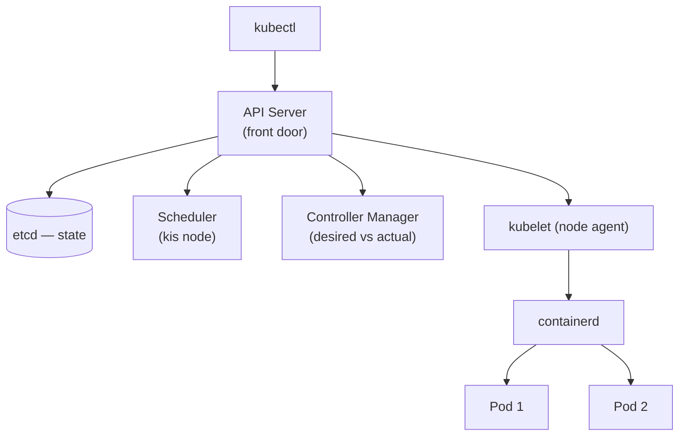

# Day 18: Kubernetes Fundamentals
📚 Topic 18: K8s Deep Dive — Control Plane, Scheduling & Core Resources
✅ Prerequisite-checklist: (review Day 17 Container optimization if needed)

> Ek line mein: K8s = containers ka manager — "desired state" bolo, cluster usse continuously poora karta rahega (scaling, failover, networking, updates khud).

## Overview | Parichay

Containers ek-ek chalane se production manage karna mushkil hai - scaling, failover, networking, updates. **Kubernetes (K8s)** iska answer hai - container orchestration platform.

Socho hotel bada hai, har kamre ka cleaning schedule khud se — chaos. Manager ko "mujhe 3 clean kamre chahiye" bata do, bas. K8s wahi manager hai: `replicas: 3` likho to cluster khud 3 pods rakhta hai — ek pod mare to turant naya. `kubectl` sirf **API Server** (control plane) se baat karta hai, jo decisions leta hai (scheduler), state rakhta hai (etcd), reconcile karta hai (controller-manager). Workers (kubelet) pe asli containers chalti hain.

Aaj: **minikube** (ek-node local cluster) + **kubectl** + core objects — **Namespace** (logical dabbe), **Pod** (smallest unit), YAML manifests (declarative), aur `describe`/`logs`/`exec`/`port-forward` ka troubleshooting flow. Kal Deployments/Services, phir Config/Secrets/Volumes — aaj ka base hai.

### K8s kyun — Docker se aage ka problem

Docker single host ke liye great hai; production me chahiye: **auto-scaling** (traffic badhe to pods barhaye), **self-healing** (pod mari to naya), **load balancing**, **rolling updates**, **multi-node** (VM/cloud instances ka jhund). In sab ko khud implement karna = ek duniya ka kaam. **Kubernetes** exactly yeh karta hai — container orchestration: tum sirf **desired state** batao, wo us state ko continuously maintain karta hai.

### Control Plane vs Workers — brain vs muscles

```
Control Plane (brain):  API Server (sabka receive) · etcd (state database)
                        Scheduler (kaunsi node pe rakho) · Controller Manager (reconcile)
Workers (muscles):      kubelet (har node ka agent) · kube-proxy (networking rules) · container runtime
```
`kubectl` koi direct node se baat NAHI karta — hamesha **API Server** se, jo cluster ka single entry point hai. Etcd dil hai — poori cluster state yahi (desired + actual). Scheduler decide karta hai kaunsi workable node pe pod bana. Yehi architecture bada cloud-managed clusters (EKS/AKS/GKE) me bhi hai.

### Namespace — logical dabbe

**Namespace** resources ko **logically alag** karta hai (confuse mat karo, security isolation nahi hai by default): `default`, `kube-system` (system pods), `kube-public`. Practice: team/app per namespace. Ek aam gotcha — `kubectl get pods` aapke current namespace ke hi dikhata hai; `-A` (all namespaces) ya `-n <ns>` bhoolna = "pod kahan gaya?!" ka classic cause.

### Pod — smallest deployed unit

**Pod** = 1+ containers jo **same network + storage** share karte hain (usually 1 container). Pod koi permanent cheez nahi — **mar bhi sakta hai** (node crash, resource pressure). Isliye pods ko directly manage karna anti-pattern hai; aage **Deployment** se manage hoga. Pod ki identity = **IP**, jo har baar badal jati hai — yehi reason hai ki aage Service object chahiye (stable DNS).

### YAML manifest — declarative approach

K8s me sab resources **YAML (declarative)** me define hote:

```yaml
apiVersion: v1
kind: Pod
metadata:
  name: myapp
  labels: { app: myapp }
spec:
  containers:
    - name: app
      image: nginx:alpine
      ports: [{ containerPort: 80 }]
```
`kind` = resource type, `metadata` = name/labels, `spec` = desired state. `kubectl apply -f pod.yaml` — cluster turant us state ko reconcile karta hai (jaise Terraform, declarative hi pattern hai — Day 22 me dobaara milega).

### Troubleshooting ka flow — kubectl ka toolbox

```
kubectl get pods            → status (Running/ImagePullBackOff/CrashLoopBackOff)
kubectl describe pod x      → events + reasons (80% answers yahi hai)
kubectl logs -f pod x       → app output
kubectl exec -it pod x -- sh  → andar jao, echo/curl karo
kubectl port-forward pod x 8080:80  → local machine se service/pod ko chhedo
kubectl get events -A      → cluster-wide kaun kaun events hua
```
`describe` sabse badi cheez kam hoti hai — ImagePullBackOff/CrashLoopBackOff events uchhar diye. Yehi loop senior har din chalaata hai.

---

## What You'll Learn | Aaj Ki Seekh

- [ ] minikube + kubectl setup aur verify
- [ ] Cluster anatomy — control plane (API server, etcd, scheduler, controller-manager) vs worker (kubelet, kube-proxy, runtime)
- [ ] Namespace — logical dabbe (dev/qa/prod)
- [ ] Pod — smallest schedulable unit (1+ containers)
- [ ] YAML manifests — declarative desired state
- [ ] `kubectl get` / `describe` / `logs` / `exec`
- [ ] `kubectl port-forward` — local se pod tak tunnel
- [ ] Labels & selectors — kaise cheezein milee hain

## Diagram | Dekho Kaise Kaam Karta Hai



ASCII:
```
kubectl → API Server → etcd + scheduler + controller-manager
         → worker → kubelet → containerd → Pods
Pod = smallest unit (1+ containers, shared net)
Namespace = alag-alag dabbe; port-forward = laptop se pod tak private tunnel
```

## Demo | Copy-Paste Karke Chalao

```bash
minikube start --driver=docker          # local single-node cluster
kubectl cluster-info

kubectl get nodes -o wide               # Ready? Runtime? OS?
kubectl create namespace dev
kubectl get namespaces

cat > pod.yaml << 'EOF'
apiVersion: v1
kind: Pod
metadata:
  name: hello-k8s
  namespace: dev
  labels:
    app: hello
spec:
  containers:
  - name: nginx
    image: nginx:alpine
    ports:
    - containerPort: 80
EOF

kubectl apply -f pod.yaml

kubectl get pods -n dev -o wide         # state
kubectl describe pod hello-k8s -n dev   # Events = asli khabar
kubectl logs hello-k8s -n dev
kubectl exec -it hello-k8s -n dev -- sh # ls /usr/share/nginx/html

kubectl port-forward -n dev pod/hello-k8s 8080:80 &
curl http://localhost:8080              # nginx "Welcome"

kubectl label pod hello-k8s tier=frontend -n dev
kubectl get pods -n dev -l app=hello    # selector filter

kubectl delete -f pod.yaml
minikube delete                         # cost = zero
```

## Real-Life Example | Industry Me

**Production microservices (medium company):**
```
3 control-plane + 30 workers (managed AKS/EKS/GKE); namespaces dev/staging/prod — quotas + RBAC alag
1000+ pods daily chalte-bandte; ReplicaSet khud count sambhalta hai
Incident: kubectl describe pod → Events (image pull fail / liveness) — root cause wahan se
kubectl port-forward: engineer bina kisi firewall ke pod ke andar debug karta hai
Mental model har jagah same: kubectl → control plane → workers
```

## Practice Exercise | Abhi Karein

1. `minikube start --driver=docker`; `kubectl cluster-info` + `kubectl get nodes -o wide`
2. `kubectl describe node minikube` padho — Conditions (Ready?), CPU/memory, pods count
3. `kubectl create namespace dev` + `create ns qa`; `kubectl get namespaces`
4. `pod.yaml` likho aur apply karo; `kubectl get pods -n dev -o wide`
5. `kubectl describe pod` me Events section padho (image pull ka proof)
6. `kubectl port-forward -n dev pod/hello-k8s 8080:80` + curl; exec andar jaake dekh ke exit
7. `kubectl label pod hello-k8s tier=frontend -n dev` + `get pods -l tier=frontend` (selector power)
8. `kubectl delete -f pod.yaml`; `minikube delete`

## Quick Notes | Yaad Rakho

```
- kubectl sirf API Server se baat karta hai — nodes se direct kabhi nahi
- Control plane: API server (gatekeeper), etcd (sab state), scheduler, controller-manager
- Worker: kubelet (pod lifecycle), kube-proxy (service IP), containerd (runtime)
- Pod = smallest unit = 1+ containers sharing network; prod me direct pod nahi (Day 19)
- Namespace = vibhag (dev/qa/prod); `kubectl -n dev` se target
- Manifest = apiVersion + kind + metadata + spec — isi order me yaad rakho
- `kubectl apply -f` = declarative (GitOps-friendly); `create` = imperative
- Troubleshoot order: get (state) → describe (Events/reason) → logs (app)
- `kubectl exec -it pod -- sh` andar jaana; `logs --previous` = crashed ka last log
- Labels key-value hain; selectors pods chunte hain — Service ka base
- port-forward = laptop se pod tak private tunnel
- minikube ek-node dev cluster; prod me managed (AKS/EKS/GKE)
```

**Agla:** Deployments & Services — replicas, rolling updates, Service types, probes.