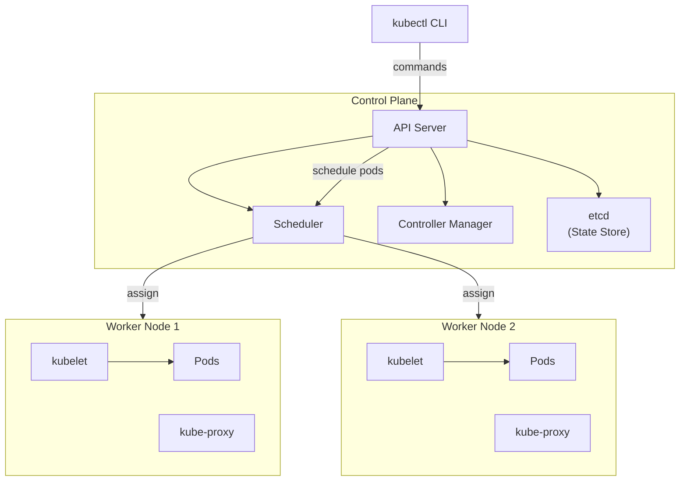
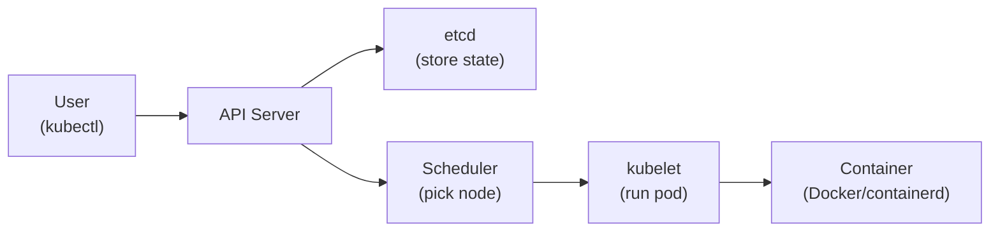

# Day 18: Kubernetes Fundamentals
📚 Topic 18: K8s Deep Dive — Control Plane, Scheduling & Core Resources
✅ Prerequisite-checklist: (review Day 17 Container optimization if needed)

## Overview | Parichay

Containers ek-ek chalane se production manage karna mushkil hai - scaling, failover, networking, updates. **Kubernetes (K8s)** iska answer hai - container orchestration platform.

---

## What You'll Learn | Aaj Ki Seekh

- [ ] Kubernetes kya hai aur kyun zaroori hai
- [ ] K8s architecture samajhna - Control Plane aur Worker Nodes
- [ ] Core objects - Pod, Namespace, Labels
- [ ] kubectl commands - get, describe, logs, exec, apply, delete
- [ ] Imperative vs Declarative approach
- [ ] Minikube se local cluster setup karna

---

## Diagram | Dekho Kaise Kaam Karta Hai

### Mermaid - Kubernetes Architecture



### Mermaid - K8s Control Flow



### Real Image Links

- Kubernetes Architecture: https://kubernetes.io/docs/concepts/overview/components/
- Kubernetes Concepts: https://kubernetes.io/docs/concepts/

---

## Real-Life Example | Zindagi Se

Kubernetes ek **bus conductor** jaisa hai. Socho ek city ki bus:
- **Bus conductor (Scheduler)** decide karta hai kitne log kis bus mein baithenge
- **Bus (Worker Node)** mein alag-alag seats (Pods) hain
- **GPS tracker (etcd)** mein pata hai kitni buses hain, kitne log hain
- **Bus stand (API Server)** se log ticket lete hain (commands dete hain)
- Agar bus kharaab ho jaye (node fail), conductor nayi bus bhej deta hai (self-healing)

Bina conductor ke - buses randomly chalein, log road par khade rahein, koi pata na ho kitni seats khali hain. K8s sab arrange karta hai automatically.

---

## Basic Concepts Detail Mein

### 1. K8s Kya Karta Hai?

Kubernetes containers ko:
- **Deploy** karta hai (kahan chalega soch kar)
- **Scale** karta hai (load ke hisaab se badha/ghata)
- **Self-heal** karta hai (container fail → restart)
- **Rolling update** deta hai (downtime ke bina update)
- **Service discovery** karta hai (containers ek-doosre ko kaise dhoondhein)

### 2. Architecture

```
┌─────────────────────────────────────────────┐
│            Control Plane (Master)           │
│                                             │
│  ┌─────────┐ ┌──────────┐ ┌──────────────┐  │
│  │ API     │ │ Scheduler │ │ Controller   │  │
│  │ Server  │ │           │ │ Manager      │  │
│  └─────────┘ └──────────┘ └──────────────┘  │
│        ┌────────────────────────┐           │
│        │        etcd            │ (state)   │
│        └────────────────────────┘           │
└─────────────────┬───────────────────────────┘
                  │  kubectl (CLI)
┌─────────────────┴───────────────────────────┐
│   Worker Node 1        Worker Node 2        │
│   ┌──────────────┐    ┌──────────────┐      │
│   │ kubelet      │    │ kubelet      │      │
│   │ containers   │    │ containers   │      │
│   │ kube-proxy   │    │ kube-proxy   │      │
│   └──────────────┘    └──────────────┘      │
└─────────────────────────────────────────────┘
```

**Components:**
| Component | Matlab |
|-----------|--------|
| **API Server** | Sab kuch yahan hota hai (front door) |
| **Scheduler** | Kis node par container chalega decide |
| **Controller Manager** | Deshi state maintain (reconcile) |
| **etcd** | State store (key-value DB) |
| **kubelet** | Har node ka agent (containers chalata hai) |
| **kube-proxy** | Networking (proxy) |

### 3. Core Objects

**Namespace:** Cluster ko alag-alag virtual clusters mein divide:
```bash
kubectl get namespaces
kubectl create namespace dev
```

**Pod:** Sabse chhota unit - ek ya multiple containers ek saath (usually 1).

**Label:** Key-value tags se resources select karte hain:
```yaml
metadata:
  labels:
    app: myapp
    tier: frontend
```

**Deployment:** Pods manage karta hai (replicas, rolling update) - production mein direct Pod nahi, Deployment use karte hain.

### 4. Set Up Local K8s

**Minikube:**
```bash
minikube start
kubectl get nodes
```

**kind (Docker-based):**
```bash
kind create cluster
kubectl get nodes
```

### 5. kubectl - The K8s CLI

```bash
kubectl get nodes          # nodes
kubectl get pods           # pods (default ns)
kubectl get pods -A        # all namespaces
kubectl get pods -n dev    # specific ns
kubectl get deploy,svc     # multiple types

kubectl describe pod mypod          # detail dekho
kubectl logs mypod                  # logs
kubectl logs -f mypod --tail=100    # last 100, follow
kubectl exec -it mypod -- bash      # andar jao
kubectl delete pod mypod            # delete

kubectl get all                    # sab resources
kubectl get events                 # events (troubleshoot)
kubectl apply -f file.yaml         # apply config
kubectl delete -f file.yaml        # delete config
```

### 6. Imperative vs Declarative

| Type | Matlab | Example |
|------|--------|---------|
| **Imperative** | "Ye karo" | `kubectl run nginx --image=nginx` |
| **Declarative** | "Ye chahiye" | `kubectl apply -f deployment.yaml` |

**Best practice:** Declarative use karo (YAML files in git = GitOps). Imperative sirf quick test ke liye.

### 7. First Pod

```yaml
# pod.yaml
apiVersion: v1
kind: Pod
metadata:
  name: myapp
  labels:
    app: myapp
spec:
  containers:
  - name: nginx
    image: nginx:alpine
    ports:
    - containerPort: 80
```

```bash
kubectl apply -f pod.yaml
kubectl get pod myapp -o wide
kubectl describe pod myapp    # events dekho
kubectl logs myapp
kubectl port-forward pod/myapp 8080:80   # local access
kubectl delete -f pod.yaml
```

---

## Demo | Copy-Paste Karke Chalao

### Step 1: Local Cluster Start Karo

```bash
# Minikube start karo (Docker driver)
minikube start --driver=docker

# Verify node
kubectl get nodes
kubectl get nodes -o wide

# Cluster info
kubectl cluster-info
```

### Step 2: Nginx Pod Banao aur Explore Karo

```bash
# Ek simple pod banaye (imperative)
kubectl run nginx --image=nginx:alpine --port=80

# Status check
kubectl get pods
kubectl get pods -o wide

# Detailed info + events
kubectl describe pod nginx

# Logs dekho
kubectl logs nginx

# Pod ke andar jaao
kubectl exec -it nginx -- sh

# Port forward (local browser se access)
kubectl port-forward pod/nginx 8080:80 &
curl localhost:8080
```

### Step 3: Declarative Way (YAML se Pod)

```bash
cat > pod.yaml << 'EOF'
apiVersion: v1
kind: Pod
metadata:
  name: myapp
  labels:
    app: myapp
spec:
  containers:
  - name: nginx
    image: nginx:alpine
    ports:
    - containerPort: 80
EOF

kubectl apply -f pod.yaml
kubectl get pods

# Namespace banao ismein pod dalo
kubectl create ns testing
kubectl -n testing run web --image=nginx:alpine
kubectl get pods -n testing

# Cleanup
kubectl delete -f pod.yaml
kubectl delete pod nginx
kubectl delete ns testing
```

---

## Practice Exercise | Abhi Karein

```bash
# 1. Minikube/kind start karo
minikube start

# 2. Pod banao
kubectl run nginx --image=nginx:alpine --port=80
kubectl get pods
kubectl describe pod nginx
kubectl logs nginx

# 3. Expose karo (port-forward)
kubectl port-forward pod/nginx 8080:80 &
curl localhost:8080

# 4. Namespace banao + pod usmein
kubectl create ns testing
kubectl -n testing run web --image=nginx:alpine

# 5. Cleanup
kubectl delete pod nginx
kubectl delete ns testing
```

---

## Quick Notes | Yaad Rakho

```
- Pod = chhota container unit, Deployment = manage pods
- kubectl get/describe/logs/exec/delete = day-to-day
- Namespace = virtual cluster
- apply -f = declarative (best)
- Minikube = local cluster
```

---

**Kal:** Deployments & Services - scaling aur networking.
