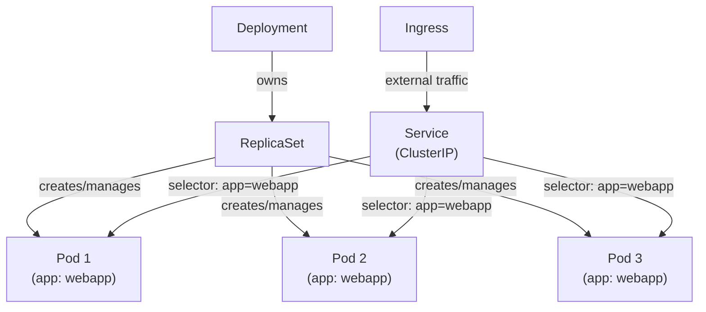

# Day 19: Kubernetes Deployments & Services
📚 Topic 19: K8s Deep Dive — Deployments, Services & Networking
✅ Prerequisite-checklist: (review Day 18 K8s fundamentals if needed)

## Overview | Parichay

Ab production-level deployment banayenge - **Deployments** se scaling/rolling updates, **Services** se networking, aur **Ingress** se external access. Yeh hi K8s ka asli power use hai.

---

## What You'll Learn | Aaj Ki Seekh

- [ ] Deployment YAML samajhna - replicas, selector, template
- [ ] kubectl scale se scaling karna
- [ ] Rolling updates aur kubectl set image
- [ ] Rollback aur rollout history
- [ ] Service types - ClusterIP, NodePort, LoadBalancer
- [ ] Probes - readiness aur liveness health checks

---

## Diagram | Dekho Kaise Kaam Karta Hai

### Mermaid - Deployment, ReplicaSet, Pods aur Service Routing



### Real Image Links

- Deployments: https://kubernetes.io/docs/concepts/workloads/controllers/deployment/
- Services: https://kubernetes.io/docs/concepts/services-networking/service/

---

## Real-Life Example | Zindagi Se

Deployment ek **hotel manager** aur Services ek **receptionist** jaisa hai.

- **Deployment (Hotel Manager):** Agar koi server (Pod) chhutti par ho ya fail ho jaye, manager turant naya server deploy karta hai. Chahoon jitne servers chahiye (replicas), manager unko maintain karta hai.
- **ReplicaSet:** Manager ka handyman - batta hai kitne servers kaam par hain.
- **Service (Receptionist):** Customers ko directly kisi ek server ke paas nahi bheja jaata (office change ho sakta hai). Receptionist ek **stable number** hota hai - call karo, reception receiver koi bhi available server ko ghuma dega (load balancing).

Rolling update = jab manager naye uniform aate hain, ek-ek server ko turant badalta hai, poora hotel band nahi karta.

---

## Basic Concepts Detail Mein

### 1. Deployment (Core Workload)

Deployment Pods ko manage karta hai with replicas + rolling updates:

```yaml
# deployment.yaml
apiVersion: apps/v1
kind: Deployment
metadata:
  name: webapp
  namespace: default
  labels:
    app: webapp
spec:
  replicas: 3                    # kitne pods jab chahiye
  selector:
    matchLabels:
      app: webapp                # kaunse pods manage
  template:                      # Pod template
    metadata:
      labels:
        app: webapp
    spec:
      containers:
      - name: webapp
        image: nginx:1.25
        ports:
        - containerPort: 80
        resources:               # resource limits (zaroori!)
          requests:
            memory: "64Mi"
            cpu: "250m"
          limits:
            memory: "128Mi"
            cpu: "500m"
```

**K8s labels:** `selector.matchLabels` batata hai Deployment kaunse Pods ko control karta hai. Important - isse matching karo.

### 2. Scaling

```bash
# Manual scale
kubectl scale deployment webapp --replicas=5
kubectl get pods -o wide

# Autoscale (HPA - Horizontal Pod Autoscaler)
kubectl autoscale deployment webapp --min=3 --max=10 --cpu-percent=50
kubectl get hpa
```

### 3. Rolling Update & Rollback

```bash
# Update image (rolling update - ek-ek pod replace)
kubectl set image deployment/webapp webapp=nginx:1.25
kubectl rollout status deployment/webapp   # track karo

# Pause/resume
kubectl rollout pause deployment/webapp
kubectl rollout resume deployment/webapp

# Rollback (agar problem)
kubectl rollout undo deployment/webapp
kubectl rollout history deployment/webapp
kubectl rollout undo deployment/webapp --to-revision=2

# Restart (config change ke baad)
kubectl rollout restart deployment/webapp
```

**Strategy types:**
```
RollingUpdate (default): ek-ek pod, zero downtime
Recreate: pehle saare band, phir naye (downtime)
```

### 4. Services (Networking)

Pods ka IP **change** hota hai (delete/restart par). Services stable access dete hain:

**Service types:**
| Type | Access | Use |
|------|--------|-----|
| **ClusterIP** (default) | Cluster ke andar | Internal se baat |
| **NodePort** | `nodeIP:NodePort` | Testing, dev |
| **LoadBalancer** | External cloud LB | Production, external |

```yaml
# service.yaml
apiVersion: v1
kind: Service
metadata:
  name: webapp-service
spec:
  selector:
    app: webapp              # kaunse pods ko target (labels!)
  ports:
  - port: 80                # service port
    targetPort: 80          # pod port
  type: ClusterIP
```

**Important:** Service ka `selector` Deployment ke pod `labels` se match hona chahiye, tabhi traffic jati hai.

### 5. ConfigMaps & Environment (Preview)

```yaml
# configmap.yaml
apiVersion: v1
kind: ConfigMap
metadata:
  name: app-config
data:
  APP_COLOR: "blue"
  DATABASE_HOST: "db"
```
```yaml
# deployment mein use
env:
- name: DATABASE_HOST
  valueFrom:
    configMapKeyRef:
      name: app-config
      key: DATABASE_HOST
```

### 6. Probes (Health Checks)

**Readiness Probe** - Pod traffic receive karne ke liye ready hai?
**Liveness Probe** - Pod still alive hai? (fail → restart)

```yaml
readinessProbe:
  httpGet:
    path: /health
    port: 8080
  initialDelaySeconds: 10
  periodSeconds: 5
  timeoutSeconds: 3

livenessProbe:
  httpGet:
    path: /healthz
    port: 8080
  initialDelaySeconds: 20
  periodSeconds: 10
```

---

## Demo | Copy-Paste Karke Chalao

### Step 1: Deployment Banao

```bash
cat > deployment.yaml << 'EOF'
apiVersion: apps/v1
kind: Deployment
metadata:
  name: webapp
  labels:
    app: webapp
spec:
  replicas: 3
  selector:
    matchLabels:
      app: webapp
  template:
    metadata:
      labels:
        app: webapp
    spec:
      containers:
      - name: webapp
        image: nginx:1.25
        ports:
        - containerPort: 80
        resources:
          requests:
            memory: "64Mi"
            cpu: "250m"
          limits:
            memory: "128Mi"
            cpu: "500m"
EOF

kubectl apply -f deployment.yaml
kubectl get pods
kubectl get deployment webapp
kubectl describe deployment webapp
```

### Step 2: Scale Karo

```bash
kubectl scale deployment webapp --replicas=5
kubectl get pods -o wide

# Wapas 3 par
kubectl scale deployment webapp --replicas=3
```

### Step 3: Rolling Update aur Rollback

```bash
# Image update karo
kubectl set image deployment/webapp webapp=nginx:1.27
kubectl rollout status deployment/webapp
kubectl rollout history deployment/webapp

# Rollback karo (agar problem hai)
kubectl rollout undo deployment/webapp
kubectl rollout status deployment/webapp
```

### Step 4: Service Banao aur Access Karo

```bash
cat > service.yaml << 'EOF'
apiVersion: v1
kind: Service
metadata:
  name: webapp-service
spec:
  selector:
    app: webapp
  ports:
  - port: 80
    targetPort: 80
  type: ClusterIP
EOF

kubectl apply -f service.yaml
kubectl get svc

# Service through access
kubectl port-forward svc/webapp-service 8080:80 &
curl localhost:8080

# Cleanup
kubectl delete -f deployment.yaml -f service.yaml
```

---

## Practice Exercise | Abhi Karein

```yaml
# deployment.yaml + service.yaml banao
# (upar diye hue)

# Tasks:
kubectl apply -f deployment.yaml
kubectl get pods

# Scale
kubectl scale deployment webapp --replicas=5
kubectl get pods -o wide

# Update + rolling
kubectl set image deployment/webapp webapp=nginx:1.25
kubectl rollout status deployment/webapp

# Rollback
kubectl rollout undo deployment/webapp

# Service
kubectl apply -f service.yaml
kubectl get svc
kubectl port-forward svc/webapp-service 8080:80 &
curl localhost:8080

# Cleanup
kubectl delete -f deployment.yaml -f service.yaml
```

---

## Quick Notes | Yaad Rakho

```
- Deployment = replicas + rolling update + rollback
- Service = stable networking (ClusterIP/LoadBalancer)
- Labels/selector match = traffic flow control
- kubectl scale / set image / rollout
- Probes = health check (readiness + liveness)
```

---

**Kal:** ConfigMaps, Secrets, aur Volumes.
