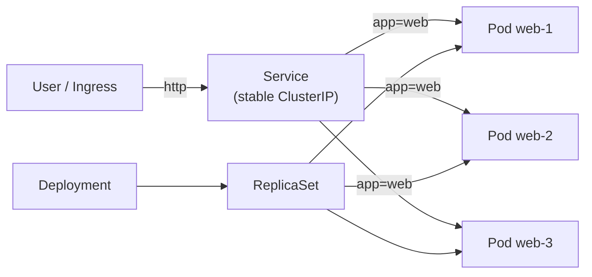

# Day 19: Kubernetes Deployments & Services
📚 Topic 19: K8s Deep Dive — Deployments, Services & Networking
✅ Prerequisite-checklist: (review Day 18 K8s fundamentals if needed)

> Ek line mein: Deployment = replicas fixed + rolling updates; Service = stable naam/IP jo pod badalne par kabhi nahi toot-ta — yehi K8s ka production power hai.

## Overview | Parichay

Ab production-level deployment banayenge - **Deployments** se scaling/rolling updates, **Services** se networking, aur **Ingress** se external access. Yeh hi K8s ka asli power use hai.

Pods (kal) baar-baar marte-bante hain, unka IP har baar badalta hai — yaad rakhna namumkin. **Deployment** desired replicas maintain karta hai (ek mara to turant naya). **Service** pods ko **stable VIP + DNS** deta hai — `selector` se sahi pods dhundhta hai aur unpe traffic load-balance karta hai. Rolling update me pods ek-ek karke badalte hain (zero downtime), galat release ho to `rollout undo` se wapas.

### Deployment — desired state ka nigrani

**Deployment** kya karta hai: tum batao `replicas: 3` + image tag, wo khud ensure karta hai ki **3 healthy pods hamesha rahen**:

- Agar pod crash → turant naya (ye functionality asal me **ReplicaSet** karta hai, Deployment usko control karta hai)
- Pod IP badal jaye to koi tension nahi — Service unhe track karti hai labels se
- Isliye k8s me `kubectl run`/single-pod-manage (imperative) anti-pattern hai; hamesha Deployment (declarative).

Yeh self-healing prod ka saviour hai — pod mari to koi manually nahi banata, system khud naya pakka karta hai.

### ReplicaSet — Deployment ka invisible helper

```
kubectl get deployment → kubectl get rs → kubectl get pods
Deployment → manages → ReplicaSet → creates → Pods
```
Har Deployment ek ReplicaSet banata hai. Rolling update me **naya ReplicaSet** ban jaata hai aur pura track rakha jata hai (rollback ke liye). `kubectl get rs` me desired/current/ready columns — upgrades me ishi se dekho kaunse rs active hai.

### Service — stable door + load balancer

Pods ki IPs unstable hain, isliye **Service** unke aage ek **stable VIP + DNS** rakhta hai:

```
Service (VIP + DNS)  →  selector: app=web  →  match labels →  load-balance traffic
```
- **ClusterIP** (default) — cluster ke andar access; prod services isi se baat karti hain
- **NodePort** — har node pe ek port kholta hai (`<nodeIP>:30080`) dev/quick access ke liye
- **LoadBalancer** — cloud LB (external) — public traffic ki entry

Selector wahi label jo pod ke `metadata.labels` me ho — label mismatch = "Service connection refused" ka top reason.

### Ingress — production entry point

`LoadBalancer` per service = royal cost (har service pe cloud LB!). **Ingress** ek hi entry point pe **host-path based routing** karta hai: `api.example.com` → api service, `www.example.com` → web service, TLS terminate (https). K8s me Ingress sirf **definition** hai; asli magician **Ingress Controller** (nginx/traefik) hai. Large prod setups: Ingress → Services → Pods.

### Rolling update + rollback — zero downtime deploy

```
kubectl set image deploy/web web=acme/web:v2.0      # update
kubectl rollout status deploy/web                    # progress dekh
kubectl rollout history deploy/web                   # revision history
kubectl rollout undo deploy/web                      # v2 galat? wapas v1
```
Default strategy = **RollingUpdate**: pods **ek-ek** karke naye image pe badalna (ek naya healthy → ek pura hataya). `maxSurge`/`maxUnavailable` se dikhao kitni parallelism allowed. Lamba upgrade chikne se hota hai — dusri strategy **Recreate** me sab pods ek saath band-phir-chalu hote hain = full downtime, isliye prod me na use karo. Interview trick: "deploy zero-downtime kaise?" → rolling updates + health checks.

---

## What You'll Learn | Aaj Ki Seekh

- [ ] Deployment — desired replicas, self-healing (ReplicaSet ke through)
- [ ] Rolling update + `rollout status` / `history` / `undo`
- [ ] Label selectors — Service ka pod dhundhne ka raaz
- [ ] Service types — ClusterIP (internal) / NodePort / LoadBalancer
- [ ] Liveness vs readiness probe — kab restart, kab traffic se hatao
- [ ] `kubectl scale` + Endpoints (selection ka proof)
- [ ] Ingress basics — HTTP routing entry point

## Diagram | Dekho Kaise Kaam Karta Hai



ASCII:
```
Deployment → replicas + rolling update + rollback; ReplicaSet → pod count maintain (self-heal)
Service → stable IP/DNS; selector se pods pick (ClusterIP/NodePort/LoadBalancer)
Probes: liveness = restart, readiness = traffic se hatao
```

## Demo | Copy-Paste Karke Chalao

```bash
kubectl apply -f deploy.yaml -f service.yaml
kubectl get pods -l app=web

kubectl set image deployment/web web=nginx:1.27-alpine   # rolling update
kubectl rollout status deployment/web                     # "successfully rolled out"
kubectl rollout history deployment/web                    # revisions

kubectl rollout undo deployment/web                       # rollback

kubectl scale deployment/web --replicas=5

curl $(minikube service web-svc --url)                   # NodePort URL access

kubectl get endpoints web-svc                             # selection ka proof
kubectl label pod <pod-naam> app=wrong --overwrite        # selector miss → hata
kubectl get endpoints web-svc
```

`deploy.yaml` + `service.yaml`:

```yaml
apiVersion: apps/v1
kind: Deployment
metadata:
  name: web
spec:
  replicas: 3
  selector:
    matchLabels:
      app: web
  template:
    metadata:
      labels:
        app: web
    spec:
      containers:
      - name: nginx
        image: nginx:alpine
        ports:
        - containerPort: 80
        readinessProbe:
          httpGet: { path: /, port: 80 }
          initialDelaySeconds: 5
          periodSeconds: 10
        livenessProbe:
          httpGet: { path: /, port: 80 }
          initialDelaySeconds: 15
          periodSeconds: 20
---
apiVersion: v1
kind: Service
metadata:
  name: web-svc
spec:
  type: NodePort
  selector:
    app: web
  ports:
  - port: 80
    targetPort: 80
    nodePort: 30080
```

## Real-Life Example | Industry Me

**Web app deploy (zero-downtime production):**
```
kubectl apply → rolling update (3 pods ek-ek karke) = no downtime; bad release → rollout undo, 30s me wapas
minikube: NodePort (dev); cloud: LoadBalancer/Ingress; selector galat → endpoints empty → 1 min me catch
Readiness = traffic gate; HPA (later): CPU ke hisab se auto-scale — kubectl autoscale deploy web --min=2 --max=10
```

## Practice Exercise | Abhi Karein

1. `kubectl apply -f deploy.yaml -f service.yaml`; `kubectl get deploy,rs,po,svc -o wide`
2. Self-heal: `kubectl delete pod web-<x> --wait=false` — turant naya banega dekho
3. Rolling: image change + `rollout status`/`history`; phir `rollout undo` (rollback)
4. Scale: `kubectl scale deployment/web --replicas=5`; pods 5 dikhne chahiye
5. Selector: pod ko `app=wrong` label karo → `get endpoints` se gayab; wapas restore
6. Probe: `kubectl exec -it deploy/web -- mv /usr/share/nginx/html/index.html /tmp/` → `get pods -w` me 0/1; wapas move karo
7. `type: LoadBalancer` try karo (minikube tunnel); cleanup `kubectl delete -f deploy.yaml service.yaml`

## Quick Notes | Yaad Rakho

```
- Deployment → ReplicaSet → Pods; update par naya ReplicaSet (history se rollback)
- ReplicaSet self-heal: pod delete karo to desired replicas turant restore
- Selector matchLabels mand hai — template labels se match na ho to Service ko pods nahi milengi
- Service types: ClusterIP < NodePort < LoadBalancer < Ingress
- ClusterIP stable — pods kahin bhi, Service hamesha same
- port + targetPort + nodePort — teeno alag
- Liveness fail → restart; Readiness fail → Service se traffic hatana
- `rollout undo` = rollback; `get endpoints` = selection proof
- `kubectl expose deploy web --type=NodePort --port=80` = quick service
- App ko SIGTERM handle sikhana — rolling update smooth
```
**Agla:** ConfigMaps, Secrets & Volumes — config image se alag, secret base64, data pod se zyada lamba.