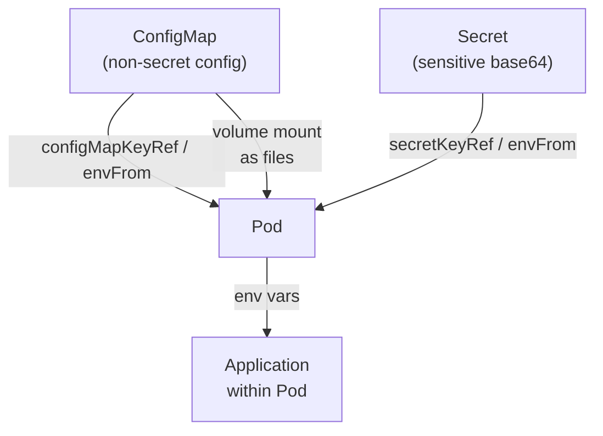
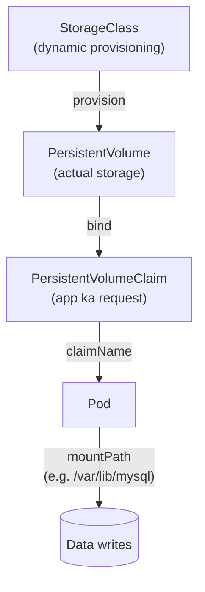

# Day 20: ConfigMaps, Secrets & Volumes
📚 Topic 20: K8s Deep Dive — ConfigMaps, Secrets & Storage Orchestration
✅ Prerequisite-checklist: (review Day 19 Deployments & Services if needed)

## Overview | Parichay

Production apps mein config, secrets, aur data storage alag-alag manage karna zaroori hai. **ConfigMaps** (non-secret config), **Secrets** (sensitive data), **Volumes** (persistent data) - teeno detail mein seekhenge.

---

## What You'll Learn | Aaj Ki Seekh

- [ ] ConfigMap banana aur Deployment mein use karna
- [ ] Secret banana - base64 encoding samajhna
- [ ] env se config aur secret pass karna - envFrom, keyRef
- [ ] PV, PVC aur StorageClass samajhna
- [ ] Deployment mein volume mount karna
- [ ] StatefulSet ka concept samajhna

---

## Diagram | Dekho Kaise Kaam Karta Hai

### Mermaid - ConfigMap/Secret se Pod Environment



### Mermaid - PV/PVC se Pod Mount



### Real Image Links

- ConfigMaps: https://kubernetes.io/docs/concepts/configuration/configmap/
- Secrets: https://kubernetes.io/docs/concepts/configuration/secret/
- Persistent Volumes: https://kubernetes.io/docs/concepts/storage/persistent-volumes/

---

## Real-Life Example | Zindagi Se

Socho tum **ek naye office building mein shift** ho rahe ho:
- **ConfigMap (Configuration Guide):** Office ka address, floor number, light timing - ye info sabko chahiye, par safe nahi hai (not secret). Alag-alag jagah ki baar-baar na picchho - ek guide banao aur sabko baat do.
- **Secret (Bank Vault):** Office ka safe ka password, WiFi key - sirf choraya hi manzoor hai, kisi ko nahi bata sakte. Isliye alag vault mein rakha, encode kar ke.
- **Volume (Storage Room):** Tumhara office ka documentation, agar tum chutti par ho ya office badlo (pod delete), storage room mein sab data safe rahega. Agar pod crash ho jaye, naya pod aayega aur uski purani files wapas milegi.

ConfigMap = "office kaida" (rules), Secret = "vault ka password" (sensitive), Volume = "safe cupboard" (data storage).

---

## Basic Concepts Detail Mein

### 1. ConfigMap - Non-Secret Config

ConfigMap mein config values/files rakhte hain (jo secret nahi hain).

**Create karna:**
```yaml
# configmap.yaml
apiVersion: v1
kind: ConfigMap
metadata:
  name: app-config
data:
  APP_ENV: "production"
  APP_DEBUG: "false"
  DATABASE_HOST: "db-service"
  DATABASE_PORT: "5432"
  LOG_LEVEL: "info"
```

```bash
# Se bhi create kar sakte hain
kubectl create configmap app-config --from-literal=APP_ENV=production
kubectl create configmap app-config --from-file=config.yaml
kubectl get configmap
kubectl describe configmap app-config
```

**Use karna (Deployment mein):**

```yaml
spec:
  containers:
  - name: app
    image: myapp:1.0
    envFrom:                       # saara configmap env mein daalo
    - configMapRef:
        name: app-config

    env:                           # specific key use
    - name: DATABASE_PORT
      valueFrom:
        configMapKeyRef:
          name: app-config
          key: DATABASE_PORT

    volumeMounts:                  # file ke roop mein mount
    - name: config-volume
      mountPath: /app/config
  volumes:
  - name: config-volume
    configMap:
      name: app-config
```

### 2. Secrets - Sensitive Data

Secrets bhi config jaisa, par **encrypted** and sensitive (passwords, API keys, tokens).

```yaml
# secret.yaml
apiVersion: v1
kind: Secret
metadata:
  name: app-secrets
type: Opaque
data:                        # base64 encoded
  DATABASE_PASSWORD: cGFzc3dvcmQ=
  API_KEY: c2VjcmV0LWFwaS1rZXk=
stringData:                  # plain text (k8s encode deta hai)
  DATABASE_PASSWORD: password123
```

```bash
# create
kubectl create secret generic app-secrets \
  --from-literal=DATABASE_PASSWORD=password123 \
  --from-literal=API_KEY=secret-api-key

kubectl get secrets
kubectl get secret app-secrets -o yaml   # base64 dikhegi
```

**Use (Deployment):**
```yaml
envFrom:
- secretRef:
    name: app-secrets

env:
- name: DB_PASS
  valueFrom:
    secretKeyRef:
      name: app-secrets
      key: DATABASE_PASSWORD
```

**Secret types:**
| Type | Use |
|------|-----|
| Opaque | General (passwords, keys) |
| kubernetes.io/dockerconfigjson | Docker registry creds |
| kubernetes.io/tls | TLS certificates |
| kubernetes.io/ssh-auth | SSH keys |

### 3. Volumes - Persistent Storage

Pod delete par data **delete** ho jata hai (ephemeral volume). Persistent data ke liye **PV + PVC** chahiye.

```
┌─────────────────────────────────────────────┐
│ Cluster                                      │
│  ┌────────────────────────────┐              │
│  │ PersistentVolume (PV)      │  ← storage kaha hai (host/EBS)
│  │  -- capacity, access modes │              │
│  └────────────────────────────┘              │
│  ┌────────────────────────────┐              │
│  │ PersistentVolumeClaim (PVC)│  ← app ka request
│  └────────────────────────────┘              │
│        (bound to PV)                         │
│  ┌────────────────────────────┐              │
│  │ Pod → PVC mount karti hai   │              │
│  └────────────────────────────┘              │
└─────────────────────────────────────────────┘
```

**StorageClass** (dynamic provisioning) - cloud par automatically volume banata hai.

```yaml
# storageclass.yaml (AKS / Azure)
apiVersion: storage.k8s.io/v1
kind: StorageClass
metadata:
  name: azure-disk
provisioner: disk.csi.azure.com   # azure managed-disk CSI driver
parameters:
  skuname: StandardSSD_LRS
```

### 4. PVC Example

```yaml
# pvc.yaml
apiVersion: v1
kind: PersistentVolumeClaim
metadata:
  name: data-claim
spec:
  accessModes:
    - ReadWriteOnce
  resources:
    requests:
      storage: 5Gi
  storageClassName: gp2
```

```yaml
# deployment mein use
volumes:
- name: data-volume
  persistentVolumeClaim:
    claimName: data-claim
volumeMounts:
- name: data-volume
  mountPath: /var/lib/mysql
```

**Access modes:**
| Mode | Matlab |
|------|--------|
| ReadWriteOnce | Ek node read+write |
| ReadOnlyMany | Kai nodes read only |
| ReadWriteMany | Kai nodes read+write |

### 5. StatefulSets

Stateful apps (databases) ke liye - har pod ka **stable identity** (name, storage):

```yaml
# statefulset.yaml (MySQL nai, par concept)
apiVersion: apps/v1
kind: StatefulSet
metadata:
  name: mysql
spec:
  serviceName: mysql
  replicas: 3
  selector:
    matchLabels:
      app: mysql
  template:
    metadata:
      labels: {app: mysql}
    spec:
      containers:
      - name: mysql
        image: mysql:8.0
        volumeMounts:
        - name: mysqldata
          mountPath: /var/lib/mysql
  volumeClaimTemplates:    # har pod ko apna volume
  - metadata:
      name: mysqldata
    spec:
      accessModes: ["ReadWriteOnce"]
      resources:
        requests:
          storage: 5Gi
```

---

## Demo | Copy-Paste Karke Chalao

### Step 1: ConfigMap aur Secret Banao

```bash
# ConfigMap banaye (non-secret config)
kubectl create configmap app-config \
  --from-literal=APP_ENV=production \
  --from-literal=LOG_LEVEL=info \
  --from-literal=DATABASE_HOST=db-service

# Secret banaye (sensitive data)
kubectl create secret generic app-secrets \
  --from-literal=DATABASE_PASSWORD=password123 \
  --from-literal=API_KEY=secret-api-key-xyz

# Verify
kubectl get configmap
kubectl get secret
kubectl describe configmap app-config
kubectl get secret app-secrets -o yaml   # base64 mein dikhega
```

### Step 2: Deployment Banao jo ConfigMap + Secret use Kare

```bash
cat > app-deployment.yaml << 'EOF'
apiVersion: apps/v1
kind: Deployment
metadata:
  name: config-demo
  labels:
    app: config-demo
spec:
  replicas: 1
  selector:
    matchLabels:
      app: config-demo
  template:
    metadata:
      labels:
        app: config-demo
    spec:
      containers:
      - name: app
        image: nginx:alpine
        ports:
        - containerPort: 80
        envFrom:
        - configMapRef:
            name: app-config
        - secretRef:
            name: app-secrets
        env:
        - name: DATABASE_HOST
          valueFrom:
            configMapKeyRef:
              name: app-config
              key: DATABASE_HOST
        - name: DB_PASSWORD
          valueFrom:
            secretKeyRef:
              name: app-secrets
              key: DATABASE_PASSWORD
EOF

kubectl apply -f app-deployment.yaml
kubectl get pods
```

### Step 3: Verify Karo - Pod ke Andar Env Check

```bash
# Pod ka naam lo
kubectl get pods

# Pod ke andar environment check karo
kubectl exec -it <pod-name> -- env | grep -E "APP_ENV|LOG_LEVEL|DB_|DATABASE"

# Expected output:
# APP_ENV=production
# DATABASE_HOST=db-service
# DATABASE_PASSWORD=password123
# API_KEY=secret-api-key-xyz
```

### Step 4: PVC Banao (Data Persistence)

```bash
cat > pvc.yaml << 'EOF'
apiVersion: v1
kind: PersistentVolumeClaim
metadata:
  name: data-claim
spec:
  accessModes:
    - ReadWriteOnce
  resources:
    requests:
      storage: 1Gi
EOF

kubectl apply -f pvc.yaml
kubectl get pvc

# Cleanup
kubectl delete -f app-deployment.yaml -f pvc.yaml
kubectl delete configmap app-config
kubectl delete secret app-secrets
```

> **Note:** Minikube mein StorageClass default ban jaata hai. Agar PVC Pending mein atka ho, `kubectl get storageclass` aur `kubectl describe pvc data-claim` se diagnose karo.

---

## Practice Exercise | Abhi Karein

**Complete Config App:**

1. **ConfigMap** banao app-config (env + URL)
2. **Secret** banao app-secrets (db password, api key)
3. **Deployment** banao jo dono ko env ke roop mein use kare
4. Pod ke andar `env` check karo: `kubectl exec -it <pod> -- env`
5. **PVC** banao 5Gi
6. **MySQL** StatefulSet/Deployment persistent data ke saath deploy karo
7. Data write karo, pod delete karo, pod wapas aaye - **data bacha** verify karo
8. Real "secret" naa ho - base64 hai, K8s Secrets default par base64 only (encrypted nahi) memory mein rakhte hain. Production mein encryption alag.

---

## Quick Notes | Yaad Rakho

```
- ConfigMap = non-secret, Secret = sensitive (base64)
- envFrom = saara, env+keyRef = specific key
- PV = storage, PVC = request, StorageClass = dynamic
- AccessModes: RWO one node, RWM many
- StatefulSet = stable identity + persistent
```

---

**Kal:** Week 3 review + deployment capstone.
