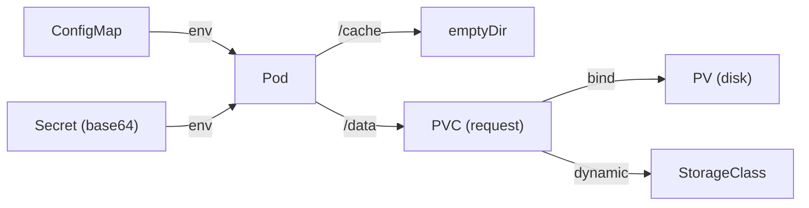

# Day 20: ConfigMaps, Secrets & Volumes
📚 Topic 20: K8s Deep Dive — ConfigMaps, Secrets & Storage Orchestration
✅ Prerequisite-checklist: (review Day 19 Deployments & Services if needed)

> Ek line mein: Config image se alag (ConfigMap), gopniyaat base64 (Secret), aur data pod se zyada lamba (Volumes + PVC) — teeno production apps ki dhadkan hain.

## Overview | Parichay

Production apps mein config, secrets, aur data storage alag-alag manage karna zaroori hai. **ConfigMaps** (non-secret config), **Secrets** (sensitive data), **Volumes** (persistent data) - teeno detail mein seekhenge.

Socho recipe card ho — agar usi card pe salt (password) likh diya to har baar recipe badalni padegi. Better: recipe same, salt alag dabbe me. **ConfigMap** non-secret config rakhta hai, **Secret** sensitive values base64 me (base64 = encoding, encryption NAHI!). Dono pods env ya file mount se lete hain — image rebuild ki zaroorat nahi. Storage: **emptyDir** = pod ke jeevan tak (cache/temp), **hostPath** = node ka folder (dev), production ke liye **PVC** → **StorageClass** (dynamic) → **PV**.

### ConfigMap — config alag, image same

**ConfigMap** = non-secret config ka dabba (URLs, flags, thresholds). Faisla kyu: config code me hardcode karo to image har baar rebuild karni padegi + env-specific configs alag nahi. ConfigMap se:

```yaml
apiVersion: v1
kind: ConfigMap
metadata: { name: app-config }
data:
  LOG_LEVEL: info
  DB_HOST: postgres
```
Pod me do tarah use hota hai — `env` (single var) ya `envFrom` (poora config env me) ya file mount. Change config → pod restart (config change se pods auto-restart nahi hote — rollout karke naye pods lena hota hai).

### Secret — sensitive values ka dabba

**Secret** = passwords/tokens/keys. Yad rakho:

- Base64 sirf **encoding** hai, **encryption NAHI** — `echo dXNlcg== | base64 -d` se koi bhi decode kar sakta hai
- Real security = **encryption-at-rest**, **RBAC** (kaun dekh sakta hai), aur storage bhi securely karna (External Secrets/Vault — Day 36+)
- Preferred: `stringData:` use karo (plain text likho, k8s khud encode kare) bina khud base64 banaya
- Secret ~1MB limit; bade data ke liye ConfigMap/volume
- Commit mat karo!. Secret YAMLs Git me commit nahi — env/CI se produce karo ya sealed-secrets (Day 41)

### Pod me use — env ya volume

```yaml
spec:
  containers:
    - name: app
      envFrom:
        - configMapRef: { name: app-config }
        - secretRef:    { name: app-secret }
```
Dono `envFrom` se ek saath inject — **image rebuild ki zaroorat nahi**, config deploy ke waqt hi inject hoti hai. Pattern interviews me: config/secrets ko containers se alag rakho → same image, alag environment.

### Storage types — kahan kya data

| Type | Age | Use kab |
|------|-----|---------|
| `emptyDir` | Pod ke jeevan tak | Cache, temp, sidecar share |
| `hostPath` | Node ke folder | Dev/logs only — node-specific |
| **PV + PVC** | Persistent (cluster ke pare) | DB/data prod ke liye |

**PV** (PersistentVolume) = storage ka actual "disk" (host/cloud-EBS/NFS). **PVC** (PersistentVolumeClaim) = "mujhe X size ka storage chahiye" — request. **StorageClass** auto-banata hai (cloud dynamic provisioning). Pod `persistentVolumeClaimName` se PVC ko mount karta hai.

### RBAC + 12-factor ka jod

Ye topic chhota lagega magar DevSecOps me core hai — `secrets` ka access RBAC se control karo (har user ko secret nahi dikhta). Config aur Secrets ko "app code se alag" rakhna — yehi 12-factor app ka config-inject principle hai, jo Day 22-28 (IaC/CI-CD) me deeply milega.

---

## What You'll Learn | Aaj Ki Seekh

- [ ] ConfigMap — non-secret config (`data:` YAML)
- [ ] Secret — base64 values, `stringData`, size limit ~1MB
- [ ] `envFrom` — poora config/secret env vars me
- [ ] `hostPath` — node ka folder (sirf dev!)
- [ ] PVC ↔ PV ↔ StorageClass — persistent chain
- [ ] Secret update + `rollout restart` — bina image rebuild
- [ ] Volume mounts — config/file/emptyDir/PVC

## Diagram | Dekho Kaise Kaam Karta Hai



ASCII:
```
ConfigMap + Secret → env ya file → pod (config image se alag)
emptyDir = pod ke saath; hostPath = node folder (dev only); PVC → PV = data pod-se alag
Secret = base64 (encoding, ENCRYPTION NAHI) — prod me Vault/SOPS
```

## Demo | Copy-Paste Karke Chalao

```bash
echo -n "super-secret" | base64 && echo "c3VwZXItc2VjcmV0" | base64 -d   # encoding, encoding only!

kubectl apply -f config.yaml
kubectl get cm,secret

POD=$(kubectl get pods -o name | head -1 | sed 's#pod/##')
kubectl exec -it "$POD" -- env | grep -E 'APP_ENV|DB_PASSWORD'   # envFrom ka kaam
# PVC data survive karta hai — pod delete karke check
kubectl delete pod "$POD" --wait=false && sleep 5
NEW=$(kubectl get pods -o name | head -1 | sed 's#pod/##')
kubectl exec -it "$NEW" -- env | grep APP_ENV     # naya pod, same env

# secret update — bina image rebuild ke
kubectl create secret generic app-secret --from-literal=DB_PASSWORD=change-me \
  --dry-run=client -o yaml | kubectl apply -f -
kubectl rollout restart deployment/app
```

`config.yaml` (ConfigMap + Secret + Deployment + PVC):

```yaml
apiVersion: v1
kind: ConfigMap
metadata:
  name: app-config
data:
  APP_ENV: production
---
apiVersion: v1
kind: Secret
metadata:
  name: app-secret
type: Opaque
stringData:                # readable for devs: base64 khud banta hai
  DB_PASSWORD: super-secret
---
apiVersion: apps/v1
kind: Deployment
metadata:
  name: app
spec:
  replicas: 1
  selector:
    matchLabels:
      app: app
  template:
    metadata:
      labels:
        app: app
    spec:
      containers:
      - name: app
        image: nginx:alpine
        envFrom:
        - configMapRef: { name: app-config }
        - secretRef: { name: app-secret }
---
apiVersion: v1
kind: PersistentVolumeClaim
metadata:
  name: app-pvc
spec:
  accessModes:
  - ReadWriteOnce
  resources:
    requests:
      storage: 500Mi
```

## Real-Life Example | Industry Me

**Analytics service (production lessons):**
```
Config image me nahi — stage/prod alag ConfigMap, image 100% same; secrets base64 stored (encoding); prod me Day 35: External Secrets/Vault
Analytics pods write results to PVC — pod mar jaye, data safe; emptyDir for scratch; hostPath sirf dev lab
StorageClass: ssd for DB volumes, standard for logs — cost control
```

## Practice Exercise | Abhi Karein

1. `kubectl apply -f config.yaml`; `kubectl get cm; kubectl get secret app-secret -o yaml` (base64 dekho)
2. `kubectl get secret app-secret -o jsonpath='{.data.DB_PASSWORD}' | base64 -d` → "super-secret"
3. `kubectl exec -it <pod> -- env | grep -E 'APP_ENV|DB_PASSWORD'` — envFrom verify
4. `kubectl edit configmap app-config` me value change karke `rollout restart deployment/app` — bina image rebuild ke config badali
5. PVC + emptyDir: `kubectl get pvc` (Bound); pod me `/scratch` pe likho, pod delete karke emptyDir ka data gaya, PVC ke liye `mountPath` add karke data survive check
6. Cleanup: `kubectl delete -f config.yaml; kubectl delete pvc app-pvc`

## Quick Notes | Yaad Rakho

```
- ConfigMap = non-secret config; Secret = sensitive (base64 = encoding, ENCRYPTION NAHI)
- `stringData` = readable, base64 auto; Secret ~1MB limit
- envFrom = poora config/secret env me; change ke baad `rollout restart`
- emptyDir = pod ke saath; hostPath = dev only
- PVC → StorageClass → PV; pod delete pe bhi safe; accessModes: RWO/ROX/RWX
- resources.request storage zaroori (500Mi/1Gi)
- Production: External Secrets/Vault — Git me raw secret nahi
```

**Agla:** Week 3 Review + Capstone — apna app Dockerize → Compose → minikube deploy!