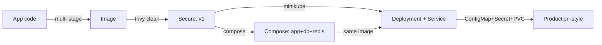

# Day 21: Week 3 Review & Challenge
📚 Topic 21: K8s Mastery — Multi-Cluster Review & Challenge
✅ Prerequisite-checklist: (review Days 18-20 concepts if needed)

> Ek line mein: Apna app do ab — Dockerize → Compose multi-tier → minikube pe Deployment+Service, wo bhi Config/Secret/Volume ke saath. Ye hi Week 3 Capstone.

## Overview | Parichay

Week 3 - Docker aur Kubernetes ka purra review. Complete karo **Week 3 Capstone Challenge**: production-ready microservices stack deploy karna. Days 15-17: Docker (image, Compose, optimization); 18-20: K8s (pods, deployments, services, config, secrets, volumes). Aaj: ek app ko production-style flow se le jao — code → optimized image → Compose → minikube Deployment + Service + ConfigMap/Secret/PVC. Har stage verify karo; fail ho to pichle dinon ke notes se root cause dhundho. Portfolio piece: "localhost se production-style K8s deployment tak pohnchaya."

### Review strategy — kya-kya pakde hue ho

Pehle **5-min checklist** — bina haath lagaye answer do:
- Image vs Container? Multi-stage kyu? `.dockerignore` kya karta hai?
- Compose me `depends_on` vs `service_healthy` fark?
- Deployment se Pod kyun manage karo (direct nahi)?
- Service kyu chahiye jab Pods hain? Selector kaam kaise karta hai?
- ConfigMap vs Secret? PVC/PV/StorageClass ka rishta?

Jo bilkul nahi aata, waapas Day 15-20 ka overview + quick notes padho. Review ka asli fayda **recall** hai (book ko hi dekhna nahi) — isliye pehle bina notes answer karo.

### Capstone flow — 7 stage ka pipeline

```
1. App + Dockerfile         → Day 15 pattern (docker build)
2. .dockerignore + multistage → size verify (docker images)
3. Trivy scan               → HIGH/CRITICAL = 0 gate
4. Compose (app+db+redis)   → docker compose up -d, curl verify
5. minikube start           → cluster up
6. Deployment + Service + ConfigMap/Secret/PVC → apply -f
7. Access + verify          → port-forward / curl + kubectl get all
```

Yeh hi wahi pipeline hai jo prod CI/CD me aage bhi milega (Day 24-28) — aaj iska manual version.

### Debugging mindset — fail hone par kya karo

Har stage **verify matlab verify**: `curl` run + expected output. Agar fail:

```
docker compose up → logs -f <svc>   → kya error? (connection refused = db not ready?)
kubectl apply     → describe pod    → events padho (ImagePullBackOff/CrashLoopBackOff)
kubectl logs -f pod → app ka asli sach (500? missing env?)
```
Root cause dhundhne ka order: **describe → logs → events**. Yehi senior-level habit hai — error ko systematically suljhana, direct google-habit nahi.

### Portfolio piece — "localhost se K8s production-style tak"

Is capstone ko apni portfolio/demo repo me daalo with clean README: screenshot of `kubectl get all`, size table (before/after multistage), trivy output (0 critical), compose vs k8s dono mein app chal raha. Interviews me yehi "hands-on" proof hota hai jo course me seekha — chaaho to iska short demo script bhi bana denge.

### Week 3 summary check — kya-kya seekha

- **Docker** (15-17): containers ka mental model, layers/caching, image hardening (multistage, non-root, trivy)
- **Compose** (16): multi-container ek YAML, healthchecks, env
- **K8s basics** (18): control plane vs worker, pods, namespaces, kubectl flow
- **K8s runtime** (19-20): deployments/services/ingress, config/secrets/persistence

Infra ab aage Day 22+ me IaC (Terraform) aur CI/CD (GitHub Actions) me build hoga.

---

## What You'll Learn | Aaj Ki Seekh

- [ ] Week 3 skill checklist review (Days 15-20 ek saath)
- [ ] App ka Dockerfile + `.dockerignore` + multi-stage (size verify)
- [ ] Trivy scan gate — HIGH/CRITICAL = 0
- [ ] Compose multi-tier (app + db + redis) local run
- [ ] Wahi image minikube pe Deployment (probes) + Service
- [ ] ConfigMap + Secret inject (envFrom) + PVC
- [ ] Rollout + rollback + port-forward test

## Diagram | Dekho Kaise Kaam Karta Hai



ASCII:
```
App → Dockerfile → image → trivy(clean)
   → compose up (app+db+redis) [local verify]
   → minikube: Deployment + Service + ConfigMap + Secret
   → port-forward → curl → DONE
Troubleshoot: get → describe → logs
```

## Demo | Copy-Paste Karke Chalao

```bash
# Phase 1: Image (Day 15-17)
mkdir capstone && cd capstone
docker build -t capstone:v1 -f app/Dockerfile app/
echo ".git\nnode_modules\n.env\n*.md" > app/.dockerignore
trivy image --severity HIGH,CRITICAL capstone:v1

# Phase 2: Compose (Day 16)
cat > compose.yml << 'EOF'
services:
  app: { image: capstone:v1, ports: ["5000:5000"], environment: [REDIS_HOST=redis, DB_HOST=db], depends_on: { redis: { condition: service_healthy }, db: { condition: service_healthy } } }
  redis: { image: redis:7-alpine, healthcheck: { test: ["CMD", "redis-cli", "ping"], interval: 10s, retries: 5 } }
  db: { image: postgres:16-alpine, environment: [POSTGRES_USER=app, POSTGRES_PASSWORD=pass], healthcheck: { test: ["CMD-SHELL", "pg_isready -U app"], interval: 10s, retries: 5 } }
EOF
docker compose up -d && curl http://localhost:5000

# Phase 3: K8s (Day 18-20)
minikube start --driver=docker
kubectl create namespace prod
minikube image load capstone:v1
kubectl create configmap app-config -n prod --from-literal=APP_ENV=production
kubectl create secret generic app-secret -n prod --from-literal=DB_PASSWORD=pass
kubectl apply -f deploy.yaml -f service.yaml
kubectl get pods -n prod && kubectl rollout status deployment/capstock -n prod
kubectl port-forward -n prod svc/capstock-svc 8080:80 &
curl http://localhost:8080
kubectl set image deployment/capstock app=capstone:v2 || true && kubectl rollout undo deployment/capstock -n prod
kubectl delete ns prod; minikube delete
```

`deploy.yaml` + `service.yaml` (capstone):

```yaml
apiVersion: apps/v1
kind: Deployment
metadata: { name: capstock, namespace: prod }
spec:
  replicas: 3
  selector: { matchLabels: { app: capstock } }
  template:
    metadata: { labels: { app: capstock } }
    spec:
      containers:
      - name: app
        image: capstone:v1
        imagePullPolicy: IfNotPresent
        ports: [{ containerPort: 5000 }]
        envFrom: [{ configMapRef: { name: app-config } }, { secretRef: { name: app-secret } }]
        readinessProbe: { httpGet: { path: /health, port: 5000 }, initialDelaySeconds: 5, periodSeconds: 10 }
        livenessProbe: { httpGet: { path: /health, port: 5000 }, initialDelaySeconds: 15, periodSeconds: 20 }
---
apiVersion: v1
kind: Service
metadata: { name: capstock-svc, namespace: prod }
spec:
  type: NodePort
  selector: { app: capstock }
  ports: [{ port: 80, targetPort: 5000, nodePort: 30080 }]
```

## Real-Life Example | Industry Me

**Real engineer ka din (startup):**
```
Feature likha → docker build (multi-stage) → trivy gate → push registry → tag = git SHA
Locally: docker compose up — db+redis milke test
Prod-like: AKS/EKS pe Deployment (3 replicas) + Service + prod secrets; deploy = kubectl apply / GitOps
Rollback = rollout undo; zero downtime = readiness-first rolling update
```

## Practice Exercise | Abhi Karein (CAPSTONE)

1. **Image:** app files banao (`/health`, REDIS_HOST env), multi-stage Dockerfile + `.dockerignore`; build + size + trivy verify
2. **Compose:** `compose.yml` → `up -d`; `curl localhost:5000` 5 baar (counter 1..5); `compose ps` healthy
3. **DNS + depends_on:** `compose exec app getent hosts redis db` resolve; `logs app` me "connected" dekho
4. **K8s deploy:** minikube start; ns `prod`; configmap + secret; `minikube image load capstone:v1`
5. **Deployment + Service:** manifests apply; `kubectl get pods -n prod`; `rollout status`; `get endpoints capstock-svc`
6. **Access + probes:** port-forward + curl; ek pod pe readiness fail karke `get pods -w` me 0/1 dekho
7. **Rollout + rollback:** image v2 set karke error, phir `rollout undo`; `rollout history` dekho; cleanup

## Quick Notes | Yaad Rakho (Week 3 Checklist)

```
- Day 15: Image=recipe, Container=running copy; layers + writable layer; naam hi DNS
- Day 16: Compose = ek file me pura stack; service-name DNS; depends_on + service_healthy
- Day 17: multi-stage (900→120MB), .dockerignore, layer order, USER nonroot, trivy gate
- Day 18: kubectl → api-server → etcd/scheduler/controller; Pod = smallest unit
- Day 19: Deployment replicas/rolling/rollback; Service ClusterIP/NodePort/LoadBalancer
- Day 20: ConfigMap=config, Secret=base64 (encryption NAHI), PVC→PV→StorageClass
- Troubleshoot: get (state) → describe (events) → logs (app)
- Self-heal: pod delete karte hi naya banta hai (Deployment/ReplicaSet)
- Data survives: PVC magic — pod/node mare, data zinda
- Rolling deploy = zero downtime: ek-ek pod, probes + readiness pehle
- Image tag pin (v1/commit-SHA); `latest` prod me kabhi nahi
- Capstone done = Week 3 claim: Docker + Compose + K8s core sab haath se
```

**Agla:** Week 4 shuru — cloud-native deployments & advanced topics (monitoring, GitOps, service mesh).