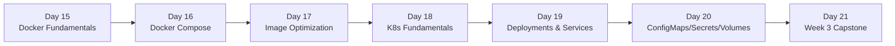

# Day 21: Week 3 Review & Challenge
📚 Topic 21: K8s Mastery — Multi-Cluster Review & Challenge
✅ Prerequisite-checklist: (review Days 18-20 concepts if needed)

## Overview | Parichay

Week 3 - Docker aur Kubernetes ka purra review. Aur complete karo **Week 3 Capstone Challenge**: production-ready microservices stack deploy karna.

---

## What You'll Learn | Aaj Ki Seekh

- [ ] Week 3 ke saare topics ka quick revision - Docker, Compose, K8s
- [ ] Revision quiz se apni yaad test karna
- [ ] Microservices architecture ka design samajhna
- [ ] Production-ready microservices stack deploy karna
- [ ] Deployment verification aur troubleshooting
- [ ] Week 3 self-checklist complete karna

---

## Diagram | Dekho Kaise Kaam Karta Hai

### Mermaid - Week 3 Microservices Architecture

```mermaid
flowchart TD
    U["User Browser"] -->|"HTTP :80"| ING["Ingress<br/>(external access)"]
    ING -->|"path: /api/users"| GW["API Gateway<br/>(nginx)"]
    ING -->|"path: /api/orders"| GW
    GW -->|"proxy"| US["User Service<br/>(Flask)"]
    GW -->|"proxy"| OS["Order Service<br/>(Flask)"]
    US -->|"DB_HOST via ConfigMap"| DB[(("PostgreSQL<br/>(StatefulSet)"))]
    OS --> DB
    US -->|"curl /health"| KP1["K8s Probes<br/>(readiness/liveness)"]
    OS --> KP1
    CM["ConfigMaps<br/>(env vars)"] --> US
    CM --> OS
    SEC["Secrets<br/>(db password)"] --> US
    SEC --> OS
```

### Mermaid - Week 3 Journey



### Real Image Links

- Kubernetes Microservices: https://kubernetes.io/blog/2018/04/18/kubernetes-and-microservices/
- Ingress Controllers: https://kubernetes.io/docs/concepts/services-networking/ingress-controllers/

---

## Demo | Copy-Paste Karke Chalao

### Step 1: Mini Microservices Stack (Docker Compose)

```bash
mkdir week3-demo && cd week3-demo

# User service banao
mkdir -p user-service
cat > user-service/app.py << 'EOF'
from flask import Flask, jsonify
import os
app = Flask(__name__)
@app.route('/health')
def health(): return jsonify(status="ok")
@app.route('/users')
def users(): return jsonify([{"id":1,"name":"DevClo"}])
if __name__ == '__main__':
    app.run(host='0.0.0.0', port=5000)
EOF

cat > user-service/requirements.txt << 'EOF'
flask==3.0.0
EOF

cat > user-service/Dockerfile << 'EOF'
FROM python:3.11-slim
WORKDIR /app
COPY requirements.txt .
RUN pip install --no-cache-dir -r requirements.txt
COPY . .
EXPOSE 5000
CMD ["python", "app.py"]
EOF

# docker-compose.yml
cat > docker-compose.yml << 'EOF'
version: '3.8'
services:
  user-service:
    build: ./user-service
    ports: ["5000:5000"]
  gateway:
    image: nginx:alpine
    ports: ["80:80"]
    depends_on: [user-service]
EOF

# Local mein chalao
docker compose up -d
docker compose ps
curl localhost:80
docker compose down -v
```

### Step 2: K8s Mein Deploy Karo (Minikube)

```bash
# Minikube start
minikube start --driver=docker

# Namespace banao
kubectl create ns week3-demo

# Simple user-service deployment + service
cat > k8s-demo.yaml << 'EOF'
apiVersion: apps/v1
kind: Deployment
metadata:
  name: user-service
  namespace: week3-demo
  labels:
    app: user-service
spec:
  replicas: 2
  selector:
    matchLabels:
      app: user-service
  template:
    metadata:
      labels:
        app: user-service
    spec:
      containers:
      - name: user-service
        image: nginx:alpine
        ports:
        - containerPort: 80
        readinessProbe:
          httpGet:
            path: /
            port: 80
          initialDelaySeconds: 5
          periodSeconds: 5
---
apiVersion: v1
kind: Service
metadata:
  name: user-service-svc
  namespace: week3-demo
spec:
  selector:
    app: user-service
  ports:
  - port: 80
    targetPort: 80
  type: ClusterIP
EOF

kubectl apply -f k8s-demo.yaml
kubectl get pods -n week3-demo
kubectl get svc -n week3-demo

# Access karo
kubectl port-forward -n week3-demo svc/user-service-svc 8080:80 &
curl localhost:8080

# Cleanup
kubectl delete -f k8s-demo.yaml
kubectl delete ns week3-demo
minikube stop
```

---

## Real-Life Example | Zindagi Se

Week 3 ka pura journey ek **restaurant chain khulne** jaisa hai:

- **Day 15 (Docker):** Socho tumne recipe (Dockerfile) likhi aur ek dabbe (container) mein banaya jo kahin bhi le ja sakte ho.
- **Day 16 (Compose):** Phir poora restaurant set kiya - chef, fridge, waiter, sab ek checklist (docker-compose.yml) par.
- **Day 17 (Optimization):** Recipe chhoti kari - sirf jroori samaan, taaki dabbe halke aur security tight rahe.
- **Day 18 (K8s):** Bus conductor aaya - saare restaurants ko manage karne.
- **Day 19 (Deployments):** Hotel manager - har restaurant mein kitne servers chahiye decide kiya.
- **Day 20 (Config/Volumes):** Office ke rules (ConfigMap), vault ke passwords (Secret), aur storage room (Volume) set kiye.
- **Day 21 (Capstone):** Ab poori chain deploy kari - production mein chal rahi hai!

Yeh poori journey ka asli goal hai: **ek app jo deploy ho, scale ho, self-heal ho aur secure ho.**

---

## Week 3 Summary | Is Week Kya Seekha

| Day | Topic | Key Concepts |
|-----|-------|-------------|
| 15 | Docker | Images, containers, Dockerfile, build/run/logs/exec |
| 16 | Docker Compose | Multi-container, services, volumes, networks |
| 17 | Image Optimization | Multi-stage, alpine/slim, .dockerignore, Trivy |
| 18 | Kubernetes Basics | Pods, kubectl, namespaces, Minikube |
| 19 | Deployments & Services | Replicas, rolling update, Service types, probes |
| 20 | ConfigMaps/Secrets/Volumes | Externalized config, secrets, PV/PVC/StatefulSet |

---

## Revision Quiz | Apni Yaad Check Karo

**Q1:** Docker image vs container ka difference?
**A:** Image = blueprint/reading, Container = running instance

**Q2:** Multi-stage builds size kam kaise karte hain?
**A:** Build tools stage 1 mein, sirf binary/runtime stage 2 mein copy

**Q3:** Kubernetes Pod vs Deployment?
**A:** Pod = chhota unit, Deployment = replicas + rolling update manage

**Q4:** Service types kya-kya?
**A:** ClusterIP (internal), NodePort (node IP), LoadBalancer (external)

**Q5:** ConfigMap vs Secret difference?
**A:** Dono config, Secret sensitive hai (base64), ConfigMap non-secret

**Q6:** Rolling update aur iska rollback?
**A:** `kubectl set image` → `kubectl rollout undo`

**Q7:** External access K8s app tak?
**A:** LoadBalancer Service / Ingress

---

## Week 3 Capstone | Microservices Stack

```
devops-microservices/
├── services/
│   ├── api-gateway/     (nginx)
│   ├── user-service/    (Flask)
│   └── order-service/   (Flask)
├── k8s/
│   ├── namespace.yaml
│   ├── configmap.yaml
│   ├── secrets.yaml
│   ├── deployments/     (sab services)
│   ├── services/        (sab services)
│   └── ingress.yaml
├── docker-compose.yml
└── README.md
```

**Requirements (self-check):**
- [ ] 3 microservices Dockerfiles
- [ ] K8s manifests (deployments + services)
- [ ] ConfigMaps (non-sensitive)
- [ ] Secrets (db password)
- [ ] Ingress external access
- [ ] Probes (readiness/liveness) har service par
- [ ] Resource limits
- [ ] Docker Compose local dev
- [ ] Deploy + verify

**Sample user-service:**
```python
# user-service/app.py
from flask import Flask, jsonify
app = Flask(__name__)
@app.route('/health')
def health(): return jsonify(status="ok")
@app.route('/users')
def users(): return jsonify([{"id":1,"name":"DevClo"}])
if __name__ == '__main__':
    app.run(host='0.0.0.0', port=5000)
```

---

## Self-Checklist | Week-3 Complete

- [ ] Docker containerize kiya
- [ ] Docker Compose multi-container
- [ ] Image optimize kiya
- [ ] K8s cluster local set up
- [ ] Deployment scale/update/rollback
- [ ] ConfigMap/Secret use
- [ ] Capstone stack deployed

---

**Agla Week:** Terraform, Azure, monitoring, logging, security, SRE.
