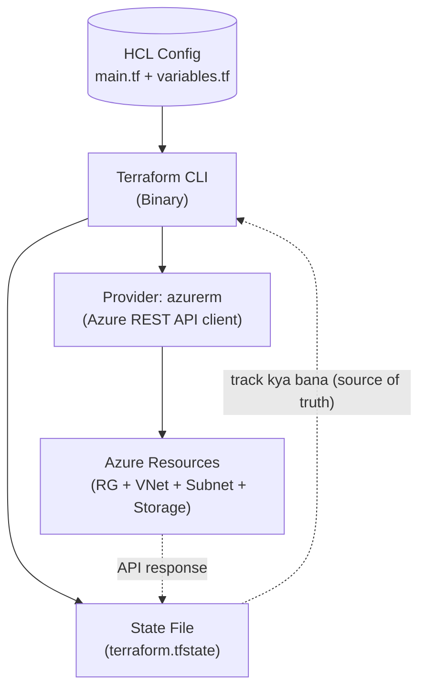
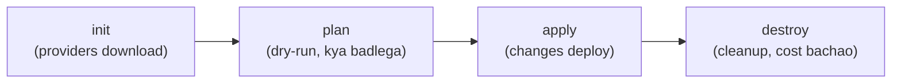

# Day 22: Infrastructure as Code with Terraform (Azure)
📚 Topic 22: IaC Deep Dive — Terraform, HCL & Infrastructure as Code
✅ Prerequisite-checklist: (review Day 21 K8s review if needed)

## Overview | Parichay

Manual infrastructure banana error-prone hai aur reproducable nahi hota. **Infrastructure as Code (IaC)** se infra version-control mein kaise file ki tarah store hota hai. **Terraform** sabse popular IaC tool hai - aaj hum isko detail mein seekhenge. **NOTE:** Hamara target **Microsoft Azure** hai, isliye AWS ki jagah saare examples Azure provider (`azurerm`) ke honge.

---

## What You'll Learn | Aaj Ki Seekh

- [ ] Terraform kya hai aur IaC mein iska role kya hai
- [ ] HCL syntax: resource, variable, output, module (sab Azure `azurerm` provider ke saath)
- [ ] Terraform lifecycle: `init → plan → apply → destroy`
- [ ] State file (`terraform.tfstate`) kyu important aur secret hai
- [ ] Azure provider ke saath real infra deploy karne ka poora flow

---

## Diagram | Dekho Kaise Kaam Karta Hai



**Lifecycle:**



ASCII:
```
Terraform (HCL)
    │
    ▼
 azurerm provider (Azure API client)
    │
    ▼
Azure resources (RG, VNet, Storage)
    │
    ▼
State file (terraform.tfstate) ← track
```

**Real images (official docs):**
- Terraform overview diagram: https://developer.hashicorp.com/terraform/intro (How Terraform works section)
- Core workflow (write/plan/apply): https://developer.hashicorp.com/terraform/intro/core-workflow
- Learn Azure with HashiCorp Terraform tutorials: https://developer.hashicorp.com/terraform/tutorials/azure

---

## Demo | Copy-Paste Karke Chalao

Pehle Azure se login karo (browser tab khulega):
```bash
az login
az account show
```

Ab ek folder banao aur `main.tf` likho:
```bash
mkdir terraform-demo && cd terraform-demo
```

```hcl
# main.tf
provider "azurerm" {
  features {}
}

resource "azurerm_resource_group" "main" {
  name     = "rg-devops"
  location = "East US"
}

resource "azurerm_virtual_network" "main" {
  name                = "vnet-main"
  address_space       = ["10.0.0.0/16"]
  location            = azurerm_resource_group.main.location
  resource_group_name = azurerm_resource_group.main.name
}
```

Ab copy-paste karke chalao:
```bash
terraform init
terraform validate
terraform plan
terraform apply -auto-approve
```

Check karo ki kya bana:
```bash
az group list -o table
az network vnet list -o table
```

Cleanup (cost bachao):
```bash
terraform destroy -auto-approve
```

---

## Real-Life Example | Zindagi Se

Terraform ko samjho **ghar ke blueprint + contractor** ki tarah. Tum kisi contractor (Terraform) ko **blueprint (HCL code)** dete ho - "ghar mein 2 bedroom, 1 kitchen, washroom yahan hoga". Contractor (provider `azurerm`) jaakar maal (Azure resources) mangwata hai aur ghar (infra) banata hai. Aur ek **register/bahi (state file)** mein likhta hai ki kya-kya bana. Agar kal koi kamra badalna ho, to blueprint edit karo aur contractor sirf wahi change karega - baaki hata nahi.

---

## Basic Concepts Detail Mein

### 1. IaC Kya Hai? Declarative vs Imperative

**IaC** = infrastructure ko code/definition files se manage karna (web console click-click se nahi!).

| Approach | Matlab | Tools |
|----------|--------|-------|
| **Declarative** | "Kya chahiye" batao - tool kahan badalna hai khud sochta hai | Terraform, Bicep |
| **Imperative** | "Kaise karna hai" step-by-step batao | Ansible, shell scripts |

**IaC ke faide:**
- Reproducible (hamesha same result)
- Version-controlled (git mein changes track)
- Review-able (PR se infra change review)
- Fast (seconds mein infra)
- No "works on my machine"

### 2. Terraform Architecture

```
Terraform (HCL config)
  │
  └──► Providers (Azure, GCP, AWS - API client)
        │
        └──► Cloud Resources (VM, VNet, Storage...)
        │
  State file (terraform.tfstate) - what exists bas abhi
```

**Components:**
| Part | Matlab |
|------|--------|
| **Providers** | Cloud API se baat karte hain (azurerm, aws, google) |
| **Resources** | Infra items (azurerm_virtual_machine, azurerm_virtual_network) |
| **Data Sources** | Existing infra read karo |
| **Variables** | Inputs (configurable) |
| **Outputs** | Deploy ke baad values (IP, endpoint) |
| **State** | Jo create hua uski record (tfstate) |
| **Modules** | Reusable blocks of infra |

### 3. Core Lifecycle Commands

```bash
terraform init        # Providers download, modules init
terraform plan        # Kya badlega dikhao (dry-run)
terraform apply       # Changes apply karo
terraform destroy     # Saara infra delete karo
terraform fmt         # Format karo
terraform validate    # Syntax check
terraform state list  # State mein kya hai
```

### 4. HCL Basics (Terraform Language) - Azure Examples

```hcl
# main.tf
provider "azurerm" {
  features {}                   # azurerm ko features block chahiye
}

# Resource syntax
resource "azurerm_resource_group" "main" {
  name     = "rg-devops"
  location = "East US"
}

resource "azurerm_virtual_network" "main" {
  name                = "vnet-main"
  address_space       = ["10.0.0.0/16"]
  location            = azurerm_resource_group.main.location
  resource_group_name = azurerm_resource_group.main.name
}

resource "azurerm_subnet" "public" {
  name                 = "snet-public"
  resource_group_name  = azurerm_resource_group.main.name
  virtual_network_name = azurerm_virtual_network.main.name
  address_prefixes     = ["10.0.1.0/24"]
}

# Variable
variable "vm_size" {
  default = "Standard_B1s"
  type    = string
}

# Use variable
size = var.vm_size

# Output
output "resource_group_id" {
  value = azurerm_resource_group.main.id
}
```

### 5. Variables & Environments

```hcl
# variables.tf
variable "environment" {
  description = "dev/staging/prod"
  type        = string
}

variable "location" {
  default = "East US"
}
```

```bash
# Values dene ke tarike
terraform apply -var="environment=dev"
terraform apply -var-file=dev.tfvars   # .tfvars file
terraform apply -auto-approve          # no prompt

# environments/dev.tfvars
environment = "dev"
location = "East US"
vm_size = "Standard_B1s"
```

### 6. State Management

**State file (`terraform.tfstate`)** - Terraform ka memory. Important - kabhi **manually edit** mat karo, aur bahut **secret** hai (may contain passwords).

**Remote state (best practice - team mein):**
```hcl
# backend azurerm (Azure Storage Account blob)
terraform {
  backend "azurerm" {
    resource_group_name  = "rg-tfstate"
    storage_account_name = "mytfstate2027"   # globally unique hona chahiye
    container_name       = "tfstate"
    key                  = "prod/terraform.tfstate"
    access_key           = "xxxxx"
  }
}
```

### 7. Modules (Reusability)

```bash
# modules/vnet/main.tf
variable "name" {}
variable "address_space" {}

resource "azurerm_virtual_network" "this" {
  name                = var.name
  address_space       = [var.address_space]
  location            = azurerm_resource_group.this.location
  resource_group_name = azurerm_resource_group.this.name
}
output "vnet_id" { value = azurerm_virtual_network.this.id }
```

```hcl
# Use module
module "vnet" {
  source        = "./modules/vnet"
  name          = "prod-vnet"
  address_space = "10.0.0.0/16"
}
output "vnet_id" { value = module.vnet.vnet_id }
```

---

## Practice Exercise | Abhi Karein

**Azure Free infra:**

```hcl
# main.tf
provider "azurerm" { features {} }

resource "azurerm_resource_group" "main" {
  name     = "rg-devops"
  location = "East US"
}

resource "azurerm_virtual_network" "main" {
  name                = "vnet-main"
  address_space       = ["10.0.0.0/16"]
  location            = azurerm_resource_group.main.location
  resource_group_name = azurerm_resource_group.main.name
  tags = { Name = "dev-vnet" }
}

resource "azurerm_subnet" "public" {
  name                 = "snet-public"
  resource_group_name  = azurerm_resource_group.main.name
  virtual_network_name = azurerm_virtual_network.main.name
  address_prefixes     = ["10.0.1.0/24"]
}

# Storage account bhi test karo (blob storage)
resource "azurerm_storage_account" "data" {
  name                     = "devopsstorage2027"   # globally unique!
  resource_group_name      = azurerm_resource_group.main.name
  location                 = azurerm_resource_group.main.location
  account_tier             = "Standard"
  account_replication_type = "LRS"
}

output "storage_account_name" { value = azurerm_storage_account.data.name }
```

**Tasks:**
1. Azure free account + CLI: `az login` + `az account list`
2. Upar wala code likho
3. `terraform init`, `terraform plan`, `terraform apply`
4. Azure Portal mein verify karo (Resource Group + VNet + Storage)
5. Resource group mein resources dekho
6. `terraform destroy` se cleanup (cost bachao!)

---

## Quick Notes | Yaad Rakho

```
- Terraform = IaC (declarative) - "kya chahiye"
- init → plan → apply → destroy
- resource, variable, output, module
- State file = importante + secret (remote backend = azurerm)
- .tfvars = per-environment values
- azurerm = Azure provider (az CLI se login first)
- Naming: lowercase + unique (storage account)
```

---

**Kal:** Azure core services (AZ-900 level) - Microsoft Cloud ka base.
