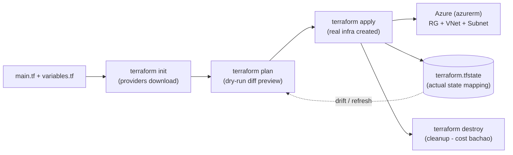

# Day 22: Infrastructure as Code with Terraform (Azure)
📚 Topic 22: IaC Deep Dive — Terraform, HCL & Infrastructure as Code
✅ Prerequisite-checklist: (review Day 21 K8s review if needed)

## Overview | Parichay

Manual infrastructure banana error-prone hai aur reproducable nahi hota. **Infrastructure as Code (IaC)** se infra version-control mein kaise file ki tarah store hota hai. **Terraform** sabse popular IaC tool hai - aaj hum isko detail mein seekhenge. **NOTE:** Hamara target **Microsoft Azure** hai, isliye AWS ki jagah saare examples Azure provider (`azurerm`) ke honge.

Jaise recipe ke bina khana fix nahi aata, waise bina IaC ke infra reproduce nahi hota. Portal pe click-click karke system banana = "kisne kaise banaya, pata nahi". **Terraform = recipe:** tum batate ho **kya chahiye** (Resource Group, VNet, Subnet), tool khud order decide karke banaata hai. Same code → same infra, har baar. Git mein version, PR se review, rollback = files revert.

### Imperative vs declarative — do tarike, ek asli fark

Infra banane ke do tarike hain: **imperative** (step-by-step bolo — "pehle ye command chalao, phir portal pe ye click karo") aur **declarative** (final state likh do — "mujhe aisi VNet chahiye", tool baaki khud dekh lega). IaC ka matlab hai infrastructure ki **definition ek code file** hai jo git me rehti hai. Fayde seedhe hain: **version history** (kaunsa change kisne kiya), **review** (PR pe team padhti hai), **reproducibility** (dev aur prod same code se bante hain), **speed** (20 min ka click-ops = 2 min ka apply), **rollback** (purana commit revert). Portal se manually badalna = **click-ops** — ye drift laata hai aur audit me koi jawab nahi milta.

### HCL — Terraform ki apni bhasha

Terraform ka code **HCL (HashiCorp Configuration Language)** me likha jaata hai — declarative, thoda human-readable. Har cheez **block** me aati hai: `provider` (kaunsa cloud), `resource` (kya banana hai), `variable` (inputs), `output` (bahar nikalne wali values). Resource ka **local name** (`main`) sirf code ke reference ke liye hai aur **type** (`azurerm_virtual_network`) cloud API batata hai — dono milke address banate hain `azurerm_virtual_network.main.name`.

```hcl
variable "env" { type = string, default = "dev" }             # input
resource "azurerm_resource_group" "main" {                     # desired state
  name     = "rg-${var.env}-tf"
  location = "East US"
}
output "rg_name" { value = azurerm_resource_group.main.name }  # result
```

Ek hi code dobara apply karo to **"No changes"** aata hai — ye **idempotency** hai, scripts ke "chalo dekhte hain kya hua" wale scene se bahut alag.

### Lifecycle — init se destroy tak ka order

Is workflow ko order me chalana zaroori hai, beech me skip karna allowed nahi:

1. `terraform init` — providers + backend download (naye machine/clone pe hamesha pehla step)
2. `terraform validate` — syntax/type check, galat code pakdo apply se pehle
3. `terraform plan` — **dry-run diff**: kya create/update/destroy hoga (abhi tak kuch real nahi hua)
4. `terraform apply` — plan approve karke asli infra banao (CI me hamesha plan pehle)
5. `terraform destroy` — saari demo/lab resources hatao, paisa bachao

Plan ke symbols: `+` create, `~` update in-place, `-/+` replace (destroy + recreate = downtime risk), `-` destroy. Exit code bhi bolta hai: **0 = no changes, 1 = error, 2 = changes planned** — drift-checking CI isi exit code 2 pe ruk jaati hai.

### State file — source of truth, lekin sharthi

`terraform.tfstate` ek JSON file hai jo **config aur real cloud ka mapping** rakhti hai — jaise `azurerm_subnet.web` ka asli Azure resource ID kya hai. Bina state ke Terraform ko pata hi nahi ki pehle kya banaya tha, isliye state ko treat karo **secret** (IDs + kabhi kabhi sensitive values) aur **team-shared artifact** (ek hi copy, warna do log parallel apply karenge = race condition).

| State | Kahan rehta hai | Kab use karo |
|---|---|---|
| Local (`terraform.tfstate`) | laptop/repo folder | sirf sandbox, kabhi team nahi |
| Remote — `backend "azurerm"` | Azure Storage blob | team + CI ka default |
| **Locking** blob lease se | same storage | do apply kabhi overlap nahi honge |

`terraform.tfstate` ko **kabhi git me commit mat karo**. Prod setup me dev/prod alag **state keys** (`dev/terraform.tfstate`, `prod/terraform.tfstate`) rakhte hain — same backend storage, alag namespaces.

### Drift — portal ka chhupa khel

Agar koi insaan portal se resource delete/change de, to agla `terraform plan` turant wo difference dikha dega — yahi hai **drift**. Mature teams nightly `terraform plan` chalati hain (exit 2 = drift mila) aur ya to change ko code me le aati hain ya portal wala change wapas revert karti hain. Golden rule: **Terraform hi source of truth** — portal se kuch bhi permanently badla to state aur reality ka divorce ho jayega.

### azurerm provider — Azure ki apni shartein

Terraform cloud-agnostic hai, but har cloud ka **provider plugin** chahiye — AWS ke liye `aws`, humare target Azure ke liye **`azurerm`**. Provider block me `features {}` default rehta hai; auth local pe `az login` (Azure CLI) se aati hai, CI me **service principal / OIDC** se. Azure ki naming me gotchas: storage account names **globally unique** aur limited chars — isliye code me random suffix lagate hain. Dependencies **declarative** hain: subnet me `azurerm_virtual_network.main.name` likhte hi Terraform samajh jaata hai pehle VNet banana hai — `depends_on` sirf tab jab relation code me visible na ho.

### Modules, environments, interview angle

Bade infra me code repeat mat karo — **modules** banao: `modules/network/` ke andar VNet + subnet + NSG ek saath, caller sirf variables de. `count` / `for_each` se ek resource teen subnets ban jaata hai. Environments ka formula: **same module + alag tfvars + alag state key**. Gotchas jo interview me aksar hote hain: 1) bina plan ke apply = blind driving, 2) state me secrets = leak risk (isliye remote + locking), 3) `-/+` replace ka matlab downtime ho sakta hai, 4) provider version pin karo (`~> 3.0`) warna major upgrade surprise de jayega. Ek line me: "**plan is the contract, state is the truth, backend + locking keeps the team sane**."

## What You'll Learn | Aaj Ki Seekh

- [ ] IaC kyun — click-ops vs declarative code (versioned, reviewable, reproducible)
- [ ] HCL syntax: `resource`, `variable`, `output`, provider block `azurerm`
- [ ] Project files: `main.tf`, `variables.tf`, `outputs.tf`, backend
- [ ] Lifecycle commands: `init` → `validate` → `plan` → `apply` → `destroy`
- [ ] Plan reading: `+` create, `~` update, `-/+` replace, `-` destroy
- [ ] State file (`terraform.tfstate`) — source of truth + remote backend kyun
- [ ] Real example: Azure Resource Group + VNet + Subnet `azurerm` se

## Diagram | Dekho Kaise Kaam Karta Hai



## Demo | Copy-Paste Karke Chalao

```bash
# 1. Install Terraform + Azure CLI, phir login
curl -fsSL https://apt.releases.hashicorp.com/gpg | sudo gpg --dearmor -o /usr/share/keyrings/hashicorp-archive-keyring.gpg
sudo apt-add-repository "deb [signed-by=/usr/share/keyrings/hashicorp-archive-keyring.gpg] https://apt.releases.hashicorp.com $(lsb_release -cs) main"
sudo apt install terraform
az login

# 2. Project files banao
mkdir -p ~/tf-azure && cd ~/tf-azure
```

```hcl
# providers.tf — azurerm provider + remote state backend (storage account)
terraform {
  required_version = ">= 1.5"
  required_providers {
    azurerm = { source = "hashicorp/azurerm", version = "~> 3.0" }
  }
  backend "azurerm" {
    resource_group_name  = "rg-tfstate"
    storage_account_name = "tfstatesa2026"   # globally unique - apna naam likho
    container_name       = "tfstate"
    key                  = "dev/terraform.tfstate"
  }
}

provider "azurerm" { features {} }
```

```hcl
# variables.tf
variable "location" {
  type        = string
  default     = "East US"
  description = "Azure region"
}
variable "env" { type = string; default = "dev" }
```

```hcl
# main.tf — Resource Group + VNet + Subnet + output
resource "azurerm_resource_group" "main" {
  name     = "rg-${var.env}-tf"
  location = var.location
  tags     = { Env = var.env, ManagedBy = "terraform" }
}

resource "azurerm_virtual_network" "main" {
  name                = "vnet-${var.env}"
  resource_group_name = azurerm_resource_group.main.name
  location            = var.location
  address_space       = ["10.0.0.0/16"]
}

resource "azurerm_subnet" "web" {
  name                 = "snet-web"
  resource_group_name  = azurerm_resource_group.main.name
  virtual_network_name = azurerm_virtual_network.main.name
  address_prefixes     = ["10.0.1.0/24"]
}

output "rg_name" { value = azurerm_resource_group.main.name }
```

```bash
# 3. Lifecycle — init → validate → plan → apply
terraform init
terraform fmt && terraform validate
terraform plan            # preview - "+ create" dikhega (kuch create nahi hoga abhi)
terraform apply -auto-approve
terraform state list      # azurerm_resource_group.main, azurerm_virtual_network.main...
terraform output rg_name  # rg-dev-tf

# 4. Plan reading: main.tf me tag change karke phir se plan dekho
terraform plan            # "~ update in-place" (tag) - resource recreate nahi hoga

# 5. Cleanup (demo infra = paisa lagega, destroy zaroori!)
terraform destroy -auto-approve
```

## Real-Life Example | Industry Me

**Production me:** Team `infra/` repo rakhti hai — `main.tf` + modules, CI mein **plan stage** (PR comment pe diff) aur **apply stage** (manual approval). Dev/prod alag **state keys** (`dev/`, `prod/`) same backend storage pe. Koi portal mein kuch bhi change kare → nightly `terraform plan` mein **drift** dikhta hai (exit code 2). Rollback = config revert + apply. Interview reply: "state = source of truth, remote backend + locking, hamesha plan before apply".

## Practice Exercise | Abhi Karein

1. Terraform install + `az login`
2. `providers.tf`, `variables.tf`, `main.tf` banao (upar copy-paste karo)
3. `terraform init` → `terraform validate` → `terraform plan` — `+ create` verify
4. `terraform apply -auto-approve` — portal mein RG + VNet + Subnet confirm
5. `terraform state list` + `terraform output` — state ka mapping dekho
6. Tag change karo → `plan` → `~ update` — idempotency/drift samjho
7. `terraform destroy -auto-approve` — Azure cost bachaao

## Quick Notes | Yaad Rakho

```
- Terraform = declarative (Kya chahiye) - order khud decide karta hai
- Files: main.tf (resources), variables.tf (inputs), outputs.tf (values)
- Workflow: init → validate → plan → apply → destroy
- Plan reading: + create | ~ update | -/+ replace | - destroy
- tfstate = source of truth + SECRET - kabhi git mat bhejo
- Remote backend (azurerm storage) = team shared + state locking
- `azurerm` provider = ek code se pura Azure
- Same config -> same infra: reproducibility (idempotent apply "No changes")
- `-/+` replace = destroy+recreate = downtime/data-loss risk - dhyan se
- destroy hamesha karo - demo infra ka paisa barbaad na ho
```

**Agla:** Azure Core Services — VM, Blob Storage, VNet/NSG, SQL, Azure Monitor (Day 23).