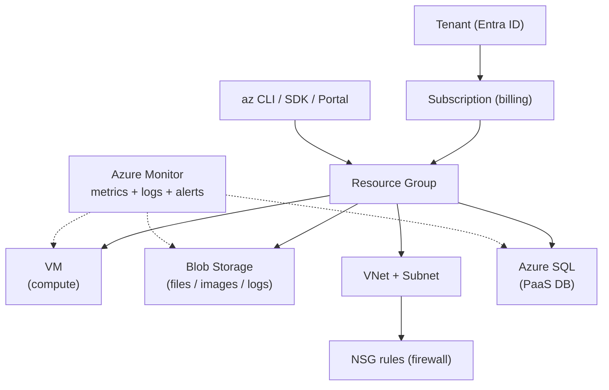

# Day 23: Azure Core Services for DevOps
📚 Topic 23: Cloud & IaC Deep Dive — Azure Core Services, VNet, NSG & Resource Management
✅ Prerequisite-checklist: (review Day 22 Terraform if needed)

## Overview | Parichay

**Microsoft Azure** duniya ke top-3 clouds mein hai. DevOps engineer ko core Azure services aani zaroori hain. Aaj hum **Virtual Machines, Blob Storage, Entra ID, Virtual Network, Azure SQL, aur Azure Monitor** detail mein seekhenge (AZ-900 level).

Socho Azure ek **mall** hai: subscription = shop ka rent, Resource Group = floor, aur shops = services (VM, Storage, SQL). **VM** = machine jahan code chalta hai, **Blob** = almari jahan files rehti hain, **VNet/NSG** = mall ke doors ka lock system, **SQL** = register (database), **Azure Monitor** = CCTV + health log. Har service **SDK / CLI / Portal** — teeno se control hoti hai.

### Azure hierarchy — paisa aur access ka tree

Azure ko top se samjho: **Tenant (Entra ID)** = puri organization ka directory (kaun insaan, kya access), **Subscription** = billing unit (kitna paisa kharch hoga — ek card ek subscription), **Resource Group** = logical folder (app ke saare resources ek jagah — delete to sab), **Resource** = actual cheez (VM, storage, VNet). Hierarchy ka fayda: RBAC role ek subscription ya RG pe lagao to saare children me flow ho jaata hai, aur ek RG delete = us app ka pura samaan ek saath clean. Interview me yahi 4-level tree poochha jaata hai.

```
Tenant (Entra ID)
  -> Subscription (billing unit)
     -> Resource Group (logical folder)
        -> VM / Blob / VNet+NSG / SQL / Monitor
```

### VM — compute jahan code chalta hai

**VM = IaaS** — tumhe OS milta hai, tum patch/firewall/kuch bhi karo. Banate waqt 3 cheezein decide hoti hain: **size** (B-series sasta burstable = dev, D-series = prod), **OS disk** (SSD Premium prod ke liye), aur **SSH key** (password auth hamesha off). Cost ka sach: VM chalti hai to paisa chalta hai — isliye dev machines pe `az vm auto-shutdown`, labs ke liye **Spot VMs** (sasta lekin Azure kabhi bhi nikal sakta hai), aur band karne pe **deallocate** karo (`az vm deallocate` — sirf stop se fark: deallocate = billing ruk jaata hai).

Cost levers — inhe hamesha checklist me rakho:

- size chhoti karo (B-series burstable = dev ke liye kaafi)
- deallocate (not just stop) jab kaam na ho
- auto-shutdown schedule (raat ko apne aap band)
- Spot VMs labs ke liye (sasta, but Azure interrupt kar sakta hai)

### Blob Storage — files ki almari with tiers

**Blob Storage** = object storage — images, backups, logs, static website files. Har blob ek **container** me rehta hai. Access ke 2 raaste: **RBAC** (managed identity + role assignment — auditable, prod ka choice) aur **SAS token** (URL me time-limited key — share karne ke liye, expire hona chahiye). Tiers cost ka khel hain:

| Tier | Kab use | Rate vs Hot |
|---|---|---|
| **Hot** | daily access | normal |
| **Cool / Cold** | 30/90 din baad rare | sasta store, read pe extra |
| **Archive** | legal/purana backup | bahut sasta, restore me hours |

### VNet/Subnet — CIDR planning pehle

**VNet** = tumhara private network cloud ke andar, CIDR block se define (`10.0.0.0/16`). **Subnet** = us vnet ke chhote blocks (`10.0.1.0/24` = ~254 IPs) alag tiers ke liye — web, app, db. Planning ka rule: address space overlap kabhi mat karo (pehle soch lo, baad me badalna painful hai), tier ke hisaab se subnet alag, aur Azure resources ek subnet ke bina nahi rehte. Egress ke liye NAT Gateway, aur pehla subnet bastion/jumpbox ke liye reserve kar sakte ho.

### NSG — priority wala firewall logic

**NSG (Network Security Group)** subnet ya NIC pe lagta hai aur rules ka ordered list rakhta hai: har rule me **priority** (100, 200...), direction (Inbound/Outbound), protocol, port, source/dest, Allow/Deny. Logic ek hi hai: **chhota number pehle check hota hai, pehla match hi jeet jaata hai** (aage ka rule padha hi nahi jata). Default se Azure inbound traffic allow nahi karta — tumhe sirf zaroori ports kholne (SSH sirf apne IP se, HTTP/HTTPS) aur baaki sab deny chhodna chahiye. NSG L3/L4 filter hai — app-level auth ke liye WAF/App Gateway alag cheez hai.

Typical inbound rules ka order (priority chhoti = pehle):

| Priority | Rule | Purpose |
|---|---|---|
| 100 | AllowSSH_MyIP | sirf apne laptop se SSH |
| 200 | AllowHTTPS | 443 internet ke liye |
| 4096 | DenyAllInbound | implicit default deny |

### Azure SQL — managed database

**Azure SQL** = managed database: Microsoft patch lagata hai, backups leta hai, HA deta hai — tum sirf schema + queries sambhalo (IaaS DB server vs PaaS ka yahi farak hai). Structure: **SQL server** (logical container + admin credentials) → **database** (appdb) + **service objective** (S0 = dev sasta, S3+ = prod). Firewall default se closed hai: ya to specific Azure service/IP rules, ya password auth ke saath restricted IPs. Connection string app ke config/env vars me, password kabhi code me nahi.

### Azure Monitor + teeno access paths

**Azure Monitor** = sab resources ka health system: **Metrics** (numbers, graphs — CPU%), **Logs** (raw events query workspace me), **Activity Log** (kaunne kya change kiya — audit trail), aur **Alerts** (threshold pe email/webhook). Har service inhe automatically feed karti hain. Control ke teen raaste: **Portal** (inspect/visual), **`az` CLI** (terminal + CI automation — yahi production me chalta hai), **SDK** (`azure-identity` + `azure-mgmt-*` Python packages se code me control). Rule of thumb: portal se dekho, CLI/SDK se karo — kyunki click repeat nahi ho sakta, script ho sakti hai.

### Gotchas aur interview angle

Common traps: RG ke bahar resource banana (organizational crime), NSG rule me `*` source SSH ke liye (internet scan hone ka invitation), storage account pe public access on chhodna (block karo by default), VM size badalne se pehle stop/deallocate na karna. Cost checklist: auto-shutdown + right-size + LRS for dev + SQL S0 for dev. Interview ka fav question: "**VNet aur NSG ka fark?**" — VNet = private network (roads), NSG = traffic rules on those roads (kaunsi gate kis port se khulegi).

Access paths recap: **Portal** = dekhne/inspect karne ke liye, **`az` CLI** = automate + CI ke liye, **SDK** (`azure-identity` + `azure-mgmt-*`) = code embed karne ke liye — teeno peeche se same ARM API use karte hain, isliye jo cheez CLI me dikhti hai wo SDK me bhi milegi. Interview follow-up: "portal se banaya hua resource Terraform me kaise aayega?" — answer: `terraform import`.

## What You'll Learn | Aaj Ki Seekh

- [ ] Azure hierarchy: Tenant → Subscription → Resource Group → Resource
- [ ] VM: sizes, disks, lifecycle (`az vm create/start/stop`), cost notes
- [ ] Blob Storage: types, tiers, SAS vs RBAC, AzCopy
- [ ] VNet + Subnet: address space, CIDR planning
- [ ] NSG: rules, priority, allow/deny firewall logic
- [ ] Azure SQL: managed PaaS database, connection, firewall rules
- [ ] Azure Monitor: metrics, logs, alerts, activity log
- [ ] SDK / CLI / Portal — teeno access paths

## Diagram | Dekho Kaise Kaam Karta Hai



ASCII:
```
Tenant → Subscription → Resource Group → { VM, Storage, VNet+NSG, SQL }
                                          Azure Monitor watch karta hai sab par
```

## Demo | Copy-Paste Karke Chalao

```bash
# 1. Login + hierarchy
az login
az account list -o table
az group create -n rg-day23 -l eastus

# 2. VM (Standard_B2s = sasta dev size)
az vm create -g rg-day23 -n web-vm --image Ubuntu2204 \
  --size Standard_B2s --admin-username azureuser \
  --ssh-key-values ~/.ssh/id_rsa.pub --generate-ssh-keys \
  --vnet-name vnet-day23 --subnet snet-web --nsg nsg-web

# 3. Blob Storage + upload
SA="sa$(date +%s)"
az storage account create -n $SA -g rg-day23 -l eastus --sku Standard_LRS
az storage container create --name static -n $SA --auth-mode login
echo "<h1>hello</h1>" > index.html
az storage blob upload -c static -n index.html --file index.html -n $SA --auth-mode login
az storage blob list -c static -n $SA --auth-mode login -o table

# 4. Azure SQL (PaaS DB - server + db)
az sql server create -g rg-day23 -n "sql${RANDOM}${RANDOM}" -l eastus \
  --admin-user sqluser --admin-password '<Strong!Pass123>'
az sql db create -g rg-day23 -s "<apna-server-naam>" -n appdb --service-objective S0

# 5. NSG rule: HTTPS allow (priority chhota = pehle check)
az network nsg rule create -g rg-day23 --nsg-name nsg-web -n AllowHTTPS \
  --priority 100 --protocol Tcp --direction Inbound \
  --source-address-prefixes '*' --destination-port-ranges 443 --access Allow

# 6. Azure Monitor: VM ka CPU metric
az vm show -g rg-day23 -n web-vm --query id -o tsv   # resource id nikal ke
az monitor metrics list --resource "<vm-resource-id>" --metric "Percentage CPU" \
  --interval PT1M --output table

# 7. Cost bachao: auto-shutdown schedule
az vm auto-shutdown -g rg-day23 -n web-vm --time 19:00 --timezone "India Standard Time"
```

**Access paths:** Portal (click), `az` CLI (terminal/CI), SDK (Python `azure-identity` + `azure-mgmt-*` packages se code mein bhi control). Production = CLI/SDK (automation), portal sirf visibility.

## Real-Life Example | Industry Me

**Production me:** `web-vm` pe nginx, Blob pe static assets + backups, VNet/NSG private tiers (web subnet sirf 80/443, app subnet sirf internal), SQL PaaS (managed - koi manual patch nahi), Azure Monitor alerts on CPU>80% + Activity log (kaun kya change kiya). **Cost:** VM full-time chalti hai → SKU chhota + auto-shutdown; storage LRS (dev) vs ZRS (prod); SQL S0 (dev) vs S3+ (prod). Har cheez Terraform se bani (Day 22) — wahi main source of truth.

## Practice Exercise | Abhi Karein

1. `az login` + `az group create` karo
2. VNet (10.0.0.0/16) + 2 subnets (snet-web 10.0.1.0/24, snet-db 10.0.2.0/24) banao
3. NSG banake AllowSSH (apne IP se) + AllowHTTPS rule lagao
4. VM + Blob (upload koi bhi file) + SQL db create karo
5. Azure Monitor se VM ka CPU/disk metric dekhkar alert rule banao
6. Python SDK (`pip install azure-identity azure-mgmt-resource`) se RG list karo
7. Cleanup: `az group delete -n rg-day23 --yes --no-wait`

## Quick Notes | Yaad Rakho

```
- Hierarchy: Tenant → Subscription → RG → Resource
- VM: size + disk + auto-shutdown = cost control
- Blob tiers: Hot (frequent) / Cool / Cold / Archive (sasta store)
- SAS (scoped, expiry) vs RBAC (auditable) - prod me RBAC
- VNet = private network; subnet = chhota CIDR block
- NSG: priority chhota = pehle; pehla match wins; default deny inbound
- Azure SQL = PaaS - Microsoft patch/kare backup, tum sirf use karo
- Azure Monitor = metrics + logs + alerts + activity log (audit)
- CLI/SDK = automation; portal = inspection
- Production ka everything Terraform se (Day 22), yahan sirf kaam samajho
```

**Agla:** Monitoring — Prometheus & Grafana se metrics collect + dashboards (Day 24).