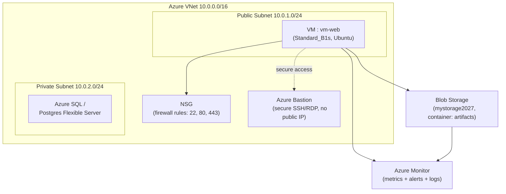

# Day 23: Azure Core Services for DevOps
📚 Topic 23: Cloud & IaC Deep Dive — Azure Core Services, VNet, NSG & Resource Management
✅ Prerequisite-checklist: (review Day 22 Terraform if needed)

## Overview | Parichay

**Microsoft Azure** duniya ke top-3 clouds mein hai. DevOps engineer ko core Azure services aani zaroori hain. Aaj hum **Virtual Machines, Blob Storage, Entra ID, Virtual Network, Azure SQL, aur Azure Monitor** detail mein seekhenge (AZ-900 level).

---

## What You'll Learn | Aaj Ki Seekh

- [ ] Azure regions, availability zones aur redundancy ka concept
- [ ] Compute: Virtual Machines (VM) banana, SSH karna, delete karna
- [ ] Storage: Blob Storage account + container + upload/download
- [ ] Networking: VNet, subnets, NSG firewall rules aur Bastion
- [ ] Databases: Azure SQL / Postgres Flexible Server (managed PaaS)
- [ ] Observability: Azure Monitor metric alerts aur action groups

---

## Diagram | Dekho Kaise Kaam Karta Hai



ASCII:
```
Azure VNet 10.0.0.0/16
├─ Public Subnet → VM (with NSG rules)
├─ Private Subnet → Azure SQL
├─ NSG → firewall rules
├─ Bastion → secure SSH browser me
└─ Blob Storage + Azure Monitor (telemetry)
```

**Real images (official docs):**
- Azure VNet overview: https://learn.microsoft.com/en-us/azure/virtual-network/virtual-networks-overview
- Virtual Machines quickstart (portal): https://learn.microsoft.com/en-us/azure/virtual-machines/linux/quick-create-portal
- Azure Monitor overview: https://learn.microsoft.com/en-us/azure/azure-monitor/overview

---

## Demo | Copy-Paste Karke Chalao

Login + resource group:
```bash
az login
az account show
az group create -n rg-devops -l eastus
```

VM banao (B1s free-eligible, cheap):
```bash
az vm create \
  --resource-group rg-devops \
  --name vm-web \
  --image Ubuntu2204 \
  --size Standard_B1s \
  --admin-username azureuser \
  --generate-ssh-keys
```

VM ke public IP nikaalo aur SSH karo:
```bash
az vm list-ip-addresses -g rg-devops -n vm-web -o table
ssh azureuser@<vm-public-ip>
```

Ab Blob Storage banao + upload karo:
```bash
az storage account create -n mystorage2027 -g rg-devops -l eastus --sku Standard_LRS
az storage container create -n artifacts --account-name mystorage2027
echo "hello devops" > file.txt
az storage blob upload -c artifacts -f file.txt -n file.txt --account-name mystorage2027
az storage blob list -c artifacts --account-name mystorage2027 -o table
```

Metric alert (CPU > 80%):
```bash
VM_ID=$(az vm show -g rg-devops -n vm-web --query id -o tsv)
az monitor metrics alert create \
  --name high-cpu \
  --resource-group rg-devops \
  --scopes $VM_ID \
  --condition "avg Percentage CPU > 80" \
  --evaluation-frequency 5m \
  --window-size 10m
```

Cleanup (cost bachao):
```bash
az group delete -g rg-devops --yes --no-wait
```

---

## Real-Life Example | Zindagi Se

Azure services ko samjho **ek safal dukaan/chhota business** ki tarah. Tumhara **VM** hai tumhari dukaan ka counter (jahan ladka baithta hai). **Blob Storage** hai tumhari go-down (jahan saaman rakhte ho - files, backups). **VNet + NSG** hai dukaan ka darwaza + guard (kaun andar aayega, kya rules). **Azure SQL** hai tumhari hisaab-kitaab ki register. Aur **Azure Monitor** hai CCTV + guard room - jo dekh raha hai sab kuch galti par alert karta hai.

---

## Basic Concepts Detail Mein

### 1. Azure Basics

**Regions & Availability:**
- **Region:** Geographic location (East US, Central India, West Europe)
- **Availability Zone:** Region ke andar isolated data centers
- **Availability Set:** VMs ko alag racks par rakhta hai (VM host failover)
- Failover ke liye multiple regions/AZs use karo

**Global services vs Regional:**
- Global: Entra ID, Azure DNS, Azure Front Door
- Regional: VM, Storage, Azure SQL

### 2. Microsoft Entra ID + RBAC (Identity & Access Management)

Kaun kya kar sakta hai - security ka control.

- **User:** Ek insaan/app ki identity
- **Group:** Users ka collection (devs, admins)
- **Service Principal:** App ke liye temporary identity (jaise AWS Role)
- **Role (RBAC):** Permissions ka set (Owner, Contributor, Reader)
- **Policy / Azure Policy:** Rules (e.g. "saare resources East US mein honge")
- **Least privilege principle:** Jo chahiye utna hi do, usse zyada nahi

```bash
# Entra ID = global (subscription independent)
az ad user list
az role assignment list --assignee <user>
```

### 3. Virtual Machines (Compute)

Azure par VM = cloud mein virtual server.

```bash
# Resource group banao
az group create -n rg-devops -l eastus

# VM banao (B1s = free-eligible, cheap)
az vm create \
  --resource-group rg-devops \
  --name vm-web \
  --image Ubuntu2204 \
  --size Standard_B1s \
  --admin-username azureuser \
  --generate-ssh-keys

# SSH connect
ssh azureuser@<public-ip>

# VM info/stop/delete
az vm show -g rg-devops -n vm-web
az vm stop -g rg-devops -n vm-web
az vm delete -g rg-devops -n vm-web --yes
```

**VM Options:**
- **Size:** B-series (burstable/cheap), D-series (general), F-series (compute)
- **OS Disk:** Managed disk (Standard HDD/SSD, Premium SSD)
- **Bastion:** VM tak VM se browser me secure access (public IP avoid)
- **Username:** Windows = administrator (check), Linux = admin_username

### 4. Azure Storage / Blob Storage

Object storage - files, backups, static websites, terraform state.

```bash
# Storage account (globally unique name) + container banao
az storage account create -n mystorage2027 -g rg-devops -l eastus --sku Standard_LRS
az storage container create -n artifacts --account-name mystorage2027

# Upload/Download
az storage blob upload -c artifacts -f file.zip -n file.zip --account-name mystorage2027
az storage blob list -c artifacts --account-name mystorage2027

# Static website hosting (storage account → static website enable)
```

**Azure Storage tiers (retention/cost):**
- **Hot** - frequent access (fast)
- **Cool** - rarely accessed (cheap)
- **Archive** - backup (sabse cheap, retrieval slow)

**Redundancy:** LRS (1 copy same DC), ZRS (zones), GRS (2 regions), GZRS.

### 5. Azure SQL Database (PaaS)

Managed relational database (SQL Server, PostgreSQL, MySQL...).

- **High availability** - managed (backup + failover Microsoft karta hai)
- **Elastic Pool** - shared resources among databases
- **Scaling** - DTU/vCores up/down on demand
- **Security** - firewall rules + VNet + Azure AD auth

```bash
# Flexible server (Postgres) - free tier available
az postgres flexible-server create \
  --resource-group rg-devops \
  --name pg-devops \
  --location eastus \
  --admin-user adminuser --admin-password 'Str0ngPass!2027' \
  --sku-name Standard_B1ms --tier Burstable
```

### 6. Virtual Network (VNet)

Isolated private network.

```
VNet 10.0.0.0/16
├── Public subnet (10.0.1.0/24) - VM with public IP via NSG
├── Private subnet (10.0.2.0/24) - DB (internal only)
├── NSG (Network Security Group) - firewall rules per subnet/VM
├── Azure Bastion - secure RDP/SSH without public IP
├── Service Endpoint / Private Link - PaaS secure access
└── VNet Peering - do VNets ko jodo
```

**NSG rules (jaise AWS Security Groups):**
- Inbound/outbound + source/destination + port + allow/deny
- `az network nsg rule create` se allow 22/80/443

### 7. Azure Monitor (Observability)

- **Metrics:** CPU, memory, custom metrics (VM/App)
- **Alerts:** Threshold cross → notify/action (email, SMS, webhook)
- **Logs (Log Analytics Workspace):** Central logs + KQL queries
- **Application Insights:** App-level telemetry (APM)

```bash
# Metric alert (jaise AWS CloudWatch alarm)
az monitor metrics alert create \
  --name high-cpu \
  --resource-group rg-devops \
  --scopes <vm-resource-id> \
  --condition "avg Percentage CPU > 80" \
  --evaluation-frequency 5m \
  --window-size 10m \
  --action <action-group-id>
```

### 8. Azure CLI Setup

```bash
# Install
# Linux: sudo apt install azure-cli  (or from Microsoft repo)
# Windows: winget install Microsoft.AzureCLI

# Login + verify
az login                          # browser me login hoga
az account show                   # kaunse subscription par ho
az account list --output table
# kai subscriptions ho to set karo:
az account set --subscription "<subscription-id>"
```

### 9. Other Azure services DevOps uses

| Service | Use |
|---------|-----|
| **AKS** (Azure Kubernetes Service) | Managed Kubernetes (Container orchestration) |
| **ACR** (Container Registry) | Docker images ka registry |
| **Azure Functions** | Serverless |
| **Bicep / ARM** | IaC (Azure-native) |
| **Managed Disks / Azure Files** | Block/file storage |
| **Azure DNS** | DNS |
| **Front Door / CDN** | CDN + WAF |
| **Azure DevOps** | CI/CD (Pipelines, Repos, Boards) |
| **App Service** | PaaS (web apps) |

---

## Practice Exercise | Abhi Karein

**Azure DevOps Lab (AZ-900 + basics):**

1. `az login` karo (`az account show` se verify)
2. Resource group `rg-devops` banao
3. VM `vm-web` (Ubuntu, B1s) banao + SSH karo + nginx install karo
4. Storage account banao + container + blob upload/download karo
5. NSG rule verify karo (port 22 bas tumhare IP se)
6. Azure Monitor metric alert banao (CPU > 80%)
7. Terraform module banao: VNet + subnet + storage (pehle kala lab repeat)
8. **Cost check:** `az cost management` / Portal → Cost analysis dekho (free tier me kaam)

> **Budget tip:** Har lab ke baad `terraform destroy` ya `az group delete -g rg-devops --yes` karo - cost na badhne dein.

---

## Quick Notes | Yaad Rakho

```
- VM = compute, Blob Storage = objects, Azure SQL = managed DB
- Entra ID + RBAC = identity/permissions (least privilege)
- VNet = network (subnets, NSG, Bastion)
- Azure Monitor = metrics + alerts + logs (KQL)
- NSG = firewall rules (allow specific ports/IPs)
- az login → az group create → az vm create → delete
- Har lab baad cleanup (destroy) - free tier me bhi careful
```

---

**Kal:** Monitoring - Prometheus aur Grafana (cloud-agnostic, sab cloud par chalta hai).