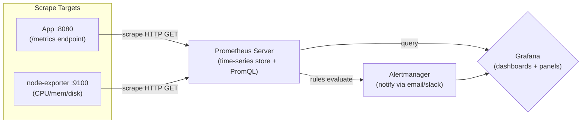

# Day 24: Monitoring with Prometheus & Grafana
📚 Topic 24: Observability Deep Dive — Monitoring, Metrics & Alerting
✅ Prerequisite-checklist: (review Day 23 Azure services if needed)

## Overview | Parichay

Bina monitoring ke aapko pata nahi chalta ki system fail hone wala hai. **Prometheus** (metrics collection) aur **Grafana** (visualization/dashboards) - aaj hum observability ka pahla pillar seekhenge.

---

## What You'll Learn | Aaj Ki Seekh

- [ ] Observability ke 3 pillars: metrics, logs, traces
- [ ] Prometheus ka pull-based scraping model aur time-series storage
- [ ] Prometheus config: `scrape_configs`, targets, jobs
- [ ] PromQL queries: `rate`, `sum by`, `up`, operators
- [ ] Alerting rules aur Alertmanager
- [ ] Grafana dashboards + data source connect karna

---

## Diagram | Dekho Kaise Kaam Karta Hai



ASCII:
```
App/node-exporter ──► Prometheus ──┬─► Alertmanager → notify
   (scrape /metrics)               |
                                   └─► Grafana → dashboards
```

**Real images (official docs):**
- Prometheus architecture diagram: https://prometheus.io/docs/introduction/overview/
- Prometheus Node Exporter docs: https://prometheus.io/docs/guides/node-exporter/
- Grafana + Prometheus data source guide: https://prometheus.io/docs/visualization/grafana/

---

## Demo | Copy-Paste Karke Chalao

Monitoring stack docker-compose se chalao. Pehle config file banao:
```bash
mkdir monitoring && cd monitoring
```

```yaml
# prometheus.yml
global:
  scrape_interval: 15s
  evaluation_interval: 15s

scrape_configs:
  - job_name: 'node'
    static_configs:
      - targets: ['node-exporter:9100']
```

```yaml
# docker-compose.monitoring.yml
services:
  prometheus:
    image: prom/prometheus
    ports: ["9090:9090"]
    volumes:
      - ./prometheus.yml:/etc/prometheus/prometheus.yml
    command:
      - '--config.file=/etc/prometheus/prometheus.yml'

  grafana:
    image: grafana/grafana
    ports: ["3000:3000"]
    environment:
      - GF_SECURITY_ADMIN_PASSWORD=admin

  node-exporter:
    image: prom/node-exporter
    ports: ["9100:9100"]
```

Chalao:
```bash
docker compose -f docker-compose.monitoring.yml up -d
docker ps
curl localhost:9090/targets     # targets check
curl localhost:9100/metrics     # node metrics raw
```

Grafana (http://localhost:3000, user `admin` / pass `admin`):
1. Add data source → Prometheus → URL `http://prometheus:9090`
2. New dashboard → panel → query

PromQL queries (Expression browser: http://localhost:9090/graph):
```promql
up
rate(node_cpu_seconds_total[5m])
node_memory_MemAvailable_bytes / 1024 / 1024 / 1024
100 - (avg(rate(node_cpu_seconds_total{mode="idle"}[5m])) * 100)
```

Roke ya delete karo:
```bash
docker compose -f docker-compose.monitoring.yml down
```

---

## Real-Life Example | Zindagi Se

Prometheus + Grafana ko samjho **ghar ke CCTV + security guard** ki tarah. **Prometheus** hai guard jo baar-baar guard room se nikal kar har camera (scrape target) check karta hai - CCTV feed (metrics) collect karta hai. **Grafana** hai surveillance screen jahan tum saare camera ek sath dekhna padho (dashboard). Aur **Alertmanager** hai siren/alarm jo turant bajata hai jab koi building ke andar ka suspicious activity dikhe (CPU > 80%). Tum screen dekhe bina hi pata chal jata hai ki kya ho raha hai.

---

## Basic Concepts Detail Mein

### 1. Observability ke 3 Pillars

| Pillar | Matlab | Tools |
|--------|--------|-------|
| **Metrics** | Numbers over time (CPU %, errors/sec) | Prometheus, Azure Monitor |
| **Logs** | Event records (error messages) | ELK, Loki |
| **Traces** | Request ka poora journey/distribution | Jaeger, Zipkin |

**Motto:** Monitor karo taaki problems comment ho rahi ho, phir fail ho.

### 2. Prometheus Architecture

```
       ┌──── scrape ────┐
App ├───► :9100/node-exporter
App ├───► :8080/app metrics
App └───► :9090/...
              │
     ┌────────▼────────┐
     │   Prometheus    │
     │  (metrics store)│
     └────────┬────────┘
              │
        AlertManager ─► notify
              │
     ┌────────▼────────┐
     │     Grafana     │  ← dashboards
     └─────────────────┘
```

**Kaam kaise karta hai:**
- **Targets** se periodic **scrape** (pull) karta hai metrics
- Metrics **time series** ke roop mein store (label ke saath)
- **PromQL** se query karo
- **Alerting rules** se Alertmanager ko alert

### 3. Prometheus Config

```yaml
# prometheus.yml
global:
  scrape_interval: 15s
  evaluation_interval: 15s

scrape_configs:
  - job_name: 'node'
    static_configs:
      - targets: ['node-exporter:9100']

  - job_name: 'app'
    static_configs:
      - targets: ['app:8080']

rule_files:
  - alerting-rules.yml
```

### 4. Exposing App Metrics

Node.js/Python mein metrics endpoint banate hain. Python example (prometheus_client):
```python
from prometheus_client import start_http_server, Counter, Histogram
import random, time

REQUESTS = Counter('http_requests_total', 'Total requests', ['status'])
LATENCY = Histogram('http_request_duration_seconds', 'Request latency')

start_http_server(8080)   # /metrics endpoint par

while True:
    REQUESTS.labels('200').inc()
    time.sleep(random.random())
```

### 5. PromQL (Prometheus Query Language)

```promql
# Basic
    
up                                    # target up hai?
node_cpu_seconds_total{mode="user"}  # specific label

# Rate (per second)
rate(http_requests_total[5m])         # requests/sec last 5min
rate(node_cpu_seconds_total[1m])
sum(rate(http_requests_total[5m]))

# Aggregations
sum by (status) (http_requests_total)
avg(node_memory_MemAvailable_bytes) / 1024/1024/1024  # GB

# Operators
up == 0                               # down services
node_load1 > 4                        # high load
```

### 6. Alerting Rules

```yaml
# alerting-rules.yml
groups:
  - name: node-alerts
    rules:
      - alert: HighCPU
        expr: 100 - (avg(rate(node_cpu_seconds_total{mode="idle"}[5m])) * 100) > 80
        for: 5m
        labels:
          severity: critical
        annotations:
          summary: "CPU > 80% for 5 min"
```

### 7. Grafana Dashboards

- **Data source:** Prometheus connect karo
- **Panel types:** Graph, gauge, stat, table
- **Query:** PromQL + visualization
- **Variables:** ${service} dropdown
- **Alerting:** inki own alerts (moh bhi)

**Dashboard path:**
1. Add data source → Prometheus → URL
2. New dashboard → panels
3. Query + viz choose
4. Save & share

**Import:** Many prebuilt dashboards (node-exporter full, Kubernetes). `grafana.com/grafana/dashboards` se ID import.

---

## Practice Exercise | Abhi Karein

```yaml
# docker-compose.monitoring.yml
services:
  prometheus:
    image: prom/prometheus
    ports: ["9090:9090"]
    volumes:
      - ./prometheus.yml:/etc/prometheus/prometheus.yml

  grafana:
    image: grafana/grafana
    ports: ["3000:3000"]
    environment:
      - GF_SECURITY_ADMIN_PASSWORD=admin

  node-exporter:
    image: prom/node-exporter
    ports: ["9100:9100"]
```

**Tasks:**
1. Stack deploy karo
2. node-exporter scrape configure
3. Grafana dashboard: CPU, memory, disk, network
4. Alert rule: CPU > 90% for 5 min
5. Alert trigger + verify
6. Apni app ke custom metrics endpoint banao aur monitor karo

---

## Quick Notes | Yaad Rakho

```
- Metrics = numbers, Prometheus = store/scrape, Grafana = display
- scrape_interval, job_name, targets = config
- PromQL: rate, sum by, up, instant/range
- Alerting = expr + for + severity
- 3 pillars: metrics, logs, traces
```

---

**Kal:** Logging - ELK Stack.
