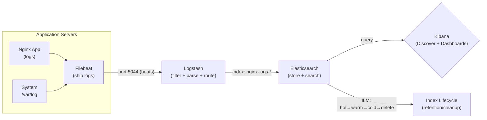

# Day 25: Logging with ELK Stack
📚 Topic 25: Observability Deep Dive — Centralized Logging, Log Processing & Analysis
✅ Prerequisite-checklist: (review Day 24 Monitoring if needed)

## Overview | Parichay

Metrics bolte hain kya ho raha hai, **logs** batate hain kyun. Centralized logging se saare servers ki logs ek jagah search karte hain. **ELK Stack** (Elasticsearch, Logstash, Kibana) - aaj hum isko detail mein seekhenge.

---

## What You'll Learn | Aaj Ki Seekh

- [ ] ELK Stack ke 4 components: Elasticsearch, Logstash, Kibana, Filebeat
- [ ] Logstash pipeline: `input → filter → output`
- [ ] Structured (JSON) logging kyu easy aur important hai
- [ ] Elasticsearch basics: index, document, query DSL
- [ ] Kibana: index pattern, Discover, dashboards, KQL queries
- [ ] Log retention aur ILM (Index Lifecycle Management)

---

## Diagram | Dekho Kaise Kaam Karta Hai



ASCII:
```
Servers → Filebeat → Logstash → Elasticsearch → Kibana
 (logs)    (ship)    (process)   (store/search)   (view)
```

**Real images (official docs):**
- What is the Elastic Stack (ELK): https://www.elastic.co/what-is/elk-stack
- Elasticsearch getting started (Docker): https://www.elastic.co/guide/en/elasticsearch/reference/current/docker.html
- Filebeat + Logstash docs: https://www.elastic.co/guide/en/beats/filebeat/current/logstash-output.html

---

## Demo | Copy-Paste Karke Chalao

ELK stack docker-compose se chalao. Pehle config files banao:
```bash
mkdir elk && cd elk
```

```conf
# logstash.conf
input {
  beats {
    port => 5044
  }
}
output {
  elasticsearch {
    hosts => ["elasticsearch:9200"]
    index => "test-logs-%{+YYYY.MM.dd}"
  }
  stdout { codec => rubydebug }
}
```

```yaml
# docker-compose.elk.yml
services:
  elasticsearch:
    image: docker.elastic.co/elasticsearch/elasticsearch:8.11.0
    environment:
      - discovery.type=single-node
      - xpack.security.enabled=false
    ports: ["9200:9200"]

  logstash:
    image: docker.elastic.co/logstash/logstash:8.11.0
    volumes:
      - ./logstash.conf:/usr/share/logstash/pipeline/logstash.conf
    depends_on: [elasticsearch]

  kibana:
    image: docker.elastic.co/kibana/kibana:8.11.0
    ports: ["5601:5601"]
    depends_on: [elasticsearch]
```

Chalao:
```bash
docker compose -f docker-compose.elk.yml up -d
docker ps
```

Verify Elasticsearch (thodi der lagegi start hone mein):
```bash
curl -s localhost:9200 | python3 -m json.tool
curl -s "localhost:9200/_cat/indices?v"
```

Ek test document bhejo aur query karo:
```bash
curl -X POST "localhost:9200/test/_doc" -H 'Content-Type: application/json' \
  -d '{"timestamp":"2027-01-15T10:00:00Z","level":"ERROR","service":"auth","message":"Login failed"}'
curl -s "localhost:9200/test-logs-*/_search?q=level:ERROR&size=10" | python3 -m json.tool
```

Kibana http://localhost:5601 kholo:
1. Management → Stack Management → Index Patterns
2. `test-logs-*` index pattern banao
3. Discover → `level: ERROR` query karo

Cleanup:
```bash
docker compose -f docker-compose.elk.yml down
```

---

## Real-Life Example | Zindagi Se

ELK stack ko samjho **apni diary + filing system + archive room** ki tarah. **Filebeat** hai office ka worker jo har server ki files (logs) utha kar laata hai. **Logstash** hai supervisor jo papers ko clean karta hai, sahi format mein rakhta hai (filter). **Elasticsearch** hai bada filing cabinet jahan saari files sorted store hoti hain aur search hone par turant milti hain. **Kibana** hai office ka search dashboard - tum "errors" type karo aur poore cabinet mein se turant relevant files nikal ke dikhao. **ILM** hai archive policy - purani files basement mein jaati hain aur time ke baad recycle hoti hain.

---

## Basic Concepts Detail Mein

### 1. ELK Stack Components

| Component | Matlab |
|-----------|--------|
| **E - Elasticsearch** | Logs ka search database + store |
| **L - Logstash** | Logs ko process/transform/route karta hai |
| **K - Kibana** | Visualization + dashboards |

Plus shipper:
- **Filebeat/Beats** - servers se logs ship karte hain to Logstash/ES

```
Servers ──► Filebeat ──► Logstash ──► Elasticsearch ──► Kibana
  (logs)      (ship)      (process)    (store/search)    (view)
```

### 2. Logging ki Pipelining (Logstash)

Logstash pipeline ke 3 stages:

```
input { ... }      →  filter { ... }      →  output { ... }
(logs kahan se)        (process/parse)        (kahan bhejo)
```

```conf
# logstash.conf
input {
  beats {
    port => 5044
  }
}

filter {
  # gsub badla/parse karo - grok pattern se structure
  grok {
    match => { "message" => "%{IP:client_ip} %{WORD:method} %{URIPATHPARAM:request}" }
  }
  date {
    match => [ "timestamp", "dd/MMM/yyyy:HH:mm:ss Z" ]
  }
  mutate {
    remove_field => [ "host" ]
  }
}

output {
  elasticsearch {
    hosts => ["elasticsearch:9200"]
    index => "nginx-logs-%{+YYYY.MM.dd}"
  }
  stdout { codec => rubydebug }   # debug
}
```

### 3. Structured Logging

**JSON logs** parse karna easy hota hai (Grok nai chahiye):

```json
{"timestamp":"2027-01-15T10:00:00Z","level":"error","service":"auth","message":"Login failed","user_id":123}
```

**Log levels:**
```
DEBUG  → dev detail
INFO   → normal events (started, completed)
WARN   → suspicious but non-fatal
ERROR  → failed operation
CRITICAL/FATAL → app crash
```

### 4. Elasticsearch Basics

- **Index:** Tab le jaisa (data ka collection)
- **Document:** Row jaisa (single log)
- **Field:** Column jaisa (timestamp, level)
- **Query DSL:** JSON search

```bash
# Verify ES
curl localhost:9200

# Search
curl -X GET "localhost:9200/nginx-logs-*/_search?q=level:ERROR&size=10"

# Delete old indices
curl -X DELETE "localhost:9200/nginx-logs-2026.01.15"
```

### 5. Kibana

- **Discover:** Search + explore logs
- **Index Pattern:** `nginx-logs-*` define karo
- **Visualize:** Charts, tables
- **Dashboard:** Multiple panels
- **Alerting:** Logs-based alerts

**Queries (KQL):**
```
level: ERROR
service: auth AND level: ERROR
status_code: 5*
message: "timeout" OR "timeout"
```

### 6. Filebeat Config

```yaml
# filebeat.yml
filebeat.inputs:
- type: log
  enabled: true
  paths:
    - /var/log/nginx/*.log
  fields:
    service: nginx

output.logstash:
  hosts: ["logstash:5044"]
```

### 7. Log Retention & Lifecycle

Logs data bahut zyada store karta hai - retention policy set karo:
- Hot logs: recent, fast search
- Warm logs: few days, slower
- Cold logs: archives, cheap
- ILM (Index Lifecycle Management) - auto tier/delete

---

## Practice Exercise | Abhi Karein

```yaml
# docker-compose.elk.yml
services:
  elasticsearch:
    image: docker.elastic.co/elasticsearch/elasticsearch:8.11.0
    environment:
      - discovery.type=single-node
      - xpack.security.enabled=false
    ports: ["9200:9200"]

  logstash:
    image: docker.elastic.co/logstash/logstash:8.11.0
    volumes:
      - ./logstash.conf:/usr/share/logstash/pipeline/logstash.conf
    depends_on: [elasticsearch]

  kibana:
    image: docker.elastic.co/kibana/kibana:8.11.0
    ports: ["5601:5601"]
    depends_on: [elasticsearch]

  filebeat:
    image: docker.elastic.co/beats/filebeat:8.11.0
    volumes:
      - /var/log:/var/log:ro
      - ./filebeat.yml:/usr/share/filebeat/filebeat.yml
```

**Tasks:**
1. Stack deploy karo
2. Filebeat se system logs ship karo
3. Logstash pipeline nginx logs parse karo
4. Kibana dashboard: log volume, errors by service, top messages
5. Index pattern + discover
6. Query: last hour ke ERROR logs

---

## Quick Notes | Yaad Rakho

```
- ELK = Elasticsearch (store) + Logstash (process) + Kibana (view)
- Filebeat = ship logs
- input → filter → output = Logstash pipeline
- Structured (JSON) logs = easy parsing
- ILM = retention/cleanup
```

---

**Kal:** DevSecOps - security har stage mein.
