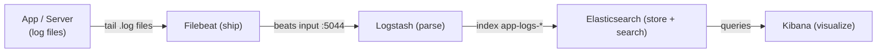

# Day 25: Logging with ELK Stack
📚 Topic 25: Observability Deep Dive — Centralized Logging, Log Processing & Analysis
✅ Prerequisite-checklist: (review Day 24 Monitoring if needed)

## Overview | Parichay

Metrics bolte hain kya ho raha hai, **logs** batate hain kyun. Centralized logging se saare servers ki logs ek jagah search karte hain. **ELK Stack** (Elasticsearch, Logstash, Kibana) - aaj hum isko detail mein seekhenge.

Jaise plane mein black box recorder sab kuch record karta hai — logs wahi hain: har error, request, action ki kahani. 100 servers pe logs alag-alag pade ho to koi dhoond nahi sakta. **ELK = ek center:** Filebeat/Beats har server se logs **ship** karte hain, **Logstash parse** karta hai, **Elasticsearch store+search** karta hai, **Kibana** me visualize/search hota hai.

### Metrics vs logs — kya aur kyun

Pichhle day ne dekha: **metrics** bolte hain kya ho raha hai (CPU 80% hai) — numbers hain, cheap, dashboards ke liye. **Logs** batate hain **kyun** hua (payment timeout because DB connection pool exhausted) — events hain, rich detail, par bina system ke bikheri padi rehti hain. Dono ek-doosre ko poore karte hain: alert ne bataya "kuch galat hai", logs ne bataya "kya galat tha". Isliye production me metrics + logs dono chahiye — observability ka doosra pillar yahi hai.

### Pipeline ke 5 steps — generate se visualize tak

Log journey ka fixed order hai: 1) **Generate** — app/service file me line likhe (`/var/log/app/app.log`), 2) **Ship** — har machine se central bhejo (Filebeat jaisa agent — disk pe pade rehne se kuch nahi hota), 3) **Parse** — raw line se fields nikaalo (timestamp, level, service), 4) **Store** — searchable index me daalo (Elasticsearch), 5) **Visualize/Search** — Kibana me dhundo aur dashboard banao. Koi bhi step missing = pura system fail: parse nahi kiya to search nahi hoga, ship nahi kiya to 100 servers pe SSH karte raho.

```
generate (app.log) -> ship (Filebeat) -> parse (Logstash)
                   -> store (Elasticsearch) -> visualize (Kibana)
```

### Elasticsearch — search engine jo logs khata hai

**Elasticsearch** distributed search engine hai jo JSON **documents** ko **indices** me rakhta hai (hamara `app-logs-2026.09.21` = ek daily index, yaad hai — index pattern `app-logs-*`). Concepts: **index** = collection (table jaisa), **document** = ek log line (ek JSON), **shard** = index ka tukda jo alag nodes pe rehta hai (scale + redundancy), **replica** = shard ki copy (node mare to data safe). Full-text search yahan inverted index se chalta hai — isliye `level: ERROR` laakhon me se millisecond me mil jaata hai. Cluster health: `green` (sab replica ok), `yellow` (primary ok, replica missing — single node pe normal), `red` (data missing = bawal).

Roz ke 3 endpoints yaad rakho (debug kabhi bhi):

- `GET /_cat/indices?v` — kaunse indices, kitne size ke
- `GET /_search?q=level:ERROR` — seedha query
- `GET /_cluster/health` — green/yellow/red status

### Logstash — parse karne wali factory

**Logstash** ka pipeline teen hisson me: **input** (kahan se aaye — beats port, syslog, kafka), **filter** (kaise sudharein — `grok` regex se fields, `mutate` rename/type, `date` timestamp samjho), **output** (kahan jaye — Elasticsearch, S3, webhook). `grok` ka kaam ek line ko todna hai:

```
2026-09-23T10:00:00 ERROR payment/order 42
   -> ts=2026-09-23T10:00:00, level=ERROR, msg=payment/order 42
```

Structured (JSON) logs ho to grok ki zarurat hi nahi — filter me `json` codec bas. Gotcha: Logstash JVM hai, heavy — halka kaam Filebeat ke filters me kar do, Logstash tabhi lagao jab transform sach me complex ho.

### Filebeat — lightweight shipper

**Filebeat** (Beats family) = chhota Go agent jo log files **tail** karta hai (jaise `tail -f`) aur registry file me yaad rakhta hai kahan tak bheja — restart pe wahin se continue (duplicate nahi). Config me sirf do cheezein: `paths` (kaunsi files) aur output (Logstash `:5044` ya seedhe Elasticsearch). Production me ye **daemon/sidecar** ki tarah har server/pod me chalta hai. Filebeat vs Logstash: Filebeat = delivery boy (halka, CPU kam), Logstash = sorting factory (parse heavy) — dono ka combo standard hai.

### Kibana — search karne ka dashboard

**Kibana** Elasticsearch ka UI hai. Pehla kaam: **index pattern** banana (`app-logs-*` + time field) — ye batata hai queries kaunse indices pe chalengi aur time-picker kis field pe. Phir **Discover** — raw logs browse, filter (`level: ERROR`), time range, field statistics. Visualizations (pie, table, histogram) + **dashboard** me jod ke service health dikhte hain. Support engineer wala scene: customer call aaya → Kibana me `trace_id` paste → us request ke saare log lines ek jagah = "server pe jaake grep" wale purane din khatam.

Kibana ke 3 kaam (order me seekho):

- **Discover** — raw logs browse + filter (`level: ERROR`, `service: payment`)
- **Visualize** — pie/table/time-chart banao (errors per hour jaisa)
- **Dashboard** — saved visuals ko jod ke ek screen pe service health

### Retention, sizing aur gotchas

Logs ka problem: **infinite hain**. Bina retention ke ES disk bharta jaata hai aur cluster yellow → red ho jaata hai. Plan banao: hot 30 din (fast SSD) → cold/archive (sasta, slow) → delete (Elasticsearch **ILM** policies se automatic). Sizing rough: daily log volume x replica factor = disk; JVM heap RAM ka aadha but 31GB se zyada nahi (compressed oops). Gotchas: 1) **index per day** (date rollover) warna ek hi index badhta rahega, 2) grok galat = `_grokparsefailure` — us field pe nazar rakho, 3) logs me secrets/PPI mat likho (masking filter), 4) UTC timestamps rakhna confusion kam karta hai.

### Interview angle

Interview ki golden line: "**metrics batata hai kya, logs batate hain kyun, dono chahiye**". Common questions: pipeline ke steps (generate → ship → parse → store → visualize), Filebeat vs Logstash (ship vs parse), index pattern kya (queryable collection + time field), ELK ka E kyun (full-text search speed), aur **stack alternatives** (Loki = lightweight logs, Fluent Bit = shipper, OpenSearch = ES fork) — naam sun ke confidence dikhao.

## What You'll Learn | Aaj Ki Seekh

- [ ] Logs pipeline: generate → ship → parse → store → visualize
- [ ] Elasticsearch: distributed search engine (index, document, shard)
- [ ] Logstash: input → filter (grok) → output (pipeline)
- [ ] Beats/Filebeat: lightweight agent jo files tail karke bhejta hai
- [ ] Kibana: Discover, index pattern, visualizations
- [ ] docker-compose se poori ELK stack local chalaana
- [ ] Index pattern (`app-logs-*`) kya hota hai aur kyun zaroori

## Diagram | Dekho Kaise Kaam Karta Hai



## Demo | Copy-Paste Karke Chalao

```bash
# 1. Demo app se logs generate karo (pipeline ka "generate" step)
mkdir -p /tmp/applogs && cd /tmp/applogs
for i in $(seq 1 50); do L=INFO; [ $((i % 5)) -eq 0 ] && L=ERROR
  echo "$(date +%Y-%m-%dT%H:%M:%S) $L payment/order $i"; done > app.log
```

```yaml
# docker-compose.yml (ELK stack)
services:
  elasticsearch:
    image: docker.elastic.co/elasticsearch/elasticsearch:8.10.4
    environment:
      - discovery.type=single-node
      - xpack.security.enabled=false
      - ES_JAVA_OPTS=-Xms512m -Xmx512m
    ports: ["9200:9200"]
  logstash:
    image: docker.elastic.co/logstash/logstash:8.10.4
    volumes:
      - ./logstash.conf:/usr/share/logstash/pipeline/logstash.conf
    ports: ["5044:5044", "9600:9600"]
    depends_on: [elasticsearch]
  kibana:
    image: docker.elastic.co/kibana/kibana:8.10.4
    environment:
      - ELASTICSEARCH_HOSTS=http://elasticsearch:9200
    ports: ["5601:5601"]
    depends_on: [elasticsearch]
```

```conf
# logstash.conf — pipeline: input → filter → output
input {
  beats { port => 5044 }
}
filter {
  grok {
    match => { "message" => "%{TIMESTAMP_ISO8601:ts} %{LOGLEVEL:level} %{GREEDYDATA:msg}" }
  }
}
output {
  elasticsearch {
    hosts => ["http://elasticsearch:9200"]
    index => "app-logs-%{+YYYY.MM.dd}"
  }
}
```

```yaml
# filebeat.yml — host ke /logs/*.log tail karke :5044 bhejega
filebeat.inputs:
  - type: log
    paths:
      - /logs/*.log
output.logstash:
  hosts: ["localhost:5044"]
```
```bash
# 2. Stack up + shipper
docker compose up -d
curl -s localhost:9200/_cluster/health | head   # wait: "status":"green"/"yellow"

# Filebeat run karo (hamare generated logs pe)
docker run -d --name filebeat \
  -v "$PWD/filebeat.yml:/usr/share/filebeat/filebeat.yml:ro" \
  -v /tmp/applogs:/logs \
  docker.elastic.co/beats/filebeat:8.10.4

# 3. Verify: index bana + documents count
curl localhost:9200/_cat/indices?v                     # app-logs-2026.09.21 dikhega
curl "localhost:9200/app-logs-*/_count"                # 50 documents
curl "localhost:9200/app-logs-*/_search?q=level:ERROR" | head   # fail kyun hua - search!

# 4. Kibana me index pattern banao (apna naam ki jagah pattern!)
curl -X POST http://localhost:5601/api/saved_objects/index-pattern \
  -H 'kbn-xsrf: true' -H 'Content-Type: application/json' \
  -d '{"attributes":{"title":"app-logs-*","timeFieldName":"ts"}}'
# open http://localhost:5601 → Discover → select app-logs-* → filter level: ERROR
```

## Real-Life Example | Industry Me

**Production me:** 200 microservices apne `/var/log/*.log` me likhti hain. Filebeat (daemon as container sidecar) har pod se logs ship karta hai. Logstash grok se **structured JSON** banata hai (timestamp, level, service, trace_id). Elasticsearch 3 nodes (data + master roles) pe **indices** rakhta hai, retention 30 days hot, phir archive. Support engineer error ke waqt: **Kibana Discover → search trace_id → pura pinjara ek jagah** — references, orders, payments. Mountaineer: "logs = bina latency wala debugger".

## Practice Exercise | Abhi Karein

1. Demo logs generate karo (50 lines, INFO + ERROR mix)
2. `docker-compose.yml` banao, ELK stack start karo, ES health green/yellow wait
3. `logstash.conf` me grok pattern se `ts`/`level`/`msg` fields nikaalo
4. Filebeat chalao aur verify: `_cat/indices` pe `app-logs-*` index
5. Kibana me index pattern `app-logs-*` banao, Discover me `level: ERROR` search karo
6. Logstash me naya filter (`mutate` ya dushra grok) add karke pipeline restart karo

## Quick Notes | Yaad Rakho

```
- Logs = kyun; Metrics = kya (pichhle day ka)
- Pipeline: generate → ship → parse → store → visualize
- Filebeat = halka ship agent (tail files); Logstash = parse/transform engine
- Elasticsearch = index (collection) + documents (log lines) + full-text search
- grok = log line se fields nikalne ka regex bazaar (levels, timestamps, IPs)
- Kibana: Discover (search), index pattern = query ka "table", visualizations
- Index name me date > daily rolls: app-logs-2026.09.21
- Structured logs (JSON + trace_id) = production ka maang (Day 24 wala trace)
- Retention: hot 30d → cold → delete - warna storage bahut jaldi bhar jayega
```

**Agla:** DevSecOps — security ko shift-left karo (SAST, SCA, secrets, container scan) (Day 26).