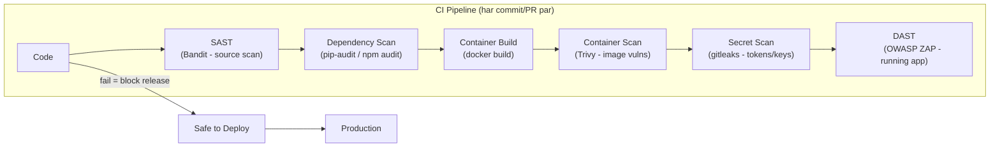

# Day 26: DevOps Security (DevSecOps)
📚 Topic 26: Security Deep Dive — DevSecOps, CI Security Scans & Compliance
✅ Prerequisite-checklist: (review Day 25 ELK logging if needed)

## Overview | Parichay

Security ab "baad mein" nahi - har step mein honi chahiye. **DevSecOps** matlab security ko **shift-left** karna i.e. development ke har stage mein. Aaj hum SAST, DAST, container/dependency/secret scanning seekhenge.

---

## What You'll Learn | Aaj Ki Seekh

- [ ] Shift-left security ka concept (security har stage mein)
- [ ] SAST: code bina chalaye security scan (Bandit)
- [ ] DAST: running app par attack-testing (OWASP ZAP)
- [ ] Container scanning (Trivy) − Docker images ki vulnerabilities
- [ ] Dependency scanning (pip-audit / npm audit) − third-party libraries
- [ ] Secret scanning (gitleaks) − credentials commit hone se rokna

---

## Diagram | Dekho Kaise Kaam Karta Hai



ASCII:
```
Shift-Left (DevSecOps):
Sec → Code → Sec → Test → Sec → Package → Sec → Deploy
        (bin har stage par security)
```

**Real images (official docs):**
- OWASP Top 10: https://owasp.org/www-project-top-ten/
- Trivy docs (image scanning): https://aquasecurity.github.io/trivy/
- gitleaks docs: https://github.com/gitleaks/gitleaks

---

## Demo | Copy-Paste Karke Chalao

### 1. SAST with Bandit (Python)
```bash
pip install bandit
mkdir -p demoapp
cat > demoapp/app.py << 'EOF'
import subprocess

def run(cmd):
    return subprocess.run(cmd, shell=True)   # security issue!

password = "supersecret123"                    # hardcoded
def login(u, p):
    return u == "admin" and p == password
EOF
bandit -r demoapp/ -f json -o report.json
cat report.json | python3 -m json.tool | head -40
```

### 2. Dependency Scan (pip-audit)
```bash
pip install pip-audit
echo "requests==2.25.1" > requirements.txt
pip-audit -r requirements.txt
```

### 3. Container Scan (Trivy)
```bash
docker run --rm -v /var/run/docker.sock:/var/run/docker.sock \
  aquasec/trivy image --severity HIGH,CRITICAL python:3.11-slim
```

### 4. Secret Scan (gitleaks)
```bash
docker run --rm -v $(pwd):/src gitleaks/gitleaks detect --source /src -v
```

### 5. DAST (OWASP ZAP) apni running app par
```bash
docker run -d -p 8081:8081 owasp/zap2docker-stable
docker run --rm owasp/zap2docker-stable zap-full-scan.py -t http://localhost:3000
```

---

## Real-Life Example | Zindagi Se

DevSecOps ko samjho **apne ghar ka lock + guard system** ki tarah. Purana tarika (traditional) tha: ghar banwao (app build), saamaan andar rakho (deploy), aur sabse aakhri mein lock lagao (security - badi galti). **Shift-left** matlab: blueprint (design) se hi achhi lock lagwana, har door (code) par quality lock, har kamre (container/deps) ki check, aur CCTV + guard (DAST/scanning) hamesha. Agar koi kamzor lock mile to build se pehle hi fix - baad mein ghar ghusne se pehle.

---

## Basic Concepts Detail Mein

### 1. DevSecOps Principles

**Shift-Left:** Security baad mein nahi, jaise hi code likho, wahan se shuru.

```
Traditional:   Code → Test → Package → Deploy → SECURITY (aakhri)
DevSecOps:     Sec → Code → Sec → Test → Sec → Package → Sec → Deploy
```

**Automated security harness in CI:**
1. Scans har commit/PR par chalti hain
2. Fail pipeline = fail security
3. Finding jaise hi ban jayenge fix karo
4. Secrets kabhi code mein nahi

### 2. SAST (Static Application Security Testing)

Code **chalaye bina** source code analyze karta hai (vulnerabilities search).

| Tool | Language | Matlab |
|------|----------|--------|
| **Bandit** | Python | Security issues in code |
| **ESLint (security)** | JS | JS security |
| **SonarQube** | Multi | Code quality + security |
| **Semgrep** | Multi | Pattern-based scanning |
| **Checkmarx** | Multi | Enterprise SAST |

**Bandit:**
```bash
pip install bandit
bandit -r app/                    # recursive
bandit -r app/ -f json -o report.json
```

### 3. DAST (Dynamic Application Security Testing)

Running app par attack karke vulnerabilities dhoondta hai (black-box).

| Tool | Matlab |
|------|--------|
| **OWASP ZAP** | Free, browser-based scanner |
| **Burp Suite** | Manual + automated |
| **Nikto** | Web server scanner |

**ZAP:**
```bash
docker run -d -p 8081:8081 owasp/zap2docker-stable
# scan
docker run owasp/zap2docker-stable zap-full-scan.py -t http://myapp
```

### 4. Container Scanning

Docker images ke andar vulnerabilities (base image deps ke issues):

```bash
# Trivy
docker run --rm -v /var/run/docker.sock:/var/run/docker.sock \
  aquasec/trivy image myapp:latest
docker run --rm aquasec/trivy image --severity HIGH,CRITICAL python:3.11-slim

# Scan filesystem/repo
docker run --rm -v $(pwd):/src aquasec/trivy fs /src

# Snyk (CLI)
snyk test
snyk container test myapp:latest
```

### 5. Dependency Scanning

Third-party libraries ke known vulnerabilities check.

| Tool | Use |
|------|-----|
| **Snyk** | npm/pip/maven deps |
| **Dependabot** | GitHub built-in (auto PR for fixes) |
| **pip-audit** | Python |
| **npm audit** | Node |
| **OWASP Dependency-Check** | Java |

**Dependabot:** GitHub → Security → Dependabot → enable. Auto PR banata hai vulnerable deps fix karne ke liye.

### 6. Secret Scanning

Code mein password/tokens commit nahi hone chahiye.

```bash
# trufflehog - GitHub history scan
trufflehog github --repo https://github.com/org/repo --only-verified

# git-secrets
git secrets --install
git secrets --scan

# gitleaks
gitleaks detect
```

**Bonus = pre-commit hook** taaki commit se pehle hi ruk jaye.

### 7. OWASP Top 10 (yaad rakho)

1. Broken Access Control
2. Cryptographic Failures
3. Injection (SQL, command)
4. Insecure Design
5. Security Misconfiguration
6. Vulnerable Components
7. Auth Failures
8. Data Integrity Failures
9. Logging/Monitoring Failures
10. SSRF

### 8. CI Security Pipeline

```yaml
# .github/workflows/security.yml
name: Security
on: [push, pull_request]
jobs:
  security:
    runs-on: ubuntu-latest
    steps:
      - uses: actions/checkout@v4

      - name: Secret scan
        run: |
          docker run --rm -v $PWD:/src gitleaks/gitleaks detect -v

      - name: SAST - Python
        run: |
          pip install bandit
          bandit -r app/ -f json -o sast.json

      - name: Dependency check
        run: |
          pip install pip-audit
          pip-audit -r requirements.txt

      - name: Image scan
        run: |
          docker build -t app:ci .
          docker run --rm -v /var/run/docker.sock:/var/run/docker.sock \
            aquasec/trivy image --severity HIGH,CRITICAL app:ci
```

---

## Practice Exercise | Abhi Karein

1. SonarQube local set up: `docker run -d -p 9000:9000 sonarqube`
2. Python app par Bandit chalao, issues fix karo
3. Trivy se image scan karo
4. GitHub Dependabot enable karo
5. gitleaks se git history scan karo
6. OWASP ZAP se apni app par DAST
7. Security pipeline CI mein add karo
8. Ek report banao - saare findings aur fixes

---

## Quick Notes | Yaad Rakho

```
- Shift-left = security jaise hi code likho
- SAST = code bina chalaye (Bandit, SonarQube)
- DAST = running app attack (ZAP)
- Trivy = images, pip-audit = deps, gitleaks = secrets
- OWASP Top 10 = apnane ki jaankari
- Fail pipeline on critical findings
```

---

**Kal:** SRE - reliability engineering.
